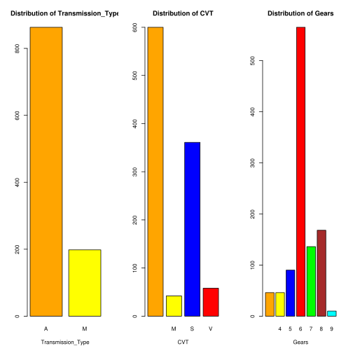
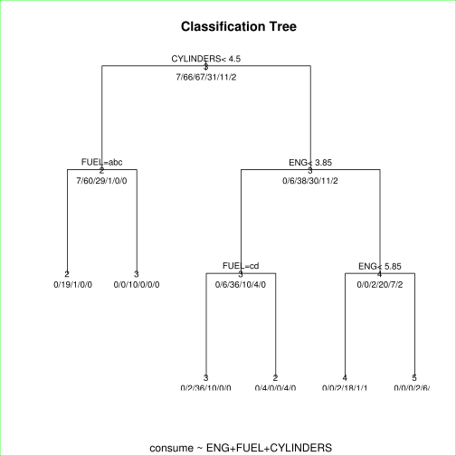

# Fuel Consumption Classification
## Data Mining Assignment 3
### Author: G. Gordon
February 8,2016


```R
# My re-usable variables
my.colors = c('orange','yellow','blue','red','green','brown','cyan','purple','black')
println = function(){
    paste(rep('-',218),collapse='')
}
```


```R
# Import the fuel data
fueldata = read.csv("fueldata.csv")
```


```R
"Initial Features"
# Show first 12 records to have a look at the data
head(fueldata,12)
# View summary statistics to get an overview of the data
"Summary Statistics"
println()
summary(fueldata)
```


'Initial Features'


<table>
<thead><tr><th></th><th scope=col>YR</th><th scope=col>BRAND</th><th scope=col>MODEL</th><th scope=col>CLASS</th><th scope=col>ENG</th><th scope=col>CYLINDERS</th><th scope=col>TRANS</th><th scope=col>FUEL</th><th scope=col>CITY_L</th><th scope=col>HWY_L</th><th scope=col>CITY_MI</th><th scope=col>HWY_MI</th><th scope=col>FUEL_L_YR</th><th scope=col>CO2</th></tr></thead>
<tbody>
	<tr><th scope=row>1</th><td>2014</td><td>ACURA</td><td>ILX</td><td>COMPACT</td><td>2</td><td>4</td><td>AS5</td><td>Z</td><td>8.6</td><td>5.6</td><td>33</td><td>50</td><td>1440</td><td>166</td></tr>
	<tr><th scope=row>2</th><td>2014</td><td>ACURA</td><td>ILX</td><td>COMPACT</td><td>2.4</td><td>4</td><td>M6</td><td>Z</td><td>9.8</td><td>6.5</td><td>29</td><td>43</td><td>1660</td><td>191</td></tr>
	<tr><th scope=row>3</th><td>2014</td><td>ACURA</td><td>ILX HYBRID</td><td>COMPACT</td><td>1.5</td><td>4</td><td>AV7</td><td>Z</td><td>5</td><td>4.8</td><td>56</td><td>59</td><td>980</td><td>113</td></tr>
	<tr><th scope=row>4</th><td>2014</td><td>ACURA</td><td>MDX 4WD</td><td>SUV - SMALL</td><td>3.5</td><td>6</td><td>AS6</td><td>Z</td><td>11.2</td><td>7.7</td><td>25</td><td>37</td><td>1920</td><td>221</td></tr>
	<tr><th scope=row>5</th><td>2014</td><td>ACURA</td><td>RDX AWD</td><td>SUV - SMALL</td><td>3.5</td><td>6</td><td>AS6</td><td>Z</td><td>10.7</td><td>7.3</td><td>26</td><td>39</td><td>1840</td><td>212</td></tr>
	<tr><th scope=row>6</th><td>2014</td><td>ACURA</td><td>RLX</td><td>MID-SIZE</td><td>3.5</td><td>6</td><td>AS6</td><td>Z</td><td>10.5</td><td>6.4</td><td>27</td><td>44</td><td>1720</td><td>198</td></tr>
	<tr><th scope=row>7</th><td>2014</td><td>ACURA</td><td>TL</td><td>MID-SIZE</td><td>3.5</td><td>6</td><td>AS6</td><td>Z</td><td>10.4</td><td>6.8</td><td>27</td><td>42</td><td>1760</td><td>202</td></tr>
	<tr><th scope=row>8</th><td>2014</td><td>ACURA</td><td>TL AWD</td><td>MID-SIZE</td><td>3.7</td><td>6</td><td>AS6</td><td>Z</td><td>11.4</td><td>7.6</td><td>25</td><td>37</td><td>1940</td><td>223</td></tr>
	<tr><th scope=row>9</th><td>2014</td><td>ACURA</td><td>TL AWD</td><td>MID-SIZE</td><td>3.7</td><td>6</td><td>M6</td><td>Z</td><td>11.9</td><td>8</td><td>24</td><td>35</td><td>2040</td><td>235</td></tr>
	<tr><th scope=row>10</th><td>2014</td><td>ACURA</td><td>TSX</td><td>COMPACT</td><td>2.4</td><td>4</td><td>AS5</td><td>Z</td><td>9.3</td><td>6.2</td><td>30</td><td>46</td><td>1580</td><td>182</td></tr>
	<tr><th scope=row>11</th><td>2014</td><td>ACURA</td><td>TSX</td><td>COMPACT</td><td>2.4</td><td>4</td><td>M6</td><td>Z</td><td>9.9</td><td>6.8</td><td>29</td><td>42</td><td>1700</td><td>195</td></tr>
	<tr><th scope=row>12</th><td>2014</td><td>ACURA</td><td>TSX</td><td>COMPACT</td><td>3.5</td><td>6</td><td>AS5</td><td>Z</td><td>10.7</td><td>7</td><td>26</td><td>40</td><td>1800</td><td>207</td></tr>
</tbody>
</table>


'Summary Statistics'


'--------------------------------------------------------------------------------------------------------------------------------------------------------------------------------------------------------------------------'


           YR                 BRAND              MODEL                 CLASS    
     Min.   :2014   FORD         : 88   F150 FFV    :   8   MID-SIZE      :184  
     1st Qu.:2014   CHEVROLET    : 86   F150 FFV 4X4:   8   COMPACT       :169  
     Median :2014   BMW          : 64   ACCORD      :   6   SUV - SMALL   :154  
     Mean   :2014   MERCEDES-BENZ: 59   BEETLE      :   6   SUV - STANDARD:112  
     3rd Qu.:2014   AUDI         : 49   FOCUS FFV   :   6   FULL-SIZE     : 82  
     Max.   :2014   GMC          : 49   MUSTANG     :   5   TWO-SEATER    : 71  
                    (Other)      :666   (Other)     :1022   (Other)       :289  
          ENG          CYLINDERS          TRANS     FUEL        CITY_L     
     Min.   :1.000   Min.   : 3.000   A6     :222   D: 25   Min.   : 3.60  
     1st Qu.:2.000   1st Qu.: 4.000   AS6    :189   E: 92   1st Qu.: 9.00  
     Median :3.400   Median : 6.000   M6     :141   X:508   Median :11.10  
     Mean   :3.356   Mean   : 5.801   A8     : 85   Z:436   Mean   :11.81  
     3rd Qu.:4.300   3rd Qu.: 8.000   AS8    : 82           3rd Qu.:13.90  
     Max.   :8.400   Max.   :12.000   AS7    : 77           Max.   :27.70  
                                      (Other):265                          
         HWY_L           CITY_MI         HWY_MI        FUEL_L_YR         CO2      
     Min.   : 4.000   Min.   :10.0   Min.   :16.00   Min.   : 760   Min.   :  87  
     1st Qu.: 6.300   1st Qu.:20.0   1st Qu.:31.00   1st Qu.:1560   1st Qu.: 179  
     Median : 7.400   Median :25.0   Median :38.00   Median :1900   Median : 218  
     Mean   : 8.001   Mean   :26.5   Mean   :38.21   Mean   :2019   Mean   : 226  
     3rd Qu.: 9.200   3rd Qu.:31.0   3rd Qu.:45.00   3rd Qu.:2340   3rd Qu.: 258  
     Max.   :17.600   Max.   :78.0   Max.   :71.00   Max.   :4620   Max.   :3358  
                                                                                  


```R
"A closer look at the variety of transmision systems"
k=as.data.frame(t(t(table(fueldata$TRANS))))
k$Var2=NULL
names(k) <- c('Transmission','Frequency')
k
#summary(k)
barplot(k$Frequency,main="Frequency of Transmission Systems",
                    col=rainbow(length(k$Transmission)),names.arg=rep('',length(k$Transmission)))

axis(1, at=seq(1, length(k$Transmission), by=1)*1.18, labels = FALSE)
text(seq(1, length(k$Transmission), by=1)*1.18,-10 , labels = k$Transmission, srt = 35, pos = 1, xpd = TRUE)

```


'A closer look at the variety of transmision systems'


<table>
<thead><tr><th></th><th scope=col>Transmission</th><th scope=col>Frequency</th></tr></thead>
<tbody>
	<tr><th scope=row>1</th><td>A4</td><td>45</td></tr>
	<tr><th scope=row>2</th><td>A5</td><td>30</td></tr>
	<tr><th scope=row>3</th><td>A6</td><td>222</td></tr>
	<tr><th scope=row>4</th><td>A7</td><td>12</td></tr>
	<tr><th scope=row>5</th><td>A8</td><td>85</td></tr>
	<tr><th scope=row>6</th><td>A9</td><td>8</td></tr>
	<tr><th scope=row>7</th><td>AM5</td><td>2</td></tr>
	<tr><th scope=row>8</th><td>AM6</td><td>6</td></tr>
	<tr><th scope=row>9</th><td>AM7</td><td>34</td></tr>
	<tr><th scope=row>10</th><td>AS4</td><td>1</td></tr>
	<tr><th scope=row>11</th><td>AS5</td><td>10</td></tr>
	<tr><th scope=row>12</th><td>AS6</td><td>189</td></tr>
	<tr><th scope=row>13</th><td>AS7</td><td>77</td></tr>
	<tr><th scope=row>14</th><td>AS8</td><td>82</td></tr>
	<tr><th scope=row>15</th><td>AS9</td><td>2</td></tr>
	<tr><th scope=row>16</th><td>AV</td><td>46</td></tr>
	<tr><th scope=row>17</th><td>AV6</td><td>7</td></tr>
	<tr><th scope=row>18</th><td>AV7</td><td>4</td></tr>
	<tr><th scope=row>19</th><td>AV8</td><td>1</td></tr>
	<tr><th scope=row>20</th><td>M5</td><td>48</td></tr>
	<tr><th scope=row>21</th><td>M6</td><td>141</td></tr>
	<tr><th scope=row>22</th><td>M7</td><td>9</td></tr>
</tbody>
</table>


```R
# Split Original Transmission Column into additional features (Type,IsCVT, No of Gears)
fuelTransmissions=apply(as.matrix(fueldata$TRAN),1,function(mx){
    li = (strsplit(mx,split="")[[1]])
    if(length(li)==1){ # Cases where transmission is only automatic/manual
        li = c(li,'','')
    }else
    if(length(li)==2){ # cases where only transmission and no. of grears is specified
        if(grepl('[0-9]',paste(li,collapse=''))){
            li = c(li[1],'',li[2])
        }else{
            li = c(li,'')
        }
        
    }
    return (li)
})
fuelTransmissions=as.data.frame(t(fuelTransmissions))
```


```R

#CVT - http://cars.about.com/od/thingsyouneedtoknow/a/CVT.htm
transmission_labels = c('Transmission_Type','CVT','Gears')
names(fuelTransmissions) <- transmission_labels
"First 5 Transmissions"
head(fuelTransmissions)
"Summary Statistics for Transmissions"
summary(fuelTransmissions)
"Distribution of Transmissions across groups"
par(mfrow=c(1,3))
for(label in transmission_labels){
    barplot(table(fuelTransmissions[label]), 
         main=paste('Distribution of',label),
         xlab=label,
         col=my.colors)
}
```


'First 5 Transmissions'


<table>
<thead><tr><th></th><th scope=col>Transmission_Type</th><th scope=col>CVT</th><th scope=col>Gears</th></tr></thead>
<tbody>
	<tr><th scope=row>1</th><td>A</td><td>S</td><td>5</td></tr>
	<tr><th scope=row>2</th><td>M</td><td></td><td>6</td></tr>
	<tr><th scope=row>3</th><td>A</td><td>V</td><td>7</td></tr>
	<tr><th scope=row>4</th><td>A</td><td>S</td><td>6</td></tr>
	<tr><th scope=row>5</th><td>A</td><td>S</td><td>6</td></tr>
	<tr><th scope=row>6</th><td>A</td><td>S</td><td>6</td></tr>
</tbody>
</table>


'Summary Statistics for Transmissions'


     Transmission_Type CVT     Gears  
     A:863              :600    : 46  
     M:198             M: 42   4: 46  
                       S:361   5: 90  
                       V: 58   6:565  
                               7:136  
                               8:168  
                               9: 10  


'Distribution of Transmissions across groups'





```R
# adding new transmissions data
#create copy
fueldata2 = fueldata
for(label in transmission_labels){
    fueldata2[label]=fuelTransmissions[label]
}
"Merged With Transmission Data"
head(fueldata2)
```


'Merged With Transmission Data'


<table>
<thead><tr><th></th><th scope=col>YR</th><th scope=col>BRAND</th><th scope=col>MODEL</th><th scope=col>CLASS</th><th scope=col>ENG</th><th scope=col>CYLINDERS</th><th scope=col>TRANS</th><th scope=col>FUEL</th><th scope=col>CITY_L</th><th scope=col>HWY_L</th><th scope=col>CITY_MI</th><th scope=col>HWY_MI</th><th scope=col>FUEL_L_YR</th><th scope=col>CO2</th><th scope=col>Transmission_Type</th><th scope=col>CVT</th><th scope=col>Gears</th></tr></thead>
<tbody>
	<tr><th scope=row>1</th><td>2014</td><td>ACURA</td><td>ILX</td><td>COMPACT</td><td>2</td><td>4</td><td>AS5</td><td>Z</td><td>8.6</td><td>5.6</td><td>33</td><td>50</td><td>1440</td><td>166</td><td>A</td><td>S</td><td>5</td></tr>
	<tr><th scope=row>2</th><td>2014</td><td>ACURA</td><td>ILX</td><td>COMPACT</td><td>2.4</td><td>4</td><td>M6</td><td>Z</td><td>9.8</td><td>6.5</td><td>29</td><td>43</td><td>1660</td><td>191</td><td>M</td><td></td><td>6</td></tr>
	<tr><th scope=row>3</th><td>2014</td><td>ACURA</td><td>ILX HYBRID</td><td>COMPACT</td><td>1.5</td><td>4</td><td>AV7</td><td>Z</td><td>5</td><td>4.8</td><td>56</td><td>59</td><td>980</td><td>113</td><td>A</td><td>V</td><td>7</td></tr>
	<tr><th scope=row>4</th><td>2014</td><td>ACURA</td><td>MDX 4WD</td><td>SUV - SMALL</td><td>3.5</td><td>6</td><td>AS6</td><td>Z</td><td>11.2</td><td>7.7</td><td>25</td><td>37</td><td>1920</td><td>221</td><td>A</td><td>S</td><td>6</td></tr>
	<tr><th scope=row>5</th><td>2014</td><td>ACURA</td><td>RDX AWD</td><td>SUV - SMALL</td><td>3.5</td><td>6</td><td>AS6</td><td>Z</td><td>10.7</td><td>7.3</td><td>26</td><td>39</td><td>1840</td><td>212</td><td>A</td><td>S</td><td>6</td></tr>
	<tr><th scope=row>6</th><td>2014</td><td>ACURA</td><td>RLX</td><td>MID-SIZE</td><td>3.5</td><td>6</td><td>AS6</td><td>Z</td><td>10.5</td><td>6.4</td><td>27</td><td>44</td><td>1720</td><td>198</td><td>A</td><td>S</td><td>6</td></tr>
</tbody>
</table>


```R
#Look at distribution of cars over unique class combos
cls.freq = table(fueldata$CLASS)


lablist=names(cls.freq)
barplot(cls.freq,names.arg=rep('',length(lablist)),
        horiz=T,
        col=rainbow(length(lablist)),
        xlim=c(-50,160),
        main="Distribution of cars across class combinations",xlab="Frequency",ylab="Class")
par(las=2)
#axis(2, at=seq(1, length(lablist)*2, by=1), labels = FALSE)
text(2,seq(1, length(lablist), by=1)*1.15,offset=0.6 , labels = lablist, srt = 24, pos = 2, xpd = T)


uniqueClassCombos = unique(fueldata$CLASS)
paste("Unique Combination of Classes (",length(uniqueClassCombos),")",collapse='')
uniqueClassCombos

summary(fueldata$CLASS)
```


'Unique Combination of Classes ( 15 )'


<ol class=list-inline>
	<li>COMPACT</li>
	<li>SUV - SMALL</li>
	<li>MID-SIZE</li>
	<li>MINICOMPACT</li>
	<li>SUBCOMPACT</li>
	<li>TWO-SEATER</li>
	<li>FULL-SIZE</li>
	<li>STATION WAGON - SMALL</li>
	<li>SUV - STANDARD</li>
	<li>VAN - CARGO</li>
	<li>VAN - PASSENGER</li>
	<li>PICKUP TRUCK - STANDARD</li>
	<li>MINIVAN</li>
	<li>STATION WAGON - MID-SIZE</li>
	<li>PICKUP TRUCK - SMALL</li>
</ol>


<dl class=dl-horizontal>
	<dt>COMPACT</dt>
		<dd>169</dd>
	<dt>FULL-SIZE</dt>
		<dd>82</dd>
	<dt>MID-SIZE</dt>
		<dd>184</dd>
	<dt>MINICOMPACT</dt>
		<dd>47</dd>
	<dt>MINIVAN</dt>
		<dd>12</dd>
	<dt>PICKUP TRUCK - SMALL</dt>
		<dd>12</dd>
	<dt>PICKUP TRUCK - STANDARD</dt>
		<dd>60</dd>
	<dt>STATION WAGON - MID-SIZE</dt>
		<dd>6</dd>
	<dt>STATION WAGON - SMALL</dt>
		<dd>36</dd>
	<dt>SUBCOMPACT</dt>
		<dd>64</dd>
	<dt>SUV - SMALL</dt>
		<dd>154</dd>
	<dt>SUV - STANDARD</dt>
		<dd>112</dd>
	<dt>TWO-SEATER</dt>
		<dd>71</dd>
	<dt>VAN - CARGO</dt>
		<dd>26</dd>
	<dt>VAN - PASSENGER</dt>
		<dd>26</dd>
</dl>


```R
# getting unique classes then recode into binary data
#classes = paste(fueldata$CLASS,collapse=' ')
k=gsub("-", "", fueldata$CLASS)
k = gsub("  ", " ", k)
k=paste(k,collapse=' ')
uniqueClasses=unique(strsplit(k,' ')[[1]])
"Unique Classes"
paste("Unique Classes (",length(uniqueClasses),")",collapse='')
uniqueClasses
#NB TOFO: replace FULLSIZE with FULL-SIZE before doing queries
```


'Unique Classes'


'Unique Classes ( 17 )'


<ol class=list-inline>
	<li>'COMPACT'</li>
	<li>'SUV'</li>
	<li>'SMALL'</li>
	<li>'MIDSIZE'</li>
	<li>'MINICOMPACT'</li>
	<li>'SUBCOMPACT'</li>
	<li>'TWOSEATER'</li>
	<li>'FULLSIZE'</li>
	<li>'STATION'</li>
	<li>'WAGON'</li>
	<li>'STANDARD'</li>
	<li>'VAN'</li>
	<li>'CARGO'</li>
	<li>'PASSENGER'</li>
	<li>'PICKUP'</li>
	<li>'TRUCK'</li>
	<li>'MINIVAN'</li>
</ol>


```R
#Recording Data and adding to fueldata
# Determines if a VECTOR value contains the value in subClass
containsSubClass = function(value, subClass="CLASS"){
    return (grepl(subClass,value))
}
for(unClass in uniqueClasses){
    cleanTemp = gsub("-", "", fueldata2$CLASS)
    cleanTemp = gsub("  ", " ", cleanTemp)
    fueldata2[sprintf('is%s',unClass)]= apply(as.matrix(cleanTemp),1,FUN=containsSubClass,subClass=unClass)
}
"Data with Recoded Values"
head(fueldata2)
```


'Data with Recoded Values'


<table>
<thead><tr><th></th><th scope=col>YR</th><th scope=col>BRAND</th><th scope=col>MODEL</th><th scope=col>CLASS</th><th scope=col>ENG</th><th scope=col>CYLINDERS</th><th scope=col>TRANS</th><th scope=col>FUEL</th><th scope=col>CITY_L</th><th scope=col>HWY_L</th><th scope=col>ellip.h</th><th scope=col>isFULLSIZE</th><th scope=col>isSTATION</th><th scope=col>isWAGON</th><th scope=col>isSTANDARD</th><th scope=col>isVAN</th><th scope=col>isCARGO</th><th scope=col>isPASSENGER</th><th scope=col>isPICKUP</th><th scope=col>isTRUCK</th><th scope=col>isMINIVAN</th></tr></thead>
<tbody>
	<tr><th scope=row>1</th><td>2014</td><td>ACURA</td><td>ILX</td><td>COMPACT</td><td>2</td><td>4</td><td>AS5</td><td>Z</td><td>8.6</td><td>5.6</td><td>⋯</td><td>FALSE</td><td>FALSE</td><td>FALSE</td><td>FALSE</td><td>FALSE</td><td>FALSE</td><td>FALSE</td><td>FALSE</td><td>FALSE</td><td>FALSE</td></tr>
	<tr><th scope=row>2</th><td>2014</td><td>ACURA</td><td>ILX</td><td>COMPACT</td><td>2.4</td><td>4</td><td>M6</td><td>Z</td><td>9.8</td><td>6.5</td><td>⋯</td><td>FALSE</td><td>FALSE</td><td>FALSE</td><td>FALSE</td><td>FALSE</td><td>FALSE</td><td>FALSE</td><td>FALSE</td><td>FALSE</td><td>FALSE</td></tr>
	<tr><th scope=row>3</th><td>2014</td><td>ACURA</td><td>ILX HYBRID</td><td>COMPACT</td><td>1.5</td><td>4</td><td>AV7</td><td>Z</td><td>5</td><td>4.8</td><td>⋯</td><td>FALSE</td><td>FALSE</td><td>FALSE</td><td>FALSE</td><td>FALSE</td><td>FALSE</td><td>FALSE</td><td>FALSE</td><td>FALSE</td><td>FALSE</td></tr>
	<tr><th scope=row>4</th><td>2014</td><td>ACURA</td><td>MDX 4WD</td><td>SUV - SMALL</td><td>3.5</td><td>6</td><td>AS6</td><td>Z</td><td>11.2</td><td>7.7</td><td>⋯</td><td>FALSE</td><td>FALSE</td><td>FALSE</td><td>FALSE</td><td>FALSE</td><td>FALSE</td><td>FALSE</td><td>FALSE</td><td>FALSE</td><td>FALSE</td></tr>
	<tr><th scope=row>5</th><td>2014</td><td>ACURA</td><td>RDX AWD</td><td>SUV - SMALL</td><td>3.5</td><td>6</td><td>AS6</td><td>Z</td><td>10.7</td><td>7.3</td><td>⋯</td><td>FALSE</td><td>FALSE</td><td>FALSE</td><td>FALSE</td><td>FALSE</td><td>FALSE</td><td>FALSE</td><td>FALSE</td><td>FALSE</td><td>FALSE</td></tr>
	<tr><th scope=row>6</th><td>2014</td><td>ACURA</td><td>RLX</td><td>MID-SIZE</td><td>3.5</td><td>6</td><td>AS6</td><td>Z</td><td>10.5</td><td>6.4</td><td>⋯</td><td>FALSE</td><td>FALSE</td><td>FALSE</td><td>FALSE</td><td>FALSE</td><td>FALSE</td><td>FALSE</td><td>FALSE</td><td>FALSE</td><td>FALSE</td></tr>
</tbody>
</table>


```R
# Taking a closer look at fuel consumption per year to detemine suitable classes
"Summary Statistics for Fuel Data"
summary(fueldata$FUEL_L_YR)
plot(fueldata$FUEL_L_YR,main="Fuel Consumption Per Year For Each Car",
                        xlab="Car",
                        ylab="Fuel Consumption",col=c('blue'))
# Question, was the driver and their lifestyle an impact on the fuel consumption of the recorded car? 
# Based on the data, we cannot answer the above
 
```


'Summary Statistics for Fuel Data'


       Min. 1st Qu.  Median    Mean 3rd Qu.    Max. 
        760    1560    1900    2019    2340    4620 


```R
print("Using the Distribution of Data to identify possible classes for features")
for(feature in c('FUEL_L_YR','CITY_L','HWY_L','CITY_MI','HWY_MI','CO2')){
    title = paste("Distribution of ",feature)
    par(mfrow=c(2,1))
    hist(fueldata[,feature],freq=F,main=title,xlab=feature)
    plot(density(fueldata[,feature]),main=paste('Density Curve for',feature),xlab=feature)
}
```

    [1] "Using the Distribution of Data to identify possible classes for features"


```R
# Based on the density distribution, Possible classes include
#-  0-1000 --> 1
#-  1000-1500 --> 2
#-  1500-2000 --> 3
#-  2000-2500 --> 4
#-  2500-3000 --> 5
#-  3000-4000 --> 6
#-  4000-5000 --> 7
# Will create factors based on ranges
group_bounds = c(
    0, #1
    999, # 2
    1499, #3
    1999, #4
    2499, #5
    2999, #6
    3999 #7
    ,5000 #7
)

classification=cut(fueldata2$FUEL_L_YR,labels=F,breaks=group_bounds)
sprintf("No of groups attained: %s",length(unique(classification)))
"Labels for groups attained"
unique(classification)
# create copy of fueldata and add groups
fueldata3 = fueldata2
fueldata3$consume = classification

paste("Classification and Observations are equal? ",length(classification) == length(fueldata$FUEL_L_YR) )
hist(fueldata3$consume,col=c('blue'),main="Distribution of Cars based on consumption",
                       xlab="Consumption Class",
                       ylab="Frequency")
```


'No of groups attained: 7'


'Labels for groups attained'


<ol class=list-inline>
	<li>2</li>
	<li>3</li>
	<li>1</li>
	<li>4</li>
	<li>5</li>
	<li>6</li>
	<li>7</li>
</ol>


'Classification and Observations are equal?  TRUE'


```R
# Include rpart library
library(rpart)
```


```R
# Let's describe the data a bit more to help R
factorColumns = c('YR','BRAND','MODEL','CLASS','ENG','CYLINDERS','TRANS','FUEL','CITY_L','HWY_L','CITY_MI','HWY_MI','FUEL_L_YR','CO2' )
# Remove spaces and hyphens in CLASS
fueldata4 = fueldata3
fueldata4$CLASS=gsub(" ","",gsub("-", "", fueldata3$CLASS))
#cdata[,factorColumns] = lapply(cdata[,factorColumns] , factor)

head(fueldata4)

```


<table>
<thead><tr><th></th><th scope=col>YR</th><th scope=col>BRAND</th><th scope=col>MODEL</th><th scope=col>CLASS</th><th scope=col>ENG</th><th scope=col>CYLINDERS</th><th scope=col>TRANS</th><th scope=col>FUEL</th><th scope=col>CITY_L</th><th scope=col>HWY_L</th><th scope=col>ellip.h</th><th scope=col>isSTATION</th><th scope=col>isWAGON</th><th scope=col>isSTANDARD</th><th scope=col>isVAN</th><th scope=col>isCARGO</th><th scope=col>isPASSENGER</th><th scope=col>isPICKUP</th><th scope=col>isTRUCK</th><th scope=col>isMINIVAN</th><th scope=col>consume</th></tr></thead>
<tbody>
	<tr><th scope=row>1</th><td>2014</td><td>ACURA</td><td>ILX</td><td>COMPACT</td><td>2</td><td>4</td><td>AS5</td><td>Z</td><td>8.6</td><td>5.6</td><td>⋯</td><td>FALSE</td><td>FALSE</td><td>FALSE</td><td>FALSE</td><td>FALSE</td><td>FALSE</td><td>FALSE</td><td>FALSE</td><td>FALSE</td><td>2</td></tr>
	<tr><th scope=row>2</th><td>2014</td><td>ACURA</td><td>ILX</td><td>COMPACT</td><td>2.4</td><td>4</td><td>M6</td><td>Z</td><td>9.8</td><td>6.5</td><td>⋯</td><td>FALSE</td><td>FALSE</td><td>FALSE</td><td>FALSE</td><td>FALSE</td><td>FALSE</td><td>FALSE</td><td>FALSE</td><td>FALSE</td><td>3</td></tr>
	<tr><th scope=row>3</th><td>2014</td><td>ACURA</td><td>ILX HYBRID</td><td>COMPACT</td><td>1.5</td><td>4</td><td>AV7</td><td>Z</td><td>5</td><td>4.8</td><td>⋯</td><td>FALSE</td><td>FALSE</td><td>FALSE</td><td>FALSE</td><td>FALSE</td><td>FALSE</td><td>FALSE</td><td>FALSE</td><td>FALSE</td><td>1</td></tr>
	<tr><th scope=row>4</th><td>2014</td><td>ACURA</td><td>MDX 4WD</td><td>SUVSMALL</td><td>3.5</td><td>6</td><td>AS6</td><td>Z</td><td>11.2</td><td>7.7</td><td>⋯</td><td>FALSE</td><td>FALSE</td><td>FALSE</td><td>FALSE</td><td>FALSE</td><td>FALSE</td><td>FALSE</td><td>FALSE</td><td>FALSE</td><td>3</td></tr>
	<tr><th scope=row>5</th><td>2014</td><td>ACURA</td><td>RDX AWD</td><td>SUVSMALL</td><td>3.5</td><td>6</td><td>AS6</td><td>Z</td><td>10.7</td><td>7.3</td><td>⋯</td><td>FALSE</td><td>FALSE</td><td>FALSE</td><td>FALSE</td><td>FALSE</td><td>FALSE</td><td>FALSE</td><td>FALSE</td><td>FALSE</td><td>3</td></tr>
	<tr><th scope=row>6</th><td>2014</td><td>ACURA</td><td>RLX</td><td>MIDSIZE</td><td>3.5</td><td>6</td><td>AS6</td><td>Z</td><td>10.5</td><td>6.4</td><td>⋯</td><td>FALSE</td><td>FALSE</td><td>FALSE</td><td>FALSE</td><td>FALSE</td><td>FALSE</td><td>FALSE</td><td>FALSE</td><td>FALSE</td><td>3</td></tr>
</tbody>
</table>


```R
allfeatures=names(fueldata4)
"All features that may be considered"
allfeatures

#fueldata4[,-match(c('YR','consume'),allfeatures)]
#fueldata4[,!allfeatures %in% c('YR','consume')]
```


'All features that may be considered'


<ol class=list-inline>
	<li>'YR'</li>
	<li>'BRAND'</li>
	<li>'MODEL'</li>
	<li>'CLASS'</li>
	<li>'ENG'</li>
	<li>'CYLINDERS'</li>
	<li>'TRANS'</li>
	<li>'FUEL'</li>
	<li>'CITY_L'</li>
	<li>'HWY_L'</li>
	<li>'CITY_MI'</li>
	<li>'HWY_MI'</li>
	<li>'FUEL_L_YR'</li>
	<li>'CO2'</li>
	<li>'Transmission_Type'</li>
	<li>'CVT'</li>
	<li>'Gears'</li>
	<li>'isCOMPACT'</li>
	<li>'isSUV'</li>
	<li>'isSMALL'</li>
	<li>'isMIDSIZE'</li>
	<li>'isMINICOMPACT'</li>
	<li>'isSUBCOMPACT'</li>
	<li>'isTWOSEATER'</li>
	<li>'isFULLSIZE'</li>
	<li>'isSTATION'</li>
	<li>'isWAGON'</li>
	<li>'isSTANDARD'</li>
	<li>'isVAN'</li>
	<li>'isCARGO'</li>
	<li>'isPASSENGER'</li>
	<li>'isPICKUP'</li>
	<li>'isTRUCK'</li>
	<li>'isMINIVAN'</li>
	<li>'consume'</li>
</ol>


```R
#Implementing K-Fold Validation

number_of_observations = nrow(fueldata4) # number of observations
no_of_folds = 10 # To Perform 10-fold validation
block_size = number_of_observations%/%no_of_folds
set.seed(23) #ensure the following steps will remain consistent
random_keys = runif(number_of_observations) # random value column 
ranks = rank(random_keys)
block = (ranks -1)%/%block_size + 1
#block
block=as.factor(block)
plot(block,main=sprintf("Distribution of %d-folds of size (%d)",no_of_folds,block_size),
        xlab="Groups",ylab="Group Count")
#summary(block)

```


```R
#Testing implemented K-Fold Validation
all.err = numeric(0)
for(k in 1:no_of_folds){

    train_data = fueldata4[block != k,]
    #print(paste("Training Data size : ",nrow(train_data)))
    test_data = fueldata4[block == k,]
    #print(paste('Test Data size : ',nrow(test_data)))
    model = rpart("consume ~ ENG+CLASS+FUEL+CYLINDERS",data=train_data,method="class")
    #plotcp(model)
    pred = predict(model,newdata=test_data,type="class")
    mc = table(test_data$consume,pred)
    print(paste("Confusion Matrix for Fold ",k))
    print(mc)
    #print(paste("% Correct for fold",k," : ",sum(test_data$consume == pred)))
    err = 1.0 - sum(test_data$consume == pred)/sum(mc)
    
    all.err = rbind(all.err,err)
}
data.frame(error_in_group=all.err)
"Average Error in Model"
mean(all.err)
```

    [1] "Confusion Matrix for Fold  1"
       pred
         1  2  3  4  5  6  7
      2  0 10  9  2  0  0  0
      3  0  3 35  2  0  0  0
      4  0  0  1 19  5  0  0
      5  0  0  0  0 10  0  0
      6  0  0  0  0  4  5  0
      7  0  0  0  0  0  1  0
    [1] "Confusion Matrix for Fold  2"
       pred
         1  2  3  4  5  6  7
      1  0  1  1  0  0  0  0
      2  0  8  8  0  0  0  0
      3  0  3 36  4  0  0  0
      4  0  0  6 16  4  0  0
      5  0  0  0  0 14  1  0
      6  0  0  0  0  1  2  1
    [1] "Confusion Matrix for Fold  3"
       pred
         1  2  3  4  5  6  7
      2  0 18  5  1  0  0  0
      3  0  4 27  2  0  0  0
      4  0  0 13 15  4  0  0
      5  0  0  1  4  6  0  0
      6  0  0  0  0  3  2  0
      7  0  0  0  0  0  1  0
    [1] "Confusion Matrix for Fold  4"
       pred
         1  2  3  4  5  6  7
      1  0  2  0  0  0  0  0
      2  0 15  2  0  0  0  0
      3  0  6 30  3  0  0  0
      4  0  0  7 12  2  0  0
      5  0  0  1  3  9  0  0
      6  0  0  0  0  5  6  0
      7  0  0  0  0  0  3  0
    [1] "Confusion Matrix for Fold  5"
       pred
         1  2  3  4  5  6  7
      1  0  1  2  0  0  0  0
      2  0 16  9  0  0  0  0
      3  0  2 27  2  0  0  0
      4  0  0 11  9  6  0  0
      5  0  0  2  1 13  0  0
      6  0  0  0  1  2  1  0
      7  0  0  0  0  0  1  0
    [1] "Confusion Matrix for Fold  6"
       pred
         1  2  3  4  5  6  7
      1  0  0  1  0  0  0  0
      2  0 17 11  0  0  0  0
      3  0  2 42  2  0  0  0
      4  0  0  5 12  0  0  0
      5  0  0  1  1  6  0  0
      6  0  0  0  1  2  2  0
      7  0  0  0  0  0  1  0
    [1] "Confusion Matrix for Fold  7"
       pred
         1  2  3  4  5  6  7
      1  0  0  1  0  0  0  0
      2  0 11  7  0  0  0  0
      3  0  4 33  3  0  0  0
      4  0  0  8 17  0  0  0
      5  0  0  0  5  7  1  0
      6  0  0  0  0  1  5  0
      7  0  0  0  0  1  2  0
    [1] "Confusion Matrix for Fold  8"
       pred
         1  2  3  4  5  6  7
      1  0  2  0  0  0  0  0
      2  0 17  6  1  0  0  0
      3  0  1 25  2  1  0  0
      4  0  0  7 10  4  0  0
      5  0  0  0  2 13  2  0
      6  0  0  0  0  9  4  0
    [1] "Confusion Matrix for Fold  9"
       pred
         1  2  3  4  5  6  7
      1  0  2  0  0  0  0  0
      2  0 16  6  0  0  0  0
      3  0  4 32  1  1  0  0
      4  0  0 10 11  8  0  0
      5  0  0  0  1  6  1  0
      6  0  0  0  0  4  3  0
    [1] "Confusion Matrix for Fold  10"
       pred
         1  2  3  4  5  6  7
      1  0  1  0  0  0  0  0
      2  0 16  4  0  0  0  0
      3  0  5 24  3  0  0  0
      4  0  0  6 16  3  0  0
      5  0  0  0  6 12  0  0
      6  0  0  0  1  5  3  0
      7  0  0  0  0  0  1  0


    Warning message:
    In data.row.names(row.names, rowsi, i): some row.names duplicated: 2,3,4,5,6,7,8,9,10 --> row.names NOT used


<table>
<thead><tr><th></th><th scope=col>error_in_group</th></tr></thead>
<tbody>
	<tr><th scope=row>1</th><td>0.254717</td></tr>
	<tr><th scope=row>2</th><td>0.2830189</td></tr>
	<tr><th scope=row>3</th><td>0.3584906</td></tr>
	<tr><th scope=row>4</th><td>0.3207547</td></tr>
	<tr><th scope=row>5</th><td>0.3773585</td></tr>
	<tr><th scope=row>6</th><td>0.254717</td></tr>
	<tr><th scope=row>7</th><td>0.3113208</td></tr>
	<tr><th scope=row>8</th><td>0.3490566</td></tr>
	<tr><th scope=row>9</th><td>0.3584906</td></tr>
	<tr><th scope=row>10</th><td>0.3301887</td></tr>
</tbody>
</table>


'Average Error in Model'


0.319811320754717


```R
possible_models = c(
    #'consume ~ BRAND + MODEL + CLASS + ENG + CYLINDERS + FUEL + Transmission_Type + CVT + Gears + CO2',
    'consume ~ ENG+CLASS+FUEL+CYLINDERS + Transmission_Type + CVT + Gears',
    'consume ~ ENG+CLASS+FUEL+CYLINDERS',
    'consume ~ CITY_L + HWY_L + CITY_MI + HWY_MI + CO2'
    #,'consume ~ BRAND + MODEL + CLASS + ENG + CYLINDERS + FUEL + Transmission_Type + CVT + Gears + CO2 + CITY_L + HWY_L + CITY_MI + HWY_MI'
)

possible_models_per_class = c(
    'consume ~ ENG+FUEL+CYLINDERS + Transmission_Type + CVT + Gears',
    'consume ~ ENG+FUEL+CYLINDERS',
    'consume ~ CITY_L + HWY_L + CITY_MI + HWY_MI + CO2'
)
```


```R
head(fueldata4[,1:17])
```


<table>
<thead><tr><th></th><th scope=col>YR</th><th scope=col>BRAND</th><th scope=col>MODEL</th><th scope=col>CLASS</th><th scope=col>ENG</th><th scope=col>CYLINDERS</th><th scope=col>TRANS</th><th scope=col>FUEL</th><th scope=col>CITY_L</th><th scope=col>HWY_L</th><th scope=col>CITY_MI</th><th scope=col>HWY_MI</th><th scope=col>FUEL_L_YR</th><th scope=col>CO2</th><th scope=col>Transmission_Type</th><th scope=col>CVT</th><th scope=col>Gears</th></tr></thead>
<tbody>
	<tr><th scope=row>1</th><td>2014</td><td>ACURA</td><td>ILX</td><td>COMPACT</td><td>2</td><td>4</td><td>AS5</td><td>Z</td><td>8.6</td><td>5.6</td><td>33</td><td>50</td><td>1440</td><td>166</td><td>A</td><td>S</td><td>5</td></tr>
	<tr><th scope=row>2</th><td>2014</td><td>ACURA</td><td>ILX</td><td>COMPACT</td><td>2.4</td><td>4</td><td>M6</td><td>Z</td><td>9.8</td><td>6.5</td><td>29</td><td>43</td><td>1660</td><td>191</td><td>M</td><td></td><td>6</td></tr>
	<tr><th scope=row>3</th><td>2014</td><td>ACURA</td><td>ILX HYBRID</td><td>COMPACT</td><td>1.5</td><td>4</td><td>AV7</td><td>Z</td><td>5</td><td>4.8</td><td>56</td><td>59</td><td>980</td><td>113</td><td>A</td><td>V</td><td>7</td></tr>
	<tr><th scope=row>4</th><td>2014</td><td>ACURA</td><td>MDX 4WD</td><td>SUVSMALL</td><td>3.5</td><td>6</td><td>AS6</td><td>Z</td><td>11.2</td><td>7.7</td><td>25</td><td>37</td><td>1920</td><td>221</td><td>A</td><td>S</td><td>6</td></tr>
	<tr><th scope=row>5</th><td>2014</td><td>ACURA</td><td>RDX AWD</td><td>SUVSMALL</td><td>3.5</td><td>6</td><td>AS6</td><td>Z</td><td>10.7</td><td>7.3</td><td>26</td><td>39</td><td>1840</td><td>212</td><td>A</td><td>S</td><td>6</td></tr>
	<tr><th scope=row>6</th><td>2014</td><td>ACURA</td><td>RLX</td><td>MIDSIZE</td><td>3.5</td><td>6</td><td>AS6</td><td>Z</td><td>10.5</td><td>6.4</td><td>27</td><td>44</td><td>1720</td><td>198</td><td>A</td><td>S</td><td>6</td></tr>
</tbody>
</table>


```R

get_mean_error_using_k_fold=function (df,modelfunc="consume ~ ENG+CLASS+FUEL+CYLINDERS",no_of_folds = 10,
                                     rand_seed=23,
                                     plot_group_distribution=F,
                                     plot_models=F,
                                     show_confusion_matrices=F,
                                     show_error_per_groups=F,
                                     show_average_error=F,
                                     min_split=100)
{
    number_of_observations = nrow(df) # number of observations
    
    block_size = number_of_observations%/%no_of_folds
    set.seed(rand_seed) #ensure the following steps will remain consistent
    random_keys = runif(number_of_observations) # random value column 
    ranks = rank(random_keys)
    block = (ranks -1)%/%block_size + 1
    #block
    block=as.factor(block)
    
    if(plot_group_distribution ==T){
        plot(block,main=sprintf("Distribution of %d-folds of size (%d)",no_of_folds,block_size),
             xlab="Groups",ylab="Group Count")
    }
    
    all.err = numeric(0)
    for(k in 1:no_of_folds){
        
        train_data = fueldata4[block != k,]
        #print(paste("Training Data size : ",nrow(train_data)))
        test_data = fueldata4[block == k,]
        #print(paste('Test Data size : ',nrow(test_data)))
        model = rpart(modelfunc,data=train_data,method="class",control=rpart.control(minsplit=min_split))
        if(plot_models == T){
            plotcp(model)
        }
        pred = predict(model,newdata=test_data,type="class")
        mc = table(test_data$consume,pred)
        if(show_confusion_matrices == T){
            print(paste("Confusion Matrix for Fold ",k))
            print(mc)
        }
        #print(paste("% Correct for fold",k," : ",sum(test_data$consume == pred)))
        err = 1.0 - sum(test_data$consume == pred)/sum(mc)
        
        all.err = rbind(all.err,err)
    }
    if(show_error_per_groups == T){
        data.frame(error_in_group=all.err)
    }
    mean_err=mean(all.err)
    if(show_average_error == T){
        print(paste("Average Error in Model '",modelfunc,"' = ",mean_err))
    }
    return (mean_err)
}
```


```R
# NO longer in use, rpart performs cross validation
model_errors = c()
for(possible_model in possible_models){
    break 
    model_errors=c(
                   model_errors,
                   get_mean_error_using_k_fold(fueldata4,modelfunc=possible_model,
                                                plot_group_distribution=T,
                                     plot_models=T,
                                     show_confusion_matrices=T,
                                     show_error_per_groups=T,
                                     show_average_error=T))
}
#"Error in Each Model"
#data.frame(Error=model_errors,Model=possible_models)
```


```R
library(sqldf)
```

    Loading required package: gsubfn
    Loading required package: proto
    Loading required package: RSQLite
    Loading required package: DBI


```R
model_errors = c()
vars_used  = c()
fueldata5 = fueldata4
no_of_observations = nrow(fueldata4)
fueldata5$recordId = seq(1,no_of_observations)
percent_split=0.8
train_data = fueldata5[sample(1:no_of_observations,size = as.integer(percent_split * no_of_observations)),]
query= sprintf("select * from fueldata5 where recordId not in (%s)",paste(train_data$recordId,collapse=','))

test_data = sqldf(query)
print(paste('No of Test : ',nrow(test_data),' | No in Train : ',nrow(train_data),' | % Split :',
            (percent_split*100),'%'))
println()
for(possible_model in possible_models){
        print(paste('Model : ',possible_model))
        
        model = rpart(possible_model,data=train_data,method="class",
                      control=rpart.control(
                          minsplit=100,
                          minbucket=100,
                          xval=10 #10 Fold Validation
                      ))
        vars_used = c(vars_used,paste(unique(model$frame$var),collapse=',')) #collects vars used in model in important order
        plotcp(model,main="",sub=possible_model)
        box("outer")
        printcp(model)
        plot(model, uniform=TRUE)
        title(main=sprintf("Classification Tree "),sub=possible_model)
        text(model, use.n=TRUE, all=TRUE, cex=.8)
        box("outer")
        println()

        pred = predict(model,newdata=test_data,type="class")
        mc = table(test_data$consume,pred)

        println()
        print(paste("Confusion Matrix for ",possible_model))
        print(mc)

        err = 1.0 - sum(test_data$consume == pred)/sum(mc)
        print(paste('Error in model "',possible_model,'":',err))
        println()
        model_errors=c(model_errors, err)   
}

```

    [1] "No of Test :  213  | No in Train :  848  | % Split : 80 %"


'--------------------------------------------------------------------------------------------------------------------------------------------------------------------------------------------------------------------------'


    [1] "Model :  consume ~ ENG+CLASS+FUEL+CYLINDERS + Transmission_Type + CVT + Gears"
    
    Classification tree:
    rpart(formula = possible_model, data = train_data, method = "class", 
        control = rpart.control(minsplit = 100, minbucket = 100, 
            xval = 10))
    
    Variables actually used in tree construction:
    [1] CLASS ENG  
    
    Root node error: 545/848 = 0.64269
    
    n= 848 
    
            CP nsplit rel error  xerror     xstd
    1 0.174312      0   1.00000 1.00000 0.025605
    2 0.137615      1   0.82569 0.82569 0.026666
    3 0.031193      2   0.68807 0.68807 0.026537
    4 0.010000      4   0.62569 0.70092 0.026585


    [1] "Confusion Matrix for  consume ~ ENG+CLASS+FUEL+CYLINDERS + Transmission_Type + CVT + Gears"
       pred
         1  2  3  4  5  6  7
      1  0  0  3  0  0  0  0
      2  0 29 21  0  0  0  0
      3  0  3 58  8  0  0  0
      4  0  0 14 35  3  0  0
      5  0  0  1 12  8  0  0
      6  0  0  0  3 12  0  0
      7  0  0  0  0  3  0  0
    [1] "Error in model \" consume ~ ENG+CLASS+FUEL+CYLINDERS + Transmission_Type + CVT + Gears \": 0.389671361502347"
    [1] "Model :  consume ~ ENG+CLASS+FUEL+CYLINDERS"


    
    Classification tree:
    rpart(formula = possible_model, data = train_data, method = "class", 
        control = rpart.control(minsplit = 100, minbucket = 100, 
            xval = 10))
    
    Variables actually used in tree construction:
    [1] CLASS ENG  
    
    Root node error: 545/848 = 0.64269
    
    n= 848 
    
            CP nsplit rel error  xerror     xstd
    1 0.174312      0   1.00000 1.00000 0.025605
    2 0.137615      1   0.82569 0.82569 0.026666
    3 0.031193      2   0.68807 0.68807 0.026537
    4 0.010000      4   0.62569 0.66972 0.026456


    [1] "Confusion Matrix for  consume ~ ENG+CLASS+FUEL+CYLINDERS"
       pred
         1  2  3  4  5  6  7
      1  0  0  3  0  0  0  0
      2  0 29 21  0  0  0  0
      3  0  3 58  8  0  0  0
      4  0  0 14 35  3  0  0
      5  0  0  1 12  8  0  0
      6  0  0  0  3 12  0  0
      7  0  0  0  0  3  0  0
    [1] "Error in model \" consume ~ ENG+CLASS+FUEL+CYLINDERS \": 0.389671361502347"
    [1] "Model :  consume ~ CITY_L + HWY_L + CITY_MI + HWY_MI + CO2"


    
    Classification tree:
    rpart(formula = possible_model, data = train_data, method = "class", 
        control = rpart.control(minsplit = 100, minbucket = 100, 
            xval = 10))
    
    Variables actually used in tree construction:
    [1] CITY_L CO2   
    
    Root node error: 545/848 = 0.64269
    
    n= 848 
    
           CP nsplit rel error  xerror     xstd
    1 0.33394      0   1.00000 1.00000 0.025605
    2 0.28807      1   0.66606 0.67339 0.026473
    3 0.17798      2   0.37798 0.38532 0.023064
    4 0.01000      3   0.20000 0.21284 0.018361


    [1] "Confusion Matrix for  consume ~ CITY_L + HWY_L + CITY_MI + HWY_MI + CO2"
       pred
         1  2  3  4  5  6  7
      1  0  3  0  0  0  0  0
      2  0 49  1  0  0  0  0
      3  0  2 65  2  0  0  0
      4  0  0  4 46  2  0  0
      5  0  0  0  1 20  0  0
      6  0  0  0  0 15  0  0
      7  0  0  0  0  3  0  0
    [1] "Error in model \" consume ~ CITY_L + HWY_L + CITY_MI + HWY_MI + CO2 \": 0.154929577464789"


```R
"Error in Each Model"
data.frame(Error=model_errors,Model=possible_models,Critical_Features=vars_used)

```


'Error in Each Model'


<table>
<thead><tr><th></th><th scope=col>Error</th><th scope=col>Model</th><th scope=col>Critical_Features</th></tr></thead>
<tbody>
	<tr><th scope=row>1</th><td>0.3896714</td><td>consume ~ ENG+CLASS+FUEL+CYLINDERS + Transmission_Type + CVT + Gears</td><td>ENG,<leaf>,CLASS</td></tr>
	<tr><th scope=row>2</th><td>0.3896714</td><td>consume ~ ENG+CLASS+FUEL+CYLINDERS</td><td>ENG,<leaf>,CLASS</td></tr>
	<tr><th scope=row>3</th><td>0.1549296</td><td>consume ~ CITY_L + HWY_L + CITY_MI + HWY_MI + CO2</td><td>CITY_L,CO2,<leaf></td></tr>
</tbody>
</table>


```R
#Based on the critical features identified in the above models a better model overall may be
"<center><h3>Composite Model</h3></center>"
possible_model='consume ~ ENG + CLASS + CITY_L + CO2'
        print(paste('Model : ',possible_model))
        
        model = rpart(possible_model,data=train_data,method="class",
                      control=rpart.control(
                          minsplit=50,
                         # minbucket=100,
                          xval=10 #10 Fold Validation
                      ))
        vars_used = c(vars_used,paste(unique(model$frame$var),collapse=',')) #collects vars used in model in important order
        plotcp(model,main="",sub=possible_model)
        box("outer")
        printcp(model)
        plot(model, uniform=TRUE)
        title(main=sprintf("Classification Tree "),sub=possible_model)
        text(model, use.n=TRUE, all=TRUE, cex=.8)
        box("outer")
        println()

        pred = predict(model,newdata=test_data,type="class")
        mc = table(test_data$consume,pred)

        println()
        print(paste("Confusion Matrix for ",possible_model))
        print(mc)

        err = 1.0 - sum(test_data$consume == pred)/sum(mc)
        print(paste('Error in model "',possible_model,'":',err))
        println()
        model_errors=c(model_errors, err)
```


'<center><h3>Composite Model</h3></center>'


    [1] "Model :  consume ~ ENG + CLASS + CITY_L + CO2"
    
    Classification tree:
    rpart(formula = possible_model, data = train_data, method = "class", 
        control = rpart.control(minsplit = 50, xval = 10))
    
    Variables actually used in tree construction:
    [1] CITY_L CO2   
    
    Root node error: 545/848 = 0.64269
    
    n= 848 
    
            CP nsplit rel error  xerror     xstd
    1 0.333945      0   1.00000 1.00000 0.025605
    2 0.288073      1   0.66606 0.67523 0.026482
    3 0.177982      2   0.37798 0.38716 0.023100
    4 0.093578      3   0.20000 0.20917 0.018227
    5 0.010000      4   0.10642 0.11560 0.014012


'--------------------------------------------------------------------------------------------------------------------------------------------------------------------------------------------------------------------------'


'--------------------------------------------------------------------------------------------------------------------------------------------------------------------------------------------------------------------------'


    [1] "Confusion Matrix for  consume ~ ENG + CLASS + CITY_L + CO2"
       pred
         1  2  3  4  5  6  7
      1  0  3  0  0  0  0  0
      2  0 49  1  0  0  0  0
      3  0  2 65  2  0  0  0
      4  0  0  4 46  2  0  0
      5  0  0  0  1 20  0  0
      6  0  0  0  0  1 14  0
      7  0  0  0  0  0  3  0
    [1] "Error in model \" consume ~ ENG + CLASS + CITY_L + CO2 \": 0.0892018779342723"


'--------------------------------------------------------------------------------------------------------------------------------------------------------------------------------------------------------------------------'


## Does separating by the class of Car leverage a better model?

Based on the distribution of vehicles across classes as plotted earlier, there is the possibility of attempting to build models with group sizes of 6 - 56 observations. This sample size is significanlt small, especially when most of the data does not follow a normal distribution. Furthermoew, identifying a prediction error using the 80/20 split would be even less significant and would more or less underfit the data. 

The following has been generated as hints to possible factors that may impact a class of car, however some should be heavily scrutinized due to the sample size. 

NB. Figures surrounded by green have a sample size exceeding 30


```R
model_errors = c()


println()
for(fuelgroup in unique(fueldata5$CLASS)){
    fuelgroupdata = subset(fueldata5,CLASS==fuelgroup)
    #sqldf(sprintf("select * from fueldata5 where CLASS='%s'",fuelgroup))
    fuelgroupsize = nrow(fuelgroupdata)
    print(paste('Possible Models for ',fuelgroup,' - ',fuelgroupsize,' observation(s)'))
   
    if(fuelgroupsize == 0){
        
        break
    }
    
    for(possible_model in possible_models_per_class){
        print(paste('Model : ',possible_model))
        
        model = rpart(possible_model,data=fuelgroupdata,method="class",
                      control=rpart.control(
                          #minsplit=0.1*fuelgroupsize
                          #minbucket=100,
                          #xval=10 #10 Fold Validation
                      ))
        plotcp(model,main="",sub=possible_model)
        if(fuelgroupsize > 30){
            box("outer",col="green")
        }else{
            box("outer",col="red")
        }
        
        printcp(model)
        plot(model, uniform=TRUE)
        title(main=sprintf("Classification Tree "),sub=possible_model)
        text(model, use.n=TRUE, all=TRUE, cex=.8)
        if(fuelgroupsize > 30){
            box("outer",col="green")
        }else{
            box("outer",col="red")
        }
        println()

          
   }
  
}
```


'--------------------------------------------------------------------------------------------------------------------------------------------------------------------------------------------------------------------------'


    [1] "Possible Models for  COMPACT  -  169  observation(s)"
    [1] "Model :  consume ~ ENG+FUEL+CYLINDERS + Transmission_Type + CVT + Gears"
    
    Classification tree:
    rpart(formula = possible_model, data = fuelgroupdata, method = "class", 
        control = rpart.control())
    
    Variables actually used in tree construction:
    [1] ENG   FUEL  Gears
    
    Root node error: 97/169 = 0.57396
    
    n= 169 
    
            CP nsplit rel error  xerror     xstd
    1 0.309278      0   1.00000 1.00000 0.066273
    2 0.123711      1   0.69072 0.69072 0.065558
    3 0.056701      2   0.56701 0.59794 0.063630
    4 0.020619      4   0.45361 0.49485 0.060436
    5 0.010000      6   0.41237 0.49485 0.060436


    [1] "Model :  consume ~ ENG+FUEL+CYLINDERS"


    
    Classification tree:
    rpart(formula = possible_model, data = fuelgroupdata, method = "class", 
        control = rpart.control())
    
    Variables actually used in tree construction:
    [1] ENG  FUEL
    
    Root node error: 97/169 = 0.57396
    
    n= 169 
    
            CP nsplit rel error  xerror     xstd
    1 0.309278      0   1.00000 1.00000 0.066273
    2 0.123711      1   0.69072 0.69072 0.065558
    3 0.056701      2   0.56701 0.56701 0.062794
    4 0.020619      4   0.45361 0.45361 0.058812
    5 0.010000      5   0.43299 0.45361 0.058812


    [1] "Model :  consume ~ CITY_L + HWY_L + CITY_MI + HWY_MI + CO2"


    
    Classification tree:
    rpart(formula = possible_model, data = fuelgroupdata, method = "class", 
        control = rpart.control())
    
    Variables actually used in tree construction:
    [1] CITY_L CO2   
    
    Root node error: 97/169 = 0.57396
    
    n= 169 
    
            CP nsplit rel error  xerror     xstd
    1 0.587629      0  1.000000 1.00000 0.066273
    2 0.206186      1  0.412371 0.46392 0.059238
    3 0.072165      2  0.206186 0.32990 0.052507
    4 0.030928      3  0.134021 0.31959 0.051869
    5 0.010309      4  0.103093 0.30928 0.051210
    6 0.010000      5  0.092784 0.29897 0.050530


    [1] "Possible Models for  SUVSMALL  -  154  observation(s)"
    [1] "Model :  consume ~ ENG+FUEL+CYLINDERS + Transmission_Type + CVT + Gears"


    
    Classification tree:
    rpart(formula = possible_model, data = fuelgroupdata, method = "class", 
        control = rpart.control())
    
    Variables actually used in tree construction:
    [1] ENG   FUEL  Gears
    
    Root node error: 57/154 = 0.37013
    
    n= 154 
    
            CP nsplit rel error  xerror     xstd
    1 0.350877      0   1.00000 1.00000 0.105121
    2 0.052632      1   0.64912 0.64912 0.093016
    3 0.017544      2   0.59649 0.73684 0.096961
    4 0.010000      4   0.56140 0.77193 0.098353


    [1] "Model :  consume ~ ENG+FUEL+CYLINDERS"


    
    Classification tree:
    rpart(formula = possible_model, data = fuelgroupdata, method = "class", 
        control = rpart.control())
    
    Variables actually used in tree construction:
    [1] ENG  FUEL
    
    Root node error: 57/154 = 0.37013
    
    n= 154 
    
            CP nsplit rel error  xerror     xstd
    1 0.350877      0   1.00000 1.00000 0.105121
    2 0.052632      1   0.64912 0.64912 0.093016
    3 0.010000      2   0.59649 0.64912 0.093016


    [1] "Model :  consume ~ CITY_L + HWY_L + CITY_MI + HWY_MI + CO2"


    
    Classification tree:
    rpart(formula = possible_model, data = fuelgroupdata, method = "class", 
        control = rpart.control())
    
    Variables actually used in tree construction:
    [1] CITY_L CO2   
    
    Root node error: 57/154 = 0.37013
    
    n= 154 
    
            CP nsplit rel error   xerror     xstd
    1 0.614035      0  1.000000 1.000000 0.105121
    2 0.245614      1  0.385965 0.385965 0.076184
    3 0.087719      2  0.140351 0.157895 0.051070
    4 0.010000      3  0.052632 0.087719 0.038587


    [1] "Possible Models for  MIDSIZE  -  184  observation(s)"
    [1] "Model :  consume ~ ENG+FUEL+CYLINDERS + Transmission_Type + CVT + Gears"


    
    Classification tree:
    rpart(formula = possible_model, data = fuelgroupdata, method = "class", 
        control = rpart.control())
    
    Variables actually used in tree construction:
    [1] CVT       CYLINDERS ENG       FUEL      Gears    
    
    Root node error: 117/184 = 0.63587
    
    n= 184 
    
            CP nsplit rel error  xerror     xstd
    1 0.264957      0   1.00000 1.11111 0.052793
    2 0.153846      1   0.73504 0.73504 0.057845
    3 0.085470      2   0.58120 0.63248 0.056848
    4 0.034188      3   0.49573 0.49573 0.053865
    5 0.017094      5   0.42735 0.46154 0.052793
    6 0.010000      8   0.37607 0.48718 0.053610


    [1] "Model :  consume ~ ENG+FUEL+CYLINDERS"


    
    Classification tree:
    rpart(formula = possible_model, data = fuelgroupdata, method = "class", 
        control = rpart.control())
    
    Variables actually used in tree construction:
    [1] CYLINDERS ENG       FUEL     
    
    Root node error: 117/184 = 0.63587
    
    n= 184 
    
            CP nsplit rel error  xerror     xstd
    1 0.264957      0   1.00000 1.15385 0.051247
    2 0.153846      1   0.73504 0.87179 0.057625
    3 0.085470      2   0.58120 0.59829 0.056287
    4 0.034188      3   0.49573 0.50427 0.054111
    5 0.010000      5   0.42735 0.47009 0.053074


    [1] "Model :  consume ~ CITY_L + HWY_L + CITY_MI + HWY_MI + CO2"





    
    Classification tree:
    rpart(formula = possible_model, data = fuelgroupdata, method = "class", 
        control = rpart.control())
    
    Variables actually used in tree construction:
    [1] CITY_L CO2    HWY_L 
    
    Root node error: 117/184 = 0.63587
    
    n= 184 
    
            CP nsplit rel error  xerror     xstd
    1 0.555556      0  1.000000 1.15385 0.051247
    2 0.256410      1  0.444444 0.44444 0.052203
    3 0.068376      2  0.188034 0.20513 0.039045
    4 0.059829      3  0.119658 0.18803 0.037616
    5 0.010000      4  0.059829 0.11111 0.029708


    [1] "Possible Models for  MINICOMPACT  -  47  observation(s)"
    [1] "Model :  consume ~ ENG+FUEL+CYLINDERS + Transmission_Type + CVT + Gears"


    
    Classification tree:
    rpart(formula = possible_model, data = fuelgroupdata, method = "class", 
        control = rpart.control())
    
    Variables actually used in tree construction:
    [1] ENG
    
    Root node error: 29/47 = 0.61702
    
    n= 47 
    
           CP nsplit rel error  xerror     xstd
    1 0.51724      0   1.00000 1.31034 0.093018
    2 0.20690      1   0.48276 0.55172 0.112020
    3 0.01000      2   0.27586 0.37931 0.100092


    [1] "Model :  consume ~ ENG+FUEL+CYLINDERS"


    
    Classification tree:
    rpart(formula = possible_model, data = fuelgroupdata, method = "class", 
        control = rpart.control())
    
    Variables actually used in tree construction:
    [1] ENG
    
    Root node error: 29/47 = 0.61702
    
    n= 47 
    
           CP nsplit rel error  xerror     xstd
    1 0.51724      0   1.00000 1.34483 0.088844
    2 0.20690      1   0.48276 0.55172 0.112020
    3 0.01000      2   0.27586 0.48276 0.108112


    [1] "Model :  consume ~ CITY_L + HWY_L + CITY_MI + HWY_MI + CO2"


    
    Classification tree:
    rpart(formula = possible_model, data = fuelgroupdata, method = "class", 
        control = rpart.control())
    
    Variables actually used in tree construction:
    [1] CITY_L
    
    Root node error: 29/47 = 0.61702
    
    n= 47 
    
           CP nsplit rel error   xerror     xstd
    1 0.58621      0  1.000000 1.172414 0.105746
    2 0.34483      1  0.413793 0.413793 0.103081
    3 0.01000      2  0.068966 0.068966 0.047717


    [1] "Possible Models for  SUBCOMPACT  -  64  observation(s)"
    [1] "Model :  consume ~ ENG+FUEL+CYLINDERS + Transmission_Type + CVT + Gears"


    
    Classification tree:
    rpart(formula = possible_model, data = fuelgroupdata, method = "class", 
        control = rpart.control())
    
    Variables actually used in tree construction:
    [1] ENG
    
    Root node error: 41/64 = 0.64062
    
    n= 64 
    
           CP nsplit rel error  xerror     xstd
    1 0.36585      0   1.00000 1.00000 0.093623
    2 0.26829      1   0.63415 0.65854 0.096363
    3 0.02439      2   0.36585 0.48780 0.090441
    4 0.01000      3   0.34146 0.56098 0.093623


    [1] "Model :  consume ~ ENG+FUEL+CYLINDERS"


    
    Classification tree:
    rpart(formula = possible_model, data = fuelgroupdata, method = "class", 
        control = rpart.control())
    
    Variables actually used in tree construction:
    [1] ENG
    
    Root node error: 41/64 = 0.64062
    
    n= 64 
    
           CP nsplit rel error  xerror     xstd
    1 0.36585      0   1.00000 1.00000 0.093623
    2 0.26829      1   0.63415 0.63415 0.095831
    3 0.02439      2   0.36585 0.43902 0.087729
    4 0.01000      3   0.34146 0.46341 0.089148


    [1] "Model :  consume ~ CITY_L + HWY_L + CITY_MI + HWY_MI + CO2"


    
    Classification tree:
    rpart(formula = possible_model, data = fuelgroupdata, method = "class", 
        control = rpart.control())
    
    Variables actually used in tree construction:
    [1] CITY_L HWY_L 
    
    Root node error: 41/64 = 0.64062
    
    n= 64 
    
           CP nsplit rel error  xerror     xstd
    1 0.43902      0   1.00000 1.00000 0.093623
    2 0.39024      1   0.56098 0.80488 0.097513
    3 0.17073      2   0.17073 0.24390 0.070847
    4 0.01000      3   0.00000 0.17073 0.060899


    [1] "Possible Models for  TWOSEATER  -  71  observation(s)"
    [1] "Model :  consume ~ ENG+FUEL+CYLINDERS + Transmission_Type + CVT + Gears"


    
    Classification tree:
    rpart(formula = possible_model, data = fuelgroupdata, method = "class", 
        control = rpart.control())
    
    Variables actually used in tree construction:
    [1] ENG               Transmission_Type
    
    Root node error: 46/71 = 0.64789
    
    n= 71 
    
           CP nsplit rel error  xerror     xstd
    1 0.34783      0   1.00000 1.00000 0.087491
    2 0.23913      1   0.65217 0.67391 0.090850
    3 0.10870      2   0.41304 0.45652 0.083600
    4 0.01000      3   0.30435 0.39130 0.079687


    [1] "Model :  consume ~ ENG+FUEL+CYLINDERS"


    
    Classification tree:
    rpart(formula = possible_model, data = fuelgroupdata, method = "class", 
        control = rpart.control())
    
    Variables actually used in tree construction:
    [1] CYLINDERS ENG      
    
    Root node error: 46/71 = 0.64789
    
    n= 71 
    
            CP nsplit rel error  xerror     xstd
    1 0.347826      0   1.00000 1.00000 0.087491
    2 0.239130      1   0.65217 0.65217 0.090483
    3 0.065217      2   0.41304 0.45652 0.083600
    4 0.010000      3   0.34783 0.43478 0.082397


    [1] "Model :  consume ~ CITY_L + HWY_L + CITY_MI + HWY_MI + CO2"


    
    Classification tree:
    rpart(formula = possible_model, data = fuelgroupdata, method = "class", 
        control = rpart.control())
    
    Variables actually used in tree construction:
    [1] CITY_L CO2   
    
    Root node error: 46/71 = 0.64789
    
    n= 71 
    
           CP nsplit rel error  xerror     xstd
    1 0.34783      0   1.00000 1.00000 0.087491
    2 0.28261      1   0.65217 0.71739 0.091361
    3 0.19565      2   0.36957 0.41304 0.081095
    4 0.17391      3   0.17391 0.36957 0.078169
    5 0.01000      4   0.00000 0.34783 0.076534


    [1] "Possible Models for  FULLSIZE  -  82  observation(s)"
    [1] "Model :  consume ~ ENG+FUEL+CYLINDERS + Transmission_Type + CVT + Gears"


    
    Classification tree:
    rpart(formula = possible_model, data = fuelgroupdata, method = "class", 
        control = rpart.control())
    
    Variables actually used in tree construction:
    [1] ENG  FUEL
    
    Root node error: 49/82 = 0.59756
    
    n= 82 
    
            CP nsplit rel error  xerror     xstd
    1 0.408163      0   1.00000 1.14286 0.085996
    2 0.122449      1   0.59184 0.61224 0.089014
    3 0.040816      2   0.46939 0.51020 0.085075
    4 0.010000      3   0.42857 0.53061 0.085996


    [1] "Model :  consume ~ ENG+FUEL+CYLINDERS"


    
    Classification tree:
    rpart(formula = possible_model, data = fuelgroupdata, method = "class", 
        control = rpart.control())
    
    Variables actually used in tree construction:
    [1] ENG  FUEL
    
    Root node error: 49/82 = 0.59756
    
    n= 82 
    
            CP nsplit rel error  xerror     xstd
    1 0.408163      0   1.00000 1.18367 0.084085
    2 0.122449      1   0.59184 0.61224 0.089014
    3 0.040816      2   0.46939 0.48980 0.084085
    4 0.010000      3   0.42857 0.44898 0.081881


    [1] "Model :  consume ~ CITY_L + HWY_L + CITY_MI + HWY_MI + CO2"


    
    Classification tree:
    rpart(formula = possible_model, data = fuelgroupdata, method = "class", 
        control = rpart.control())
    
    Variables actually used in tree construction:
    [1] CITY_L HWY_L 
    
    Root node error: 49/82 = 0.59756
    
    n= 82 
    
           CP nsplit rel error  xerror     xstd
    1 0.61224      0   1.00000 1.24490 0.080662
    2 0.22449      1   0.38776 0.40816 0.079361
    3 0.01000      2   0.16327 0.20408 0.060473


    [1] "Possible Models for  STATIONWAGONSMALL  -  36  observation(s)"
    [1] "Model :  consume ~ ENG+FUEL+CYLINDERS + Transmission_Type + CVT + Gears"


    
    Classification tree:
    rpart(formula = possible_model, data = fuelgroupdata, method = "class", 
        control = rpart.control())
    
    Variables actually used in tree construction:
    [1] ENG   Gears
    
    Root node error: 20/36 = 0.55556
    
    n= 36 
    
        CP nsplit rel error xerror    xstd
    1 0.35      0      1.00   1.35 0.12990
    2 0.05      1      0.65   1.00 0.14907
    3 0.01      2      0.60   1.15 0.14410


    [1] "Model :  consume ~ ENG+FUEL+CYLINDERS"


    
    Classification tree:
    rpart(formula = possible_model, data = fuelgroupdata, method = "class", 
        control = rpart.control())
    
    Variables actually used in tree construction:
    [1] ENG
    
    Root node error: 20/36 = 0.55556
    
    n= 36 
    
        CP nsplit rel error xerror    xstd
    1 0.35      0      1.00   1.30 0.13437
    2 0.01      1      0.65   0.75 0.14790


    [1] "Model :  consume ~ CITY_L + HWY_L + CITY_MI + HWY_MI + CO2"


    
    Classification tree:
    rpart(formula = possible_model, data = fuelgroupdata, method = "class", 
        control = rpart.control())
    
    Variables actually used in tree construction:
    [1] CO2
    
    Root node error: 20/36 = 0.55556
    
    n= 36 
    
        CP nsplit rel error xerror    xstd
    1 0.80      0       1.0   1.35 0.12990
    2 0.01      1       0.2   0.35 0.11873


    [1] "Possible Models for  SUVSTANDARD  -  112  observation(s)"
    [1] "Model :  consume ~ ENG+FUEL+CYLINDERS + Transmission_Type + CVT + Gears"


    
    Classification tree:
    rpart(formula = possible_model, data = fuelgroupdata, method = "class", 
        control = rpart.control())
    
    Variables actually used in tree construction:
    [1] ENG  FUEL
    
    Root node error: 65/112 = 0.58036
    
    n= 112 
    
            CP nsplit rel error  xerror     xstd
    1 0.292308      0   1.00000 1.00000 0.080350
    2 0.230769      1   0.70769 0.70769 0.080099
    3 0.046154      2   0.47692 0.53846 0.075467
    4 0.041026      3   0.43077 0.61538 0.078014
    5 0.010000      6   0.30769 0.64615 0.078823


    [1] "Model :  consume ~ ENG+FUEL+CYLINDERS"


    
    Classification tree:
    rpart(formula = possible_model, data = fuelgroupdata, method = "class", 
        control = rpart.control())
    
    Variables actually used in tree construction:
    [1] ENG  FUEL
    
    Root node error: 65/112 = 0.58036
    
    n= 112 
    
            CP nsplit rel error  xerror     xstd
    1 0.292308      0   1.00000 1.00000 0.080350
    2 0.230769      1   0.70769 0.76923 0.080939
    3 0.046154      2   0.47692 0.56923 0.076579
    4 0.041026      3   0.43077 0.60000 0.077566
    5 0.010000      6   0.30769 0.61538 0.078014


    [1] "Model :  consume ~ CITY_L + HWY_L + CITY_MI + HWY_MI + CO2"


    
    Classification tree:
    rpart(formula = possible_model, data = fuelgroupdata, method = "class", 
        control = rpart.control())
    
    Variables actually used in tree construction:
    [1] CITY_L
    
    Root node error: 65/112 = 0.58036
    
    n= 112 
    
           CP nsplit rel error  xerror     xstd
    1 0.44615      0   1.00000 1.00000 0.080350
    2 0.32308      1   0.55385 0.61538 0.078014
    3 0.12308      2   0.23077 0.29231 0.061108
    4 0.01000      3   0.10769 0.21538 0.053846


    [1] "Possible Models for  VANCARGO  -  26  observation(s)"
    [1] "Model :  consume ~ ENG+FUEL+CYLINDERS + Transmission_Type + CVT + Gears"


    
    Classification tree:
    rpart(formula = possible_model, data = fuelgroupdata, method = "class", 
        control = rpart.control())
    
    Variables actually used in tree construction:
    [1] FUEL
    
    Root node error: 14/26 = 0.53846
    
    n= 26 
    
           CP nsplit rel error  xerror    xstd
    1 0.42857      0   1.00000 1.00000 0.18157
    2 0.01000      1   0.57143 0.57143 0.16810


    [1] "Model :  consume ~ ENG+FUEL+CYLINDERS"


    
    Classification tree:
    rpart(formula = possible_model, data = fuelgroupdata, method = "class", 
        control = rpart.control())
    
    Variables actually used in tree construction:
    [1] FUEL
    
    Root node error: 14/26 = 0.53846
    
    n= 26 
    
           CP nsplit rel error  xerror    xstd
    1 0.42857      0   1.00000 1.00000 0.18157
    2 0.01000      1   0.57143 0.57143 0.16810


    [1] "Model :  consume ~ CITY_L + HWY_L + CITY_MI + HWY_MI + CO2"


    
    Classification tree:
    rpart(formula = possible_model, data = fuelgroupdata, method = "class", 
        control = rpart.control())
    
    Variables actually used in tree construction:
    [1] CITY_L
    
    Root node error: 14/26 = 0.53846
    
    n= 26 
    
           CP nsplit rel error xerror    xstd
    1 0.57143      0   1.00000    1.0 0.18157
    2 0.01000      1   0.42857    0.5 0.16155


    [1] "Possible Models for  VANPASSENGER  -  26  observation(s)"
    [1] "Model :  consume ~ ENG+FUEL+CYLINDERS + Transmission_Type + CVT + Gears"


    
    Classification tree:
    rpart(formula = possible_model, data = fuelgroupdata, method = "class", 
        control = rpart.control())
    
    Variables actually used in tree construction:
    [1] FUEL
    
    Root node error: 14/26 = 0.53846
    
    n= 26 
    
           CP nsplit rel error  xerror    xstd
    1 0.42857      0   1.00000 1.00000 0.18157
    2 0.01000      1   0.57143 0.57143 0.16810


    [1] "Model :  consume ~ ENG+FUEL+CYLINDERS"


    
    Classification tree:
    rpart(formula = possible_model, data = fuelgroupdata, method = "class", 
        control = rpart.control())
    
    Variables actually used in tree construction:
    [1] FUEL
    
    Root node error: 14/26 = 0.53846
    
    n= 26 
    
           CP nsplit rel error  xerror    xstd
    1 0.42857      0   1.00000 1.00000 0.18157
    2 0.01000      1   0.57143 0.57143 0.16810


    [1] "Model :  consume ~ CITY_L + HWY_L + CITY_MI + HWY_MI + CO2"


    
    Classification tree:
    rpart(formula = possible_model, data = fuelgroupdata, method = "class", 
        control = rpart.control())
    
    Variables actually used in tree construction:
    [1] CITY_L
    
    Root node error: 14/26 = 0.53846
    
    n= 26 
    
           CP nsplit rel error  xerror    xstd
    1 0.57143      0   1.00000 1.00000 0.18157
    2 0.01000      1   0.42857 0.57143 0.16810


    [1] "Possible Models for  PICKUPTRUCKSTANDARD  -  60  observation(s)"
    [1] "Model :  consume ~ ENG+FUEL+CYLINDERS + Transmission_Type + CVT + Gears"


    
    Classification tree:
    rpart(formula = possible_model, data = fuelgroupdata, method = "class", 
        control = rpart.control())
    
    Variables actually used in tree construction:
    [1] CVT  ENG  FUEL
    
    Root node error: 36/60 = 0.6
    
    n= 60 
    
            CP nsplit rel error  xerror    xstd
    1 0.305556      0   1.00000 1.00000 0.10541
    2 0.166667      1   0.69444 0.69444 0.10608
    3 0.027778      2   0.52778 0.52778 0.10009
    4 0.010000      3   0.50000 0.61111 0.10369


    [1] "Model :  consume ~ ENG+FUEL+CYLINDERS"


    
    Classification tree:
    rpart(formula = possible_model, data = fuelgroupdata, method = "class", 
        control = rpart.control())
    
    Variables actually used in tree construction:
    [1] ENG  FUEL
    
    Root node error: 36/60 = 0.6
    
    n= 60 
    
           CP nsplit rel error  xerror    xstd
    1 0.30556      0   1.00000 1.11111 0.10143
    2 0.16667      1   0.69444 0.80556 0.10752
    3 0.01000      2   0.52778 0.63889 0.10461


    [1] "Model :  consume ~ CITY_L + HWY_L + CITY_MI + HWY_MI + CO2"


    
    Classification tree:
    rpart(formula = possible_model, data = fuelgroupdata, method = "class", 
        control = rpart.control())
    
    Variables actually used in tree construction:
    [1] CITY_L HWY_L 
    
    Root node error: 36/60 = 0.6
    
    n= 60 
    
           CP nsplit rel error   xerror     xstd
    1 0.55556      0  1.000000 1.000000 0.105409
    2 0.38889      1  0.444444 0.472222 0.096957
    3 0.01000      2  0.055556 0.083333 0.046894


    [1] "Possible Models for  MINIVAN  -  12  observation(s)"
    [1] "Model :  consume ~ ENG+FUEL+CYLINDERS + Transmission_Type + CVT + Gears"
    
    Classification tree:
    rpart(formula = possible_model, data = fuelgroupdata, method = "class", 
        control = rpart.control())
    
    Variables actually used in tree construction:
    character(0)
    
    Root node error: 7/12 = 0.58333
    
    n= 12 
    
        CP nsplit rel error xerror xstd
    1 0.01      0         1      0    0


    Error in plot.rpart(model, uniform = TRUE): fit is not a tree, just a root


```R

```
