# Product Mining Appendix

The following are included for all seven (7) groups:

1. Top and Least Performing Products
2. Distribution of taxable products across groups
3. Distribution of products across departments
4. Distribution of products across categories


<h2>Top and Least Performing Products Within Groups</h2>

<h3>Top Performing Products in Group 1</h3>

<table class="table table-bordered table-hover table-condensed">
<thead><tr><th title="Field #1">ITEM_SK</th>
<th title="Field #2">Name</th>
<th title="Field #3">Department</th>
<th title="Field #4">Category</th>
<th title="Field #5">Sub Category</th>
<th title="Field #6">Gross Weight/KG</th>
<th title="Field #7">Taxable</th>
<th title="Field #8">Kosher</th>
<th title="Field #9">Organic</th>
<th title="Field #10">Average Outlet Sales/Month</th>
<th title="Field #11">Average Total Revenue/Month</th>
<th title="Field #12">Average amount of purchases per hour/Month</th>
<th title="Field #13">Average amount of customers/Month</th>
<th title="Field #14">Average amount of purchases/Month</th>
</tr></thead>
<tbody><tr><td align="right">11701997</td>
<td>Lobster Market Live</td>
<td>Seafood</td>
<td>Fresh Crustaceans</td>
<td>Lobster</td>
<td align="right">1.000</td>
<td>N</td>
<td>N</td>
<td>N</td>
<td align="right">3.11111111111111</td>
<td align="right">8028.26777777778</td>
<td align="right">13.8888888888889</td>
<td align="right">111.3333333333330</td>
<td align="right">213.000000000000</td>
</tr>
<tr><td align="right">11699047</td>
<td>SS Beef Rib Eye SC</td>
<td>Meat</td>
<td>Service Case</td>
<td>Beef (Service Case)</td>
<td align="right">1.000</td>
<td>N</td>
<td>N</td>
<td>N</td>
<td align="right">3.11111111111111</td>
<td align="right">6203.20444444444</td>
<td align="right">13.7777777777778</td>
<td align="right">174.2222222222220</td>
<td align="right">309.888888888889</td>
</tr>
<tr><td align="right">12932341</td>
<td>SterlSil Striploin Steak SC</td>
<td>Meat</td>
<td>Service Case</td>
<td>Beef (Service Case)</td>
<td align="right">1.000</td>
<td>N</td>
<td>N</td>
<td>N</td>
<td align="right">3.11111111111111</td>
<td align="right">5708.72222222222</td>
<td align="right">14.0000000000000</td>
<td align="right">133.8888888888890</td>
<td align="right">231.555555555556</td>
</tr>
<tr><td align="right">11635275</td>
<td>Cashmere Bath Tissue Jmbo 30EA</td>
<td>Grocery</td>
<td>Paper</td>
<td>Bathroom Tissue</td>
<td align="right">3.220</td>
<td>Y</td>
<td>N</td>
<td>N</td>
<td align="right">3.11111111111111</td>
<td align="right">4892.36666666667</td>
<td align="right">18.8888888888889</td>
<td align="right">291.7777777777780</td>
<td align="right">418.888888888889</td>
</tr>
<tr><td align="right">11603103</td>
<td>Scratch EP $2 Crossword</td>
<td>Lottery</td>
<td>Lottery Sales</td>
<td>Lotto Scratch Sales</td>
<td align="right">0.000</td>
<td>N</td>
<td>N</td>
<td>N</td>
<td align="right">3.11111111111111</td>
<td align="right">4887.55555555556</td>
<td align="right">13.2222222222222</td>
<td align="right">40.7777777777778</td>
<td align="right">2443.777777777780</td>
</tr>
<tr><td align="right">12932796</td>
<td>S/S Striploin Steak Supr Saver</td>
<td>Meat</td>
<td>Beef</td>
<td>Loin Beef</td>
<td align="right">1.000</td>
<td>Y</td>
<td>N</td>
<td>N</td>
<td align="right">3.11111111111111</td>
<td align="right">4532.82333333333</td>
<td align="right">16.5555555555556</td>
<td align="right">76.1111111111111</td>
<td align="right">140.000000000000</td>
</tr>
</tbody></table>

<h3>Least Performing Products in Group 1</h3>

<table class="table table-bordered table-hover table-condensed">
<thead><tr><th title="Field #1">ITEM_SK</th>
<th title="Field #2">Name</th>
<th title="Field #3">Department</th>
<th title="Field #4">Category</th>
<th title="Field #5">Sub Category</th>
<th title="Field #6">Gross Weight/KG</th>
<th title="Field #7">Taxable</th>
<th title="Field #8">Kosher</th>
<th title="Field #9">Organic</th>
<th title="Field #10">Average Outlet Sales/Month</th>
<th title="Field #11">Average Total Revenue/Month</th>
<th title="Field #12">Average amount of purchases per hour/Month</th>
<th title="Field #13">Average amount of customers/Month</th>
<th title="Field #14">Average amount of purchases/Month</th>
</tr></thead>
<tbody><tr><td align="right">11633314</td>
<td>Hellmann Mayo Lt W/Olive Oil</td>
<td>Grocery</td>
<td>Salad Dressing</td>
<td>Salad Dress/Topping</td>
<td align="right">0.966</td>
<td>N</td>
<td>N</td>
<td>N</td>
<td align="right">3.11111111111111</td>
<td align="right">631.963333333333</td>
<td align="right">16.8888888888889</td>
<td align="right">101.8888888888890</td>
<td align="right">140.555555555556</td>
</tr>
<tr><td align="right">11701256</td>
<td>Crusty Rolls Bulk Bin</td>
<td>Instore Bakery</td>
<td>Buns And Rolls</td>
<td>Specialty Buns Rolls</td>
<td align="right">1.000</td>
<td>N</td>
<td>N</td>
<td>N</td>
<td align="right">3.11111111111111</td>
<td align="right">633.461111111111</td>
<td align="right">16.7777777777778</td>
<td align="right">208.8888888888890</td>
<td align="right">1248.333333333330</td>
</tr>
<tr><td align="right">11746371</td>
<td>Lacteeze Milk 2%</td>
<td>Dairy</td>
<td>Milk Product</td>
<td>Milk</td>
<td align="right">0.010</td>
<td>N</td>
<td>N</td>
<td>N</td>
<td align="right">3.11111111111111</td>
<td align="right">634.284444444444</td>
<td align="right">18.4444444444444</td>
<td align="right">113.2222222222220</td>
<td align="right">221.777777777778</td>
</tr>
<tr><td align="right">12811154</td>
<td>Dawn Ultra Original</td>
<td>Grocery</td>
<td>Household Others</td>
<td>Dish Detergents</td>
<td align="right">0.798</td>
<td>Y</td>
<td>N</td>
<td>N</td>
<td align="right">3.11111111111111</td>
<td align="right">634.848888888889</td>
<td align="right">19.0000000000000</td>
<td align="right">162.4444444444440</td>
<td align="right">234.333333333333</td>
</tr>
<tr><td align="right">11738689</td>
<td>Liberte Yogurt No Fat Vanilla</td>
<td>Dairy</td>
<td>Organic And Natural Dairy</td>
<td>ORGANIC/NATURL DAIRY</td>
<td align="right">0.768</td>
<td>N</td>
<td>N</td>
<td>N</td>
<td align="right">3.11111111111111</td>
<td align="right">634.935555555556</td>
<td align="right">16.6666666666667</td>
<td align="right">79.3333333333333</td>
<td align="right">148.444444444444</td>
</tr>
<tr><td align="right">14007051</td>
<td>Comp Pepperoni Mild</td>
<td>Deli</td>
<td>Deli Meats-Self Service</td>
<td>Salami-Pepperoni(SS</td>
<td align="right">0.259</td>
<td>N</td>
<td>N</td>
<td>N</td>
<td align="right">3.11111111111111</td>
<td align="right">635.356666666667</td>
<td align="right">17.7777777777778</td>
<td align="right">97.1111111111111</td>
<td align="right">157.000000000000</td>
</tr>
</tbody></table>

<h3>Top Performing Products in Group 2</h3>
<table class="table table-bordered table-hover table-condensed">
<thead><tr><th title="Field #1">ITEM_SK</th>
<th title="Field #2">Name</th>
<th title="Field #3">Department</th>
<th title="Field #4">Category</th>
<th title="Field #5">Sub Category</th>
<th title="Field #6">Gross Weight/KG</th>
<th title="Field #7">Taxable</th>
<th title="Field #8">Kosher</th>
<th title="Field #9">Organic</th>
<th title="Field #10">Average Outlet Sales/Month</th>
<th title="Field #11">Average Total Revenue/Month</th>
<th title="Field #12">Average amount of purchases per hour/Month</th>
<th title="Field #13">Average amount of customers/Month</th>
<th title="Field #14">Average amount of purchases/Month</th>
</tr></thead>
<tbody><tr><td align="right">11740989</td>
<td>Blueberries Pint</td>
<td>Produce</td>
<td>Other Fruits</td>
<td>Berries</td>
<td align="right">0.250</td>
<td>N</td>
<td>N</td>
<td>N</td>
<td align="right">1.77777777777778</td>
<td align="right">12934.49888888890</td>
<td align="right">14.88888888888890</td>
<td align="right">2005.555555555560</td>
<td align="right">4401.333333333330</td>
</tr>
<tr><td align="right">11750434</td>
<td>Windsor SafeTSalt Ice Melting</td>
<td>General Merchandise</td>
<td>GM</td>
<td>Seasonal</td>
<td align="right">10.600</td>
<td>Y</td>
<td>N</td>
<td>N</td>
<td align="right">1.55555555555556</td>
<td align="right">11888.50222222220</td>
<td align="right">10.22222222222220</td>
<td align="right">644.333333333333</td>
<td align="right">2985.000000000000</td>
</tr>
<tr><td align="right">12762899</td>
<td>Strawberries 1Lb</td>
<td>Produce</td>
<td>Other Fruits</td>
<td>Berries</td>
<td align="right">0.588</td>
<td>N</td>
<td>N</td>
<td>N</td>
<td align="right">1.11111111111111</td>
<td align="right">8533.40888888889</td>
<td align="right">8.00000000000000</td>
<td align="right">1334.000000000000</td>
<td align="right">2747.444444444440</td>
</tr>
<tr><td align="right">11650611</td>
<td>Clementines 4lb</td>
<td>Produce</td>
<td>Citrus</td>
<td>Clem/Tang/Mandarin</td>
<td align="right">2.000</td>
<td>N</td>
<td>N</td>
<td>N</td>
<td align="right">1.22222222222222</td>
<td align="right">6663.01222222222</td>
<td align="right">9.77777777777778</td>
<td align="right">588.333333333333</td>
<td align="right">1059.333333333330</td>
</tr>
<tr><td align="right">15145961</td>
<td>Sens Bnls Chk Brst Super Svr</td>
<td>Meat</td>
<td>Chicken</td>
<td>CHICKEN BNELESS BRST</td>
<td align="right">1.000</td>
<td>N</td>
<td>N</td>
<td>N</td>
<td align="right">2.00000000000000</td>
<td align="right">6281.25222222222</td>
<td align="right">12.22222222222220</td>
<td align="right">181.333333333333</td>
<td align="right">293.333333333333</td>
</tr>
<tr><td align="right">11673668</td>
<td>Tulip Bouquet X10</td>
<td>Floral</td>
<td>Horticultural Product</td>
<td>Bouquet</td>
<td align="right">3.500</td>
<td>Y</td>
<td>N</td>
<td>N</td>
<td align="right">1.77777777777778</td>
<td align="right">5769.86555555556</td>
<td align="right">10.77777777777780</td>
<td align="right">403.222222222222</td>
<td align="right">827.888888888889</td>
</tr>
</tbody></table>

<h3>Least Performing Products in Group 2</h3>
<table class="table table-bordered table-hover table-condensed">
<thead><tr><th title="Field #1">ITEM_SK</th>
<th title="Field #2">Name</th>
<th title="Field #3">Department</th>
<th title="Field #4">Category</th>
<th title="Field #5">Sub Category</th>
<th title="Field #6">Gross Weight/KG</th>
<th title="Field #7">Taxable</th>
<th title="Field #8">Kosher</th>
<th title="Field #9">Organic</th>
<th title="Field #10">Average Outlet Sales/Month</th>
<th title="Field #11">Average Total Revenue/Month</th>
<th title="Field #12">Average amount of purchases per hour/Month</th>
<th title="Field #13">Average amount of customers/Month</th>
<th title="Field #14">Average amount of purchases/Month</th>
</tr></thead>
<tbody><tr><td align="right">14255779</td>
<td>Sugardale Bacon</td>
<td>Meat</td>
<td>Processed</td>
<td>Bacon</td>
<td align="right">0.410</td>
<td>N</td>
<td>N</td>
<td>N</td>
<td align="right">0.666666666666667</td>
<td align="right">648.650000000000</td>
<td align="right">4.00000000000000</td>
<td align="right">117.777777777778</td>
<td align="right">213.111111111111</td>
</tr>
<tr><td align="right">12822423</td>
<td>Ruffles Chips All Dressed</td>
<td>Grocery</td>
<td>Chips</td>
<td>Chips</td>
<td align="right">0.294</td>
<td>Y</td>
<td>N</td>
<td>N</td>
<td align="right">1.333333333333330</td>
<td align="right">664.615555555556</td>
<td align="right">7.77777777777778</td>
<td align="right">112.555555555556</td>
<td align="right">203.333333333333</td>
</tr>
<tr><td align="right">11741359</td>
<td>Clementines 5lb</td>
<td>Produce</td>
<td>Citrus</td>
<td>Clem/Tang/Mandarin</td>
<td align="right">2.600</td>
<td>N</td>
<td>N</td>
<td>N</td>
<td align="right">0.444444444444444</td>
<td align="right">665.228888888889</td>
<td align="right">2.66666666666667</td>
<td align="right">78.000000000000</td>
<td align="right">114.666666666667</td>
</tr>
<tr><td align="right">11608901</td>
<td>Comp Mini Seedless Cucumbers</td>
<td>Produce</td>
<td>Salad Items</td>
<td>Salad Vegetables</td>
<td align="right">0.340</td>
<td>N</td>
<td>N</td>
<td>N</td>
<td align="right">1.111111111111110</td>
<td align="right">667.960000000000</td>
<td align="right">9.88888888888889</td>
<td align="right">128.333333333333</td>
<td align="right">240.111111111111</td>
</tr>
<tr><td align="right">11741051</td>
<td>Raspberries 1/2 Pint</td>
<td>Produce</td>
<td>Other Fruits</td>
<td>Berries</td>
<td align="right">0.189</td>
<td>N</td>
<td>N</td>
<td>N</td>
<td align="right">1.333333333333330</td>
<td align="right">669.874444444444</td>
<td align="right">8.00000000000000</td>
<td align="right">120.222222222222</td>
<td align="right">223.666666666667</td>
</tr>
<tr><td align="right">11677638</td>
<td>Early Variety Apples 3lb</td>
<td>Produce</td>
<td>Apple And Pear</td>
<td>Apples</td>
<td align="right">1.369</td>
<td>N</td>
<td>N</td>
<td>N</td>
<td align="right">0.666666666666667</td>
<td align="right">670.428888888889</td>
<td align="right">4.66666666666667</td>
<td align="right">109.555555555556</td>
<td align="right">162.222222222222</td>
</tr>
</tbody></table>

<h3>Top Performing Products in Group 3</h3>
<table class="table table-bordered table-hover table-condensed">
<thead><tr><th title="Field #1">ITEM_SK</th>
<th title="Field #2">Name</th>
<th title="Field #3">Department</th>
<th title="Field #4">Category</th>
<th title="Field #5">Sub Category</th>
<th title="Field #6">Gross Weight/KG</th>
<th title="Field #7">Taxable</th>
<th title="Field #8">Kosher</th>
<th title="Field #9">Organic</th>
<th title="Field #10">Average Outlet Sales/Month</th>
<th title="Field #11">Average Total Revenue/Month</th>
<th title="Field #12">Average amount of purchases per hour/Month</th>
<th title="Field #13">Average amount of customers/Month</th>
<th title="Field #14">Average amount of purchases/Month</th>
</tr></thead>
<tbody><tr><td align="right">11662922</td>
<td>Adult Bus Tickets 10Pk</td>
<td>Services</td>
<td>Services - Other</td>
<td>Services -Other</td>
<td align="right">0.001</td>
<td>N</td>
<td>N</td>
<td>N</td>
<td align="right">1.11111111111111</td>
<td align="right">11668.88888888890</td>
<td align="right">22.2222222222222</td>
<td align="right">239.4444444444440</td>
<td align="right">583.555555555556</td>
</tr>
<tr><td align="right">12466640</td>
<td>Adult Bus Pass</td>
<td>Services</td>
<td>Services - Other</td>
<td>Services -Other</td>
<td align="right">0.001</td>
<td>N</td>
<td>N</td>
<td>N</td>
<td align="right">1.11111111111111</td>
<td align="right">9524.66666666667</td>
<td align="right">18.2222222222222</td>
<td align="right">73.1111111111111</td>
<td align="right">123.000000000000</td>
</tr>
<tr><td align="right">11746136</td>
<td>C/Farm Eggs Free Range 12EA</td>
<td>Dairy</td>
<td>Eggs</td>
<td>Eggs</td>
<td align="right">0.900</td>
<td>N</td>
<td>N</td>
<td>N</td>
<td align="right">2.11111111111111</td>
<td align="right">3493.52333333333</td>
<td align="right">21.2222222222222</td>
<td align="right">275.6666666666670</td>
<td align="right">634.333333333333</td>
</tr>
<tr><td align="right">11662501</td>
<td>Next Blue KS 25s</td>
<td>Tobacco</td>
<td>Cigarettes - 25&#39;s</td>
<td>Cigs-Value Brand 25s</td>
<td align="right">0.040</td>
<td>Y</td>
<td>N</td>
<td>N</td>
<td align="right">2.11111111111111</td>
<td align="right">3262.76777777778</td>
<td align="right">12.4444444444444</td>
<td align="right">0.0000000000000</td>
<td align="right">264.888888888889</td>
</tr>
<tr><td align="right">11752141</td>
<td>CandClas Reg 25s</td>
<td>Tobacco</td>
<td>Cigarettes - 25&#39;s</td>
<td>Cigs-Value Brand 25s</td>
<td align="right">0.035</td>
<td>Y</td>
<td>N</td>
<td>N</td>
<td align="right">2.11111111111111</td>
<td align="right">3134.63888888889</td>
<td align="right">12.1111111111111</td>
<td align="right">0.0000000000000</td>
<td align="right">244.222222222222</td>
</tr>
<tr><td align="right">12191602</td>
<td>Celebration Vegetable Tray Lg</td>
<td>Produce</td>
<td>Cooking Vegetable</td>
<td>Process Veg-Instore</td>
<td align="right">1.000</td>
<td>Y</td>
<td>N</td>
<td>N</td>
<td align="right">2.11111111111111</td>
<td align="right">2803.89555555556</td>
<td align="right">20.6666666666667</td>
<td align="right">245.1111111111110</td>
<td align="right">405.000000000000</td>
</tr>
</tbody></table>

<h3>Least Performing Products in Group 3</h3>
<table class="table table-bordered table-hover table-condensed">
<thead><tr><th title="Field #1">ITEM_SK</th>
<th title="Field #2">Name</th>
<th title="Field #3">Department</th>
<th title="Field #4">Category</th>
<th title="Field #5">Sub Category</th>
<th title="Field #6">Gross Weight/KG</th>
<th title="Field #7">Taxable</th>
<th title="Field #8">Kosher</th>
<th title="Field #9">Organic</th>
<th title="Field #10">Average Outlet Sales/Month</th>
<th title="Field #11">Average Total Revenue/Month</th>
<th title="Field #12">Average amount of purchases per hour/Month</th>
<th title="Field #13">Average amount of customers/Month</th>
<th title="Field #14">Average amount of purchases/Month</th>
</tr></thead>
<tbody><tr><td align="right">11748194</td>
<td>Potato Paper NB 10LB</td>
<td>Produce</td>
<td>Potatoes</td>
<td>White Potatoes</td>
<td align="right">4.600</td>
<td>N</td>
<td>N</td>
<td>N</td>
<td align="right">2.44444444444444</td>
<td align="right">667.081111111111</td>
<td align="right">16.5555555555556</td>
<td align="right">101.3333333333330</td>
<td align="right">148.0000000000000</td>
</tr>
<tr><td align="right">11744114</td>
<td>Kraft Shredded Parmesan Chs</td>
<td>Deli</td>
<td>Deli Cheese-Portion</td>
<td>Shredded Portion</td>
<td align="right">1.000</td>
<td>N</td>
<td>N</td>
<td>N</td>
<td align="right">2.55555555555556</td>
<td align="right">675.928888888889</td>
<td align="right">16.2222222222222</td>
<td align="right">155.5555555555560</td>
<td align="right">229.7777777777780</td>
</tr>
<tr><td align="right">11743442</td>
<td>Large Coffee Flavoured</td>
<td>Home Meal Replacement</td>
<td>Bistro</td>
<td>Drink (HMR)</td>
<td align="right">0.000</td>
<td>Y</td>
<td>N</td>
<td>N</td>
<td align="right">2.00000000000000</td>
<td align="right">685.068888888889</td>
<td align="right">17.2222222222222</td>
<td align="right">97.5555555555556</td>
<td align="right">487.6666666666670</td>
</tr>
<tr><td align="right">14963277</td>
<td>MaritPri Eggs White Large</td>
<td>Dairy</td>
<td>Eggs</td>
<td>Eggs</td>
<td align="right">0.114</td>
<td>N</td>
<td>N</td>
<td>N</td>
<td align="right">1.11111111111111</td>
<td align="right">686.128888888889</td>
<td align="right">17.1111111111111</td>
<td align="right">72.2222222222222</td>
<td align="right">141.0000000000000</td>
</tr>
<tr><td align="right">13797805</td>
<td>Mixed Veggie Sticks Large</td>
<td>Produce</td>
<td>Cooking Vegetable</td>
<td>Process Veg-Instore</td>
<td align="right">1.000</td>
<td>Y</td>
<td>N</td>
<td>N</td>
<td align="right">2.22222222222222</td>
<td align="right">688.865555555556</td>
<td align="right">19.8888888888889</td>
<td align="right">112.8888888888890</td>
<td align="right">236.7777777777780</td>
</tr>
<tr><td align="right">13884733</td>
<td>Executive Chef Salad Large</td>
<td>Produce</td>
<td>Cooking Vegetable</td>
<td>Process Veg-Instore</td>
<td align="right">0.765</td>
<td>Y</td>
<td>N</td>
<td>N</td>
<td align="right">2.44444444444444</td>
<td align="right">701.762222222222</td>
<td align="right">19.2222222222222</td>
<td align="right">33.3333333333333</td>
<td align="right">89.5555555555556</td>
</tr>
</tbody></table>

<h3>Top Performing Products in Group 4</h3>
<table class="table table-bordered table-hover table-condensed">
<thead><tr><th title="Field #1">ITEM_SK</th>
<th title="Field #2">Name</th>
<th title="Field #3">Department</th>
<th title="Field #4">Category</th>
<th title="Field #5">Sub Category</th>
<th title="Field #6">Gross Weight/KG</th>
<th title="Field #7">Taxable</th>
<th title="Field #8">Kosher</th>
<th title="Field #9">Organic</th>
<th title="Field #10">Average Outlet Sales/Month</th>
<th title="Field #11">Average Total Revenue/Month</th>
<th title="Field #12">Average amount of purchases per hour/Month</th>
<th title="Field #13">Average amount of customers/Month</th>
<th title="Field #14">Average amount of purchases/Month</th>
</tr></thead>
<tbody><tr><td align="right">11696651</td>
<td>Extra Lean Grnd Beef  Supr Svr</td>
<td>Meat</td>
<td>Beef</td>
<td>Boneless Beef</td>
<td align="right">1.000</td>
<td>N</td>
<td>N</td>
<td>N</td>
<td align="right">3.11111111111111</td>
<td align="right">15953.7700000000</td>
<td align="right">21.0000000000000</td>
<td align="right">804.8888888888890</td>
<td align="right">1193.00000000000</td>
</tr>
<tr><td align="right">13881134</td>
<td>Haddock Fillets Super Saver Sz</td>
<td>Seafood</td>
<td>Fin-Fish Fresh</td>
<td>Fin Fish Filet-Other</td>
<td align="right">1.000</td>
<td>N</td>
<td>N</td>
<td>N</td>
<td align="right">3.11111111111111</td>
<td align="right">14770.8811111111</td>
<td align="right">21.7777777777778</td>
<td align="right">998.4444444444440</td>
<td align="right">1543.88888888889</td>
</tr>
<tr><td align="right">12185944</td>
<td>Corporate Gift Card $50</td>
<td>Services</td>
<td>Services - Other</td>
<td>Corporate Gift Cards</td>
<td align="right">0.007</td>
<td>N</td>
<td>N</td>
<td>N</td>
<td align="right">3.11111111111111</td>
<td align="right">14466.5555555556</td>
<td align="right">16.6666666666667</td>
<td align="right">84.1111111111111</td>
<td align="right">290.00000000000</td>
</tr>
<tr><td align="right">14388093</td>
<td>Sensatns Chkn Brst Bnls Sknls</td>
<td>Meat</td>
<td>Chicken</td>
<td>CHICKEN BNELESS BRST</td>
<td align="right">1.000</td>
<td>N</td>
<td>N</td>
<td>N</td>
<td align="right">3.11111111111111</td>
<td align="right">14243.9222222222</td>
<td align="right">21.5555555555556</td>
<td align="right">843.1111111111110</td>
<td align="right">1598.88888888889</td>
</tr>
<tr><td align="right">11832850</td>
<td>Atl Sal Portion 2s SS</td>
<td>Seafood</td>
<td>Fin-Fish Fresh</td>
<td>Salmon Filet</td>
<td align="right">0.280</td>
<td>N</td>
<td>N</td>
<td>N</td>
<td align="right">3.11111111111111</td>
<td align="right">14166.7311111111</td>
<td align="right">20.3333333333333</td>
<td align="right">877.1111111111110</td>
<td align="right">1607.66666666667</td>
</tr>
<tr><td align="right">11697985</td>
<td>Fresh Whole Chicken</td>
<td>Meat</td>
<td>Chicken</td>
<td>Chicken Whole/Half</td>
<td align="right">1.000</td>
<td>N</td>
<td>N</td>
<td>N</td>
<td align="right">3.11111111111111</td>
<td align="right">13655.2255555556</td>
<td align="right">21.5555555555556</td>
<td align="right">907.2222222222219</td>
<td align="right">1744.77777777778</td>
</tr>
</tbody></table>

<h3>Least Performing Products in Group 4</h3>
<table class="table table-bordered table-hover table-condensed">
<thead><tr><th title="Field #1">ITEM_SK</th>
<th title="Field #2">Name</th>
<th title="Field #3">Department</th>
<th title="Field #4">Category</th>
<th title="Field #5">Sub Category</th>
<th title="Field #6">Gross Weight/KG</th>
<th title="Field #7">Taxable</th>
<th title="Field #8">Kosher</th>
<th title="Field #9">Organic</th>
<th title="Field #10">Average Outlet Sales/Month</th>
<th title="Field #11">Average Total Revenue/Month</th>
<th title="Field #12">Average amount of purchases per hour/Month</th>
<th title="Field #13">Average amount of customers/Month</th>
<th title="Field #14">Average amount of purchases/Month</th>
</tr></thead>
<tbody><tr><td align="right">11653271</td>
<td>California Garlic</td>
<td>Produce</td>
<td>Garlic Onion Shallot</td>
<td>GARLIC ONIONS SHLLOT</td>
<td align="right">0.069</td>
<td>N</td>
<td>N</td>
<td>N</td>
<td align="right">3.11111111111111</td>
<td align="right">2074.25444444444</td>
<td align="right">20.8888888888889</td>
<td align="right">1207.333333333330</td>
<td align="right">2594.77777777778</td>
</tr>
<tr><td align="right">11743836</td>
<td>Ginger Root</td>
<td>Produce</td>
<td>Cooking Vegetable</td>
<td>Specialty and Other</td>
<td align="right">1.000</td>
<td>N</td>
<td>N</td>
<td>N</td>
<td align="right">3.11111111111111</td>
<td align="right">2356.15000000000</td>
<td align="right">21.8888888888889</td>
<td align="right">1085.888888888890</td>
<td align="right">1792.00000000000</td>
</tr>
<tr><td align="right">11742169</td>
<td>Mushrooms White Bulk</td>
<td>Produce</td>
<td>Mushrooms</td>
<td>Mushrooms</td>
<td align="right">1.000</td>
<td>N</td>
<td>N</td>
<td>N</td>
<td align="right">3.11111111111111</td>
<td align="right">2546.59555555556</td>
<td align="right">20.8888888888889</td>
<td align="right">925.888888888889</td>
<td align="right">1506.66666666667</td>
</tr>
<tr><td align="right">11838811</td>
<td>Farmers Milk Choc 1% Btl</td>
<td>Dairy</td>
<td>Milk Product</td>
<td>Milk</td>
<td align="right">0.625</td>
<td>Y</td>
<td>N</td>
<td>N</td>
<td align="right">3.11111111111111</td>
<td align="right">2635.58444444444</td>
<td align="right">24.0000000000000</td>
<td align="right">579.555555555556</td>
<td align="right">1641.22222222222</td>
</tr>
<tr><td align="right">11701728</td>
<td>Onions Sweet</td>
<td>Produce</td>
<td>Garlic Onion Shallot</td>
<td>GARLIC ONIONS SHLLOT</td>
<td align="right">1.000</td>
<td>N</td>
<td>N</td>
<td>N</td>
<td align="right">3.11111111111111</td>
<td align="right">2773.56111111111</td>
<td align="right">21.5555555555556</td>
<td align="right">1003.000000000000</td>
<td align="right">1642.11111111111</td>
</tr>
<tr><td align="right">11743793</td>
<td>Cilantro Coriander</td>
<td>Produce</td>
<td>Salad Items</td>
<td>Herbs</td>
<td align="right">0.186</td>
<td>N</td>
<td>N</td>
<td>N</td>
<td align="right">3.11111111111111</td>
<td align="right">2779.46333333333</td>
<td align="right">21.4444444444444</td>
<td align="right">849.222222222222</td>
<td align="right">1670.11111111111</td>
</tr>
</tbody></table>

<h3>Top Performing Products in Group 5</h3>
<table class="table table-bordered table-hover table-condensed">
<thead><tr><th title="Field #1">ITEM_SK</th>
<th title="Field #2">Name</th>
<th title="Field #3">Department</th>
<th title="Field #4">Category</th>
<th title="Field #5">Sub Category</th>
<th title="Field #6">Gross Weight/KG</th>
<th title="Field #7">Taxable</th>
<th title="Field #8">Kosher</th>
<th title="Field #9">Organic</th>
<th title="Field #10">Average Outlet Sales/Month</th>
<th title="Field #11">Average Total Revenue/Month</th>
<th title="Field #12">Average amount of purchases per hour/Month</th>
<th title="Field #13">Average amount of customers/Month</th>
<th title="Field #14">Average amount of purchases/Month</th>
</tr></thead>
<tbody><tr><td align="right">11741019</td>
<td>Cherries Red Black</td>
<td>Produce</td>
<td>Other Fruits</td>
<td>Stone Fruit</td>
<td align="right">1.000</td>
<td>N</td>
<td>N</td>
<td>N</td>
<td align="right">2.77777777777778</td>
<td align="right">10880.98444444440</td>
<td align="right">14.8888888888889</td>
<td align="right">905.333333333333</td>
<td align="right">1367.000000000000</td>
</tr>
<tr><td align="right">11702668</td>
<td>Prime Rib Grllng Steak</td>
<td>Meat</td>
<td>Beef</td>
<td>Beef Rib</td>
<td align="right">1.000</td>
<td>N</td>
<td>N</td>
<td>N</td>
<td align="right">2.44444444444444</td>
<td align="right">9038.39000000000</td>
<td align="right">15.5555555555556</td>
<td align="right">303.000000000000</td>
<td align="right">574.555555555555</td>
</tr>
<tr><td align="right">11686251</td>
<td>Chicken Brst Halves VP</td>
<td>Meat</td>
<td>Chicken</td>
<td>Chicken Breast</td>
<td align="right">1.000</td>
<td>N</td>
<td>N</td>
<td>N</td>
<td align="right">2.44444444444444</td>
<td align="right">7412.16000000000</td>
<td align="right">16.6666666666667</td>
<td align="right">483.444444444444</td>
<td align="right">834.888888888889</td>
</tr>
<tr><td align="right">11677203</td>
<td>Apples Honeycrisp</td>
<td>Produce</td>
<td>Apple And Pear</td>
<td>Apples</td>
<td align="right">1.000</td>
<td>N</td>
<td>N</td>
<td>N</td>
<td align="right">2.55555555555556</td>
<td align="right">6778.47222222222</td>
<td align="right">16.2222222222222</td>
<td align="right">807.000000000000</td>
<td align="right">1439.666666666670</td>
</tr>
<tr><td align="right">14889792</td>
<td>Clementines 2lb</td>
<td>Produce</td>
<td>Citrus</td>
<td>Clem/Tang/Mandarin</td>
<td align="right">1.065</td>
<td>N</td>
<td>N</td>
<td>N</td>
<td align="right">2.33333333333333</td>
<td align="right">4189.40000000000</td>
<td align="right">17.1111111111111</td>
<td align="right">523.000000000000</td>
<td align="right">918.222222222222</td>
</tr>
<tr><td align="right">11702379</td>
<td>Royal Gala Apples Large 72-88s</td>
<td>Produce</td>
<td>Apple And Pear</td>
<td>Apples</td>
<td align="right">1.000</td>
<td>N</td>
<td>N</td>
<td>N</td>
<td align="right">2.55555555555556</td>
<td align="right">4044.22333333333</td>
<td align="right">14.7777777777778</td>
<td align="right">851.666666666667</td>
<td align="right">1595.666666666670</td>
</tr>
</tbody></table>

<h3>Least Performing Products in Group 5</h3>
<table class="table table-bordered table-hover table-condensed">
<thead><tr><th title="Field #1">ITEM_SK</th>
<th title="Field #2">Name</th>
<th title="Field #3">Department</th>
<th title="Field #4">Category</th>
<th title="Field #5">Sub Category</th>
<th title="Field #6">Gross Weight/KG</th>
<th title="Field #7">Taxable</th>
<th title="Field #8">Kosher</th>
<th title="Field #9">Organic</th>
<th title="Field #10">Average Outlet Sales/Month</th>
<th title="Field #11">Average Total Revenue/Month</th>
<th title="Field #12">Average amount of purchases per hour/Month</th>
<th title="Field #13">Average amount of customers/Month</th>
<th title="Field #14">Average amount of purchases/Month</th>
</tr></thead>
<tbody><tr><td align="right">15268601</td>
<td>Fruitopi Strwbry Passion Awrns</td>
<td>Grocery</td>
<td>Alternative Beverages</td>
<td>Other Beverages</td>
<td align="right">0.792</td>
<td>Y</td>
<td>N</td>
<td>N</td>
<td align="right">2.44444444444444</td>
<td align="right">642.120000000000</td>
<td align="right">18.1111111111111</td>
<td align="right">198.7777777777780</td>
<td align="right">623.222222222222</td>
</tr>
<tr><td align="right">15058228</td>
<td>MapleLea Turkey Brst Sunrse Sh</td>
<td>Deli</td>
<td>Deli Meats-Self Service</td>
<td>Poultry (Deli SS)</td>
<td align="right">0.166</td>
<td>N</td>
<td>N</td>
<td>N</td>
<td align="right">2.77777777777778</td>
<td align="right">669.902222222222</td>
<td align="right">15.6666666666667</td>
<td align="right">76.5555555555556</td>
<td align="right">134.222222222222</td>
</tr>
<tr><td align="right">11897380</td>
<td>Oasis Prem Juice Orange</td>
<td>Dairy</td>
<td>Refrigerated Juice&amp;Drinks</td>
<td>Refrigerated Juices</td>
<td align="right">2.925</td>
<td>N</td>
<td>N</td>
<td>N</td>
<td align="right">2.66666666666667</td>
<td align="right">686.783333333333</td>
<td align="right">16.0000000000000</td>
<td align="right">89.5555555555556</td>
<td align="right">136.222222222222</td>
</tr>
<tr><td align="right">11607151</td>
<td>Comp Evaporated Milk</td>
<td>Grocery</td>
<td>Baking</td>
<td>Canned/Dried Milk</td>
<td align="right">0.447</td>
<td>N</td>
<td>N</td>
<td>N</td>
<td align="right">2.66666666666667</td>
<td align="right">687.027777777778</td>
<td align="right">17.4444444444444</td>
<td align="right">118.6666666666670</td>
<td align="right">420.666666666667</td>
</tr>
<tr><td align="right">11682251</td>
<td>McCain Int Parisian Pizza</td>
<td>Frozen Grocery</td>
<td>Frozen Pizza</td>
<td>Frozen Pizza Product</td>
<td align="right">0.665</td>
<td>N</td>
<td>N</td>
<td>N</td>
<td align="right">2.77777777777778</td>
<td align="right">696.168888888889</td>
<td align="right">15.8888888888889</td>
<td align="right">86.5555555555556</td>
<td align="right">150.000000000000</td>
</tr>
<tr><td align="right">15291173</td>
<td>Scones Buttermilk</td>
<td>Instore Bakery</td>
<td>Pastries</td>
<td>Other</td>
<td align="right">0.340</td>
<td>N</td>
<td>N</td>
<td>N</td>
<td align="right">2.11111111111111</td>
<td align="right">699.327777777778</td>
<td align="right">14.6666666666667</td>
<td align="right">137.3333333333330</td>
<td align="right">273.222222222222</td>
</tr>
</tbody></table>

<h3>Top Performing Products In Group 6</h3>
<table class="table table-bordered table-hover table-condensed">
<thead><tr><th title="Field #1">ITEM_SK</th>
<th title="Field #2">Name</th>
<th title="Field #3">Department</th>
<th title="Field #4">Category</th>
<th title="Field #5">Sub Category</th>
<th title="Field #6">Gross Weight/KG</th>
<th title="Field #7">Taxable</th>
<th title="Field #8">Kosher</th>
<th title="Field #9">Organic</th>
<th title="Field #10">Average Outlet Sales/Month</th>
<th title="Field #11">Average Total Revenue/Month</th>
<th title="Field #12">Average amount of purchases per hour/Month</th>
<th title="Field #13">Average amount of customers/Month</th>
<th title="Field #14">Average amount of purchases/Month</th>
</tr></thead>
<tbody><tr><td align="right">11639874</td>
<td>Medium Ground Beef Super Saver</td>
<td>Meat</td>
<td>Beef</td>
<td>Boneless Beef</td>
<td align="right">1.000</td>
<td>N</td>
<td>N</td>
<td>N</td>
<td align="right">3.11111111111111</td>
<td align="right">20553.8488888889</td>
<td align="right">23.1111111111111</td>
<td align="right">1184.22222222222</td>
<td align="right">1905.55555555556</td>
</tr>
<tr><td align="right">11675064</td>
<td>Farmers 1% Milk Jug</td>
<td>Dairy</td>
<td>Milk Product</td>
<td>Milk</td>
<td align="right">4.125</td>
<td>N</td>
<td>N</td>
<td>N</td>
<td align="right">3.11111111111111</td>
<td align="right">18572.4655555556</td>
<td align="right">24.0000000000000</td>
<td align="right">1448.55555555556</td>
<td align="right">3361.66666666667</td>
</tr>
<tr><td align="right">11676841</td>
<td>Big 8 Spring Water</td>
<td>Grocery</td>
<td>Water</td>
<td>Water</td>
<td align="right">13.040</td>
<td>Y</td>
<td>N</td>
<td>N</td>
<td align="right">3.11111111111111</td>
<td align="right">17106.5000000000</td>
<td align="right">23.4444444444444</td>
<td align="right">1154.66666666667</td>
<td align="right">3199.00000000000</td>
</tr>
<tr><td align="right">11743201</td>
<td>English Cucumbers</td>
<td>Produce</td>
<td>Salad Items</td>
<td>Salad Vegetables</td>
<td align="right">0.400</td>
<td>N</td>
<td>N</td>
<td>N</td>
<td align="right">3.11111111111111</td>
<td align="right">16702.1833333333</td>
<td align="right">23.8888888888889</td>
<td align="right">4525.88888888889</td>
<td align="right">9116.66666666667</td>
</tr>
<tr><td align="right">11611881</td>
<td>Red Cluster Tomatoes on Vine</td>
<td>Produce</td>
<td>Tomatoes</td>
<td>Tomatoes</td>
<td align="right">1.000</td>
<td>N</td>
<td>N</td>
<td>N</td>
<td align="right">3.11111111111111</td>
<td align="right">15786.6788888889</td>
<td align="right">23.7777777777778</td>
<td align="right">3927.33333333333</td>
<td align="right">7159.22222222222</td>
</tr>
<tr><td align="right">11675055</td>
<td>Farmers 2% Milk Jug</td>
<td>Dairy</td>
<td>Milk Product</td>
<td>Milk</td>
<td align="right">4.125</td>
<td>N</td>
<td>N</td>
<td>N</td>
<td align="right">3.11111111111111</td>
<td align="right">15644.8333333333</td>
<td align="right">24.0000000000000</td>
<td align="right">1180.00000000000</td>
<td align="right">2831.11111111111</td>
</tr>
</tbody></table>

<h3>Least Performing Products in Group 6</h3>
<table class="table table-bordered table-hover table-condensed">
<thead><tr><th title="Field #1">ITEM_SK</th>
<th title="Field #2">Name</th>
<th title="Field #3">Department</th>
<th title="Field #4">Category</th>
<th title="Field #5">Sub Category</th>
<th title="Field #6">Gross Weight/KG</th>
<th title="Field #7">Taxable</th>
<th title="Field #8">Kosher</th>
<th title="Field #9">Organic</th>
<th title="Field #10">Average Outlet Sales/Month</th>
<th title="Field #11">Average Total Revenue/Month</th>
<th title="Field #12">Average amount of purchases per hour/Month</th>
<th title="Field #13">Average amount of customers/Month</th>
<th title="Field #14">Average amount of purchases/Month</th>
</tr></thead>
<tbody><tr><td align="right">11742256</td>
<td>Onions Green</td>
<td>Produce</td>
<td>Salad Items</td>
<td>Salad Vegetables</td>
<td align="right">0.212</td>
<td>N</td>
<td>N</td>
<td>N</td>
<td align="right">3.11111111111111</td>
<td align="right">4032.08777777778</td>
<td align="right">22.6666666666667</td>
<td align="right">1990.55555555556</td>
<td align="right">3619.66666666667</td>
</tr>
<tr><td align="right">11743933</td>
<td>Kiwi Fruit</td>
<td>Produce</td>
<td>Other Fruits</td>
<td>Specialty-Tropical</td>
<td align="right">0.072</td>
<td>N</td>
<td>N</td>
<td>N</td>
<td align="right">3.11111111111111</td>
<td align="right">4459.32555555556</td>
<td align="right">23.0000000000000</td>
<td align="right">1335.77777777778</td>
<td align="right">7478.44444444444</td>
</tr>
<tr><td align="right">11741282</td>
<td>Limes</td>
<td>Produce</td>
<td>Citrus</td>
<td>Lemons/Limes</td>
<td align="right">0.133</td>
<td>N</td>
<td>N</td>
<td>N</td>
<td align="right">3.11111111111111</td>
<td align="right">4629.28222222222</td>
<td align="right">22.7777777777778</td>
<td align="right">1675.33333333333</td>
<td align="right">5658.88888888889</td>
</tr>
<tr><td align="right">11742219</td>
<td>Red Onions</td>
<td>Produce</td>
<td>Garlic Onion Shallot</td>
<td>GARLIC ONIONS SHLLOT</td>
<td align="right">1.000</td>
<td>N</td>
<td>N</td>
<td>N</td>
<td align="right">3.11111111111111</td>
<td align="right">5464.22000000000</td>
<td align="right">23.2222222222222</td>
<td align="right">2253.66666666667</td>
<td align="right">3664.55555555556</td>
</tr>
<tr><td align="right">11745914</td>
<td>Kraft Dinner Macaroni &amp; Cheese</td>
<td>Grocery</td>
<td>Canned and Packaged Foods</td>
<td>Can &amp; Pkgd Prepared</td>
<td align="right">0.258</td>
<td>N</td>
<td>N</td>
<td>N</td>
<td align="right">3.11111111111111</td>
<td align="right">5476.61000000000</td>
<td align="right">23.4444444444444</td>
<td align="right">1563.55555555556</td>
<td align="right">5883.11111111111</td>
</tr>
<tr><td align="right">11697902</td>
<td>Comp Carrots Mini Peeled</td>
<td>Produce</td>
<td>Refrigerated</td>
<td>Pre Cut Carrots</td>
<td align="right">0.340</td>
<td>N</td>
<td>N</td>
<td>N</td>
<td align="right">3.11111111111111</td>
<td align="right">6515.01888888889</td>
<td align="right">23.1111111111111</td>
<td align="right">2222.00000000000</td>
<td align="right">4079.66666666667</td>
</tr>
</tbody></table>

<h3>Top Performing Products in Group 7</h3>

<table class="table table-bordered table-hover table-condensed">
<thead><tr><th title="Field #1">ITEM_SK</th>
<th title="Field #2">Name</th>
<th title="Field #3">Department</th>
<th title="Field #4">Category</th>
<th title="Field #5">Sub Category</th>
<th title="Field #6">Gross Weight/KG</th>
<th title="Field #7">Taxable</th>
<th title="Field #8">Kosher</th>
<th title="Field #9">Organic</th>
<th title="Field #10">Average Outlet Sales/Month</th>
<th title="Field #11">Average Total Revenue/Month</th>
<th title="Field #12">Average amount of purchases per hour/Month</th>
<th title="Field #13">Average amount of customers/Month</th>
<th title="Field #14">Average amount of purchases/Month</th>
</tr></thead>
<tbody><tr><td align="right">11702684</td>
<td>P/Loin Chops Cntr Bnls Spr Svr</td>
<td>Meat</td>
<td>Pork</td>
<td>Pork Loin</td>
<td align="right">1.000</td>
<td>N</td>
<td>N</td>
<td>N</td>
<td align="right">3.11111111111111</td>
<td align="right">5212.42666666667</td>
<td align="right">19.3333333333333</td>
<td align="right">298.333333333333</td>
<td align="right">420.666666666667</td>
</tr>
<tr><td align="right">14340226</td>
<td>BlueGse Bnls Sknl Ck Brst 10t</td>
<td>Meat</td>
<td>Chicken</td>
<td>Chicken Prepackaged</td>
<td align="right">1.000</td>
<td>N</td>
<td>N</td>
<td>N</td>
<td align="right">3.11111111111111</td>
<td align="right">5210.64777777778</td>
<td align="right">18.6666666666667</td>
<td align="right">241.111111111111</td>
<td align="right">527.000000000000</td>
</tr>
<tr><td align="right">12932343</td>
<td>SterlSil Inside Rnd Roast Bnls</td>
<td>Meat</td>
<td>Beef</td>
<td>Inside Round Beef</td>
<td align="right">1.000</td>
<td>N</td>
<td>N</td>
<td>N</td>
<td align="right">3.11111111111111</td>
<td align="right">4969.87000000000</td>
<td align="right">20.7777777777778</td>
<td align="right">266.666666666667</td>
<td align="right">467.666666666667</td>
</tr>
<tr><td align="right">11738366</td>
<td>SS Strip Loin Grilling Steak</td>
<td>Meat</td>
<td>Beef</td>
<td>Loin Beef</td>
<td align="right">1.000</td>
<td>N</td>
<td>N</td>
<td>N</td>
<td align="right">3.11111111111111</td>
<td align="right">4827.02555555556</td>
<td align="right">20.2222222222222</td>
<td align="right">247.222222222222</td>
<td align="right">565.333333333333</td>
</tr>
<tr><td align="right">14340248</td>
<td>BlueGse Whole Chicken 8ct</td>
<td>Meat</td>
<td>Chicken</td>
<td>Chicken Prepackaged</td>
<td align="right">1.000</td>
<td>N</td>
<td>N</td>
<td>N</td>
<td align="right">3.11111111111111</td>
<td align="right">4758.39333333333</td>
<td align="right">18.6666666666667</td>
<td align="right">219.888888888889</td>
<td align="right">423.444444444444</td>
</tr>
<tr><td align="right">11634183</td>
<td>Breaded Colossal Wing Cold15Pk</td>
<td>Home Meal Replacement</td>
<td>Bistro</td>
<td>Cold Chicken-Fried</td>
<td align="right">0.000</td>
<td>N</td>
<td>N</td>
<td>N</td>
<td align="right">3.11111111111111</td>
<td align="right">4541.87444444444</td>
<td align="right">22.8888888888889</td>
<td align="right">210.000000000000</td>
<td align="right">406.222222222222</td>
</tr>
</tbody></table>

<h3>Least Performing Products in Group 7</h3>
<table class="table table-bordered table-hover table-condensed">
<thead><tr><th title="Field #1">ITEM_SK</th>
<th title="Field #2">Name</th>
<th title="Field #3">Department</th>
<th title="Field #4">Category</th>
<th title="Field #5">Sub Category</th>
<th title="Field #6">Gross Weight/KG</th>
<th title="Field #7">Taxable</th>
<th title="Field #8">Kosher</th>
<th title="Field #9">Organic</th>
<th title="Field #10">Average Outlet Sales/Month</th>
<th title="Field #11">Average Total Revenue/Month</th>
<th title="Field #12">Average amount of purchases per hour/Month</th>
<th title="Field #13">Average amount of customers/Month</th>
<th title="Field #14">Average amount of purchases/Month</th>
</tr></thead>
<tbody><tr><td align="right">11838317</td>
<td>SunChips Harvest Chedder</td>
<td>Grocery</td>
<td>Chips</td>
<td>Chips</td>
<td align="right">0.287</td>
<td>Y</td>
<td>N</td>
<td>N</td>
<td align="right">3.11111111111111</td>
<td align="right">632.272222222222</td>
<td align="right">19.5555555555556</td>
<td align="right">105.777777777778</td>
<td align="right">179.888888888889</td>
</tr>
<tr><td align="right">12153035</td>
<td>FiveAliv Passionate Peach Cit</td>
<td>Dairy</td>
<td>Refrigerated Juice&amp;Drinks</td>
<td>Refrigerated Juices</td>
<td align="right">1.962</td>
<td>N</td>
<td>N</td>
<td>N</td>
<td align="right">3.11111111111111</td>
<td align="right">636.706666666667</td>
<td align="right">19.5555555555556</td>
<td align="right">132.444444444444</td>
<td align="right">257.444444444444</td>
</tr>
<tr><td align="right">11697897</td>
<td>Fruit Stick Raspberry</td>
<td>Instore Bakery</td>
<td>Pastries</td>
<td>Puff Pastry(Turnover</td>
<td align="right">1.000</td>
<td>Y</td>
<td>N</td>
<td>N</td>
<td align="right">3.11111111111111</td>
<td align="right">637.256666666667</td>
<td align="right">20.5555555555556</td>
<td align="right">102.111111111111</td>
<td align="right">191.555555555556</td>
</tr>
<tr><td align="right">11735526</td>
<td>Frenchs Mustard Yellow Squeeze</td>
<td>Grocery</td>
<td>Condiment</td>
<td>Condiments</td>
<td align="right">0.488</td>
<td>Y</td>
<td>N</td>
<td>N</td>
<td align="right">3.11111111111111</td>
<td align="right">639.835555555556</td>
<td align="right">19.5555555555556</td>
<td align="right">197.222222222222</td>
<td align="right">272.111111111111</td>
</tr>
<tr><td align="right">11670567</td>
<td>CampChky Chowder Clam</td>
<td>Grocery</td>
<td>Soup</td>
<td>Soup</td>
<td align="right">0.651</td>
<td>N</td>
<td>N</td>
<td>N</td>
<td align="right">3.11111111111111</td>
<td align="right">639.904444444444</td>
<td align="right">19.5555555555556</td>
<td align="right">125.333333333333</td>
<td align="right">272.555555555556</td>
</tr>
<tr><td align="right">11697889</td>
<td>Blueberry Fruit Sticks</td>
<td>Instore Bakery</td>
<td>Pastries</td>
<td>Puff Pastry(Turnover</td>
<td align="right">1.000</td>
<td>Y</td>
<td>N</td>
<td>N</td>
<td align="right">3.11111111111111</td>
<td align="right">645.424444444444</td>
<td align="right">20.6666666666667</td>
<td align="right">107.444444444444</td>
<td align="right">195.222222222222</td>
</tr>
</tbody></table>
<!--here-->


<h2>Distrubution of Product Characteristics across Groups</h2>


<h3>Distribution of Taxable Items</h3>


<table>
<thead><tr><th></th><th scope=col>1</th><th scope=col>2</th><th scope=col>3</th><th scope=col>4</th><th scope=col>5</th><th scope=col>6</th><th scope=col>7</th></tr></thead>
<tbody>
	<tr><th scope=row>No Tax</th><td>644</td><td> 95</td><td> 28</td><td>101</td><td> 74</td><td> 31</td><td>529</td></tr>
	<tr><th scope=row>Undefined</th><td>0</td><td>0</td><td>0</td><td>0</td><td>1</td><td>0</td><td>2</td></tr>
	<tr><th scope=row>Taxable</th><td>173</td><td> 20</td><td> 30</td><td> 13</td><td> 27</td><td>  1</td><td>227</td></tr>
</tbody>
</table>


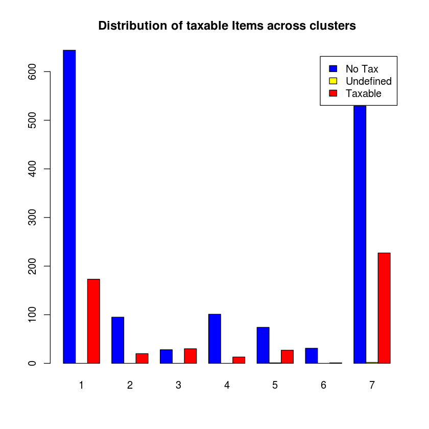

<h3>Distribution of Department Items</h3>


    [1] "Distribution of Department Items across clusters (1/7) - ,Books & Magazines,Bulk"
                       section_data
    section_data_groups   Books & Magazines Bulk
                      1 0                 3    3
                      2 0                 0    0
                      3 0                 0    1
                      4 0                 0    0
                      5 1                 0    0
                      6 0                 0    0
                      7 2                 3    0


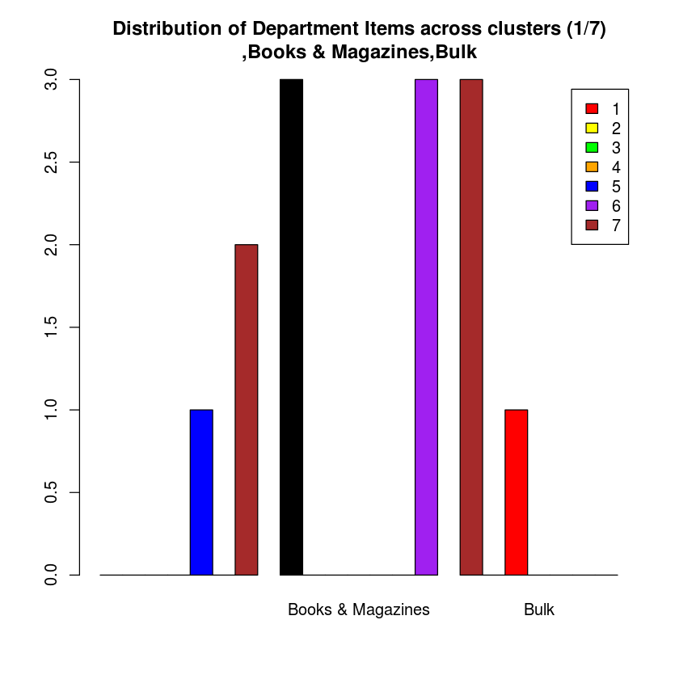


    [1] "Distribution of Department Items across clusters (2/7) - Commercial Bakery,Dairy,Deli"
                       section_data
    section_data_groups Commercial Bakery Dairy Deli
                      1                19   139   58
                      2                 2     8    0
                      3                 0     4    1
                      4                 9    28    3
                      5                 1     7    5
                      6                 2     5    0
                      7                44   125   30


    [1] "Distribution of Department Items across clusters (3/7) - Floral,Frozen Grocery,General Merchandise"
                       section_data
    section_data_groups Floral Frozen Grocery General Merchandise
                      1      3             55                   2
                      2      1              2                   2
                      3      1              2                   2
                      4      1              1                   1
                      5      1              3                   1
                      6      0              0                   0
                      7      2             22                   2


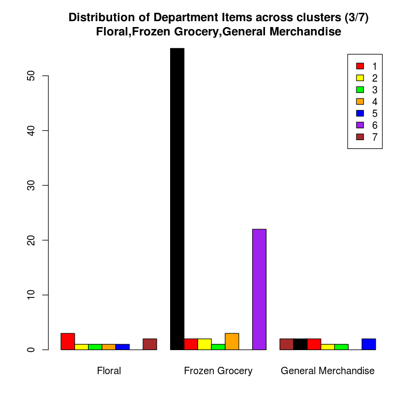


    [1] "Distribution of Department Items across clusters (4/7) - Grocery,HABA,Health Care"
                       section_data
    section_data_groups Grocery HABA Health Care
                      1     247    0           1
                      2       8    0           0
                      3       1    0           0
                      4      12    0           0
                      5      28    0           0
                      6       2    0           0
                      7     166    1           1


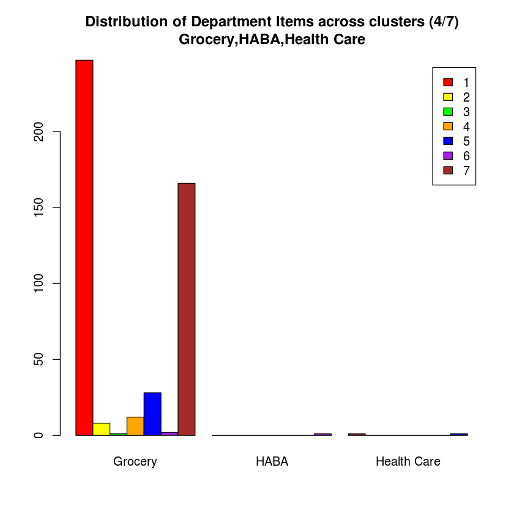


    [1] "Distribution of Department Items across clusters (5/7) - Home Meal Replacement,Instore Bakery,Lottery"
                       section_data
    section_data_groups Home Meal Replacement Instore Bakery Lottery
                      1                    39             12       7
                      2                     0              2       1
                      3                     4              2       1
                      4                     2              5       0
                      5                     0              6       0
                      6                     0              0       0
                      7                    71             70       0


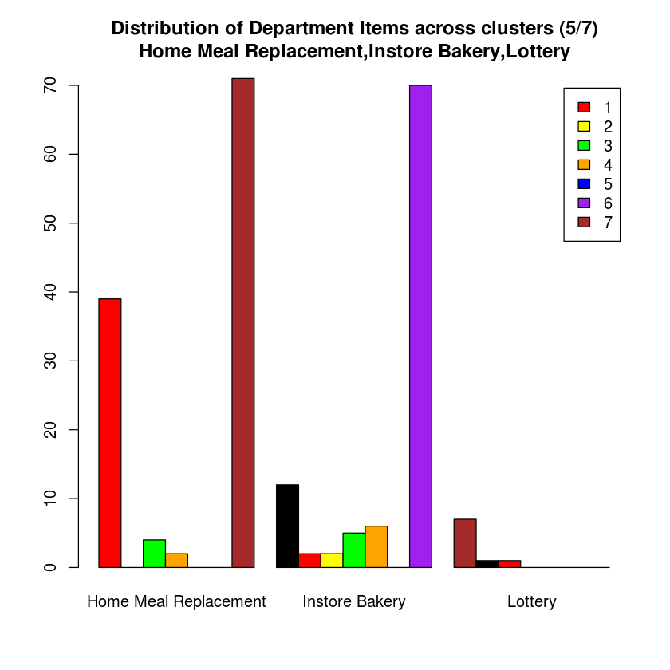


    [1] "Distribution of Department Items across clusters (6/7) - Meat,Pastry,Produce"
                       section_data
    section_data_groups Meat Pastry Produce
                      1  113      7      68
                      2   25      0      63
                      3    7      0       6
                      4   14      0      33
                      5   11      0      36
                      6    2      0      21
                      7   69      7     130


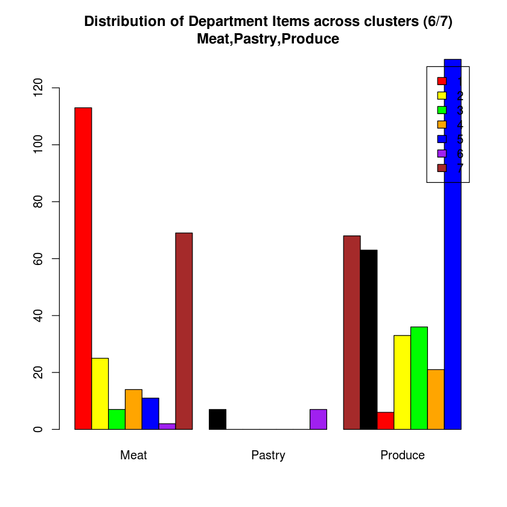


    [1] "Distribution of Department Items across clusters (7/7) - Seafood,Services,Tobacco"
                       section_data
    section_data_groups Seafood Services Tobacco
                      1      40        1       0
                      2       1        0       0
                      3       6        3      17
                      4       4        1       0
                      5       2        0       0
                      6       0        0       0
                      7      13        0       0


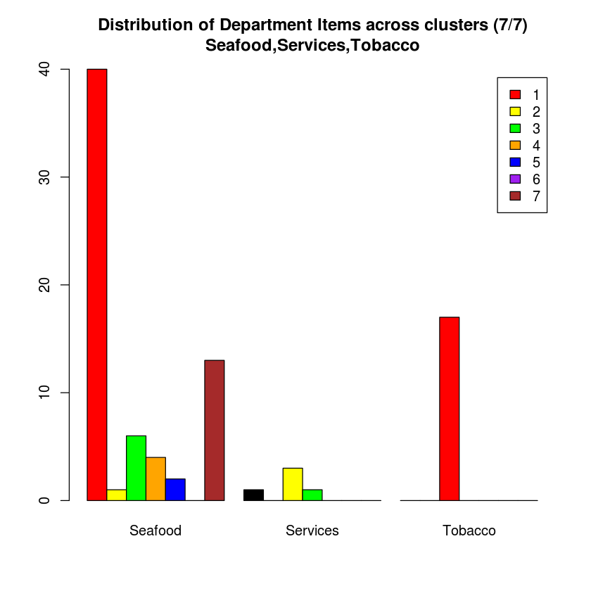


```R
"Cluster Distribution Across Groups"
head(counts,8)
```


'Cluster Distribution Across Groups'


<table>
<thead><tr><th></th><th scope=col></th><th scope=col>Books & Magazines</th><th scope=col>Bulk</th><th scope=col>Commercial Bakery</th><th scope=col>Dairy</th><th scope=col>Deli</th><th scope=col>Floral</th><th scope=col>Frozen Grocery</th><th scope=col>General Merchandise</th><th scope=col>Grocery</th><th scope=col></th><th scope=col>Health Care</th><th scope=col>Home Meal Replacement</th><th scope=col>Instore Bakery</th><th scope=col>Lottery</th><th scope=col>Meat</th><th scope=col>Pastry</th><th scope=col>Produce</th><th scope=col>Seafood</th><th scope=col>Services</th><th scope=col>Tobacco</th></tr></thead>
<tbody>
	<tr><th scope=row>1</th><td>0  </td><td>3  </td><td>3  </td><td>19 </td><td>139</td><td>58 </td><td>3  </td><td>55 </td><td>2  </td><td>247</td><td>⋯  </td><td>1  </td><td>39 </td><td>12 </td><td>7  </td><td>113</td><td>7  </td><td>68 </td><td>40 </td><td>1  </td><td>0  </td></tr>
	<tr><th scope=row>2</th><td>0 </td><td>0 </td><td>0 </td><td>2 </td><td>8 </td><td>0 </td><td>1 </td><td>2 </td><td>2 </td><td>8 </td><td>⋯ </td><td>0 </td><td>0 </td><td>2 </td><td>1 </td><td>25</td><td>0 </td><td>63</td><td>1 </td><td>0 </td><td>0 </td></tr>
	<tr><th scope=row>3</th><td>0 </td><td>0 </td><td>1 </td><td>0 </td><td>4 </td><td>1 </td><td>1 </td><td>2 </td><td>2 </td><td>1 </td><td>⋯ </td><td>0 </td><td>4 </td><td>2 </td><td>1 </td><td>7 </td><td>0 </td><td>6 </td><td>6 </td><td>3 </td><td>17</td></tr>
	<tr><th scope=row>4</th><td>0 </td><td>0 </td><td>0 </td><td>9 </td><td>28</td><td>3 </td><td>1 </td><td>1 </td><td>1 </td><td>12</td><td>⋯ </td><td>0 </td><td>2 </td><td>5 </td><td>0 </td><td>14</td><td>0 </td><td>33</td><td>4 </td><td>1 </td><td>0 </td></tr>
	<tr><th scope=row>5</th><td>1 </td><td>0 </td><td>0 </td><td>1 </td><td>7 </td><td>5 </td><td>1 </td><td>3 </td><td>1 </td><td>28</td><td>⋯ </td><td>0 </td><td>0 </td><td>6 </td><td>0 </td><td>11</td><td>0 </td><td>36</td><td>2 </td><td>0 </td><td>0 </td></tr>
	<tr><th scope=row>6</th><td>0 </td><td>0 </td><td>0 </td><td>2 </td><td>5 </td><td>0 </td><td>0 </td><td>0 </td><td>0 </td><td>2 </td><td>⋯ </td><td>0 </td><td>0 </td><td>0 </td><td>0 </td><td>2 </td><td>0 </td><td>21</td><td>0 </td><td>0 </td><td>0 </td></tr>
	<tr><th scope=row>7</th><td>2  </td><td>3  </td><td>0  </td><td>44 </td><td>125</td><td>30 </td><td>2  </td><td>22 </td><td>2  </td><td>166</td><td>⋯  </td><td>1  </td><td>71 </td><td>70 </td><td>0  </td><td>69 </td><td>7  </td><td>130</td><td>13 </td><td>0  </td><td>0  </td></tr>
</tbody>
</table>


```R
# Categories
barplot_groups(cdata$cluster,cdata$PM_CAT_ENG_DESC,section_name="Category")
```

    [1] "Distribution of Category Items across clusters (1/40) - ,Alternative Beverages,Alternative Bread"
                       section_data
    section_data_groups   Alternative Beverages Alternative Bread
                      1 0                     2                 4
                      2 0                     0                 0
                      3 0                     0                 0
                      4 0                     0                 0
                      5 1                     1                 0
                      6 0                     0                 0
                      7 2                     5                 8


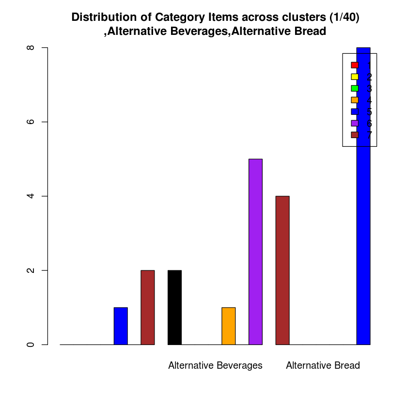


    [1] "Distribution of Category Items across clusters (2/40) - Apple And Pear,Baby Need,Bagel"
                       section_data
    section_data_groups Apple And Pear Baby Need Bagel
                      1              5         0     0
                      2             12         0     0
                      3              0         0     0
                      4              3         0     1
                      5              6         0     1
                      6              0         0     0
                      7              6         1     3


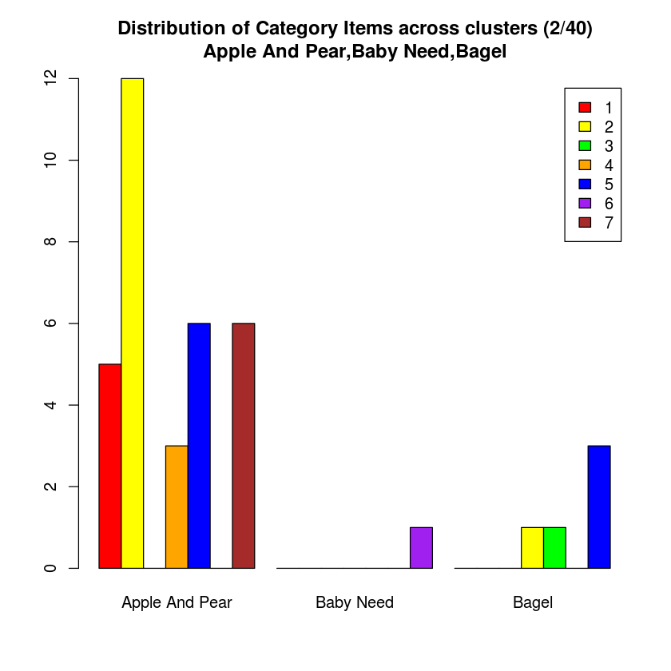


    [1] "Distribution of Category Items across clusters (3/40) - Bakery,Baking,Banana"
                       section_data
    section_data_groups Bakery Baking Banana
                      1      1     13      0
                      2      0      0      0
                      3      0      0      0
                      4      0      0      0
                      5      0      1      0
                      6      0      0      0
                      7      0      1      2


    [1] "Distribution of Category Items across clusters (4/40) - Beef,Bistro,Boxed Meat"
                       section_data
    section_data_groups Beef Bistro Boxed Meat
                      1   24     20         21
                      2    8      0          0
                      3    0      4          0
                      4    5      2          0
                      5    5      0          1
                      6    2      0          0
                      7   20     19          0


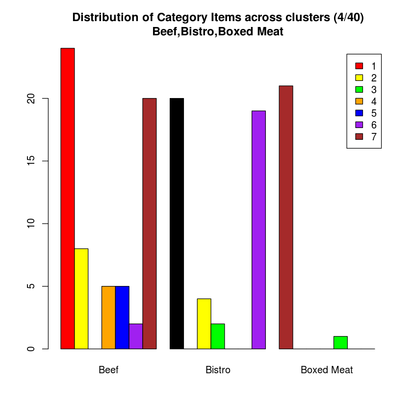


    [1] "Distribution of Category Items across clusters (5/40) - Boxed Seafood And Fish,Bread Products,Breads"
                       section_data
    section_data_groups Boxed Seafood And Fish Bread Products Breads
                      1                      5             15      1
                      2                      0              2      0
                      3                      0              0      1
                      4                      0              9      2
                      5                      0              1      1
                      6                      0              2      0
                      7                      0             42     21


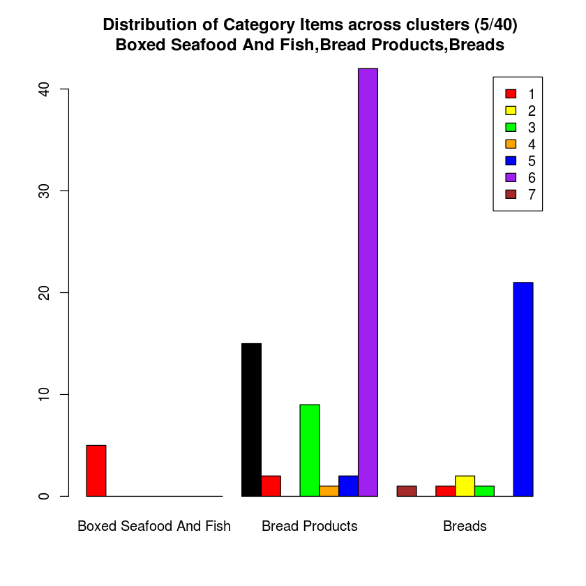


    [1] "Distribution of Category Items across clusters (6/40) - Breakfast,Bulk Food,Buns And Rolls"
                       section_data
    section_data_groups Breakfast Bulk Food Buns And Rolls
                      1         0         3              1
                      2         0         0              2
                      3         0         1              0
                      4         0         0              0
                      5         0         0              0
                      6         0         0              0
                      7         1         0             10


    [1] "Distribution of Category Items across clusters (7/40) - Butter And Margarine,Canned and Packaged Foods,Canned Vegetables"
                       section_data
    section_data_groups Butter And Margarine Canned and Packaged Foods
                      1                    8                         7
                      2                    1                         0
                      3                    0                         0
                      4                    3                         0
                      5                    0                         0
                      6                    0                         1
                      7                   11                         6
                       section_data
    section_data_groups Canned Vegetables
                      1                 2
                      2                 0
                      3                 0
                      4                 0
                      5                 0
                      6                 0
                      7                 4


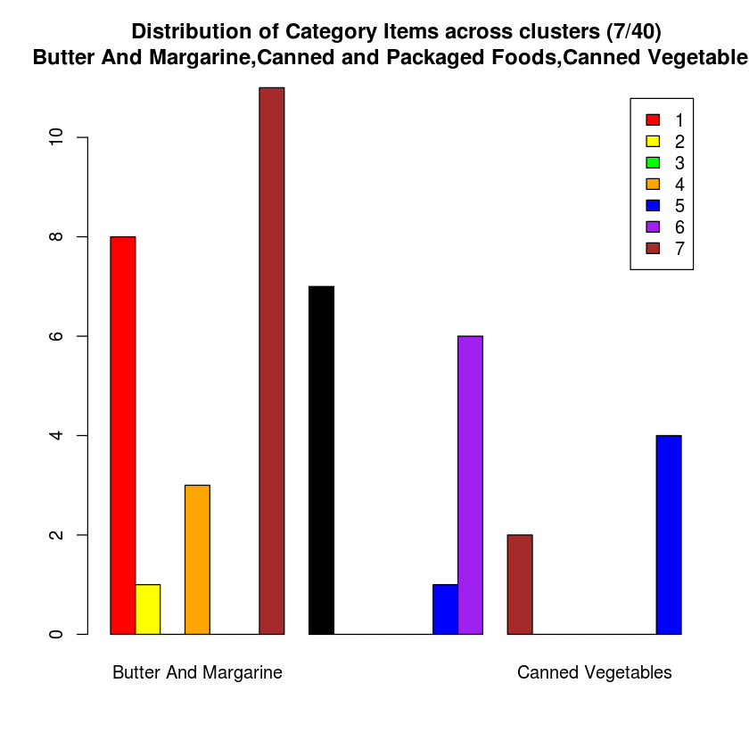


    [1] "Distribution of Category Items across clusters (8/40) - Cereal,Chicken,Chips"
                       section_data
    section_data_groups Cereal Chicken Chips
                      1     30      13    11
                      2      0      12     2
                      3      0       4     0
                      4      0       3     1
                      5      0       3     9
                      6      0       0     0
                      7     10       8    25


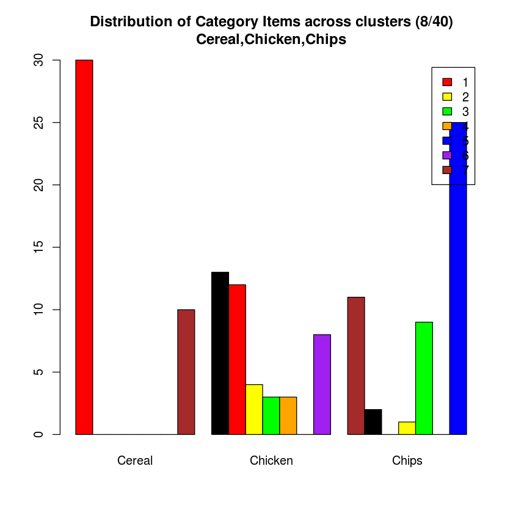


    [1] "Distribution of Category Items across clusters (9/40) - Chocolate,Cigarettes - 20's,Cigarettes - 25's"
                       section_data
    section_data_groups Chocolate Cigarettes - 20's Cigarettes - 25's
                      1         2                 0                 0
                      2         0                 0                 0
                      3         0                 6                11
                      4         0                 0                 0
                      5         0                 0                 0
                      6         0                 0                 0
                      7         8                 0                 0


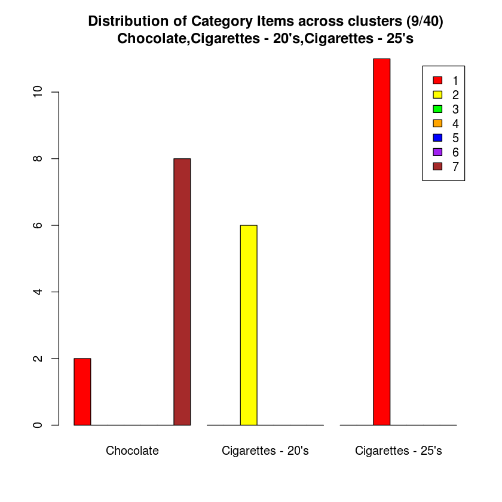


    [1] "Distribution of Category Items across clusters (10/40) - Citrus,Cleaners And Fresheners,Com. Sweet Goods"
                       section_data
    section_data_groups Citrus Cleaners And Fresheners Com. Sweet Goods
                      1      2                       1                3
                      2      6                       0                0
                      3      0                       0                0
                      4      0                       0                0
                      5      1                       0                0
                      6      4                       0                0
                      7      2                       0                2


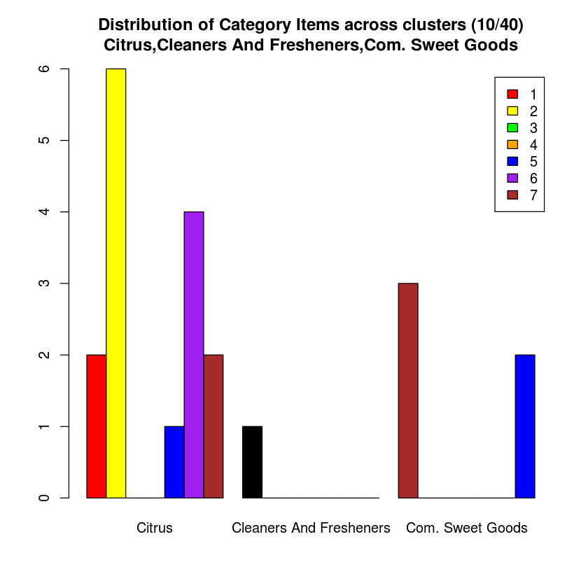


    [1] "Distribution of Category Items across clusters (11/40) - Condiment,Confectionery,Cooked Meal"
                       section_data
    section_data_groups Condiment Confectionery Cooked Meal
                      1         4             0           3
                      2         0             3           0
                      3         0             0           0
                      4         1             0           0
                      5         0             0           0
                      6         0             0           0
                      7         3             0           1


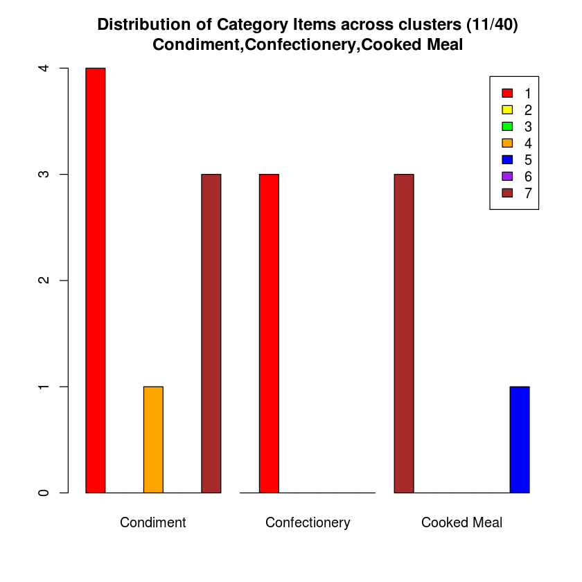


    [1] "Distribution of Category Items across clusters (12/40) - Cookies,Cooking Vegetable,Dairy Cheese"
                       section_data
    section_data_groups Cookies Cooking Vegetable Dairy Cheese
                      1       4                18           42
                      2       0                 6            6
                      3       0                 5            0
                      4       1                 7            2
                      5       2                 4            2
                      6       0                 2            0
                      7      11                29           12


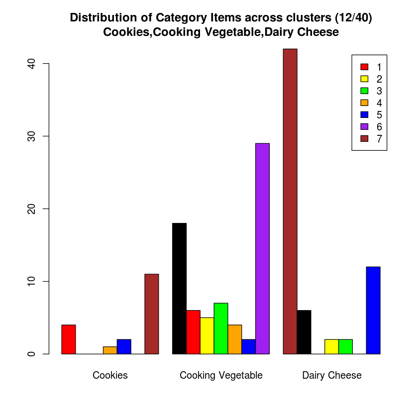


    [1] "Distribution of Category Items across clusters (13/40) - Deli Cheese,Deli Cheese-Portion,Deli Meats-Self Service"
                       section_data
    section_data_groups Deli Cheese Deli Cheese-Portion Deli Meats-Self Service
                      1           8                  13                       9
                      2           0                   0                       0
                      3           0                   1                       0
                      4           0                   0                       2
                      5           0                   3                       2
                      6           0                   0                       0
                      7           4                   1                      12


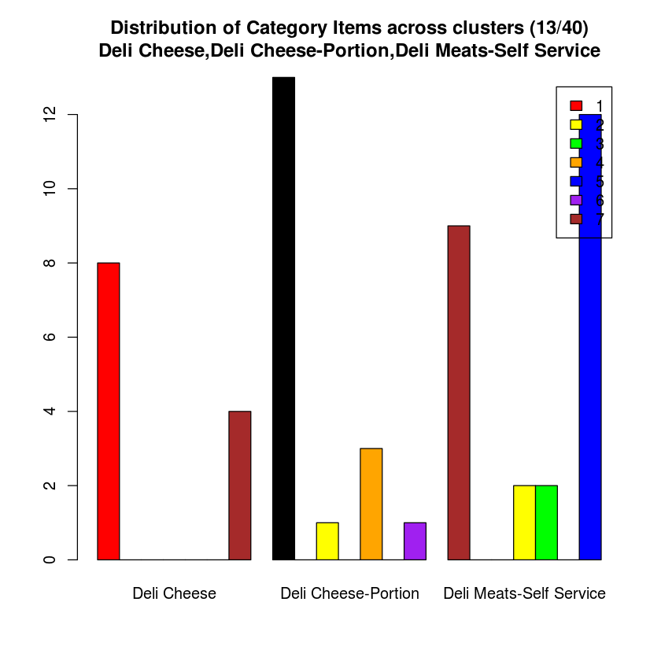


    [1] "Distribution of Category Items across clusters (14/40) - Deli Meats-Service,Donuts,Dry Produce"
                       section_data
    section_data_groups Deli Meats-Service Donuts Dry Produce
                      1                 12      0           3
                      2                  0      0           0
                      3                  0      0           0
                      4                  1      0           0
                      5                  0      0           0
                      6                  0      0           0
                      7                  0      2           1


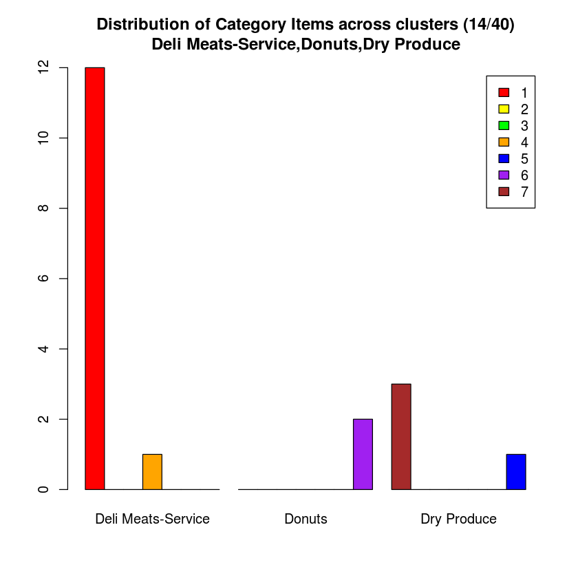


    [1] "Distribution of Category Items across clusters (15/40) - Eggs,Fin-Fish Fresh,Fin Fish Frozen"
                       section_data
    section_data_groups Eggs Fin-Fish Fresh Fin Fish Frozen
                      1    2              8               2
                      2    0              0               0
                      3    3              5               0
                      4    2              4               0
                      5    0              1               0
                      6    1              0               0
                      7   11              2               1


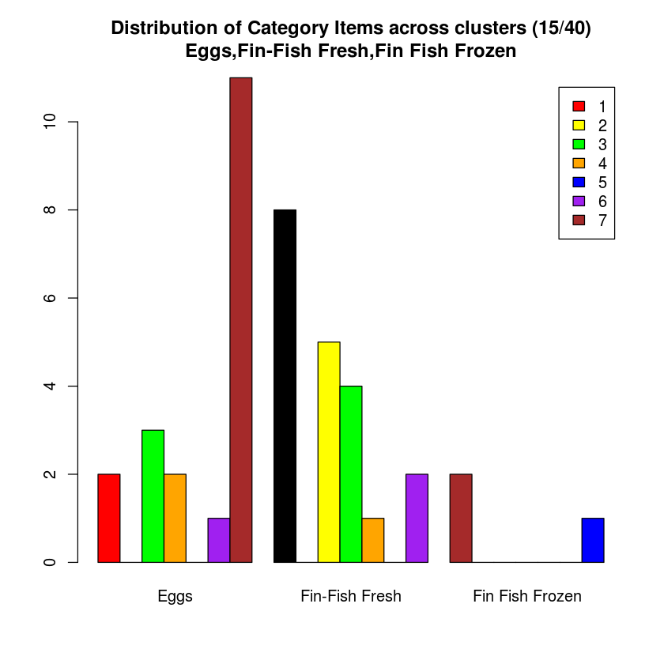


    [1] "Distribution of Category Items across clusters (16/40) - Fresh Crustaceans,Frozen Breakfast &Bread,Frozen Desserts"
                       section_data
    section_data_groups Fresh Crustaceans Frozen Breakfast &Bread Frozen Desserts
                      1                 4                       1               6
                      2                 0                       0               0
                      3                 0                       0               2
                      4                 0                       0               1
                      5                 0                       0               0
                      6                 0                       0               0
                      7                 0                       0               5


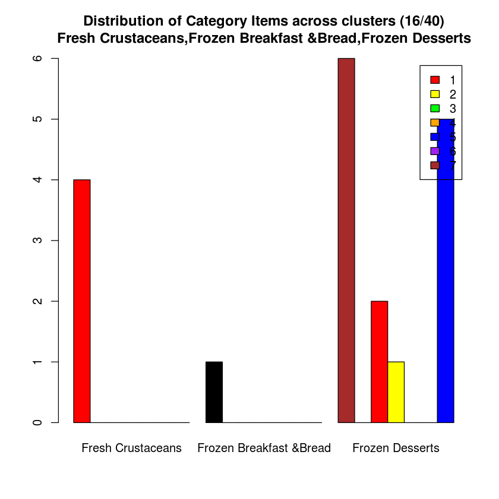


    [1] "Distribution of Category Items across clusters (17/40) - Frozen Ice Cream,Frozen Meal,Frozen Organic And Natural"
                       section_data
    section_data_groups Frozen Ice Cream Frozen Meal Frozen Organic And Natural
                      1               11           2                          1
                      2                2           0                          0
                      3                0           0                          0
                      4                0           0                          0
                      5                1           0                          0
                      6                0           0                          0
                      7                2           3                          0


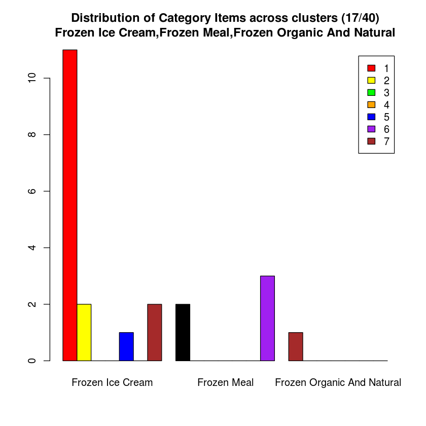


    [1] "Distribution of Category Items across clusters (18/40) - Frozen Pizza,Frozen Vegetables,Fruit And Drink Beverages"
                       section_data
    section_data_groups Frozen Pizza Frozen Vegetables Fruit And Drink Beverages
                      1           27                 6                         4
                      2            0                 0                         0
                      3            0                 0                         0
                      4            0                 0                         1
                      5            2                 0                         0
                      6            0                 0                         0
                      7            4                 7                         1


    [1] "Distribution of Category Items across clusters (19/40) - Garlic Onion Shallot,GM,Greeting Cards & Gift Wrap"
                       section_data
    section_data_groups Garlic Onion Shallot GM Greeting Cards & Gift Wrap
                      1                    1  2                          0
                      2                    0  2                          0
                      3                    0  2                          0
                      4                    2  0                          1
                      5                    1  1                          0
                      6                    2  0                          0
                      7                    5  2                          0


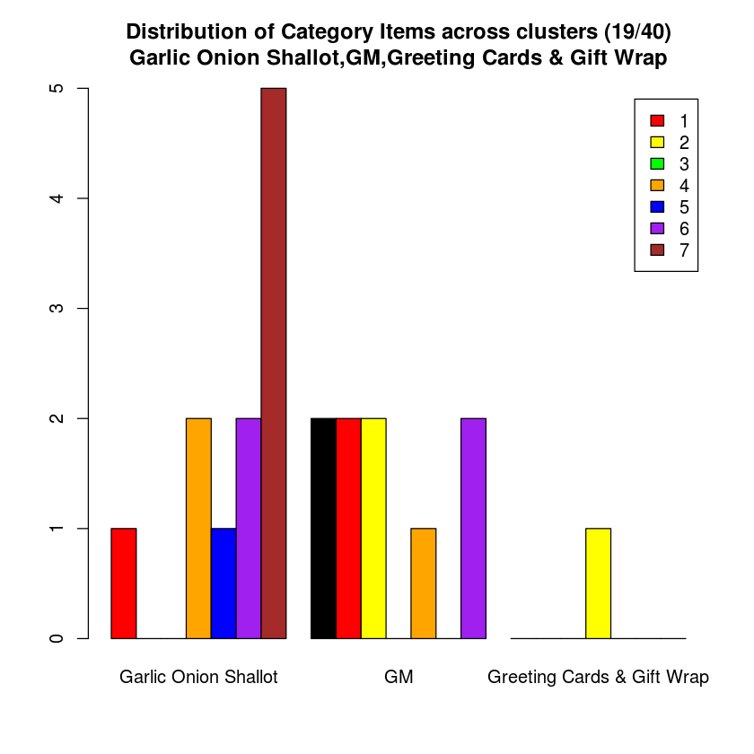


    [1] "Distribution of Category Items across clusters (20/40) - Ham,HMR Chicken,Home Health Care"
                       section_data
    section_data_groups Ham HMR Chicken Home Health Care
                      1   6           3                0
                      2   0           0                0
                      3   0           0                0
                      4   0           0                0
                      5   0           0                0
                      6   0           0                0
                      7   2           2                1


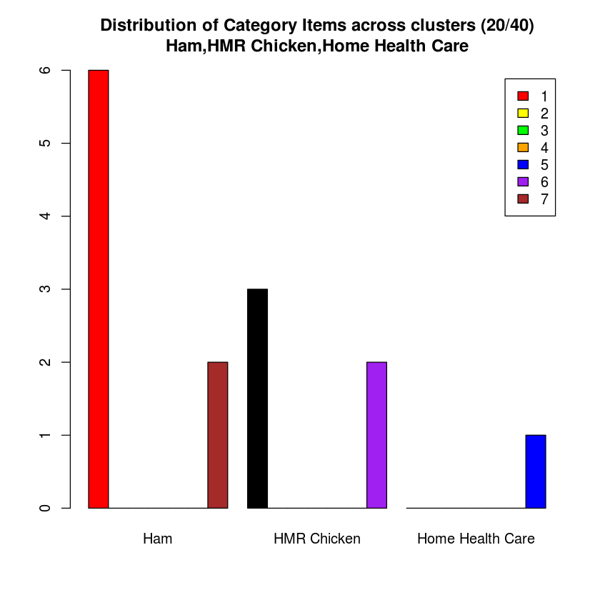


    [1] "Distribution of Category Items across clusters (21/40) - Horticultural Product,Hot Beverages,Household Others"
                       section_data
    section_data_groups Horticultural Product Hot Beverages Household Others
                      1                     3            14               14
                      2                     1             0                0
                      3                     1             0                0
                      4                     1             0                0
                      5                     1             4                2
                      6                     0             0                0
                      7                     2             2                2


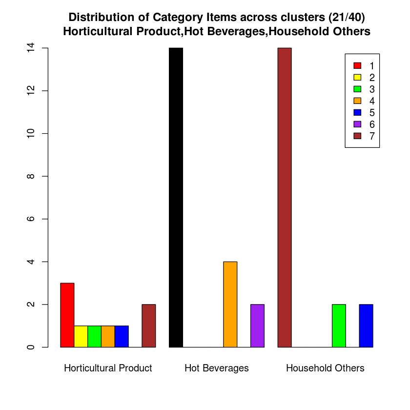


    [1] "Distribution of Category Items across clusters (22/40) - International,Lamb,Laundry"
                       section_data
    section_data_groups International Lamb Laundry
                      1             7    3       2
                      2             0    0       0
                      3             0    0       0
                      4             0    0       0
                      5             1    0       0
                      6             0    0       0
                      7             4    1       0


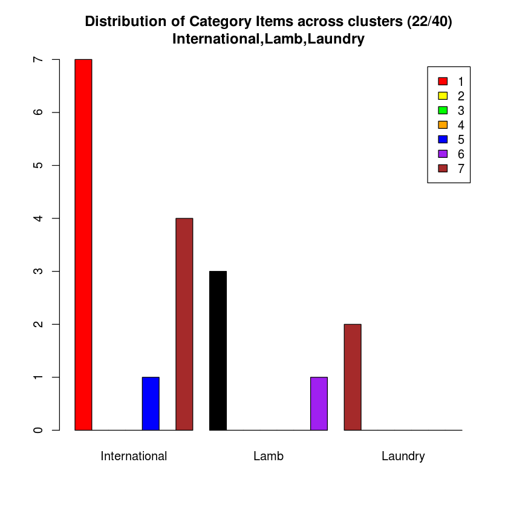


    [1] "Distribution of Category Items across clusters (23/40) - Lottery Sales,Magazines And Books,Milk Product"
                       section_data
    section_data_groups Lottery Sales Magazines And Books Milk Product
                      1             7                   3           20
                      2             1                   0            1
                      3             1                   0            1
                      4             0                   0           18
                      5             0                   0            1
                      6             0                   0            4
                      7             0                   3           47


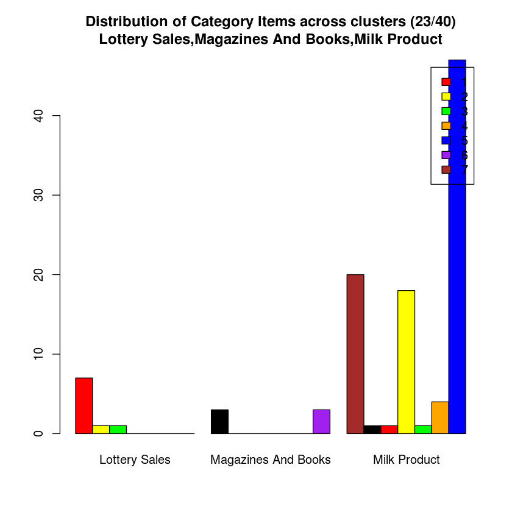


    [1] "Distribution of Category Items across clusters (24/40) - Mollusk Fresh,Muffins,Mushrooms"
                       section_data
    section_data_groups Mollusk Fresh Muffins Mushrooms
                      1             2       1         5
                      2             1       0         0
                      3             0       0         0
                      4             0       0         2
                      5             0       0         1
                      6             0       0         1
                      7             0       5         1


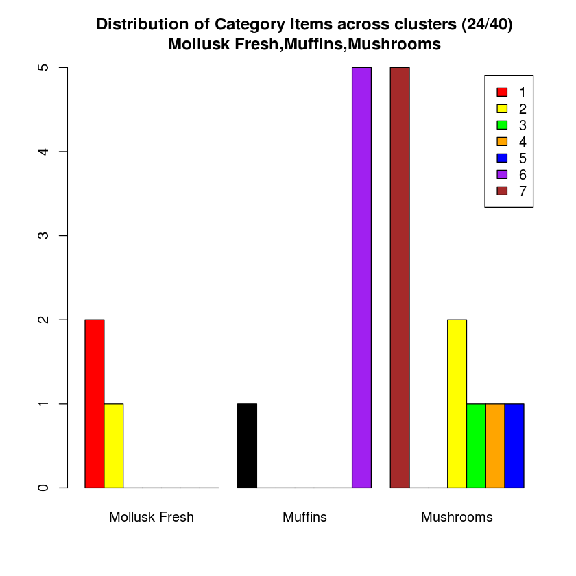


    [1] "Distribution of Category Items across clusters (25/40) - NPF,Oil,Organic And Natural Dairy"
                       section_data
    section_data_groups NPF Oil Organic And Natural Dairy
                      1   2   9                        14
                      2   0   0                         0
                      3   0   0                         0
                      4   0   0                         1
                      5   0   0                         0
                      6   0   0                         0
                      7   0   0                         9


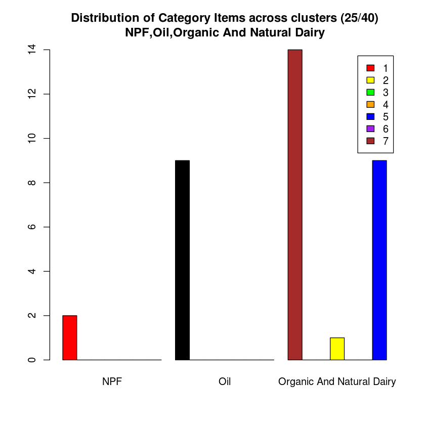


    [1] "Distribution of Category Items across clusters (26/40) - Organic &Natural Grocery,Organic Produce,OTC"
                       section_data
    section_data_groups Organic &Natural Grocery Organic Produce OTC
                      1                       20               4   1
                      2                        0               7   0
                      3                        0               0   0
                      4                        0               2   0
                      5                        0               5   0
                      6                        0               0   0
                      7                       17              14   0


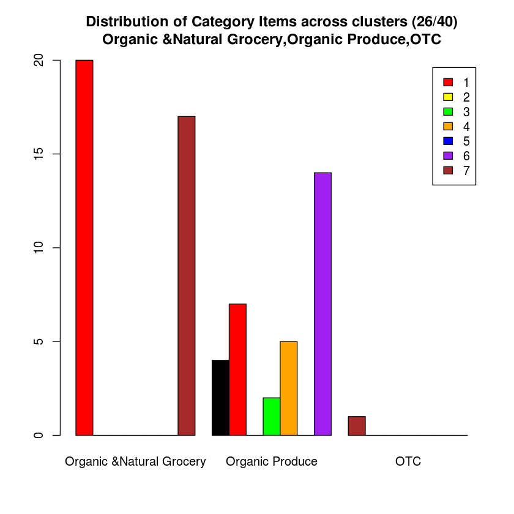


    [1] "Distribution of Category Items across clusters (27/40) - Other Bakery Products,Other Consumable Breakfast,Other Dairy"
                       section_data
    section_data_groups Other Bakery Products Other Consumable Breakfast
                      1                     2                          1
                      2                     0                          0
                      3                     0                          0
                      4                     0                          0
                      5                     0                          0
                      6                     0                          0
                      7                     0                          0
                       section_data
    section_data_groups Other Dairy
                      1           1
                      2           0
                      3           0
                      4           0
                      5           0
                      6           0
                      7           3


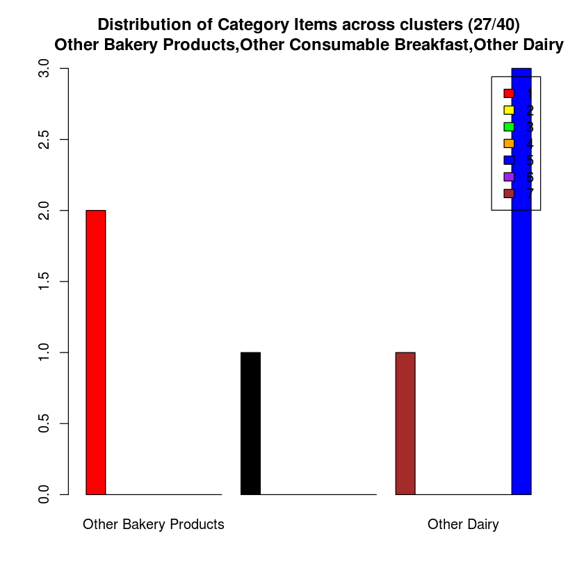


    [1] "Distribution of Category Items across clusters (28/40) - Other Deli,Other Frozen Grocery,Other Fruits"
                       section_data
    section_data_groups Other Deli Other Frozen Grocery Other Fruits
                      1          3                    1            4
                      2          0                    0           21
                      3          0                    0            0
                      4          0                    0            6
                      5          0                    0            7
                      6          0                    0            3
                      7          0                    1           35


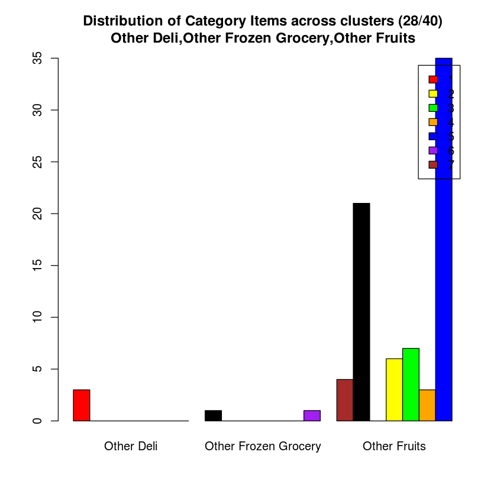


    [1] "Distribution of Category Items across clusters (29/40) - Packaged Goods-Refrigerated and Shelf st,Paper,Party Trays"
                       section_data
    section_data_groups Packaged Goods-Refrigerated and Shelf st Paper Party Trays
                      1                                        0    25           0
                      2                                        0     3           0
                      3                                        0     0           0
                      4                                        0     1           0
                      5                                        0     7           0
                      6                                        0     0           0
                      7                                        2    11           6


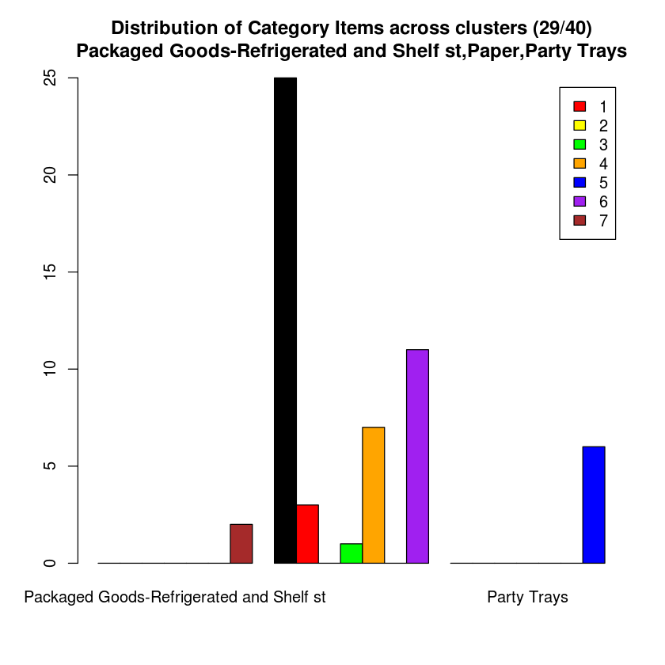


    [1] "Distribution of Category Items across clusters (30/40) - Pasta,Pastries,Pastry Counter Full"
                       section_data
    section_data_groups Pasta Pastries Pastry Counter Full
                      1     5        0                   7
                      2     0        0                   0
                      3     0        1                   0
                      4     0        1                   0
                      5     0        3                   0
                      6     0        0                   0
                      7     2       10                   6


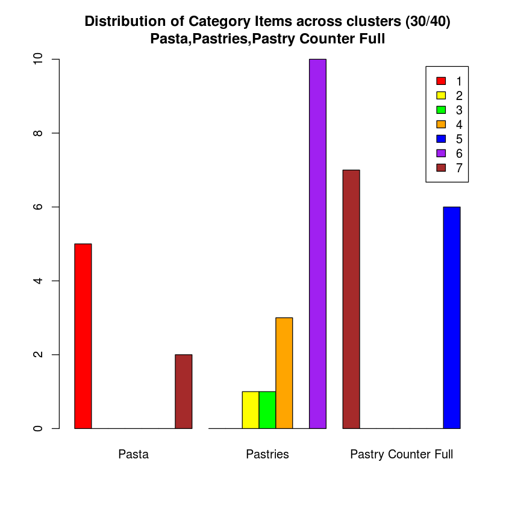


    [1] "Distribution of Category Items across clusters (31/40) - Pastry Counter-Portion,Peppers&Hot Peppers,Pet"
                       section_data
    section_data_groups Pastry Counter-Portion Peppers&Hot Peppers Pet
                      1                      0                   1  11
                      2                      0                   2   0
                      3                      0                   0   0
                      4                      0                   3   0
                      5                      0                   0   0
                      6                      0                   2   0
                      7                      1                   0   6


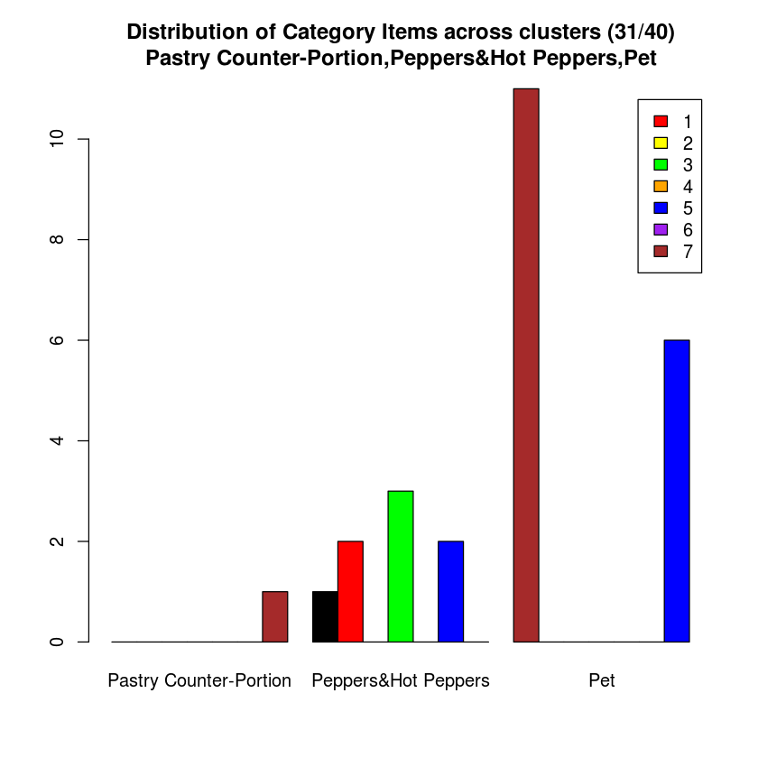


    [1] "Distribution of Category Items across clusters (32/40) - Pickles-Antipasto-Dips-Dressings,Pies,Pizza (Fresh)"
                       section_data
    section_data_groups Pickles-Antipasto-Dips-Dressings Pies Pizza (Fresh)
                      1                               13    2             5
                      2                                0    0             0
                      3                                0    0             0
                      4                                0    0             0
                      5                                0    0             0
                      6                                0    0             0
                      7                                7    2             0


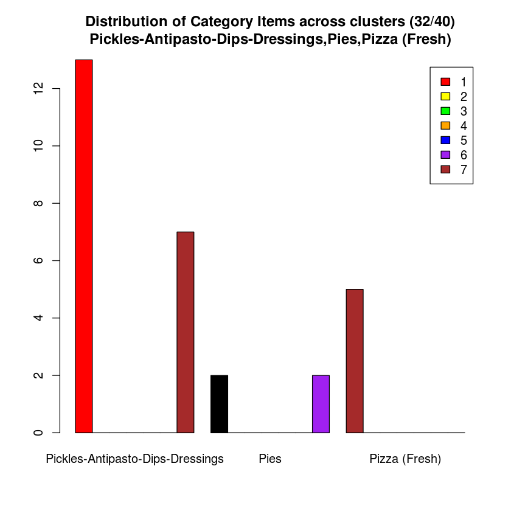


    [1] "Distribution of Category Items across clusters (33/40) - Pork,Potatoes,Processed"
                       section_data
    section_data_groups Pork Potatoes Processed
                      1   12        4        27
                      2    2        2         3
                      3    0        1         2
                      4    3        0         3
                      5    1        4         1
                      6    0        1         0
                      7   12       10        25


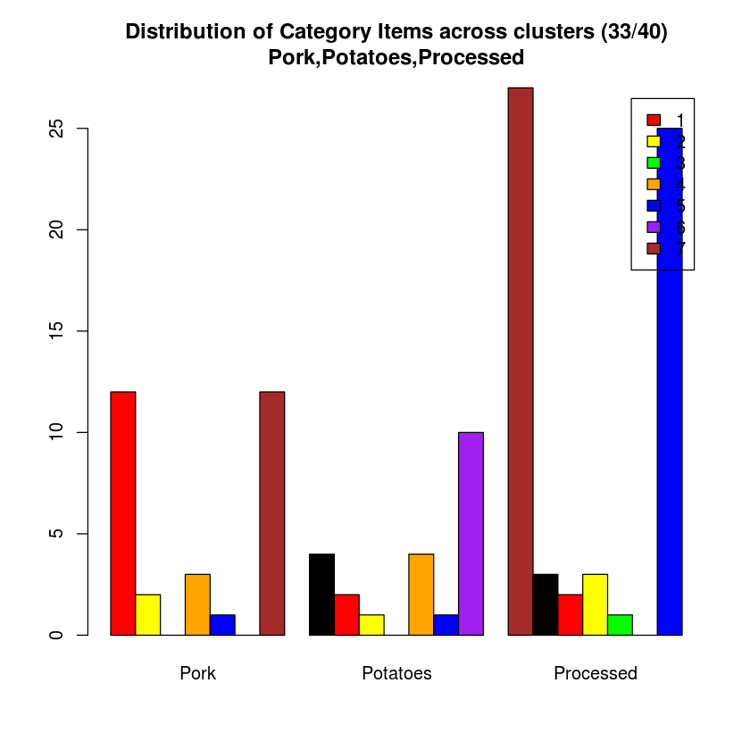


    [1] "Distribution of Category Items across clusters (34/40) - Refrigerated,Refrigerated Juice&Drinks,Rice"
                       section_data
    section_data_groups Refrigerated Refrigerated Juice&Drinks Rice
                      1           14                        10    9
                      2            2                         0    0
                      3            0                         0    0
                      4            4                         1    0
                      5            2                         2    0
                      6            1                         0    0
                      7           15                        18    0


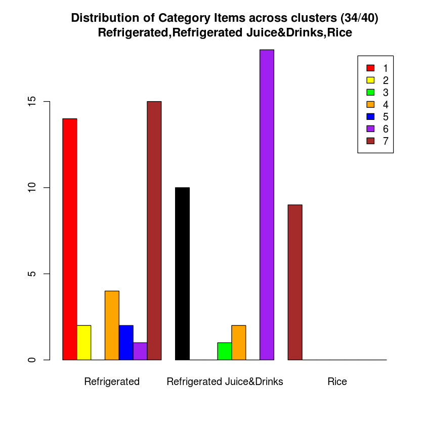


    [1] "Distribution of Category Items across clusters (35/40) - Salad Dressing,Salad Items,Salads"
                       section_data
    section_data_groups Salad Dressing Salad Items Salads
                      1              5           3      7
                      2              0           4      0
                      3              0           0      0
                      4              0           2      0
                      5              0           4      0
                      6              0           3      0
                      7              3           7     13


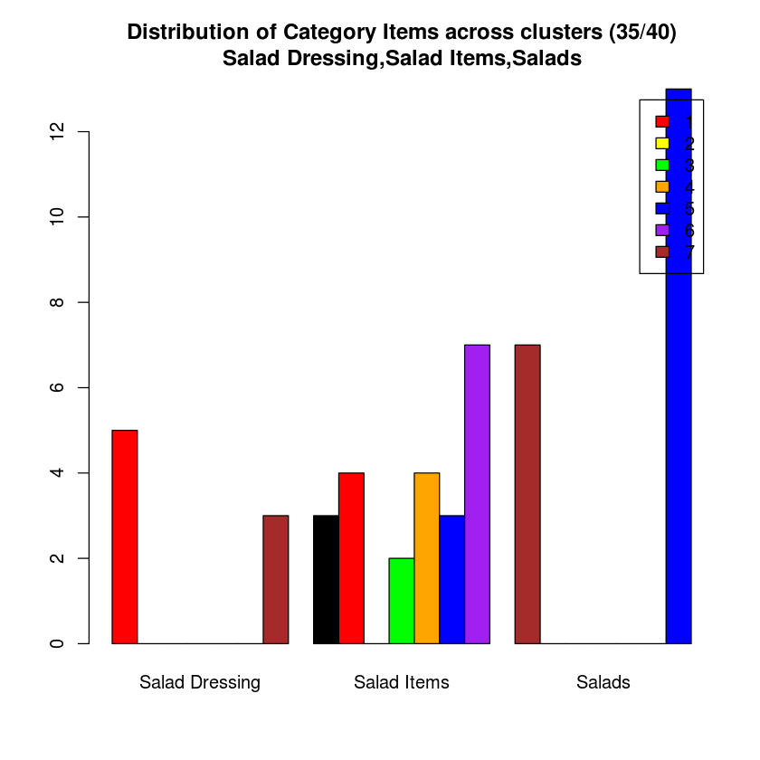


    [1] "Distribution of Category Items across clusters (36/40) - Salted Snacks,Sandwich / Submarine / Combo,Service Case"
                       section_data
    section_data_groups Salted Snacks Sandwich / Submarine / Combo Service Case
                      1             9                            1            6
                      2             0                            0            0
                      3             0                            0            1
                      4             0                            0            0
                      5             0                            0            0
                      6             0                            0            0
                      7            10                           36            0


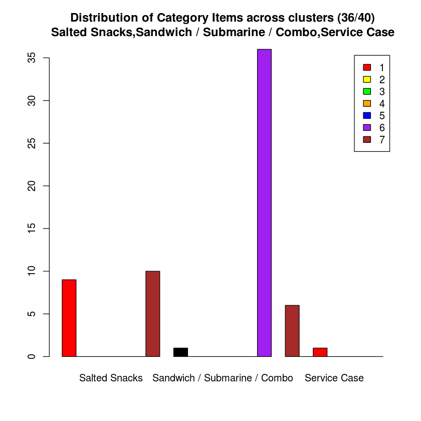


    [1] "Distribution of Category Items across clusters (37/40) - Services - Other,Shell Fish / Other,Smoked / Salted Fish"
                       section_data
    section_data_groups Services - Other Shell Fish / Other Smoked / Salted Fish
                      1                1                  7                    6
                      2                0                  0                    0
                      3                3                  1                    0
                      4                1                  0                    0
                      5                0                  0                    1
                      6                0                  0                    0
                      7                0                  1                    2


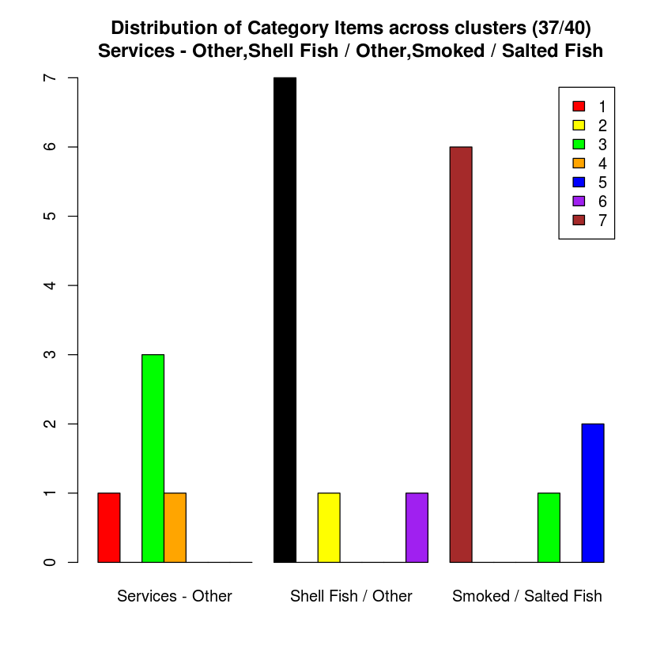


    [1] "Distribution of Category Items across clusters (38/40) - Soft Drinks,Soup,Spices"
                       section_data
    section_data_groups Soft Drinks Soup Spices
                      1          11    3      1
                      2           0    0      0
                      3           1    0      0
                      4           4    0      0
                      5           2    0      0
                      6           0    0      0
                      7          21    8      1


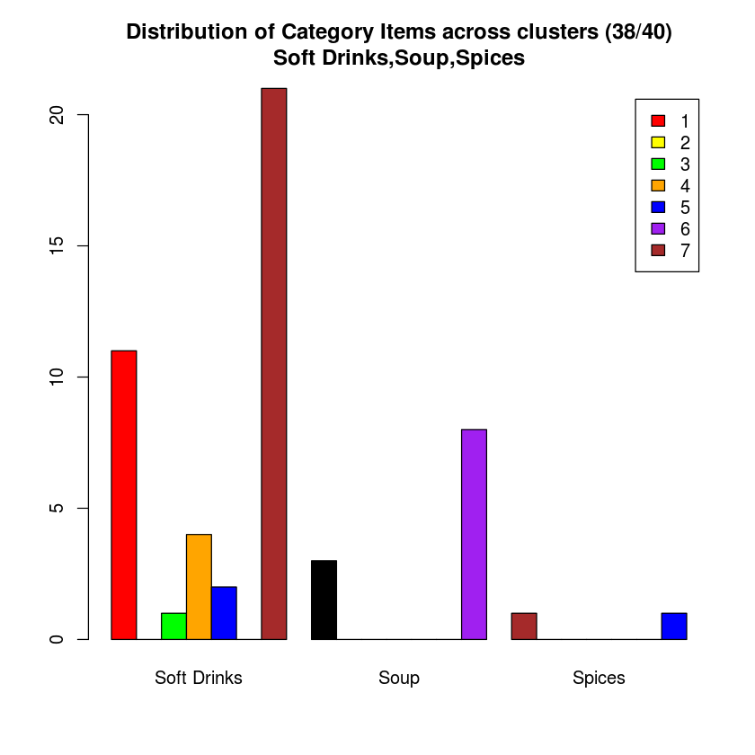


    [1] "Distribution of Category Items across clusters (39/40) - Spreads And Syrups,Sugar,Sushi"
                       section_data
    section_data_groups Spreads And Syrups Sugar Sushi
                      1                 14     1     6
                      2                  0     0     0
                      3                  0     0     0
                      4                  1     1     0
                      5                  0     0     0
                      6                  0     0     0
                      7                  4     2     5


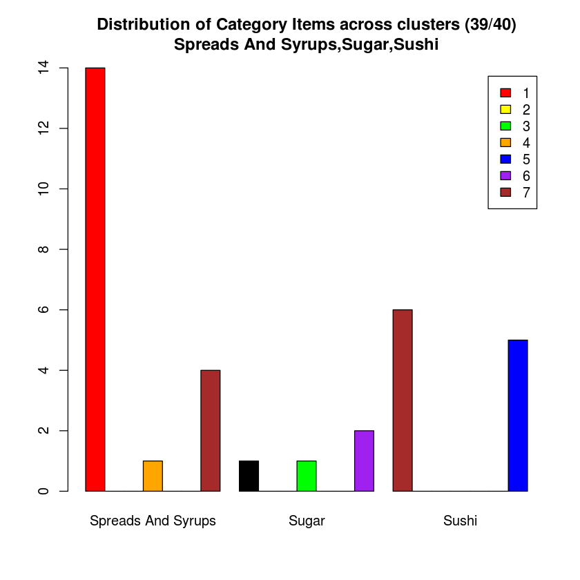


    [1] "Distribution of Category Items across clusters (40/40) - Tomatoes,Turkey,Vegetables Juices"
                       section_data
    section_data_groups Tomatoes Turkey Vegetables Juices
                      1        4      1                 1
                      2        1      0                 0
                      3        0      0                 0
                      4        2      0                 0
                      5        1      0                 0
                      6        2      0                 0
                      7        3      1                 0


```R
barplot_groups(cdata$cluster,cdata$PM_SUB_CAT_ENG_DESC,section_name="Sub Categories")

```

    [1] "Distribution of Sub Categories Items across clusters (1/94) - ,Analgesics R2,Apples"
                       section_data
    section_data_groups   Analgesics R2 Apples
                      1 0             1      4
                      2 0             0     12
                      3 0             0      0
                      4 0             0      2
                      5 1             0      6
                      6 0             0      0
                      7 2             0      4


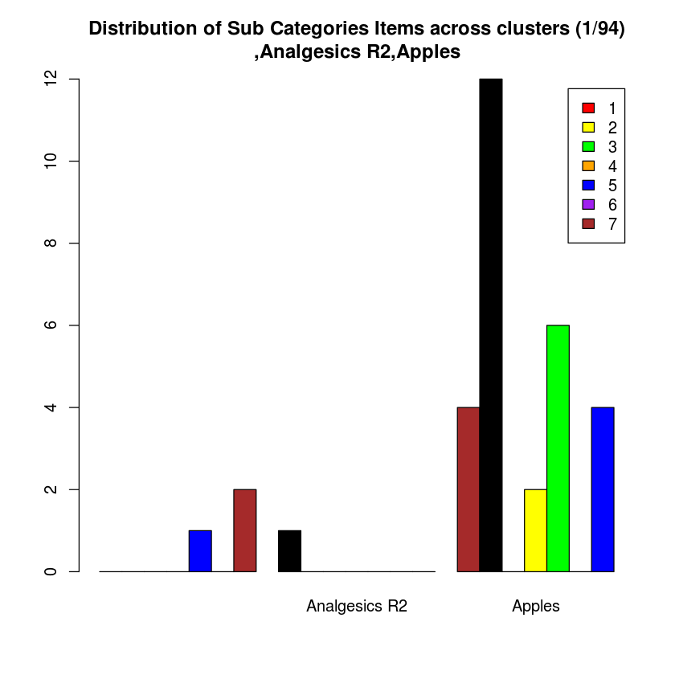


    [1] "Distribution of Sub Categories Items across clusters (2/94) - Asian,Automotive,Baby Needs"
                       section_data
    section_data_groups Asian Automotive Baby Needs
                      1     2          0          0
                      2     0          0          0
                      3     0          0          0
                      4     0          0          0
                      5     1          1          0
                      6     0          0          0
                      7     1          0          1


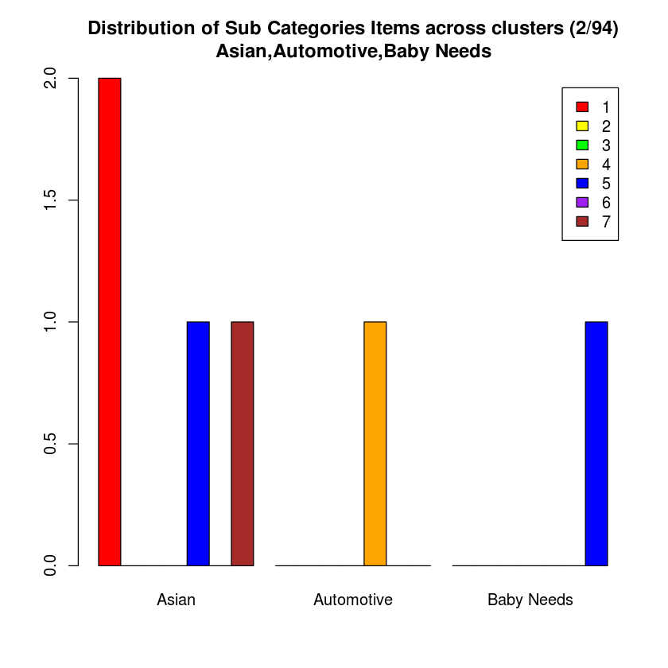


    [1] "Distribution of Sub Categories Items across clusters (3/94) - Bacon,Bagged Ice,Baking Needs"
                       section_data
    section_data_groups Bacon Bagged Ice Baking Needs
                      1     1          1            5
                      2     3          0            0
                      3     0          0            0
                      4     3          0            0
                      5     1          0            0
                      6     0          0            0
                      7     8          1            0


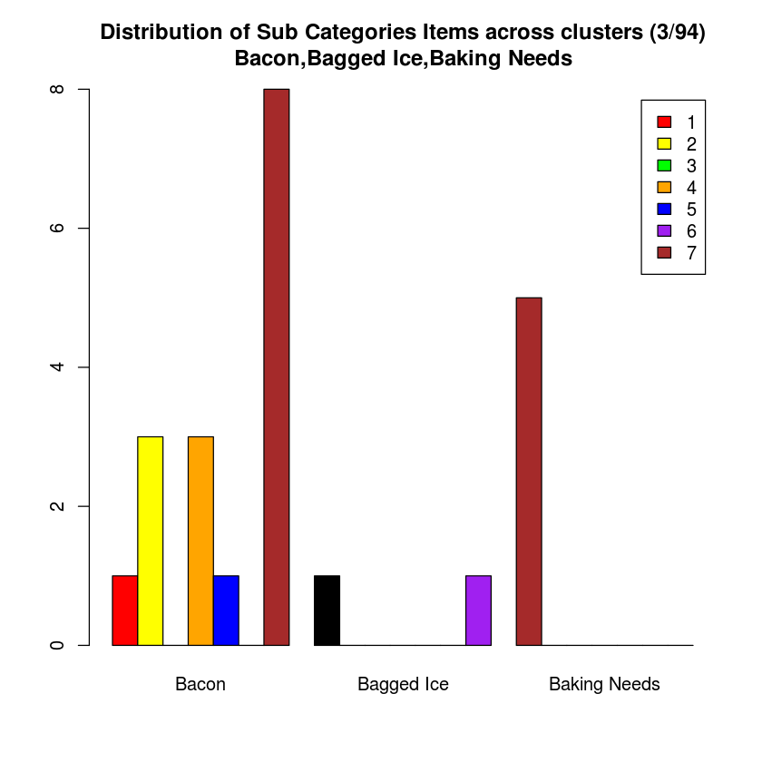


    [1] "Distribution of Sub Categories Items across clusters (4/94) - Bananas,Basic Salad Bulk(HMR,Basic Salad PPK(HMR)"
                       section_data
    section_data_groups Bananas Basic Salad Bulk(HMR Basic Salad PPK(HMR)
                      1       0                    4                    2
                      2       0                    0                    0
                      3       0                    0                    0
                      4       0                    0                    0
                      5       0                    0                    0
                      6       0                    0                    0
                      7       2                    0                   13


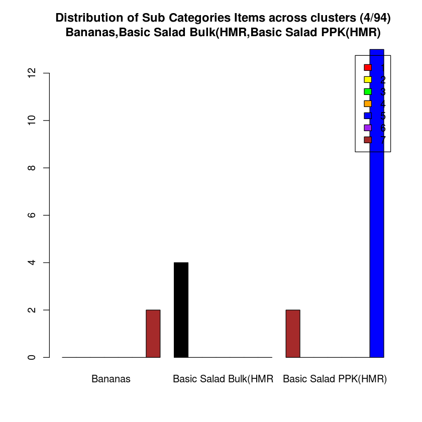


    [1] "Distribution of Sub Categories Items across clusters (5/94) - Bathroom Tissue,Batteries,Beef Frankfurt"
                       section_data
    section_data_groups Bathroom Tissue Batteries Beef Frankfurt
                      1              15         1              1
                      2               3         0              0
                      3               0         0              0
                      4               1         0              0
                      5               6         0              0
                      6               0         0              0
                      7               5         0              0


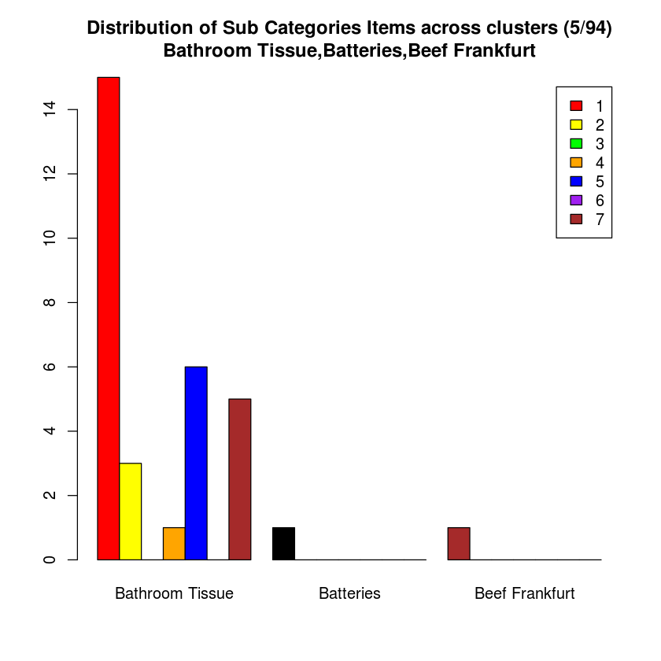


    [1] "Distribution of Sub Categories Items across clusters (6/94) - Beef-Miscellaneous,Beef Rib,Beef (Service Case)"
                       section_data
    section_data_groups Beef-Miscellaneous Beef Rib Beef (Service Case)
                      1                  3        3                   6
                      2                  0        1                   0
                      3                  0        0                   1
                      4                  0        0                   0
                      5                  0        2                   0
                      6                  0        0                   0
                      7                  1        1                   0


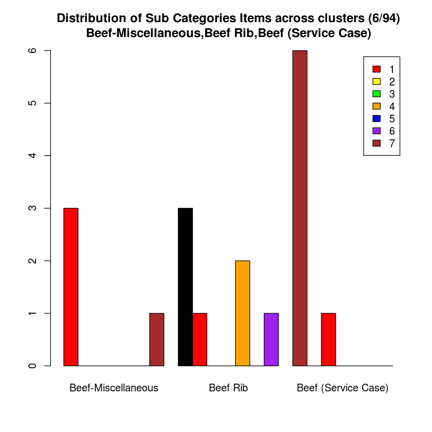


    [1] "Distribution of Sub Categories Items across clusters (7/94) - Beef Short Rump,Beef Specialties,Berries"
                       section_data
    section_data_groups Beef Short Rump Beef Specialties Berries
                      1               2                0       0
                      2               1                0      15
                      3               0                0       0
                      4               0                0       2
                      5               0                1       2
                      6               0                0       0
                      7               3                2       1


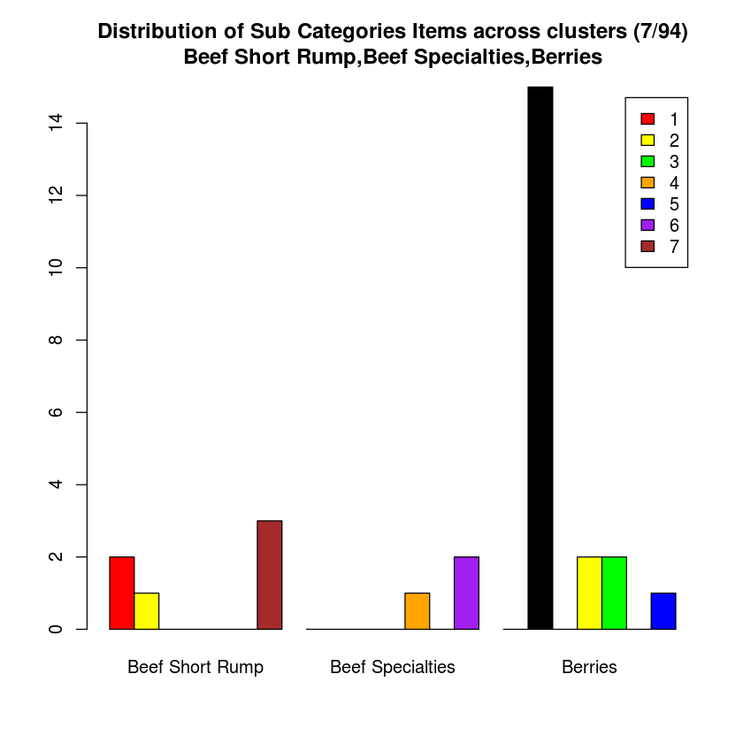


    [1] "Distribution of Sub Categories Items across clusters (8/94) - Blade,Blooming Plants,Blue Cheese (Deli)"
                       section_data
    section_data_groups Blade Blooming Plants Blue Cheese (Deli)
                      1     5               1                  1
                      2     1               0                  0
                      3     0               0                  0
                      4     0               0                  0
                      5     0               0                  0
                      6     0               0                  0
                      7     3               0                  0


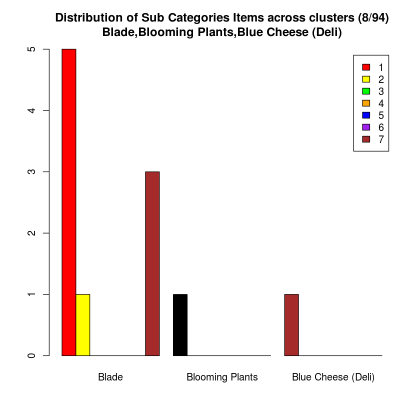


    [1] "Distribution of Sub Categories Items across clusters (9/94) - Boneless Beef,Bouquet,BOXED BREADD PORTION"
                       section_data
    section_data_groups Boneless Beef Bouquet BOXED BREADD PORTION
                      1             2       2                    1
                      2             3       1                    0
                      3             0       1                    0
                      4             5       1                    0
                      5             1       1                    0
                      6             2       0                    0
                      7             2       2                    0


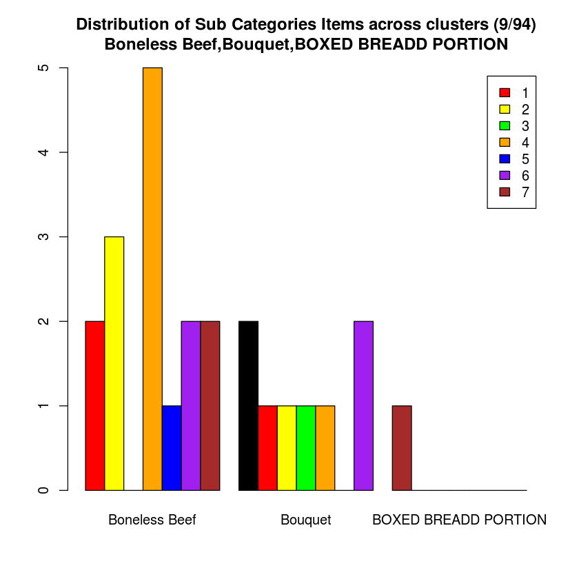


    [1] "Distribution of Sub Categories Items across clusters (10/94) - Boxed Breaded Filet,Boxed Burgers,Boxed Chinese"
                       section_data
    section_data_groups Boxed Breaded Filet Boxed Burgers Boxed Chinese
                      1                   3             5             1
                      2                   0             0             0
                      3                   0             0             0
                      4                   0             0             0
                      5                   0             0             0
                      6                   0             0             0
                      7                   0             0             0


    [1] "Distribution of Sub Categories Items across clusters (11/94) - Boxed Meal,Boxed Meat Pies,Boxed Poultry"
                       section_data
    section_data_groups Boxed Meal Boxed Meat Pies Boxed Poultry
                      1          2               1            12
                      2          0               0             0
                      3          0               0             0
                      4          0               0             0
                      5          1               0             0
                      6          0               0             0
                      7          0               0             0


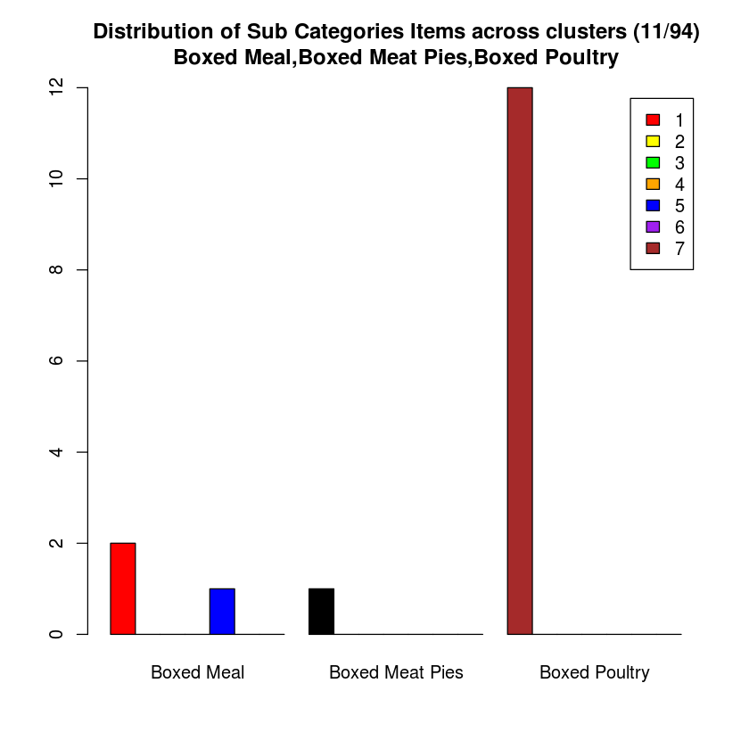


    [1] "Distribution of Sub Categories Items across clusters (12/94) - Boxed Seasoned Fish,BREAKFAST OTHER BAKE,Buns"
                       section_data
    section_data_groups Boxed Seasoned Fish BREAKFAST OTHER BAKE Buns
                      1                   1                    0    0
                      2                   0                    0    0
                      3                   0                    0    0
                      4                   0                    0    0
                      5                   0                    0    0
                      6                   0                    0    0
                      7                   0                    1    3


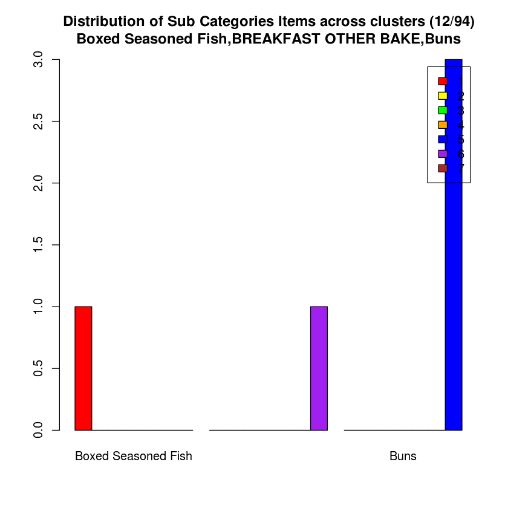


    [1] "Distribution of Sub Categories Items across clusters (13/94) - Butter,Cabbage,CAKE-RTS (PC FULL)"
                       section_data
    section_data_groups Butter Cabbage CAKE-RTS (PC FULL)
                      1      2       1                  6
                      2      1       0                  0
                      3      0       0                  0
                      4      2       1                  0
                      5      0       0                  0
                      6      0       0                  0
                      7      5       0                  3


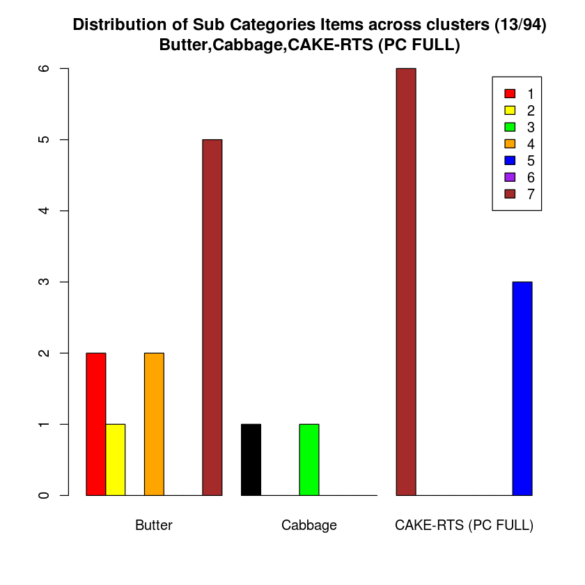


    [1] "Distribution of Sub Categories Items across clusters (14/94) - CAKE-RTS(PC PORTION),Canned/Dried Milk,Canned Fish"
                       section_data
    section_data_groups CAKE-RTS(PC PORTION) Canned/Dried Milk Canned Fish
                      1                    0                 1           4
                      2                    0                 0           0
                      3                    0                 0           0
                      4                    0                 0           0
                      5                    0                 1           0
                      6                    0                 0           0
                      7                    1                 0           3


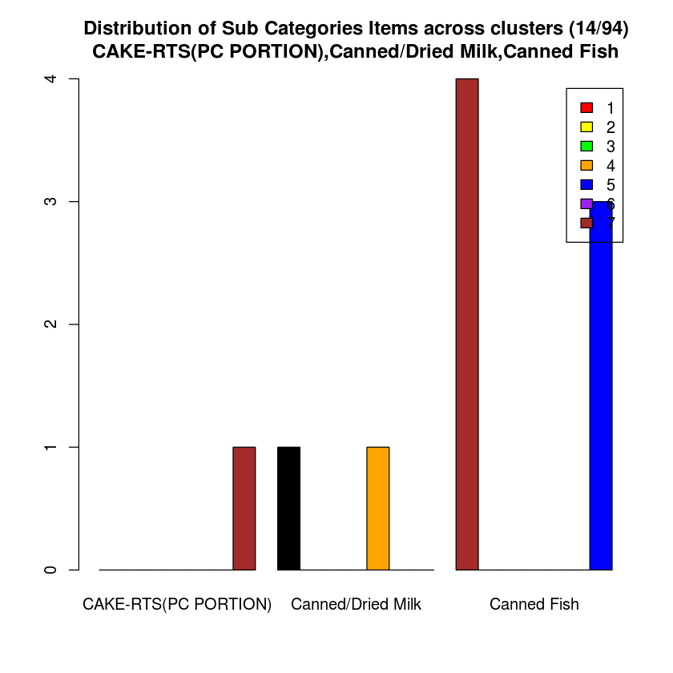


    [1] "Distribution of Sub Categories Items across clusters (15/94) - Canned Meat,Canned Tomatoes,Canned Vegetables"
                       section_data
    section_data_groups Canned Meat Canned Tomatoes Canned Vegetables
                      1           1               2                 0
                      2           0               0                 0
                      3           0               0                 0
                      4           0               0                 0
                      5           0               0                 0
                      6           0               0                 0
                      7           0               1                 3


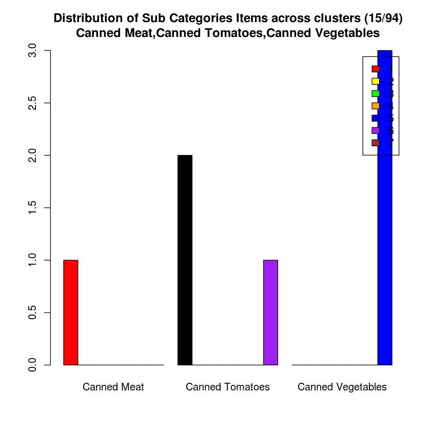


    [1] "Distribution of Sub Categories Items across clusters (16/94) - Can & Pkgd Prepared,Cards&Wrap-Everyday,Carrots"
                       section_data
    section_data_groups Can & Pkgd Prepared Cards&Wrap-Everyday Carrots
                      1                   2                   0       0
                      2                   0                   0       1
                      3                   0                   0       0
                      4                   0                   1       0
                      5                   0                   0       1
                      6                   1                   0       1
                      7                   3                   0       1


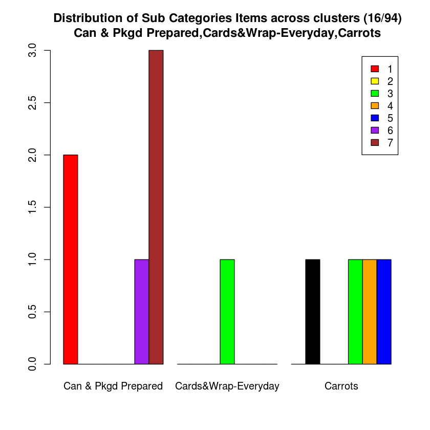


    [1] "Distribution of Sub Categories Items across clusters (17/94) - Cauliflower&Broccoli,Cereal - Cold,Cereal - Hot"
                       section_data
    section_data_groups Cauliflower&Broccoli Cereal - Cold Cereal - Hot
                      1                    2            27            3
                      2                    3             0            0
                      3                    0             0            0
                      4                    0             0            0
                      5                    0             0            0
                      6                    1             0            0
                      7                    1             9            1


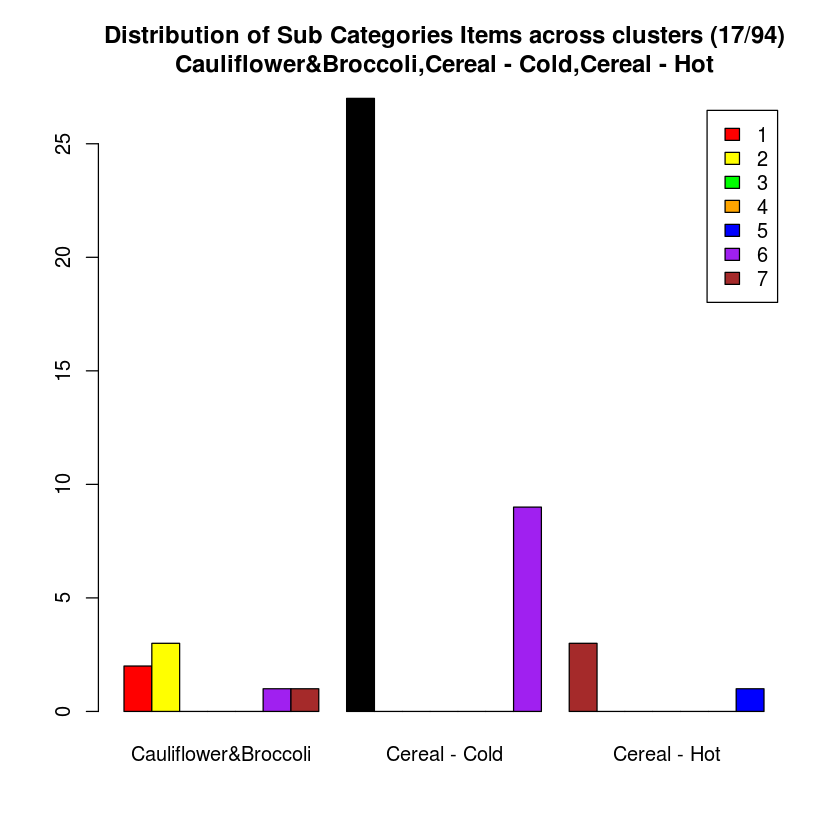


    [1] "Distribution of Sub Categories Items across clusters (18/94) - CHEDDAR PORTION DELI,Cheddar Wheel (Deli),Cheese (Dairy)"
                       section_data
    section_data_groups CHEDDAR PORTION DELI Cheddar Wheel (Deli) Cheese (Dairy)
                      1                    1                    2             42
                      2                    0                    0              6
                      3                    0                    0              0
                      4                    0                    0              2
                      5                    0                    0              2
                      6                    0                    0              0
                      7                    0                    1             12


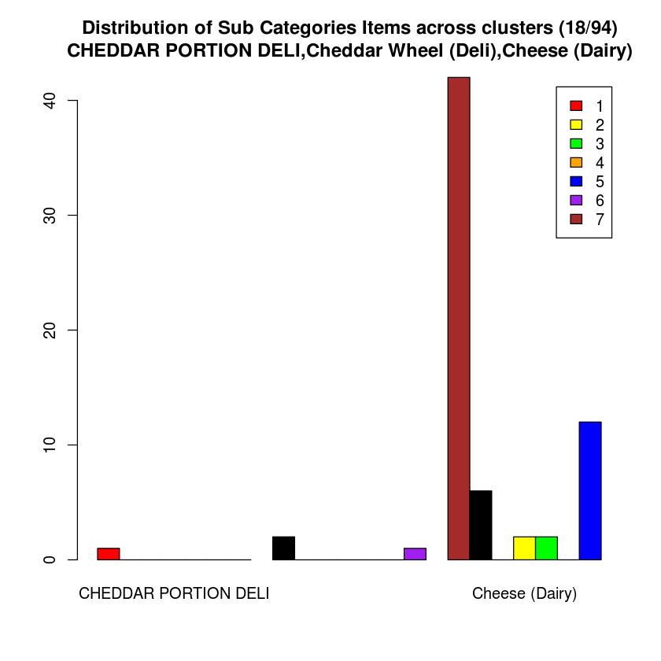


    [1] "Distribution of Sub Categories Items across clusters (19/94) - Cheese Slice Portion,Cheese Snacks (Deli),Cheese Soft Portion"
                       section_data
    section_data_groups Cheese Slice Portion Cheese Snacks (Deli)
                      1                    2                    3
                      2                    0                    0
                      3                    0                    0
                      4                    0                    0
                      5                    0                    0
                      6                    0                    0
                      7                    0                    0
                       section_data
    section_data_groups Cheese Soft Portion
                      1                   1
                      2                   0
                      3                   0
                      4                   0
                      5                   0
                      6                   0
                      7                   0


    [1] "Distribution of Sub Categories Items across clusters (20/94) - Cheese Spreads,Cheese Toppings,CHICKEN BNELESS BRST"
                       section_data
    section_data_groups Cheese Spreads Cheese Toppings CHICKEN BNELESS BRST
                      1              1               1                    0
                      2              0               0                    3
                      3              0               0                    0
                      4              0               0                    2
                      5              0               0                    0
                      6              0               0                    0
                      7              1               1                    0


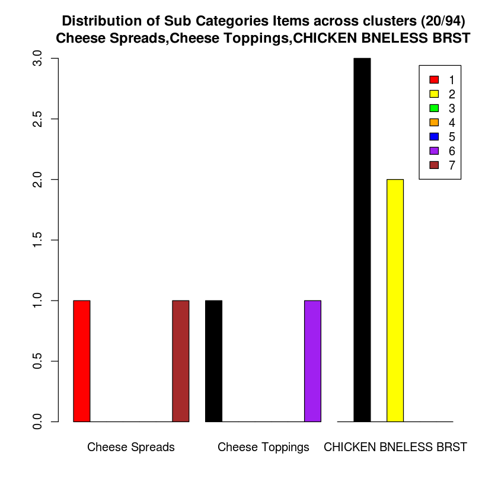


    [1] "Distribution of Sub Categories Items across clusters (21/94) - Chicken Breast,Chicken Leg,Chicken Prepackaged"
                       section_data
    section_data_groups Chicken Breast Chicken Leg Chicken Prepackaged
                      1              1           2                   7
                      2              0           5                   2
                      3              1           0                   2
                      4              0           0                   0
                      5              1           2                   0
                      6              0           0                   0
                      7              0           4                   4


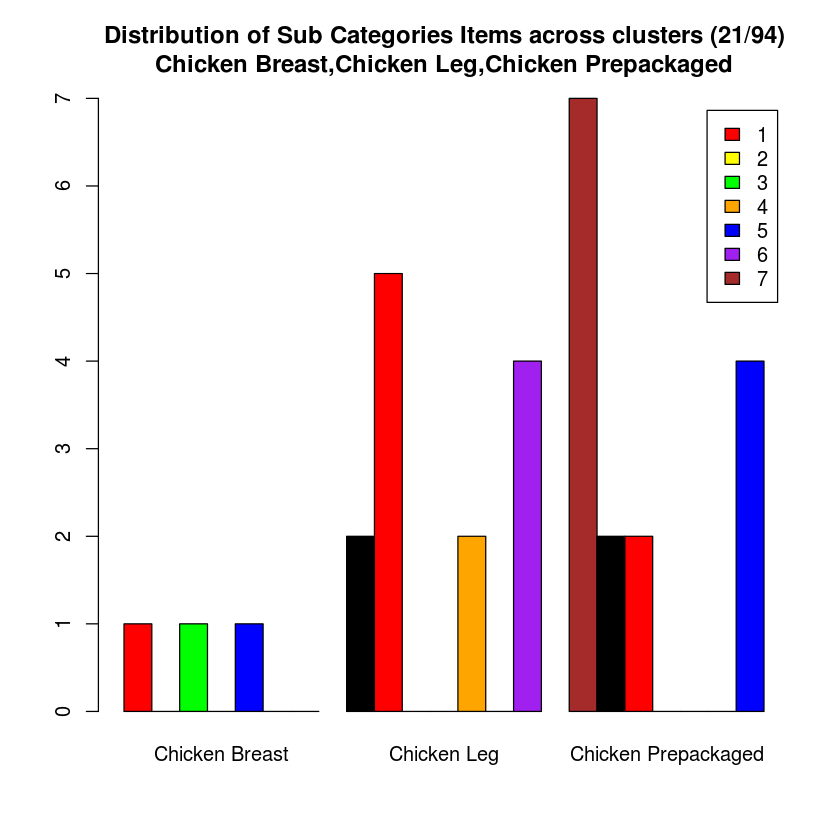


    [1] "Distribution of Sub Categories Items across clusters (22/94) - Chicken Whole/Half,Chicken Wings,Chinese Fondue- Froz"
                       section_data
    section_data_groups Chicken Whole/Half Chicken Wings Chinese Fondue- Froz
                      1                  1             2                    0
                      2                  1             1                    0
                      3                  1             0                    0
                      4                  1             0                    0
                      5                  0             0                    1
                      6                  0             0                    0
                      7                  0             0                    0


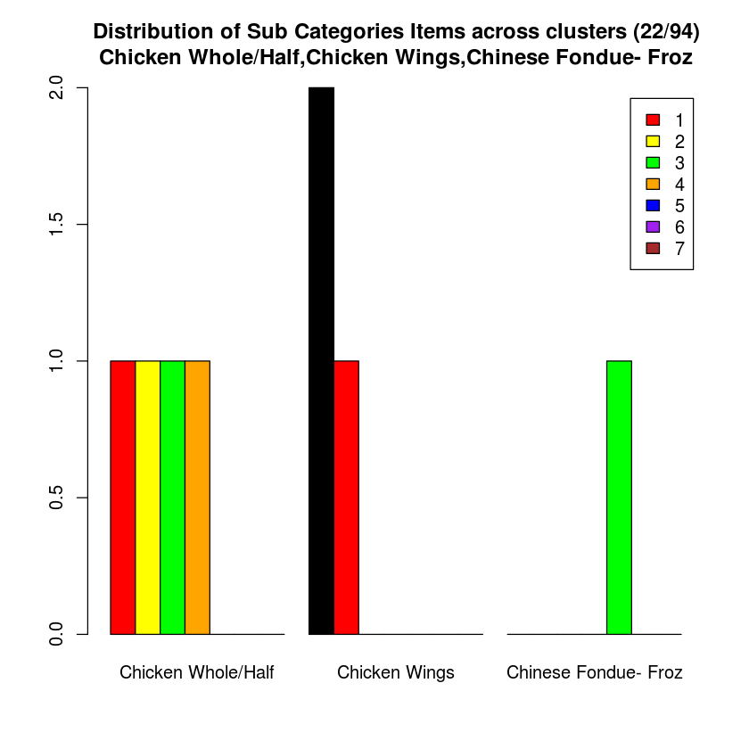


    [1] "Distribution of Sub Categories Items across clusters (23/94) - Chips,Choc Box Multi Cello,Chocolate Bar Single"
                       section_data
    section_data_groups Chips Choc Box Multi Cello Chocolate Bar Single
                      1    11                    0                    2
                      2     2                    0                    0
                      3     0                    0                    0
                      4     1                    0                    0
                      5     9                    0                    0
                      6     0                    0                    0
                      7    25                    2                    6


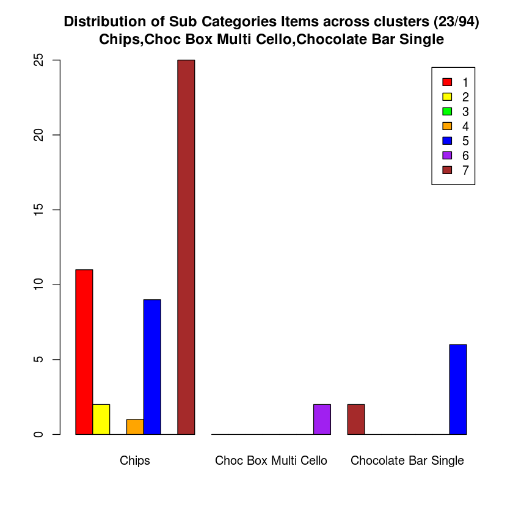


    [1] "Distribution of Sub Categories Items across clusters (24/94) - Cigarettes - 20's,Cigs-Value Brand 25s,Citrus-Specialty"
                       section_data
    section_data_groups Cigarettes - 20's Cigs-Value Brand 25s Citrus-Specialty
                      1                 0                    0                1
                      2                 0                    0                1
                      3                 6                   11                0
                      4                 0                    0                0
                      5                 0                    0                0
                      6                 0                    0                0
                      7                 0                    0                0


    [1] "Distribution of Sub Categories Items across clusters (25/94) - Clem/Tang/Mandarin,Coffee,Cold Chicken-Fried"
                       section_data
    section_data_groups Clem/Tang/Mandarin Coffee Cold Chicken-Fried
                      1                  0     11                  0
                      2                  2      0                  0
                      3                  0      0                  0
                      4                  0      0                  0
                      5                  1      2                  0
                      6                  0      0                  0
                      7                  0      1                  4


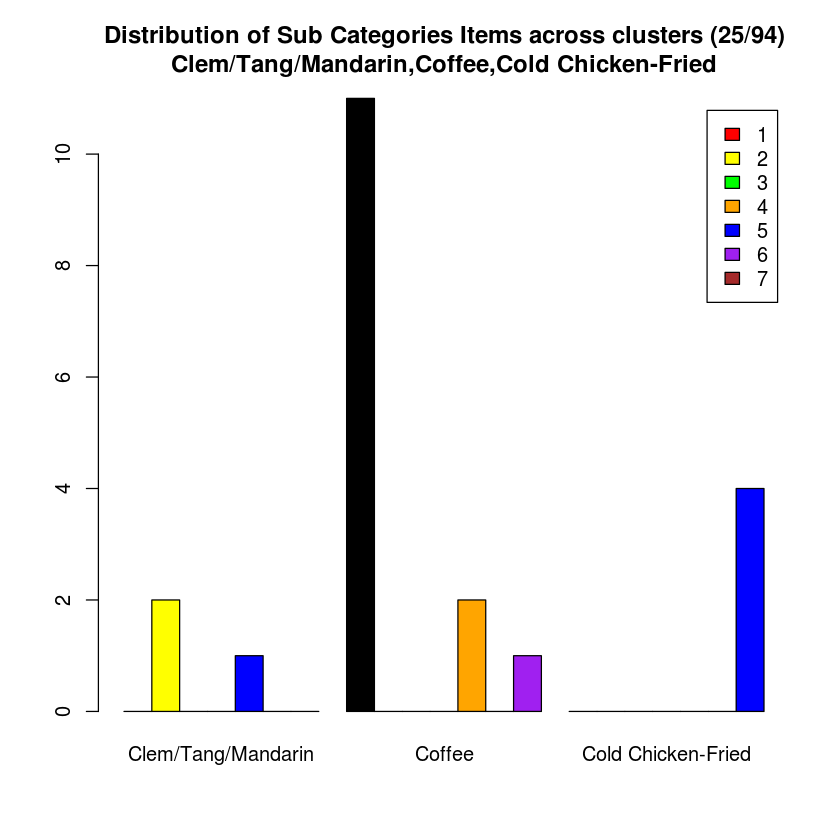


    [1] "Distribution of Sub Categories Items across clusters (26/94) - COMM ALTRNTVE BREAD,COMM BREAKFAST BRD,Comm Buns And Rolls"
                       section_data
    section_data_groups COMM ALTRNTVE BREAD COMM BREAKFAST BRD Comm Buns And Rolls
                      1                   3                  0                   6
                      2                   0                  0                   2
                      3                   0                  0                   0
                      4                   0                  2                   0
                      5                   0                  1                   0
                      6                   0                  0                   0
                      7                   7                  9                  10


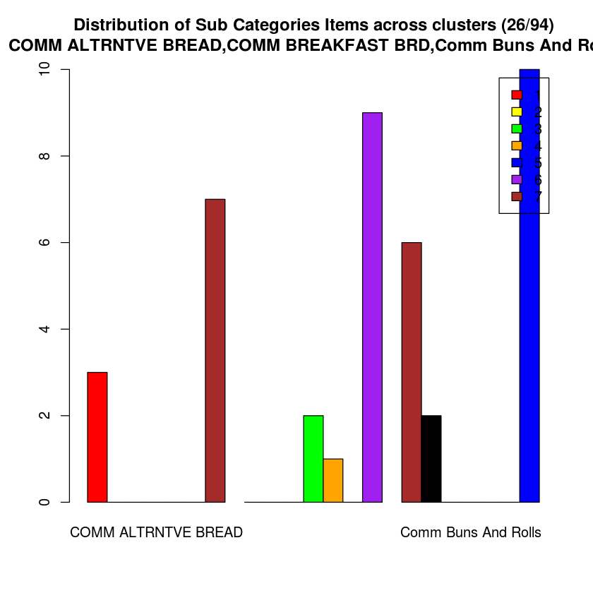


    [1] "Distribution of Sub Categories Items across clusters (27/94) - Commercial Breads,Commercial PPK Snack,COMM NATURAL/ORGANIC"
                       section_data
    section_data_groups Commercial Breads Commercial PPK Snack COMM NATURAL/ORGANIC
                      1                 6                    0                    1
                      2                 0                    0                    0
                      3                 0                    0                    0
                      4                 7                    0                    0
                      5                 0                    0                    0
                      6                 2                    0                    0
                      7                16                    2                    0


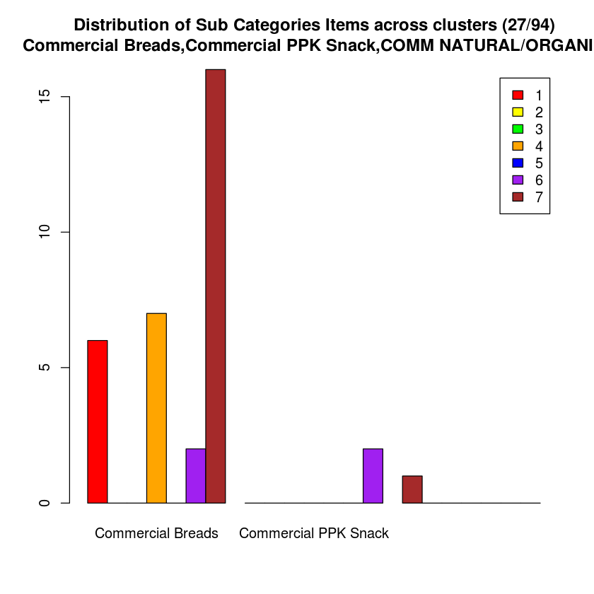


    [1] "Distribution of Sub Categories Items across clusters (28/94) - COMM PROCESSD FRUITS,COMM PROCESSD VEG,COMM SNACKS NOT PPK"
                       section_data
    section_data_groups COMM PROCESSD FRUITS COMM PROCESSD VEG COMM SNACKS NOT PPK
                      1                    0                 0                   3
                      2                    0                 1                   0
                      3                    0                 1                   0
                      4                    0                 0                   0
                      5                    0                 0                   0
                      6                    0                 0                   0
                      7                    4                 0                   0


    [1] "Distribution of Sub Categories Items across clusters (29/94) - Condiments,CONVNTNL BREAD BAKE,CONVNTNL BUNS ROLLS"
                       section_data
    section_data_groups Condiments CONVNTNL BREAD BAKE CONVNTNL BUNS ROLLS
                      1          3                   0                   0
                      2          0                   0                   0
                      3          0                   0                   0
                      4          1                   1                   0
                      5          0                   1                   0
                      6          0                   0                   0
                      7          2                   3                   1


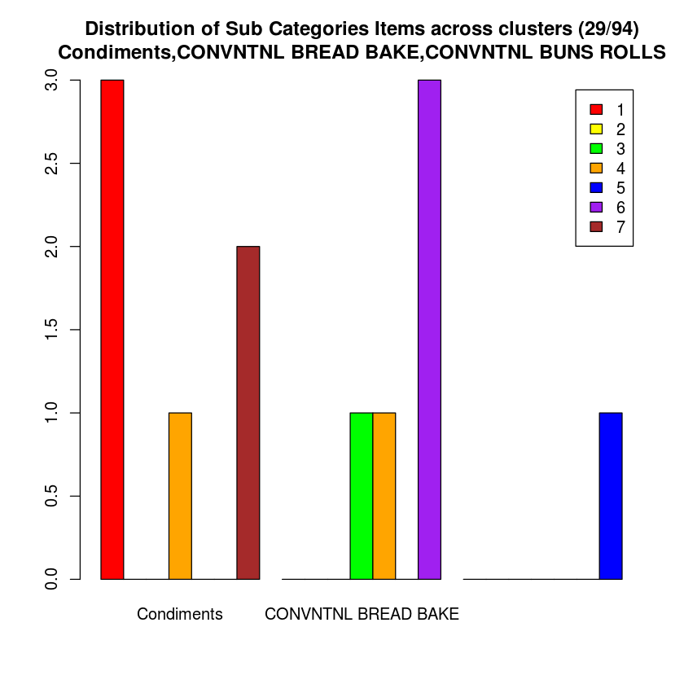


    [1] "Distribution of Sub Categories Items across clusters (30/94) - Cooked Shrimp,Cookie,Cookies"
                       section_data
    section_data_groups Cooked Shrimp Cookie Cookies
                      1             2      1       3
                      2             0      0       0
                      3             0      0       0
                      4             0      1       0
                      5             0      1       1
                      6             0      0       0
                      7             1      8       3


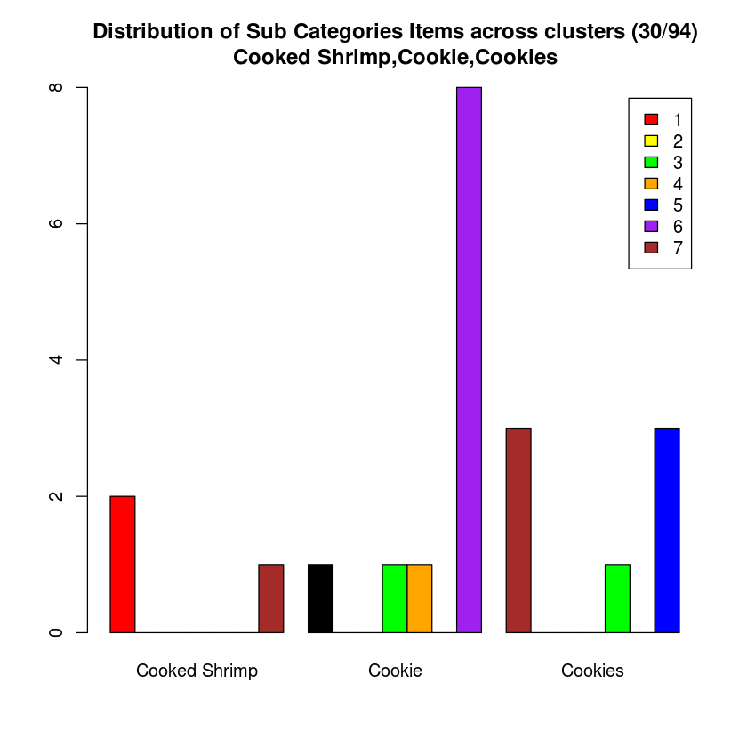


    [1] "Distribution of Sub Categories Items across clusters (31/94) - Corn,Corporate Gift Cards,CRACKERS / DRY BRD"
                       section_data
    section_data_groups Corn Corporate Gift Cards CRACKERS / DRY BRD
                      1    0                    0                  5
                      2    0                    0                  0
                      3    0                    0                  0
                      4    1                    1                  0
                      5    2                    0                  0
                      6    0                    0                  0
                      7    0                    0                  8


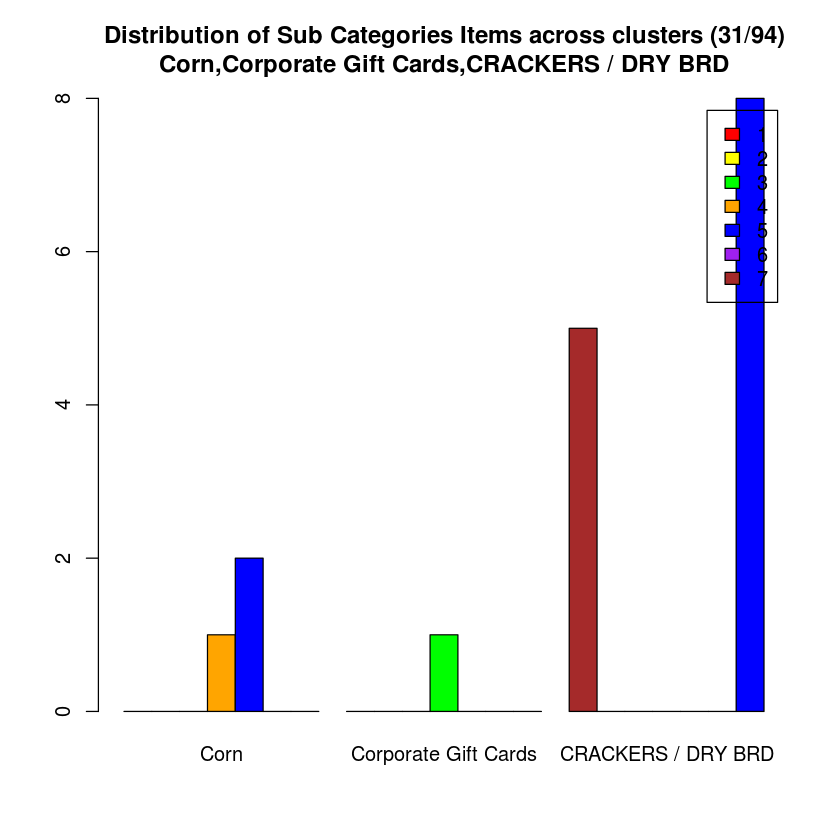


    [1] "Distribution of Sub Categories Items across clusters (32/94) - Cream And Creamers,Croissant,Cultured Products"
                       section_data
    section_data_groups Cream And Creamers Croissant Cultured Products
                      1                  3         0                10
                      2                  0         0                 0
                      3                  1         0                 0
                      4                  3         1                 0
                      5                  1         0                 0
                      6                  0         0                 0
                      7                  6         0                 7


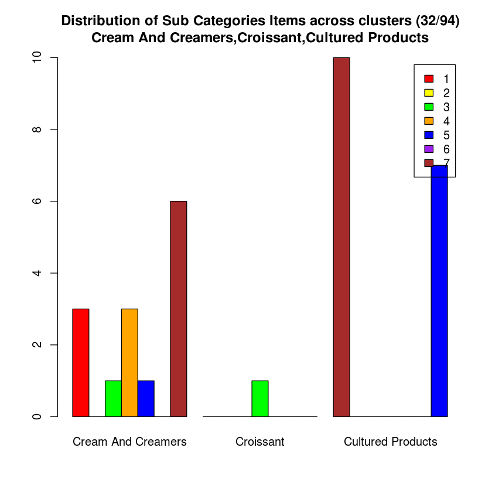


    [1] "Distribution of Sub Categories Items across clusters (33/94) - Deli Meat trays,Dip (Deli),Dish Detergents"
                       section_data
    section_data_groups Deli Meat trays Dip (Deli) Dish Detergents
                      1               0         13               1
                      2               0          0               0
                      3               0          0               0
                      4               0          0               0
                      5               0          0               0
                      6               0          0               0
                      7               6          7               0


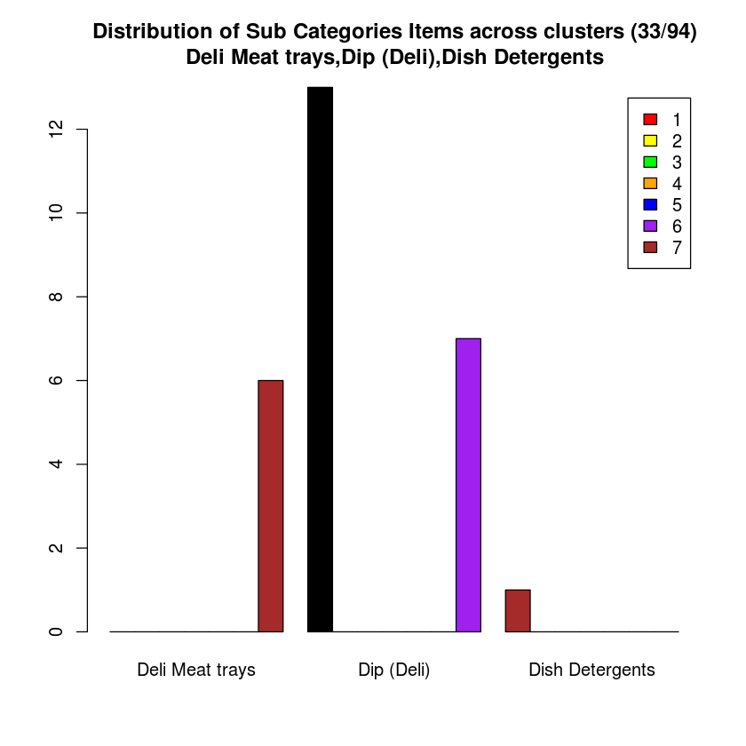


    [1] "Distribution of Sub Categories Items across clusters (34/94) - Donut Cake,Dried Fruit and Nuts,Drink (HMR)"
                       section_data
    section_data_groups Donut Cake Dried Fruit and Nuts Drink (HMR)
                      1          0                    1           0
                      2          0                    0           0
                      3          0                    0           2
                      4          0                    0           0
                      5          0                    0           0
                      6          0                    0           0
                      7          2                    0           0


    [1] "Distribution of Sub Categories Items across clusters (35/94) - Eggs,Energy Drinks,Facial Tissue"
                       section_data
    section_data_groups Eggs Energy Drinks Facial Tissue
                      1    2             1             2
                      2    0             0             0
                      3    3             0             0
                      4    2             0             0
                      5    0             0             1
                      6    1             0             0
                      7   11             5             0


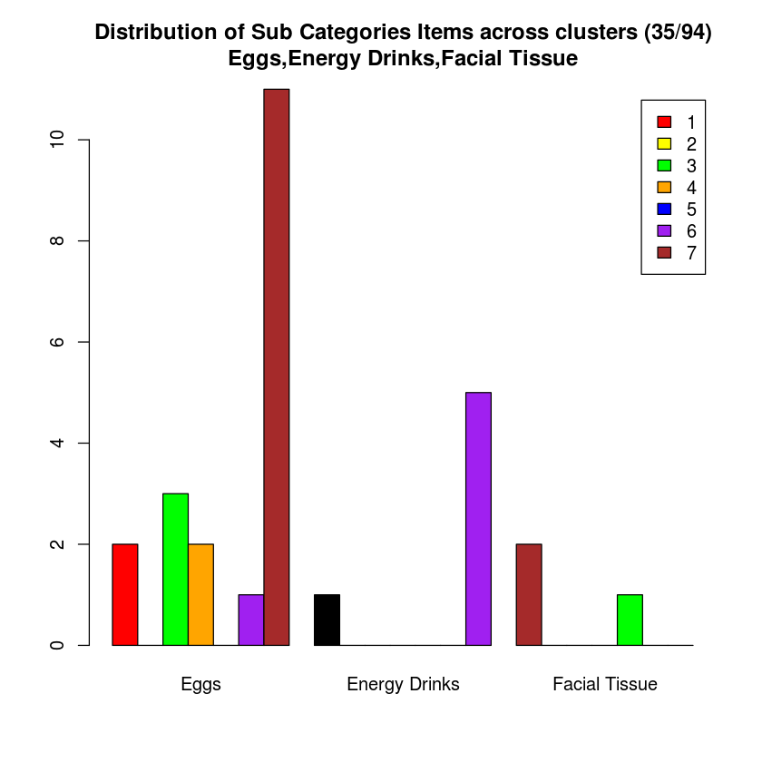


    [1] "Distribution of Sub Categories Items across clusters (36/94) - Filet- Bag Frozen,Fin Fish Filet Froze,Fin Fish Filet-Other"
                       section_data
    section_data_groups Filet- Bag Frozen Fin Fish Filet Froze Fin Fish Filet-Other
                      1                 1                    1                    3
                      2                 0                    0                    0
                      3                 0                    0                    0
                      4                 0                    0                    2
                      5                 0                    0                    0
                      6                 0                    0                    0
                      7                 0                    1                    0


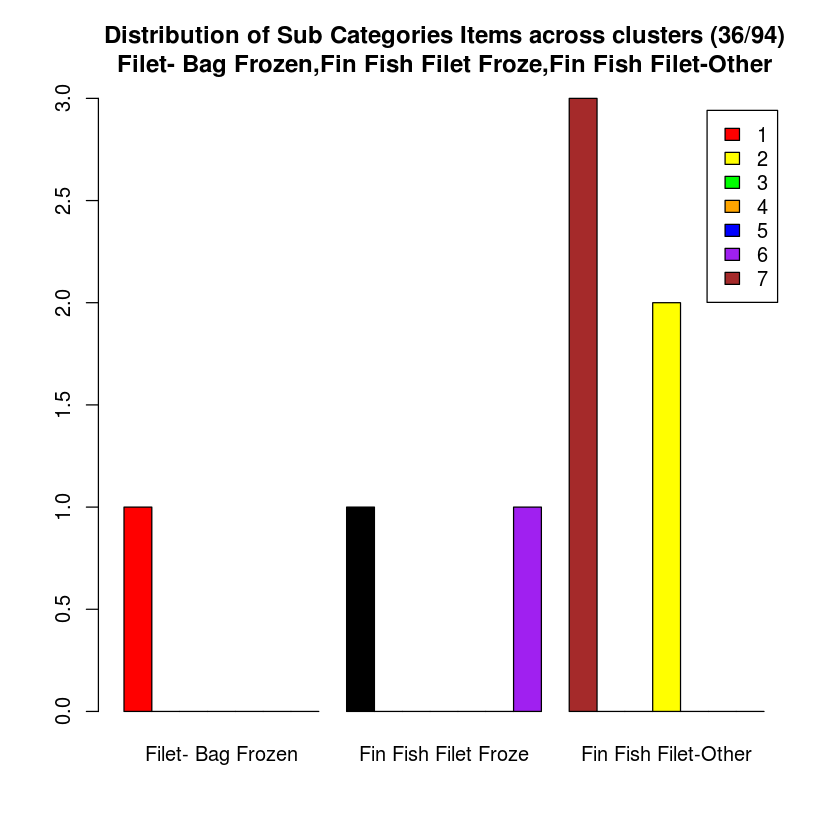


    [1] "Distribution of Sub Categories Items across clusters (37/94) - Flour,Foils Plastic Wraps,FRD CHICK/WINGS(HMR)"
                       section_data
    section_data_groups Flour Foils Plastic Wraps FRD CHICK/WINGS(HMR)
                      1     6                   5                   17
                      2     0                   0                    0
                      3     0                   0                    2
                      4     0                   0                    0
                      5     0                   0                    0
                      6     0                   0                    0
                      7     0                   2                    6


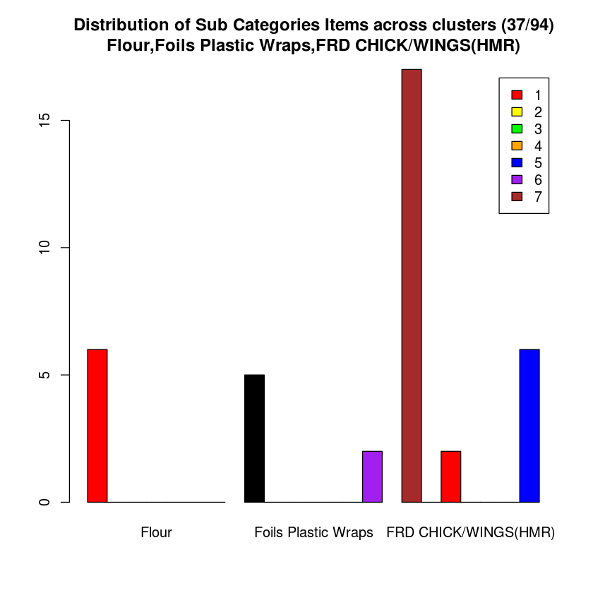


    [1] "Distribution of Sub Categories Items across clusters (38/94) - Fresh Sausage,Fresh Scallop,Fresh Shell Fish"
                       section_data
    section_data_groups Fresh Sausage Fresh Scallop Fresh Shell Fish
                      1            14             1                1
                      2             0             0                1
                      3             0             0                0
                      4             0             0                0
                      5             0             0                0
                      6             0             0                0
                      7             4             0                0


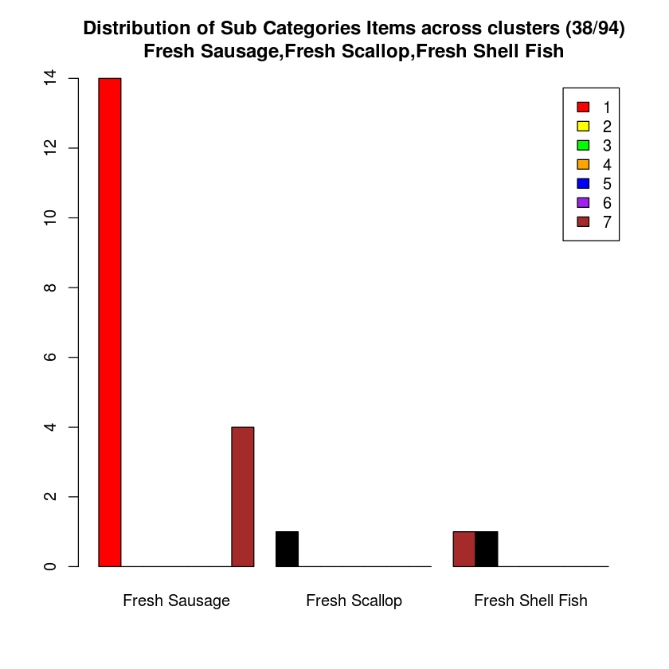


    [1] "Distribution of Sub Categories Items across clusters (39/94) - Frozen Breakfast,Frozen Desserts,Frozen Dinners & Ent"
                       section_data
    section_data_groups Frozen Breakfast Frozen Desserts Frozen Dinners & Ent
                      1                1               1                    2
                      2                0               0                    0
                      3                0               0                    0
                      4                0               0                    0
                      5                0               0                    0
                      6                0               0                    0
                      7                0               0                    3


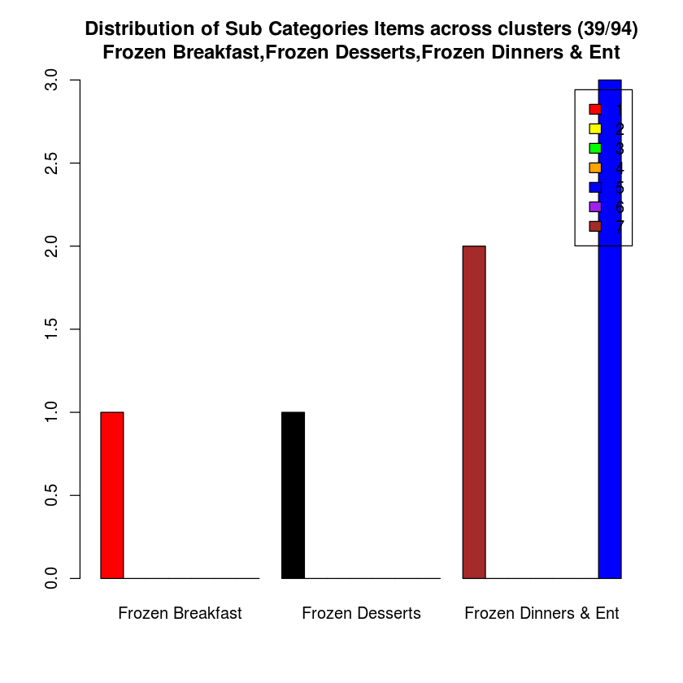


    [1] "Distribution of Sub Categories Items across clusters (40/94) - Frozen Fruit,Frozen Novelties,Frozen Organic"
                       section_data
    section_data_groups Frozen Fruit Frozen Novelties Frozen Organic
                      1            5                3              1
                      2            0                2              0
                      3            2                0              0
                      4            1                0              0
                      5            0                1              0
                      6            0                0              0
                      7            5                1              0


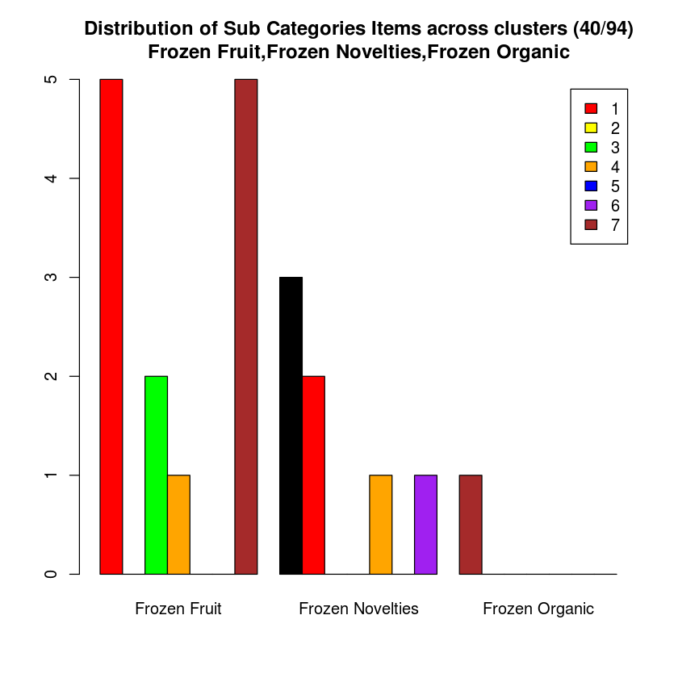


    [1] "Distribution of Sub Categories Items across clusters (41/94) - Frozen Pizza Product,Frozen Potatoes,Frozen Scallop"
                       section_data
    section_data_groups Frozen Pizza Product Frozen Potatoes Frozen Scallop
                      1                   27               1              2
                      2                    0               0              0
                      3                    0               0              1
                      4                    0               0              0
                      5                    2               0              0
                      6                    0               0              0
                      7                    4               5              0


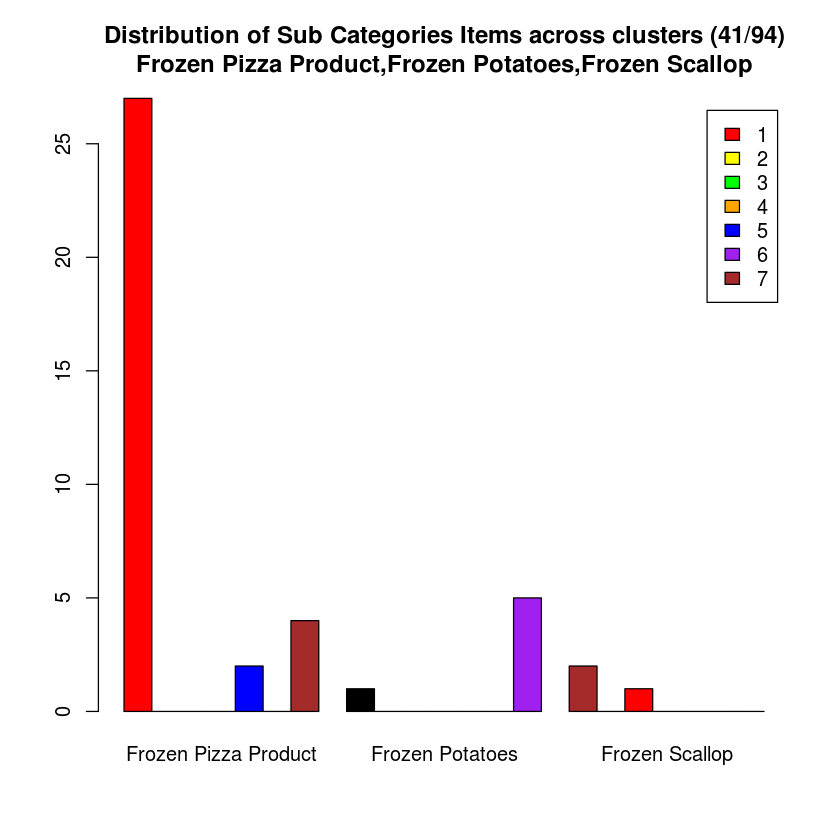


    [1] "Distribution of Sub Categories Items across clusters (42/94) - Frozen Vegetables,Fruit Juices &Drinks,Fruit/Nut Mix (Bulk)"
                       section_data
    section_data_groups Frozen Vegetables Fruit Juices &Drinks Fruit/Nut Mix (Bulk)
                      1                 5                    4                    0
                      2                 0                    0                    0
                      3                 0                    0                    1
                      4                 0                    1                    0
                      5                 0                    0                    0
                      6                 0                    0                    0
                      7                 2                    1                    0


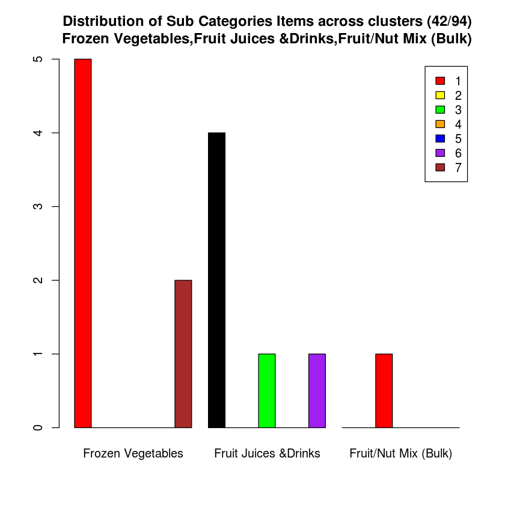


    [1] "Distribution of Sub Categories Items across clusters (43/94) - GARLIC ONIONS SHLLOT,Gift Card Mall Cards,Goat And Ewe Portion"
                       section_data
    section_data_groups GARLIC ONIONS SHLLOT Gift Card Mall Cards
                      1                    1                    1
                      2                    0                    0
                      3                    0                    0
                      4                    2                    0
                      5                    1                    0
                      6                    2                    0
                      7                    5                    0
                       section_data
    section_data_groups Goat And Ewe Portion
                      1                    0
                      2                    0
                      3                    0
                      4                    0
                      5                    2
                      6                    0
                      7                    0


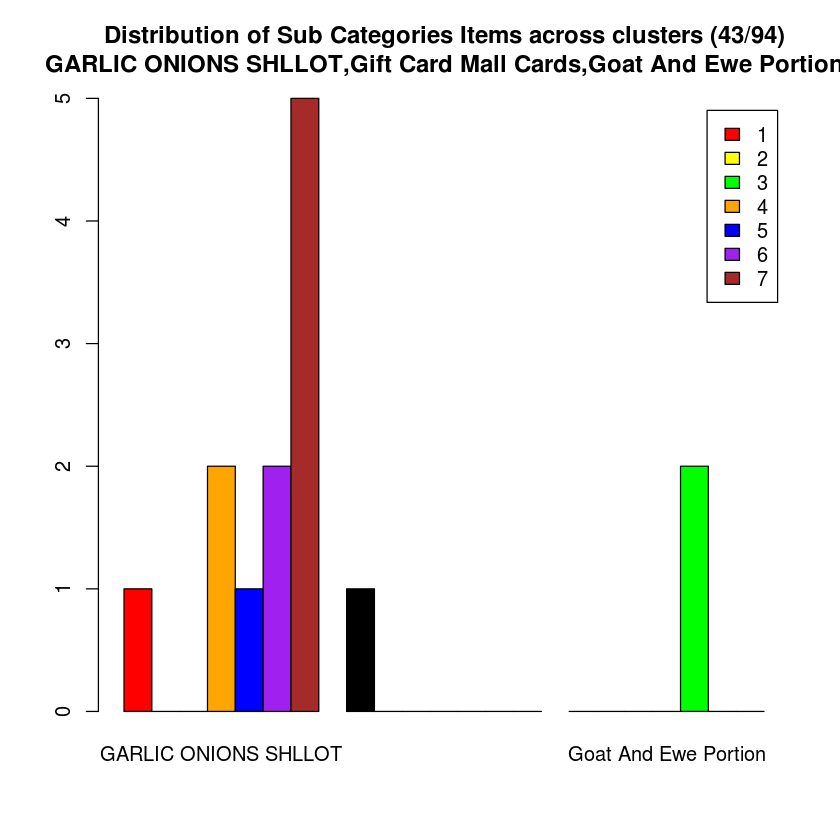


    [1] "Distribution of Sub Categories Items across clusters (44/94) - Grapefruit,Grapes,Ham - Butt-End"
                       section_data
    section_data_groups Grapefruit Grapes Ham - Butt-End
                      1          1      1              2
                      2          0      2              0
                      3          0      0              0
                      4          0      0              0
                      5          0      1              0
                      6          0      1              0
                      7          2      3              0


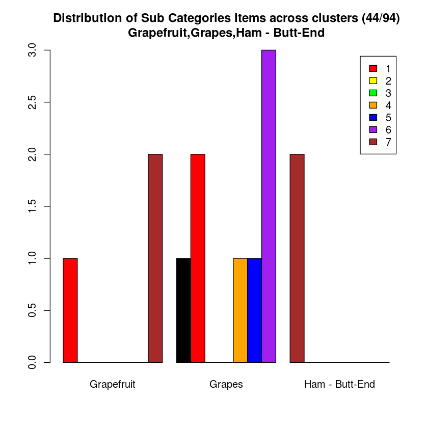


    [1] "Distribution of Sub Categories Items across clusters (45/94) - Ham (Deli Service),Ham (Deli SS),Ham-Miscellaneous"
                       section_data
    section_data_groups Ham (Deli Service) Ham (Deli SS) Ham-Miscellaneous
                      1                  3             3                 4
                      2                  0             0                 0
                      3                  0             0                 0
                      4                  1             1                 0
                      5                  0             0                 0
                      6                  0             0                 0
                      7                  0             2                 2


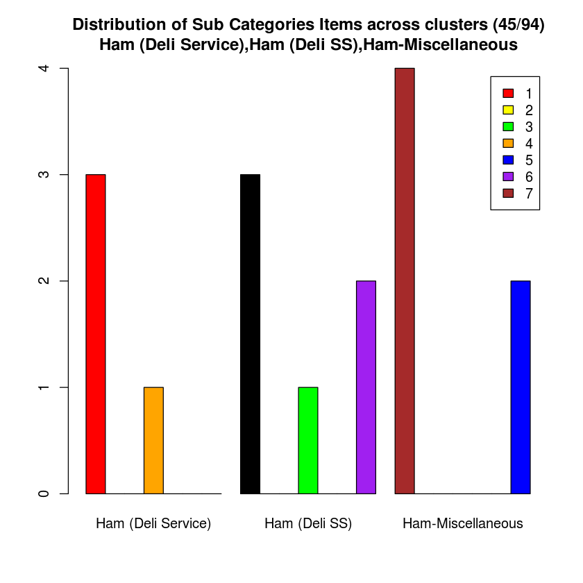


    [1] "Distribution of Sub Categories Items across clusters (46/94) - Hardware,Herbs,HHC Other-N1"
                       section_data
    section_data_groups Hardware Herbs HHC Other-N1
                      1        1     1            0
                      2        0     0            0
                      3        0     0            0
                      4        0     1            0
                      5        0     0            0
                      6        0     0            0
                      7        1     4            1


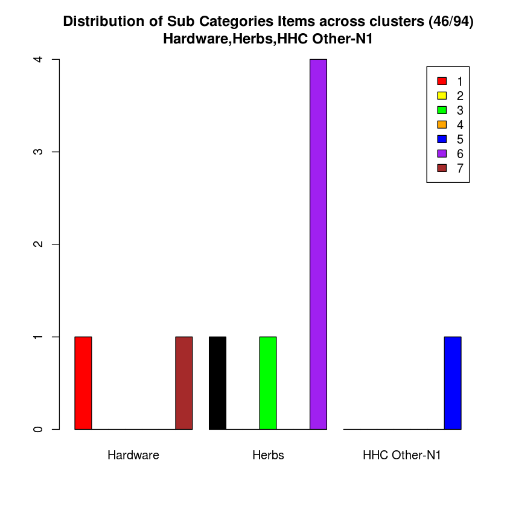


    [1] "Distribution of Sub Categories Items across clusters (47/94) - Household Cleaners,HRD CHSE WHEEL DELI,Ice Cream/Froz Yog"
                       section_data
    section_data_groups Household Cleaners HRD CHSE WHEEL DELI Ice Cream/Froz Yog
                      1                  1                   1                  8
                      2                  0                   0                  0
                      3                  0                   0                  0
                      4                  0                   0                  0
                      5                  0                   0                  0
                      6                  0                   0                  0
                      7                  0                   0                  1


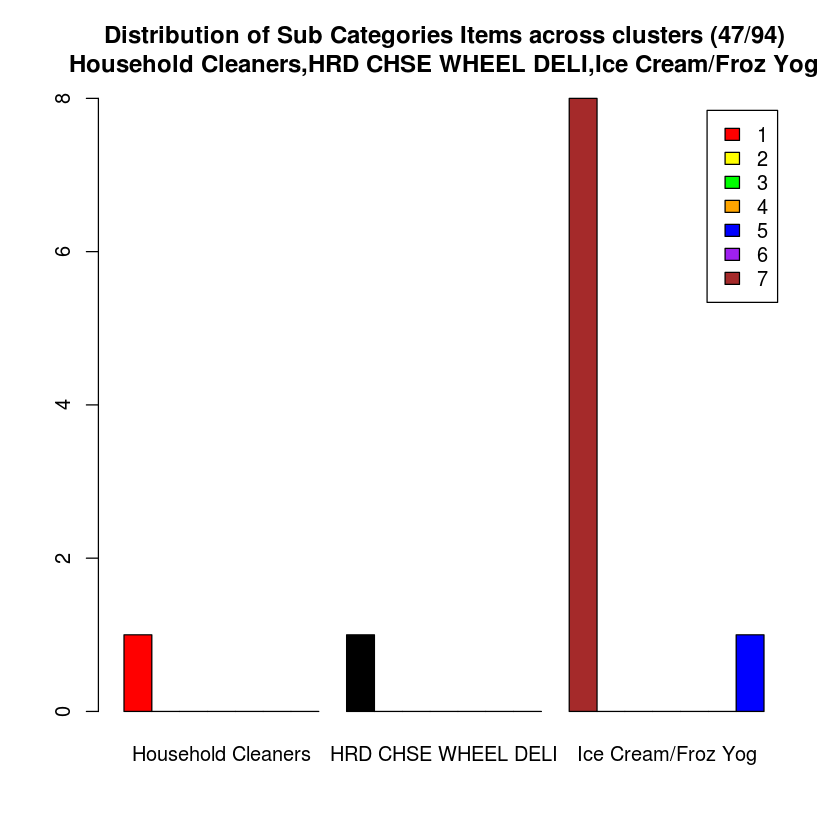


    [1] "Distribution of Sub Categories Items across clusters (48/94) - Inside Round Beef,INSTR CAKE (PC FULL),INSTR CKD MEALS(HMR)"
                       section_data
    section_data_groups Inside Round Beef INSTR CAKE (PC FULL) INSTR CKD MEALS(HMR)
                      1                 0                    1                    3
                      2                 0                    0                    0
                      3                 0                    0                    0
                      4                 0                    0                    0
                      5                 0                    0                    0
                      6                 0                    0                    0
                      7                 4                    0                    1


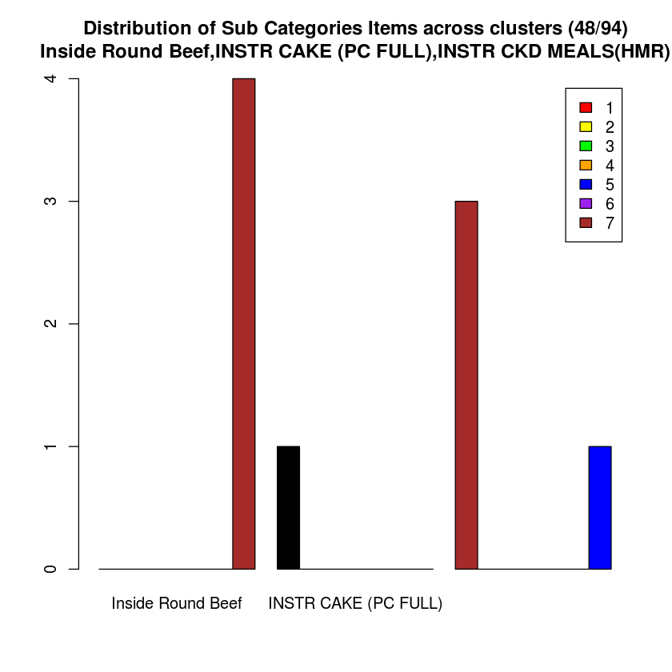


    [1] "Distribution of Sub Categories Items across clusters (49/94) - INSTR PROCESSD FRUIT,International Other,Italian (Deli SS)"
                       section_data
    section_data_groups INSTR PROCESSD FRUIT International Other Italian (Deli SS)
                      1                    0                   0                 1
                      2                    0                   0                 0
                      3                    0                   0                 0
                      4                    2                   0                 0
                      5                    0                   0                 0
                      6                    1                   0                 0
                      7                   22                   3                 0


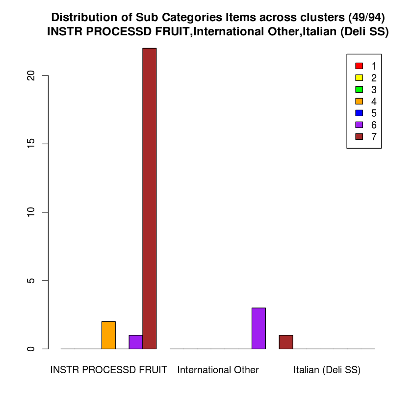


    [1] "Distribution of Sub Categories Items across clusters (50/94) - Juice (Produce),Jumbo Frankfurt,Lamb - Loin"
                       section_data
    section_data_groups Juice (Produce) Jumbo Frankfurt Lamb - Loin
                      1               0               1           1
                      2               0               0           0
                      3               0               0           0
                      4               0               0           0
                      5               0               0           0
                      6               0               0           0
                      7               2               0           0


    [1] "Distribution of Sub Categories Items across clusters (51/94) - Lamb-Miscellaneous,Laundry Additives,Laundry Detergent"
                       section_data
    section_data_groups Lamb-Miscellaneous Laundry Additives Laundry Detergent
                      1                  2                 1                 1
                      2                  0                 0                 0
                      3                  0                 0                 0
                      4                  0                 0                 0
                      5                  0                 0                 0
                      6                  0                 0                 0
                      7                  1                 0                 0


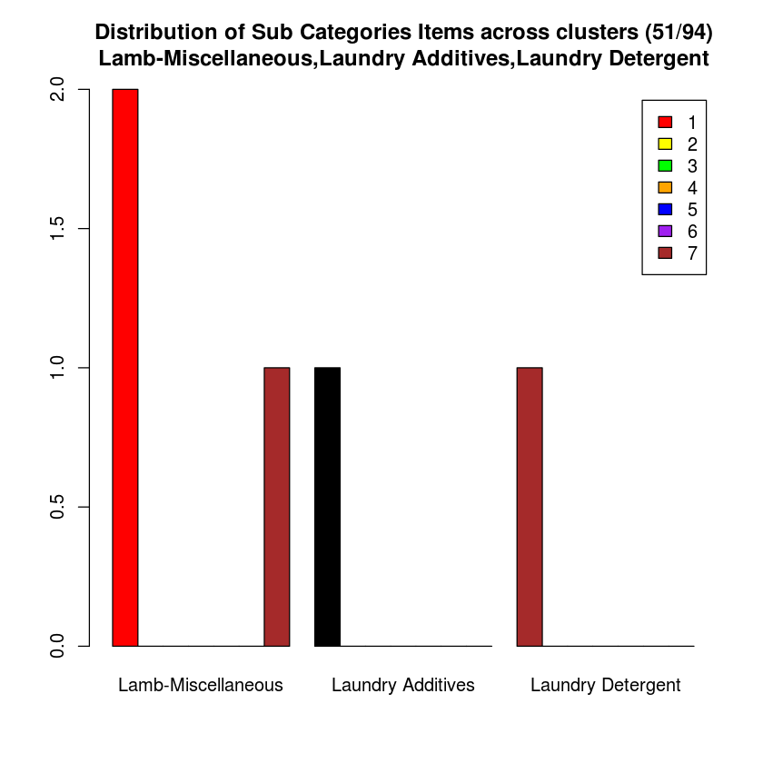


    [1] "Distribution of Sub Categories Items across clusters (52/94) - Leafy Greens,Lemons/Limes,Lobster"
                       section_data
    section_data_groups Leafy Greens Lemons/Limes Lobster
                      1            2            0       4
                      2            2            0       0
                      3            0            0       0
                      4            0            0       0
                      5            3            0       0
                      6            0            2       0
                      7            1            0       0


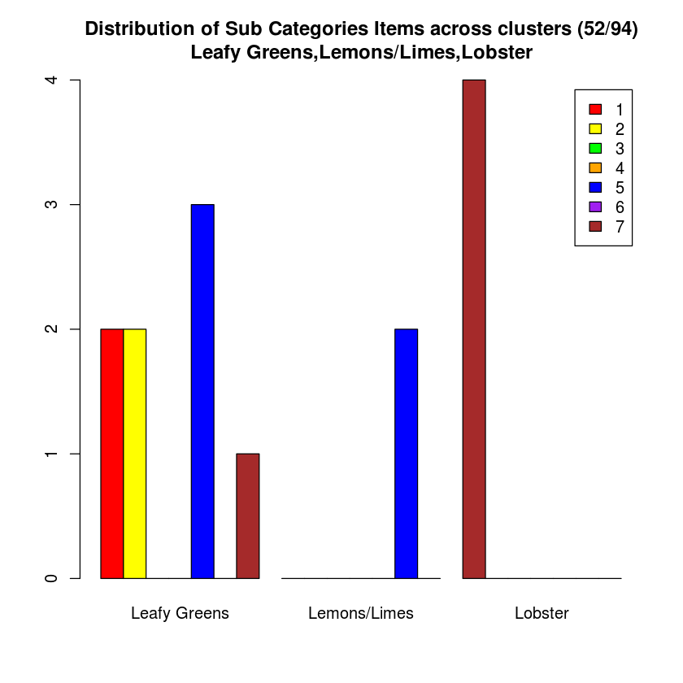


    [1] "Distribution of Sub Categories Items across clusters (53/94) - Loin Beef,Lotto Scratch Sales,Luncheon"
                       section_data
    section_data_groups Loin Beef Lotto Scratch Sales Luncheon
                      1         4                   7        1
                      2         0                   1        0
                      3         0                   0        0
                      4         0                   0        0
                      5         0                   0        0
                      6         0                   0        0
                      7         1                   0        2


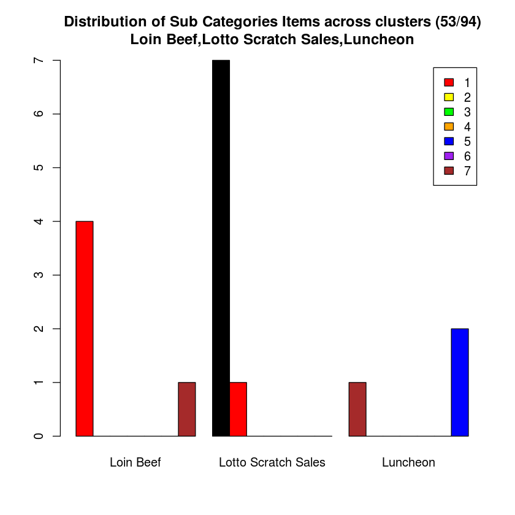


    [1] "Distribution of Sub Categories Items across clusters (54/94) - Lunchkits,Magazine,MAPLE PRODUCTS(PROD)"
                       section_data
    section_data_groups Lunchkits Magazine MAPLE PRODUCTS(PROD)
                      1         1        2                    2
                      2         0        0                    0
                      3         0        0                    0
                      4         0        0                    0
                      5         0        0                    0
                      6         0        0                    0
                      7         1        0                    0


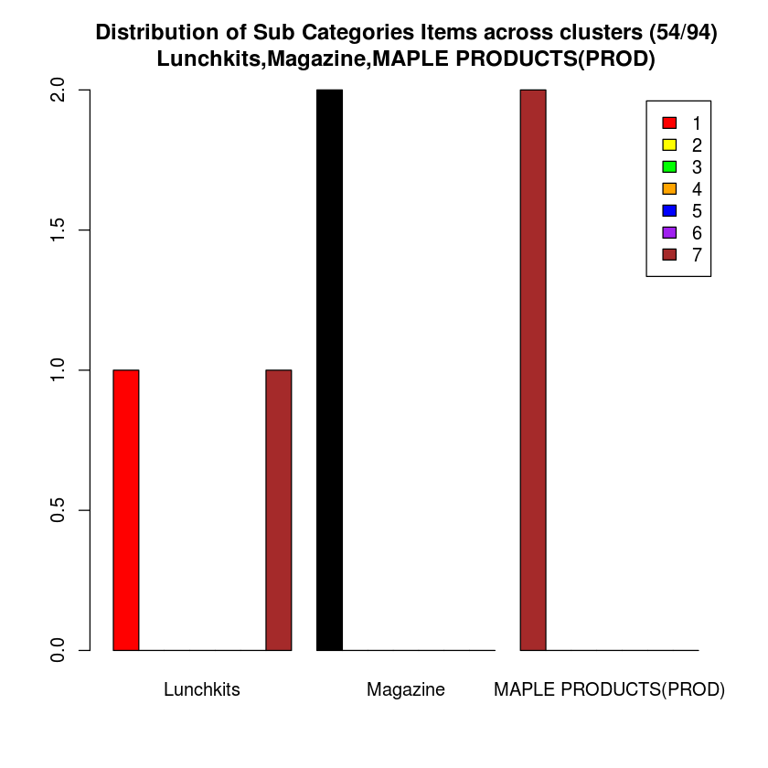


    [1] "Distribution of Sub Categories Items across clusters (55/94) - Margarine,Marinated/Salt Fish,MCK CHICK/BOLGNA SRV"
                       section_data
    section_data_groups Margarine Marinated/Salt Fish MCK CHICK/BOLGNA SRV
                      1         6                   2                    1
                      2         0                   0                    0
                      3         0                   0                    0
                      4         1                   0                    0
                      5         0                   0                    0
                      6         0                   0                    0
                      7         6                   0                    0


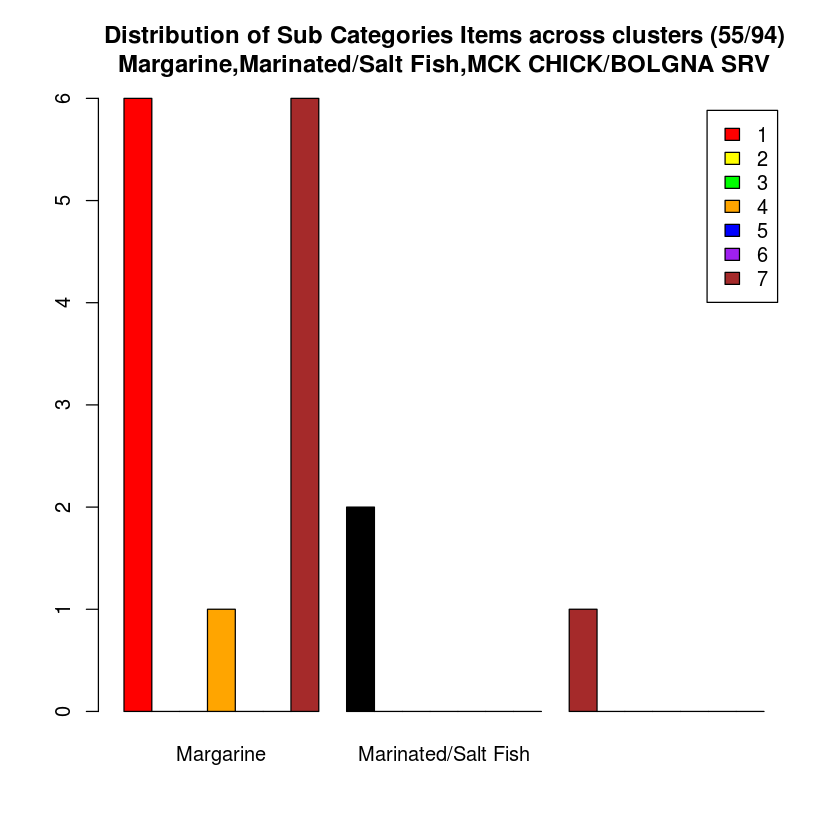


    [1] "Distribution of Sub Categories Items across clusters (56/94) - Meals (HMR),Melons,Mexican"
                       section_data
    section_data_groups Meals (HMR) Melons Mexican
                      1           3      2       5
                      2           0      0       0
                      3           0      0       0
                      4           2      1       0
                      5           0      0       0
                      6           0      0       0
                      7           9      1       0


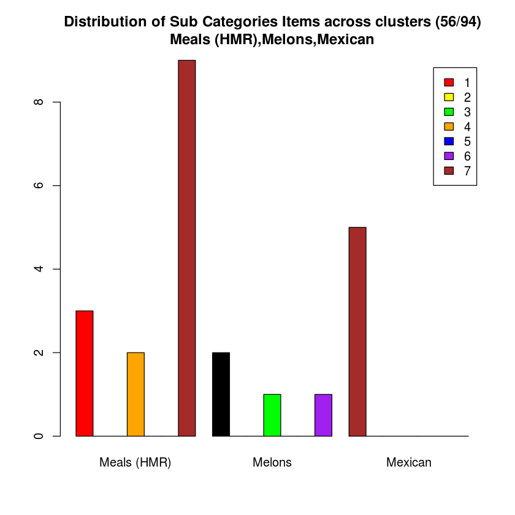


    [1] "Distribution of Sub Categories Items across clusters (57/94) - Milk,Mushrooms,Naan"
                       section_data
    section_data_groups Milk Mushrooms Naan
                      1    7         5    0
                      2    1         0    0
                      3    0         0    0
                      4   15         2    0
                      5    0         1    0
                      6    4         1    0
                      7   34         1    2


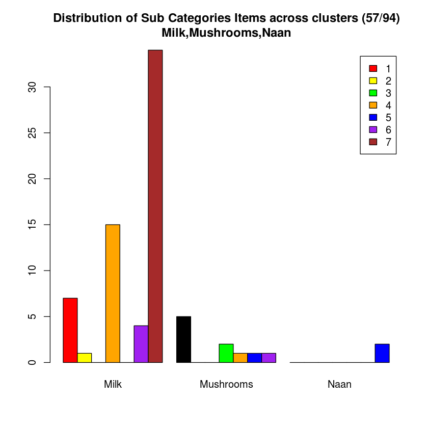


    [1] "Distribution of Sub Categories Items across clusters (58/94) - Nevada Sales,Newspapers,NPF (NUTR PRTBLE FD)"
                       section_data
    section_data_groups Nevada Sales Newspapers NPF (NUTR PRTBLE FD)
                      1            0          1                    2
                      2            0          0                    0
                      3            1          0                    0
                      4            0          0                    0
                      5            0          0                    0
                      6            0          0                    0
                      7            0          3                    0


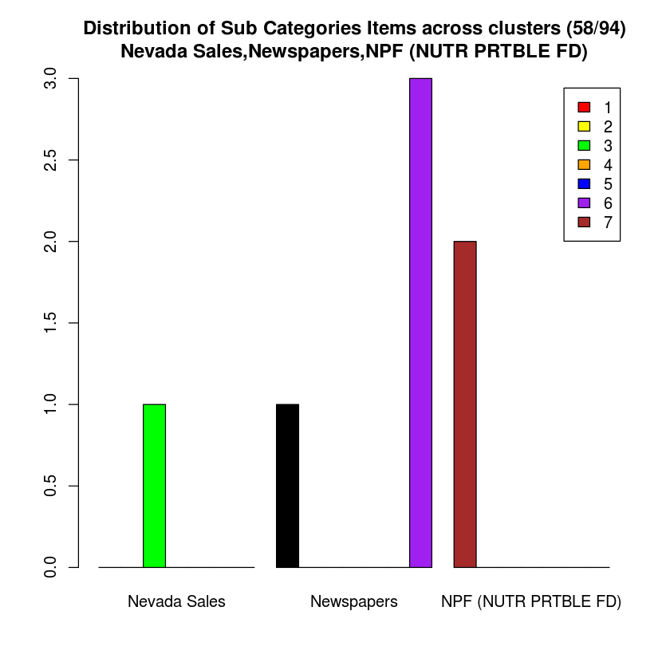


    [1] "Distribution of Sub Categories Items across clusters (59/94) - Nut (Fresh) (Produce,Oils And Sprays,Old Cheddar Portion"
                       section_data
    section_data_groups Nut (Fresh) (Produce Oils And Sprays Old Cheddar Portion
                      1                    1               9                   4
                      2                    0               0                   0
                      3                    0               0                   0
                      4                    0               0                   0
                      5                    0               0                   0
                      6                    0               0                   0
                      7                    1               0                   0


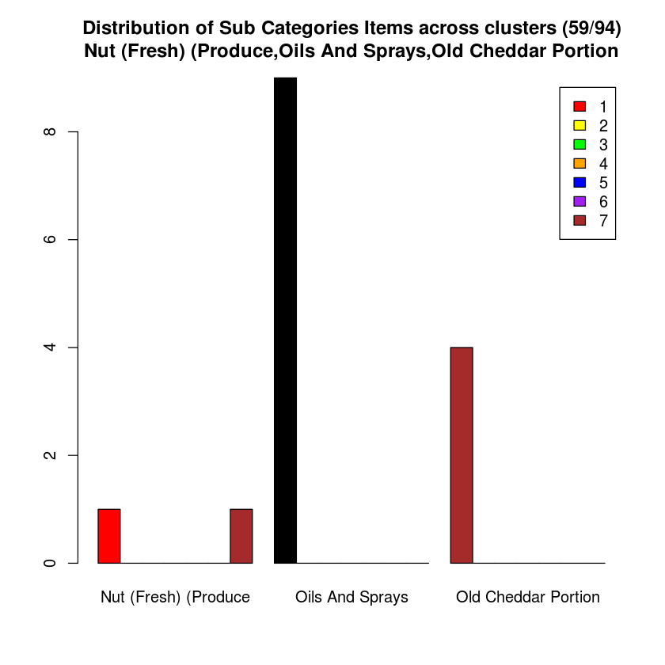


    [1] "Distribution of Sub Categories Items across clusters (60/94) - Oranges,Organi Beverages,Organic Breakfast"
                       section_data
    section_data_groups Oranges Organi Beverages Organic Breakfast
                      1       0               12                 1
                      2       3                0                 0
                      3       0                0                 0
                      4       0                0                 0
                      5       0                0                 0
                      6       2                0                 0
                      7       0                5                 0


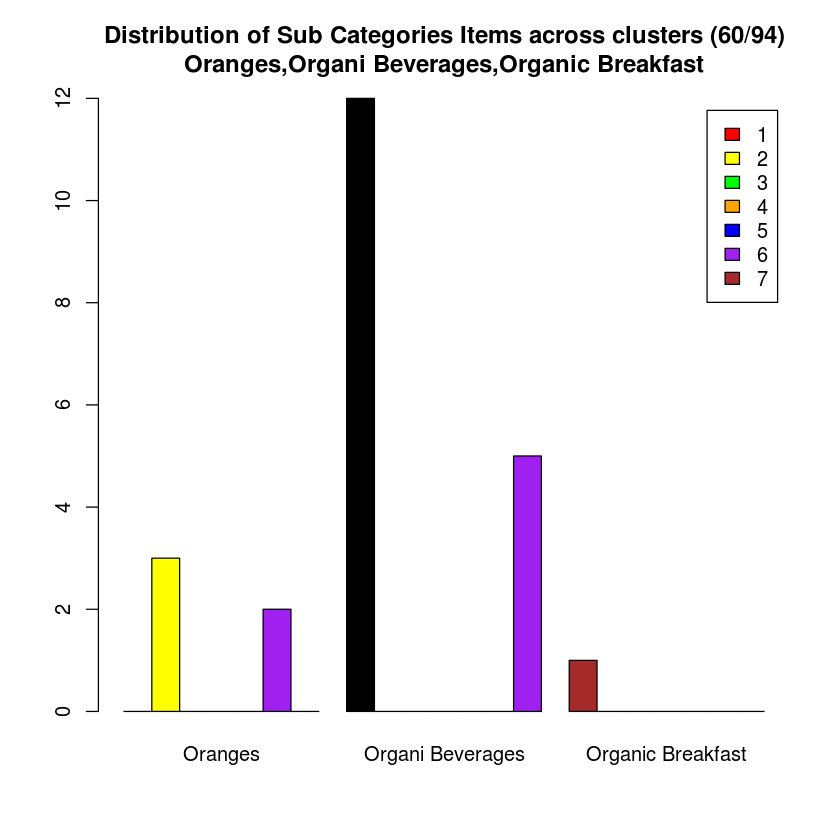


    [1] "Distribution of Sub Categories Items across clusters (61/94) - ORGANIC CONFCTNRY,Organic Fruit,ORGANIC MEAL MAKERS"
                       section_data
    section_data_groups ORGANIC CONFCTNRY Organic Fruit ORGANIC MEAL MAKERS
                      1                 0             0                   2
                      2                 0             6                   0
                      3                 0             0                   0
                      4                 0             1                   0
                      5                 0             1                   0
                      6                 0             0                   0
                      7                 1             0                   0


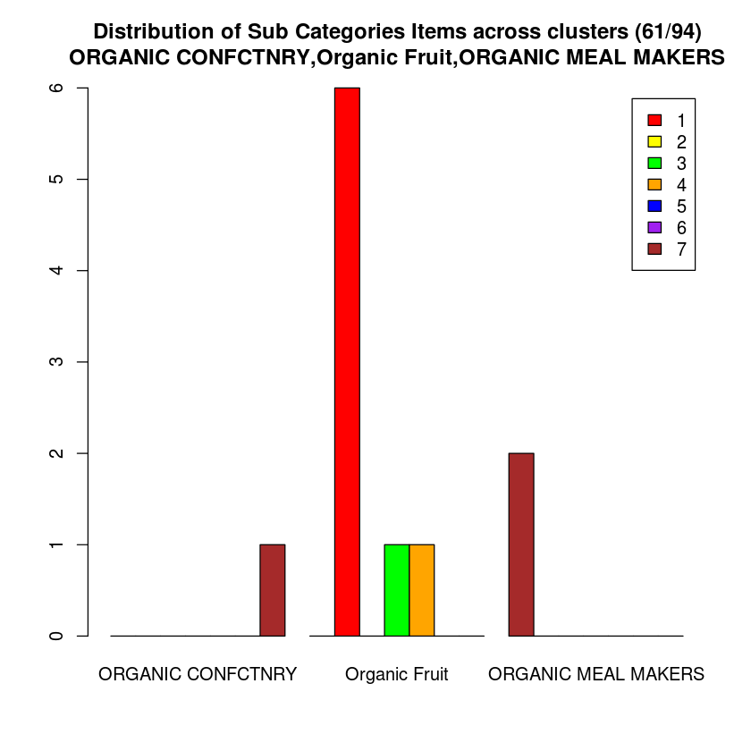


    [1] "Distribution of Sub Categories Items across clusters (62/94) - ORGANIC/NATURL DAIRY,Organic Snacks,Organic Vegetables"
                       section_data
    section_data_groups ORGANIC/NATURL DAIRY Organic Snacks Organic Vegetables
                      1                   14              5                  4
                      2                    0              0                  1
                      3                    0              0                  0
                      4                    1              0                  1
                      5                    0              0                  4
                      6                    0              0                  0
                      7                    9             11                 14


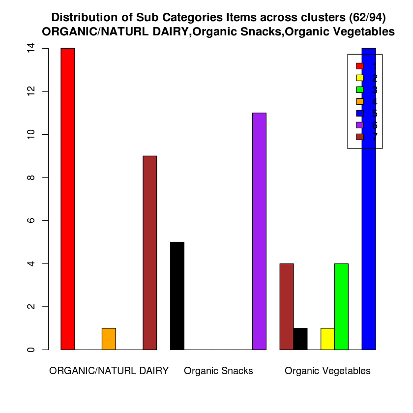


    [1] "Distribution of Sub Categories Items across clusters (63/94) - Other,Other Bakery Product,Other Beverages"
                       section_data
    section_data_groups Other Other Bakery Product Other Beverages
                      1     0                    2               0
                      2     0                    0               0
                      3     0                    0               0
                      4     0                    0               0
                      5     3                    0               1
                      6     0                    0               0
                      7     2                    0               0


    [1] "Distribution of Sub Categories Items across clusters (64/94) - Other Breakfast,Other Dairy,Other Gm"
                       section_data
    section_data_groups Other Breakfast Other Dairy Other Gm
                      1               1           1        0
                      2               0           0        0
                      3               0           0        0
                      4               0           0        0
                      5               0           0        0
                      6               0           0        0
                      7               0           3        1


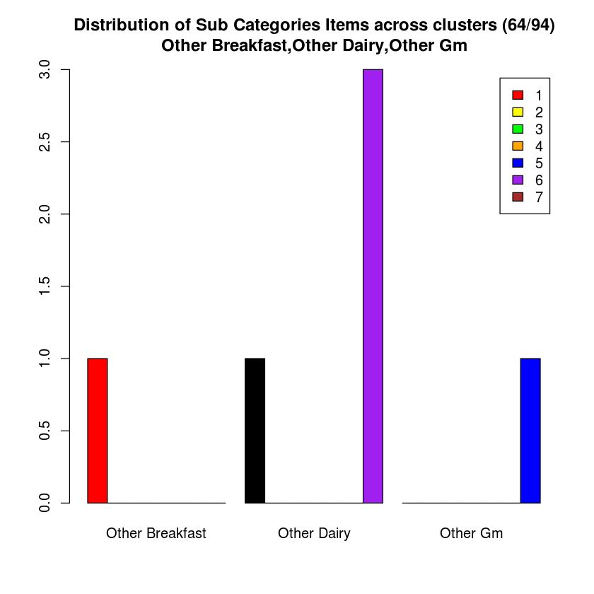


    [1] "Distribution of Sub Categories Items across clusters (65/94) - OTHER PASTRYCOUNTER,Pancake Mixes,Paper Towel"
                       section_data
    section_data_groups OTHER PASTRYCOUNTER Pancake Mixes Paper Towel
                      1                   0             0           8
                      2                   0             0           0
                      3                   0             0           0
                      4                   0             0           0
                      5                   0             0           0
                      6                   0             0           0
                      7                   3             1           6


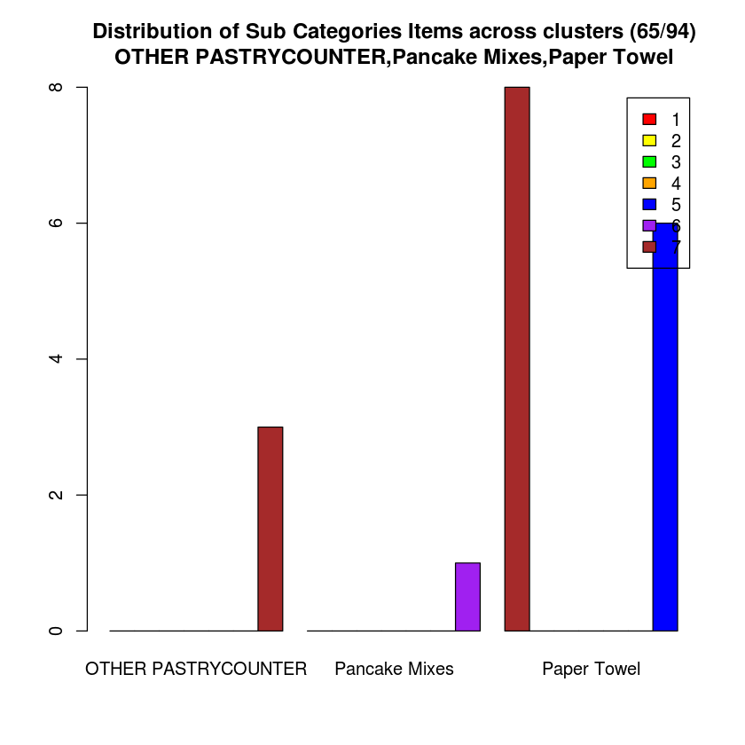


    [1] "Distribution of Sub Categories Items across clusters (66/94) - Pasta-Dry,Pasta Toppings,PASTE FRSH WHEEL DEL"
                       section_data
    section_data_groups Pasta-Dry Pasta Toppings PASTE FRSH WHEEL DEL
                      1         0              4                    2
                      2         0              0                    0
                      3         0              0                    0
                      4         0              0                    0
                      5         0              0                    0
                      6         0              0                    0
                      7         1              0                    2


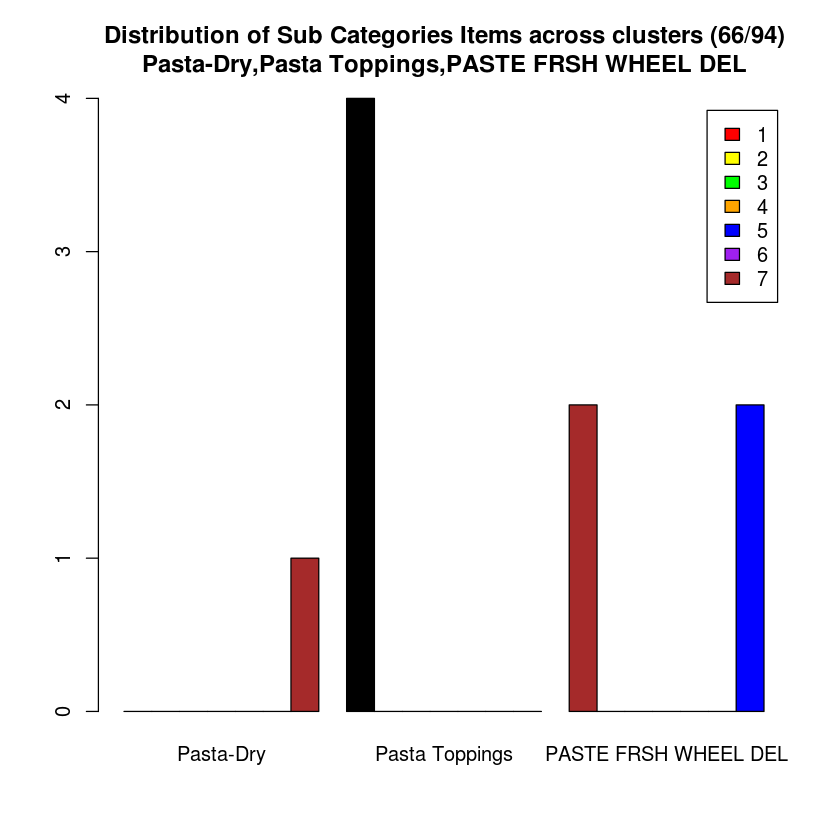


    [1] "Distribution of Sub Categories Items across clusters (67/94) - Pears,Peas And Beans,Peppers&Hot Peppers"
                       section_data
    section_data_groups Pears Peas And Beans Peppers&Hot Peppers
                      1     1              3                   1
                      2     0              0                   2
                      3     0              0                   0
                      4     1              0                   3
                      5     0              0                   0
                      6     0              0                   2
                      7     2              3                   0


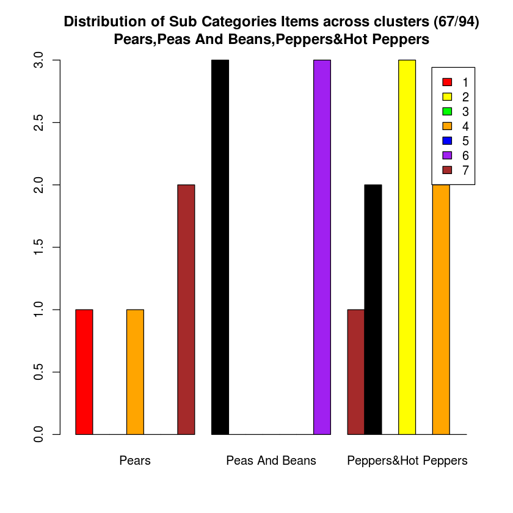


    [1] "Distribution of Sub Categories Items across clusters (68/94) - Pet Cat,PICKLS PEPPRS OLIVES,Pie"
                       section_data
    section_data_groups Pet Cat PICKLS PEPPRS OLIVES Pie
                      1      11                    1   2
                      2       0                    0   0
                      3       0                    0   0
                      4       0                    0   0
                      5       0                    0   0
                      6       0                    0   0
                      7       6                    1   2


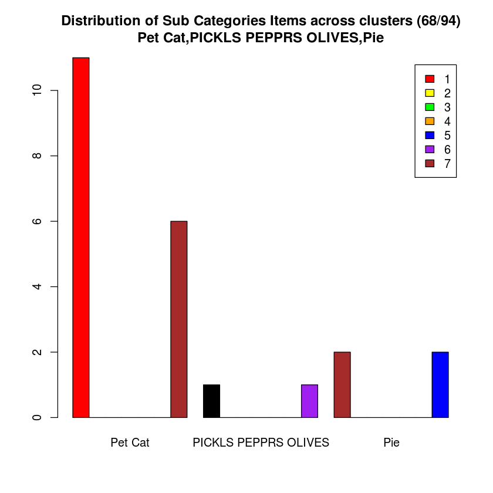


    [1] "Distribution of Sub Categories Items across clusters (69/94) - Pita,Pizza (HMR),Popcorn"
                       section_data
    section_data_groups Pita Pizza (HMR) Popcorn
                      1    0           5       2
                      2    0           0       0
                      3    0           0       0
                      4    0           0       0
                      5    0           0       0
                      6    0           0       0
                      7    3           0       1


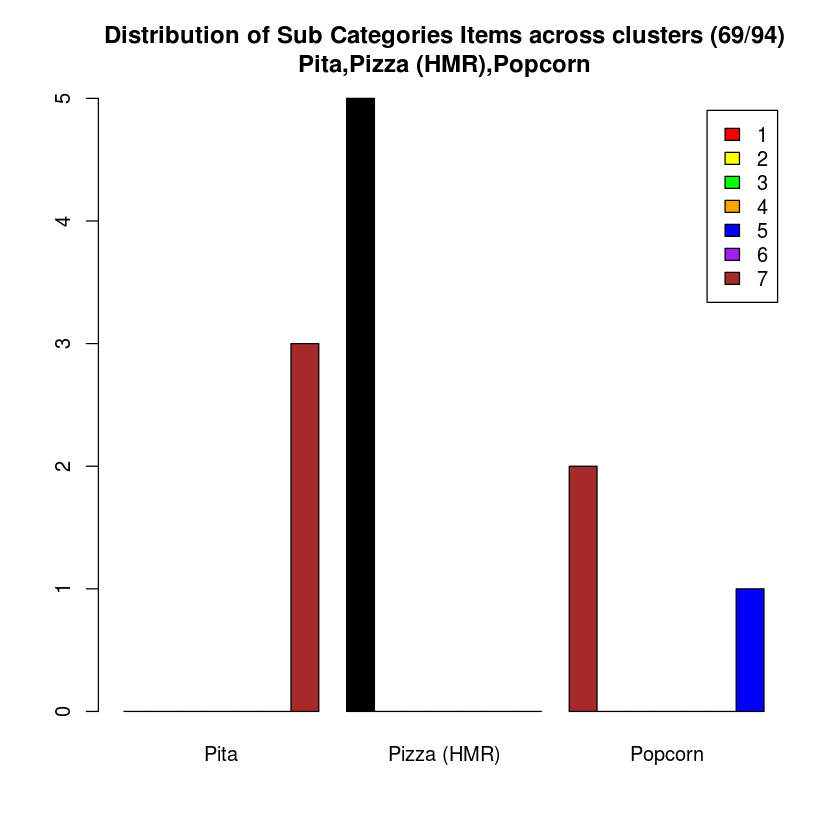


    [1] "Distribution of Sub Categories Items across clusters (70/94) - Pork Loin,Pork-Miscellaneous,Pork Shoulder"
                       section_data
    section_data_groups Pork Loin Pork-Miscellaneous Pork Shoulder
                      1         6                  3             2
                      2         0                  0             1
                      3         0                  0             0
                      4         2                  1             0
                      5         0                  1             0
                      6         0                  0             0
                      7         9                  2             0


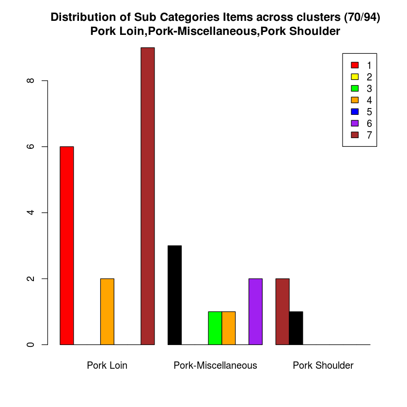


    [1] "Distribution of Sub Categories Items across clusters (71/94) - Pork Specialties,Pork Tenderloin,Potatoes-Specialty"
                       section_data
    section_data_groups Pork Specialties Pork Tenderloin Potatoes-Specialty
                      1                1               0                  2
                      2                0               1                  0
                      3                0               0                  0
                      4                0               0                  0
                      5                0               0                  1
                      6                0               0                  1
                      7                0               1                  6


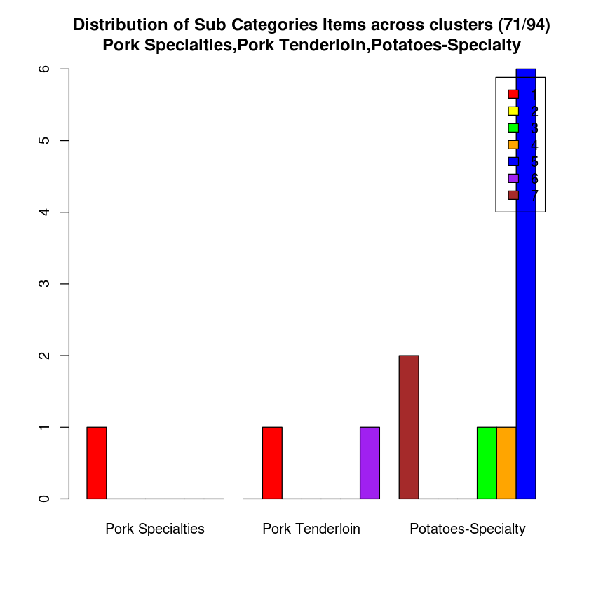


    [1] "Distribution of Sub Categories Items across clusters (72/94) - POULTRY (DELI SERV),Poultry (Deli SS),Pre-Cooked Bacon"
                       section_data
    section_data_groups POULTRY (DELI SERV) Poultry (Deli SS) Pre-Cooked Bacon
                      1                   5                 3                3
                      2                   0                 0                0
                      3                   0                 0                0
                      4                   0                 0                0
                      5                   0                 2                0
                      6                   0                 0                0
                      7                   0                 3                0


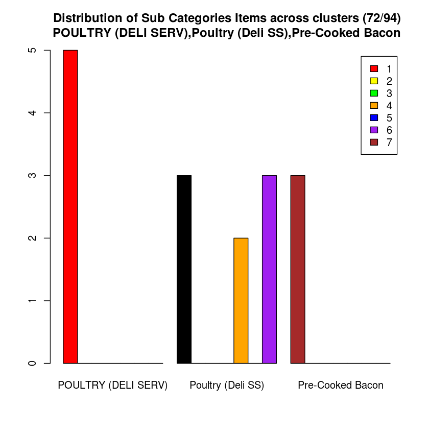


    [1] "Distribution of Sub Categories Items across clusters (73/94) - Pre Cut Carrots,Pre Cut Lettuce,Prepack Bagel"
                       section_data
    section_data_groups Pre Cut Carrots Pre Cut Lettuce Prepack Bagel
                      1               2              11             0
                      2               0               2             0
                      3               0               0             0
                      4               0               4             1
                      5               0               2             1
                      6               1               0             0
                      7               2               8             3


    [1] "Distribution of Sub Categories Items across clusters (74/94) - Prepared Vegetables,Processed Sausages,Process Veg-Instore"
                       section_data
    section_data_groups Prepared Vegetables Processed Sausages Process Veg-Instore
                      1                   1                  2                   5
                      2                   0                  0                   0
                      3                   0                  1                   4
                      4                   0                  0                   0
                      5                   0                  0                   0
                      6                   0                  0                   0
                      7                   3                  1                  22


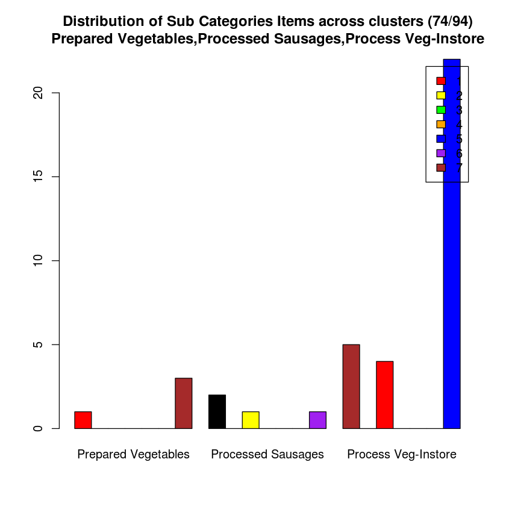


    [1] "Distribution of Sub Categories Items across clusters (75/94) - Produce Juices&Drink,Pste Frsh Wheel Port,Puff Pastry(Turnover"
                       section_data
    section_data_groups Produce Juices&Drink Pste Frsh Wheel Port
                      1                    1                    4
                      2                    0                    0
                      3                    0                    0
                      4                    0                    0
                      5                    0                    0
                      6                    0                    0
                      7                    4                    0
                       section_data
    section_data_groups Puff Pastry(Turnover
                      1                    0
                      2                    0
                      3                    1
                      4                    0
                      5                    0
                      6                    0
                      7                    5


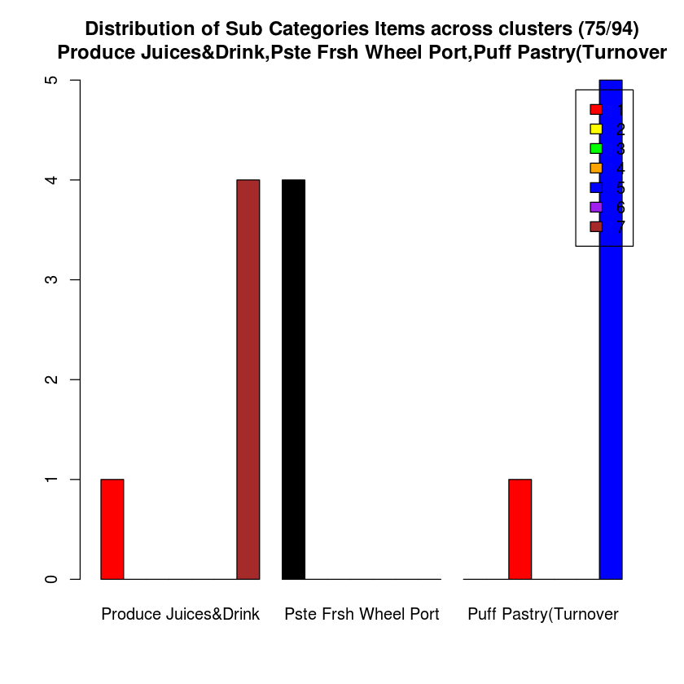


    [1] "Distribution of Sub Categories Items across clusters (76/94) - RAW SHRIMP,Refrigerated Juices,Regular Muffins"
                       section_data
    section_data_groups RAW SHRIMP Refrigerated Juices Regular Muffins
                      1          2                   9               1
                      2          0                   0               0
                      3          0                   0               0
                      4          0                   1               0
                      5          0                   2               0
                      6          0                   0               0
                      7          0                  14               5


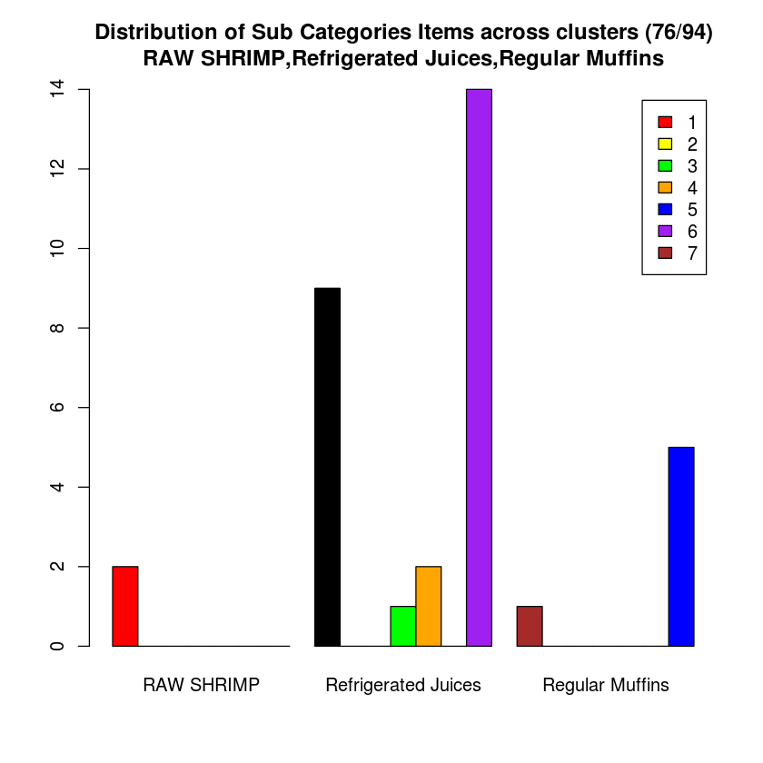


    [1] "Distribution of Sub Categories Items across clusters (77/94) - Rice,Rice Cakes,Rotise Chicken (HMR)"
                       section_data
    section_data_groups Rice Rice Cakes Rotise Chicken (HMR)
                      1    9          1                    3
                      2    0          0                    0
                      3    0          0                    0
                      4    0          0                    0
                      5    0          0                    0
                      6    0          0                    0
                      7    0          0                    2


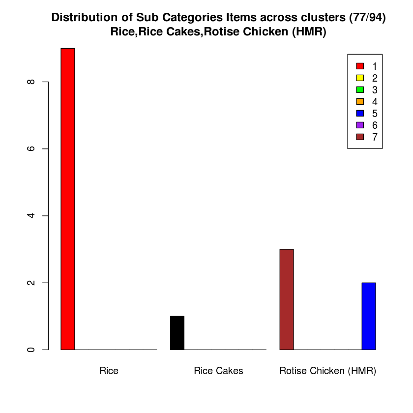


    [1] "Distribution of Sub Categories Items across clusters (78/94) - Salad Dress/Topping,Salad Spec Bulk (HMR,Salad Vegetables"
                       section_data
    section_data_groups Salad Dress/Topping Salad Spec Bulk (HMR Salad Vegetables
                      1                   4                    1                0
                      2                   0                    0                2
                      3                   0                    0                0
                      4                   0                    0                1
                      5                   0                    0                1
                      6                   0                    0                3
                      7                   3                    0                2


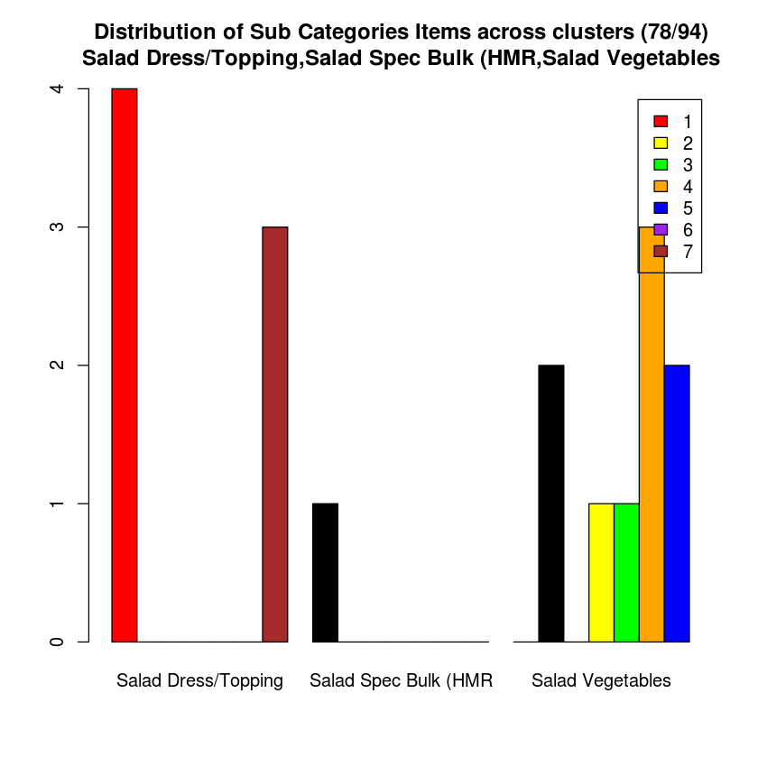


    [1] "Distribution of Sub Categories Items across clusters (79/94) - Salami-Pepperoni(SS,Salmon Filet,Sandwich (HMR)"
                       section_data
    section_data_groups Salami-Pepperoni(SS Salmon Filet Sandwich (HMR)
                      1                   2            4              1
                      2                   0            0              0
                      3                   0            1              0
                      4                   1            2              0
                      5                   0            1              0
                      6                   0            0              0
                      7                   3            2             36


    [1] "Distribution of Sub Categories Items across clusters (80/94) - Seasonal,SEASONAL CONFCTNRY,SEMI-FIRM WHEEL DELI"
                       section_data
    section_data_groups Seasonal SEASONAL CONFCTNRY SEMI-FIRM WHEEL DELI
                      1        0                  0                    1
                      2        2                  3                    0
                      3        2                  0                    0
                      4        0                  0                    0
                      5        0                  0                    0
                      6        0                  0                    0
                      7        0                  0                    0


    [1] "Distribution of Sub Categories Items across clusters (81/94) - Services -Other,Shelled Nuts (Bulk),Shredded Portion"
                       section_data
    section_data_groups Services -Other Shelled Nuts (Bulk) Shredded Portion
                      1               0                   3                1
                      2               0                   0                0
                      3               3                   0                1
                      4               0                   0                0
                      5               0                   0                1
                      6               0                   0                0
                      7               0                   0                1


    [1] "Distribution of Sub Categories Items across clusters (82/94) - Shrimp Ring,Sirloin,SMOKED MEAT SERVICE"
                       section_data
    section_data_groups Shrimp Ring Sirloin SMOKED MEAT SERVICE
                      1           1       5                   3
                      2           0       2                   0
                      3           0       0                   0
                      4           0       0                   0
                      5           0       0                   0
                      6           0       0                   0
                      7           0       3                   0


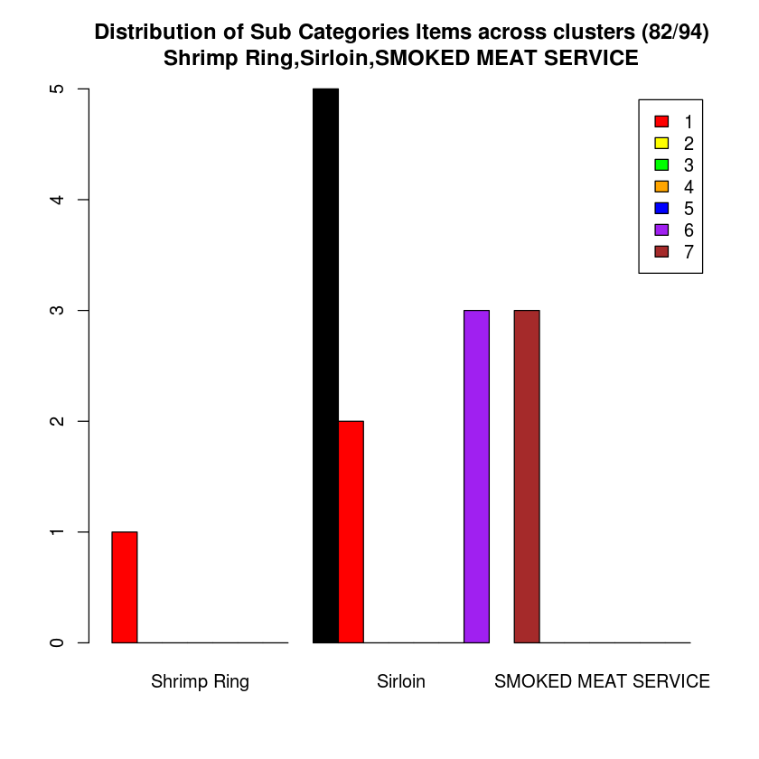


    [1] "Distribution of Sub Categories Items across clusters (83/94) - SMOKED MEAT SPEC SS,Smoked Salmon/Trout,Snack Foods/Nuts"
                       section_data
    section_data_groups SMOKED MEAT SPEC SS Smoked Salmon/Trout Snack Foods/Nuts
                      1                   0                   4                1
                      2                   0                   0                0
                      3                   0                   0                0
                      4                   0                   0                0
                      5                   0                   1                0
                      6                   0                   0                0
                      7                   4                   2                1


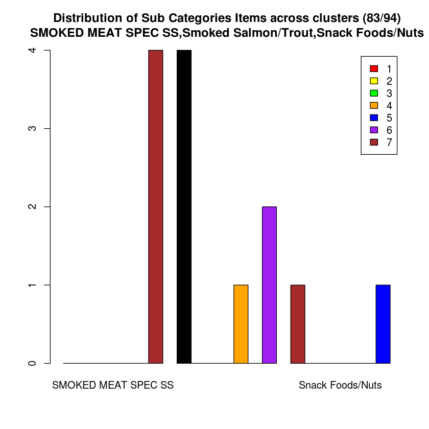


    [1] "Distribution of Sub Categories Items across clusters (84/94) - SOFT CHSE WHEEL DELI,Soft Drinks,Soup"
                       section_data
    section_data_groups SOFT CHSE WHEEL DELI Soft Drinks Soup
                      1                    1          11    3
                      2                    0           0    0
                      3                    0           1    0
                      4                    0           4    0
                      5                    0           2    0
                      6                    0           0    0
                      7                    0          21    8


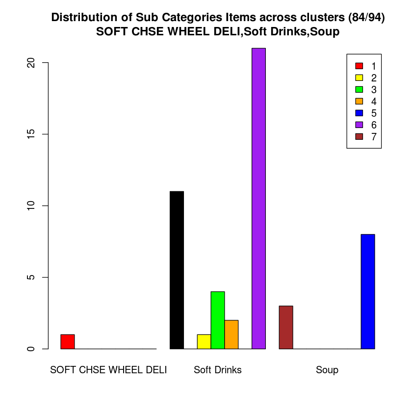


    [1] "Distribution of Sub Categories Items across clusters (85/94) - Specialty and Other,Specialty Bread,Specialty Buns Rolls"
                       section_data
    section_data_groups Specialty and Other Specialty Bread Specialty Buns Rolls
                      1                   4               1                    1
                      2                   1               0                    2
                      3                   0               1                    0
                      4                   3               1                    0
                      5                   0               0                    0
                      6                   0               0                    0
                      7                   2              18                    9


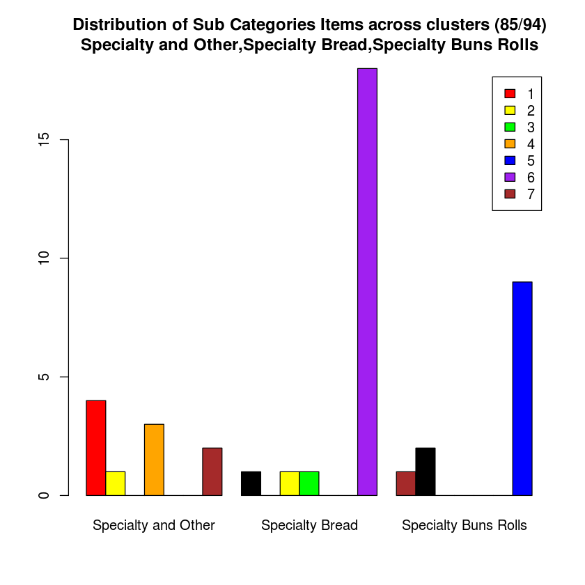


    [1] "Distribution of Sub Categories Items across clusters (86/94) - Specialty-Tropical,Spices And Seasoning,SPORTS DRINKS (ISOT)"
                       section_data
    section_data_groups Specialty-Tropical Spices And Seasoning
                      1                  0                    1
                      2                  0                    0
                      3                  0                    0
                      4                  1                    0
                      5                  1                    0
                      6                  1                    0
                      7                  3                    1
                       section_data
    section_data_groups SPORTS DRINKS (ISOT)
                      1                    1
                      2                    0
                      3                    0
                      4                    0
                      5                    0
                      6                    0
                      7                    0


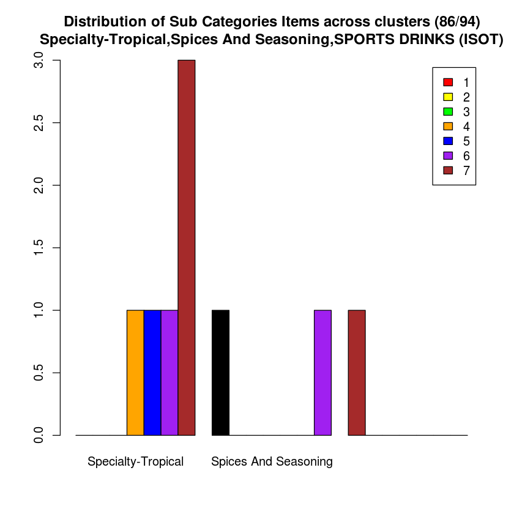


    [1] "Distribution of Sub Categories Items across clusters (87/94) - Spreads,Squash,Stone Fruit"
                       section_data
    section_data_groups Spreads Squash Stone Fruit
                      1      10      3           1
                      2       0      0           4
                      3       0      0           0
                      4       1      1           0
                      5       0      0           3
                      6       0      0           0
                      7       3      0           1


    [1] "Distribution of Sub Categories Items across clusters (88/94) - Sugar And Sweeteners,Surimi,Sushi Articles"
                       section_data
    section_data_groups Sugar And Sweeteners Surimi Sushi Articles
                      1                    1      0              6
                      2                    0      0              0
                      3                    0      0              0
                      4                    1      0              0
                      5                    0      0              0
                      6                    0      0              0
                      7                    2      2              3


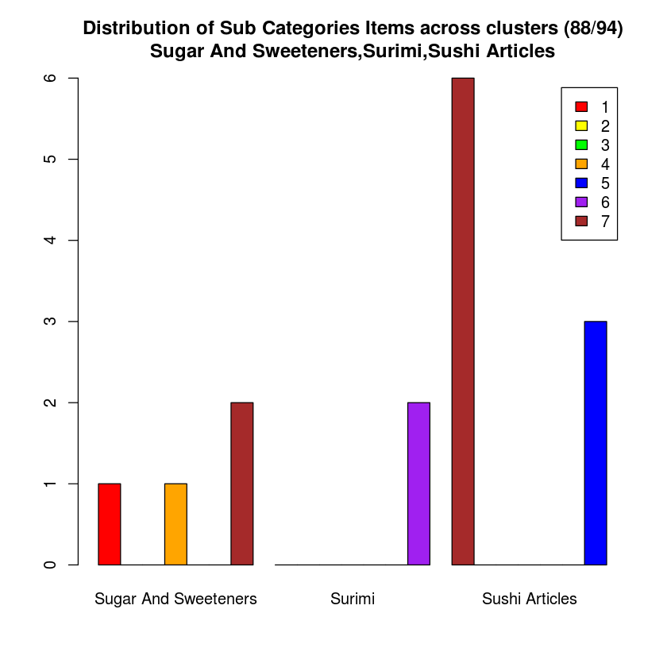


    [1] "Distribution of Sub Categories Items across clusters (89/94) - Sushi Small Tray,Syrups,Tea"
                       section_data
    section_data_groups Sushi Small Tray Syrups Tea
                      1                0      3   3
                      2                0      0   0
                      3                0      0   0
                      4                0      0   0
                      5                0      0   2
                      6                0      0   0
                      7                2      0   1


    [1] "Distribution of Sub Categories Items across clusters (90/94) - Tomatoes,Tortillas,Trout Filet"
                       section_data
    section_data_groups Tomatoes Tortillas Trout Filet
                      1        4         4           1
                      2        1         0           0
                      3        0         0           0
                      4        2         0           0
                      5        1         0           0
                      6        2         0           0
                      7        3         3           0


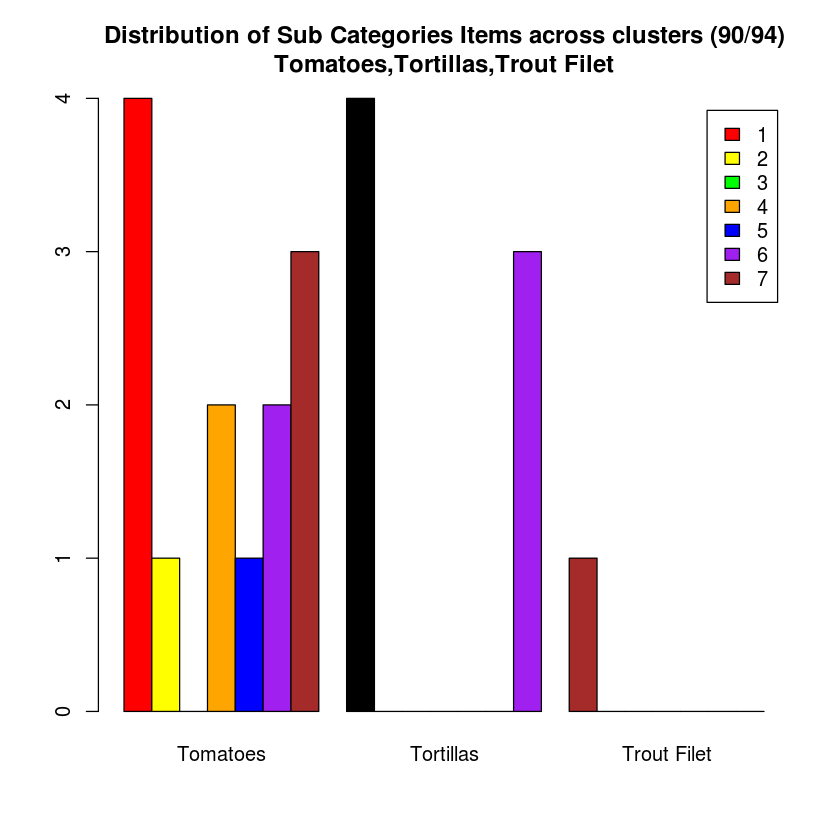


    [1] "Distribution of Sub Categories Items across clusters (91/94) - Turkey Cut,Turkey Prepacked,Turnips & Parsnips"
                       section_data
    section_data_groups Turkey Cut Turkey Prepacked Turnips & Parsnips
                      1          1                0                  0
                      2          0                0                  0
                      3          0                0                  0
                      4          0                0                  1
                      5          0                0                  1
                      6          0                0                  0
                      7          0                1                  0


    [1] "Distribution of Sub Categories Items across clusters (92/94) - Value Added Fish,Vegetable Juices,Vinegar"
                       section_data
    section_data_groups Value Added Fish Vegetable Juices Vinegar
                      1                0                1       1
                      2                0                0       0
                      3                4                0       0
                      4                0                0       0
                      5                0                0       0
                      6                0                0       0
                      7                0                0       0


    [1] "Distribution of Sub Categories Items across clusters (93/94) - Waste Bags,Water,Wheel-Othr-Specialty"
                       section_data
    section_data_groups Waste Bags Water Wheel-Othr-Specialty
                      1          8     4                    0
                      2          0     0                    0
                      3          0     0                    0
                      4          0     2                    0
                      5          2     0                    0
                      6          0     1                    0
                      7          0     7                    1


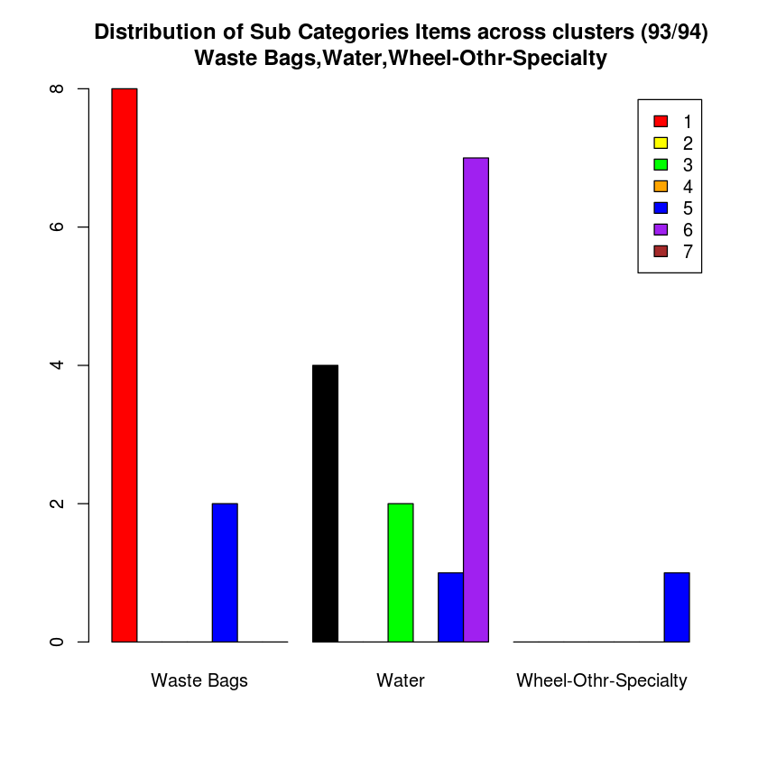


    [1] "Distribution of Sub Categories Items across clusters (94/94) - White Potatoes,Wieners-Regular,Yogurt"
                       section_data
    section_data_groups White Potatoes Wieners-Regular Yogurt
                      1              2               3     42
                      2              2               0      0
                      3              1               1      0
                      4              0               0      1
                      5              3               0      2
                      6              0               0      0
                      7              4               9     14


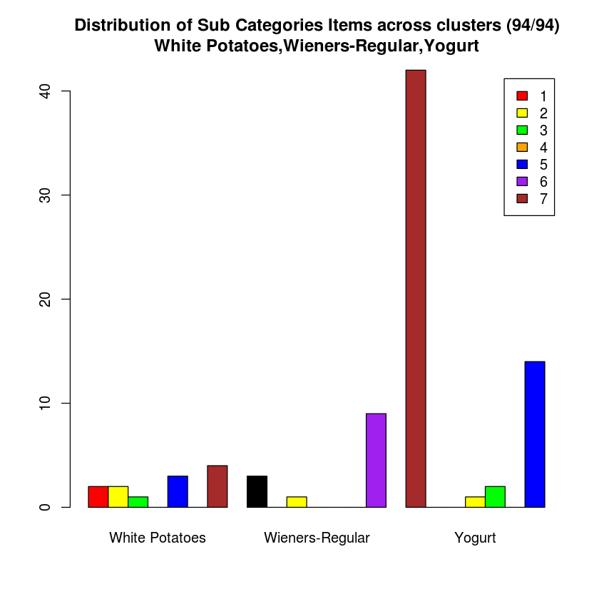


```R

```
