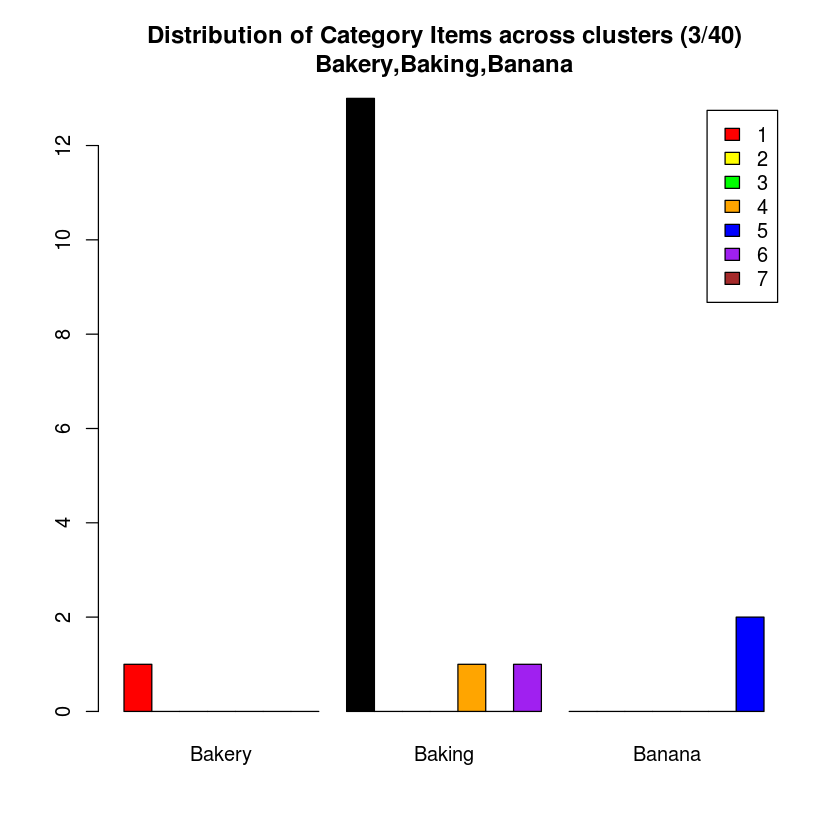
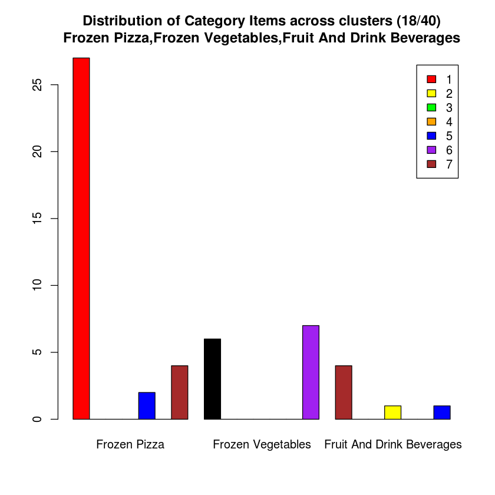
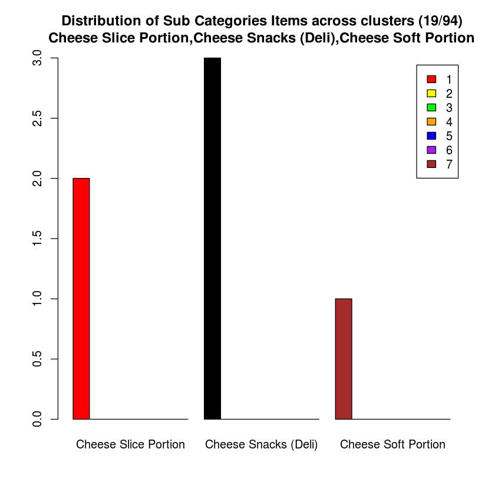
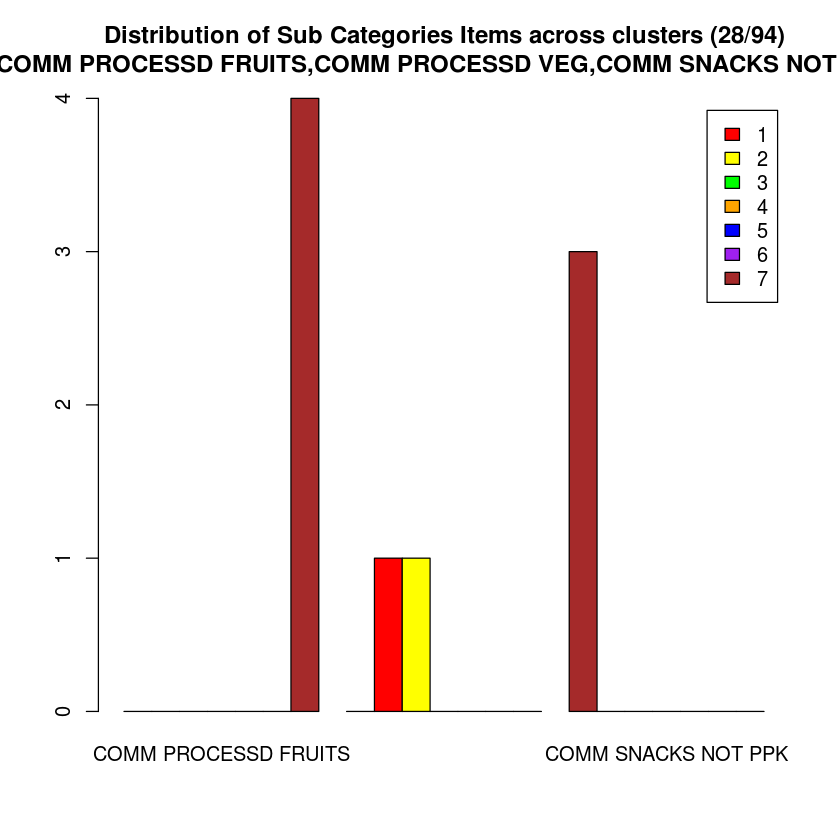
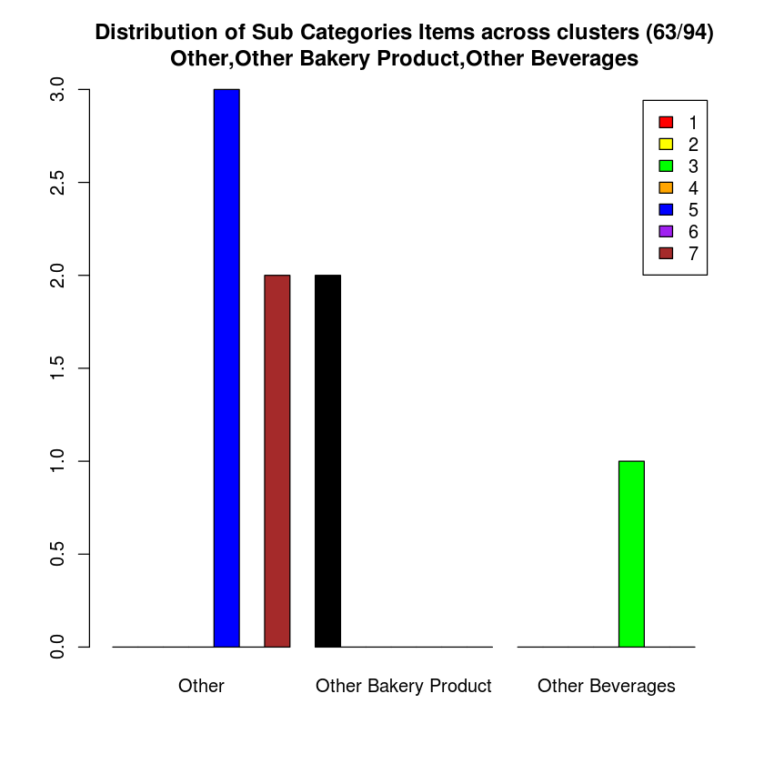
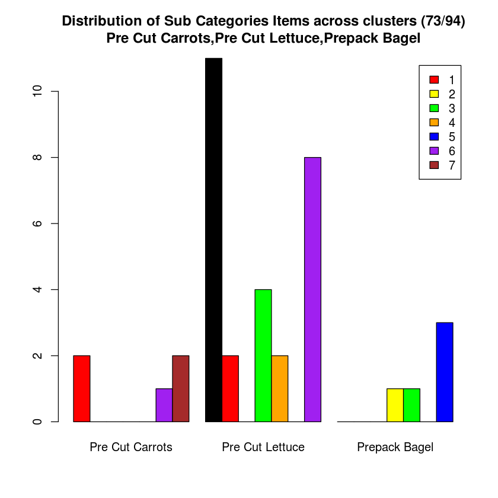
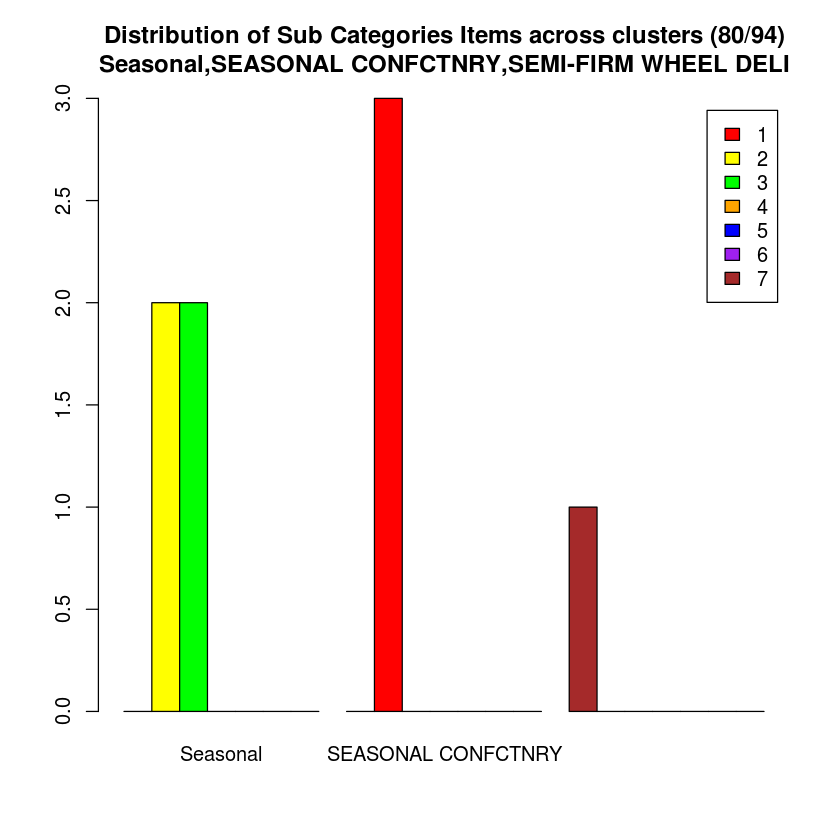
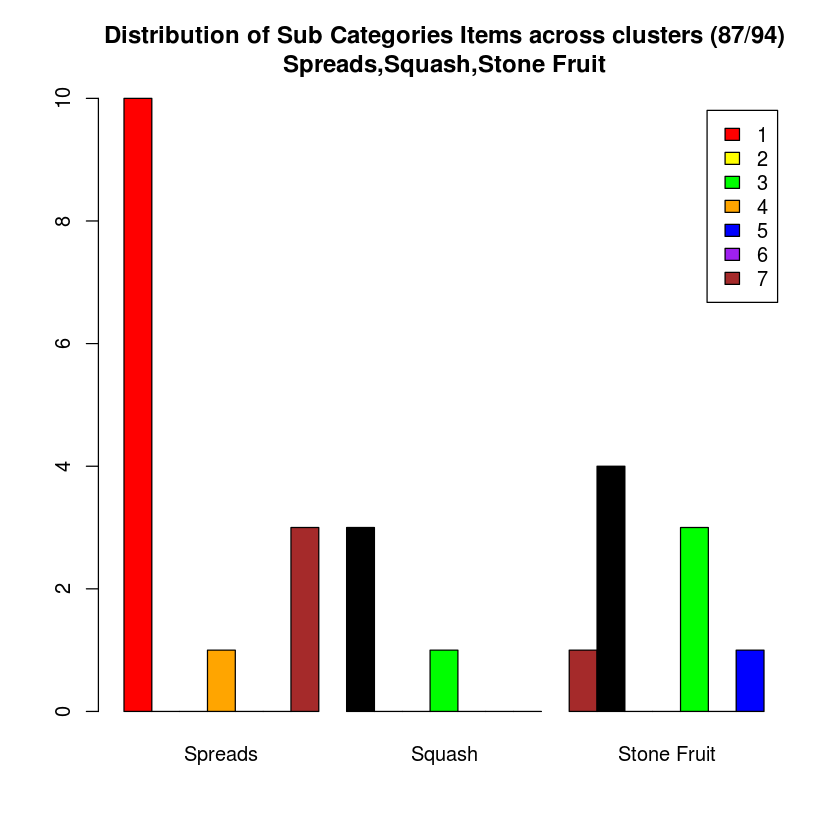

## Data Mining - Assignment 2
### R Data Preparation and Clustering
 > January 28,2015


<h2>Top and Least Performing Products Within Groups</h2>

<h3>Top Performing Products in Group 1</h3>

<table class="table table-bordered table-hover table-condensed">
<thead><tr><th title="Field #1">ITEM_SK</th>
<th title="Field #2">Name</th>
<th title="Field #3">Department</th>
<th title="Field #4">Category</th>
<th title="Field #5">Sub Category</th>
<th title="Field #6">Gross Weight/KG</th>
<th title="Field #7">Taxable</th>
<th title="Field #8">Kosher</th>
<th title="Field #9">Organic</th>
<th title="Field #10">Average Outlet Sales/Month</th>
<th title="Field #11">Average Total Revenue/Month</th>
<th title="Field #12">Average amount of purchases per hour/Month</th>
<th title="Field #13">Average amount of customers/Month</th>
<th title="Field #14">Average amount of purchases/Month</th>
</tr></thead>
<tbody><tr><td align="right">11701997</td>
<td>Lobster Market Live</td>
<td>Seafood</td>
<td>Fresh Crustaceans</td>
<td>Lobster</td>
<td align="right">1.000</td>
<td>N</td>
<td>N</td>
<td>N</td>
<td align="right">3.11111111111111</td>
<td align="right">8028.26777777778</td>
<td align="right">13.8888888888889</td>
<td align="right">111.3333333333330</td>
<td align="right">213.000000000000</td>
</tr>
<tr><td align="right">11699047</td>
<td>SS Beef Rib Eye SC</td>
<td>Meat</td>
<td>Service Case</td>
<td>Beef (Service Case)</td>
<td align="right">1.000</td>
<td>N</td>
<td>N</td>
<td>N</td>
<td align="right">3.11111111111111</td>
<td align="right">6203.20444444444</td>
<td align="right">13.7777777777778</td>
<td align="right">174.2222222222220</td>
<td align="right">309.888888888889</td>
</tr>
<tr><td align="right">12932341</td>
<td>SterlSil Striploin Steak SC</td>
<td>Meat</td>
<td>Service Case</td>
<td>Beef (Service Case)</td>
<td align="right">1.000</td>
<td>N</td>
<td>N</td>
<td>N</td>
<td align="right">3.11111111111111</td>
<td align="right">5708.72222222222</td>
<td align="right">14.0000000000000</td>
<td align="right">133.8888888888890</td>
<td align="right">231.555555555556</td>
</tr>
<tr><td align="right">11635275</td>
<td>Cashmere Bath Tissue Jmbo 30EA</td>
<td>Grocery</td>
<td>Paper</td>
<td>Bathroom Tissue</td>
<td align="right">3.220</td>
<td>Y</td>
<td>N</td>
<td>N</td>
<td align="right">3.11111111111111</td>
<td align="right">4892.36666666667</td>
<td align="right">18.8888888888889</td>
<td align="right">291.7777777777780</td>
<td align="right">418.888888888889</td>
</tr>
<tr><td align="right">11603103</td>
<td>Scratch EP $2 Crossword</td>
<td>Lottery</td>
<td>Lottery Sales</td>
<td>Lotto Scratch Sales</td>
<td align="right">0.000</td>
<td>N</td>
<td>N</td>
<td>N</td>
<td align="right">3.11111111111111</td>
<td align="right">4887.55555555556</td>
<td align="right">13.2222222222222</td>
<td align="right">40.7777777777778</td>
<td align="right">2443.777777777780</td>
</tr>
<tr><td align="right">12932796</td>
<td>S/S Striploin Steak Supr Saver</td>
<td>Meat</td>
<td>Beef</td>
<td>Loin Beef</td>
<td align="right">1.000</td>
<td>Y</td>
<td>N</td>
<td>N</td>
<td align="right">3.11111111111111</td>
<td align="right">4532.82333333333</td>
<td align="right">16.5555555555556</td>
<td align="right">76.1111111111111</td>
<td align="right">140.000000000000</td>
</tr>
</tbody></table>

<h3>Least Performing Products in Group 1</h3>

<table class="table table-bordered table-hover table-condensed">
<thead><tr><th title="Field #1">ITEM_SK</th>
<th title="Field #2">Name</th>
<th title="Field #3">Department</th>
<th title="Field #4">Category</th>
<th title="Field #5">Sub Category</th>
<th title="Field #6">Gross Weight/KG</th>
<th title="Field #7">Taxable</th>
<th title="Field #8">Kosher</th>
<th title="Field #9">Organic</th>
<th title="Field #10">Average Outlet Sales/Month</th>
<th title="Field #11">Average Total Revenue/Month</th>
<th title="Field #12">Average amount of purchases per hour/Month</th>
<th title="Field #13">Average amount of customers/Month</th>
<th title="Field #14">Average amount of purchases/Month</th>
</tr></thead>
<tbody><tr><td align="right">11633314</td>
<td>Hellmann Mayo Lt W/Olive Oil</td>
<td>Grocery</td>
<td>Salad Dressing</td>
<td>Salad Dress/Topping</td>
<td align="right">0.966</td>
<td>N</td>
<td>N</td>
<td>N</td>
<td align="right">3.11111111111111</td>
<td align="right">631.963333333333</td>
<td align="right">16.8888888888889</td>
<td align="right">101.8888888888890</td>
<td align="right">140.555555555556</td>
</tr>
<tr><td align="right">11701256</td>
<td>Crusty Rolls Bulk Bin</td>
<td>Instore Bakery</td>
<td>Buns And Rolls</td>
<td>Specialty Buns Rolls</td>
<td align="right">1.000</td>
<td>N</td>
<td>N</td>
<td>N</td>
<td align="right">3.11111111111111</td>
<td align="right">633.461111111111</td>
<td align="right">16.7777777777778</td>
<td align="right">208.8888888888890</td>
<td align="right">1248.333333333330</td>
</tr>
<tr><td align="right">11746371</td>
<td>Lacteeze Milk 2%</td>
<td>Dairy</td>
<td>Milk Product</td>
<td>Milk</td>
<td align="right">0.010</td>
<td>N</td>
<td>N</td>
<td>N</td>
<td align="right">3.11111111111111</td>
<td align="right">634.284444444444</td>
<td align="right">18.4444444444444</td>
<td align="right">113.2222222222220</td>
<td align="right">221.777777777778</td>
</tr>
<tr><td align="right">12811154</td>
<td>Dawn Ultra Original</td>
<td>Grocery</td>
<td>Household Others</td>
<td>Dish Detergents</td>
<td align="right">0.798</td>
<td>Y</td>
<td>N</td>
<td>N</td>
<td align="right">3.11111111111111</td>
<td align="right">634.848888888889</td>
<td align="right">19.0000000000000</td>
<td align="right">162.4444444444440</td>
<td align="right">234.333333333333</td>
</tr>
<tr><td align="right">11738689</td>
<td>Liberte Yogurt No Fat Vanilla</td>
<td>Dairy</td>
<td>Organic And Natural Dairy</td>
<td>ORGANIC/NATURL DAIRY</td>
<td align="right">0.768</td>
<td>N</td>
<td>N</td>
<td>N</td>
<td align="right">3.11111111111111</td>
<td align="right">634.935555555556</td>
<td align="right">16.6666666666667</td>
<td align="right">79.3333333333333</td>
<td align="right">148.444444444444</td>
</tr>
<tr><td align="right">14007051</td>
<td>Comp Pepperoni Mild</td>
<td>Deli</td>
<td>Deli Meats-Self Service</td>
<td>Salami-Pepperoni(SS</td>
<td align="right">0.259</td>
<td>N</td>
<td>N</td>
<td>N</td>
<td align="right">3.11111111111111</td>
<td align="right">635.356666666667</td>
<td align="right">17.7777777777778</td>
<td align="right">97.1111111111111</td>
<td align="right">157.000000000000</td>
</tr>
</tbody></table>

<h3>Top Performing Products in Group 2</h3>
<table class="table table-bordered table-hover table-condensed">
<thead><tr><th title="Field #1">ITEM_SK</th>
<th title="Field #2">Name</th>
<th title="Field #3">Department</th>
<th title="Field #4">Category</th>
<th title="Field #5">Sub Category</th>
<th title="Field #6">Gross Weight/KG</th>
<th title="Field #7">Taxable</th>
<th title="Field #8">Kosher</th>
<th title="Field #9">Organic</th>
<th title="Field #10">Average Outlet Sales/Month</th>
<th title="Field #11">Average Total Revenue/Month</th>
<th title="Field #12">Average amount of purchases per hour/Month</th>
<th title="Field #13">Average amount of customers/Month</th>
<th title="Field #14">Average amount of purchases/Month</th>
</tr></thead>
<tbody><tr><td align="right">11740989</td>
<td>Blueberries Pint</td>
<td>Produce</td>
<td>Other Fruits</td>
<td>Berries</td>
<td align="right">0.250</td>
<td>N</td>
<td>N</td>
<td>N</td>
<td align="right">1.77777777777778</td>
<td align="right">12934.49888888890</td>
<td align="right">14.88888888888890</td>
<td align="right">2005.555555555560</td>
<td align="right">4401.333333333330</td>
</tr>
<tr><td align="right">11750434</td>
<td>Windsor SafeTSalt Ice Melting</td>
<td>General Merchandise</td>
<td>GM</td>
<td>Seasonal</td>
<td align="right">10.600</td>
<td>Y</td>
<td>N</td>
<td>N</td>
<td align="right">1.55555555555556</td>
<td align="right">11888.50222222220</td>
<td align="right">10.22222222222220</td>
<td align="right">644.333333333333</td>
<td align="right">2985.000000000000</td>
</tr>
<tr><td align="right">12762899</td>
<td>Strawberries 1Lb</td>
<td>Produce</td>
<td>Other Fruits</td>
<td>Berries</td>
<td align="right">0.588</td>
<td>N</td>
<td>N</td>
<td>N</td>
<td align="right">1.11111111111111</td>
<td align="right">8533.40888888889</td>
<td align="right">8.00000000000000</td>
<td align="right">1334.000000000000</td>
<td align="right">2747.444444444440</td>
</tr>
<tr><td align="right">11650611</td>
<td>Clementines 4lb</td>
<td>Produce</td>
<td>Citrus</td>
<td>Clem/Tang/Mandarin</td>
<td align="right">2.000</td>
<td>N</td>
<td>N</td>
<td>N</td>
<td align="right">1.22222222222222</td>
<td align="right">6663.01222222222</td>
<td align="right">9.77777777777778</td>
<td align="right">588.333333333333</td>
<td align="right">1059.333333333330</td>
</tr>
<tr><td align="right">15145961</td>
<td>Sens Bnls Chk Brst Super Svr</td>
<td>Meat</td>
<td>Chicken</td>
<td>CHICKEN BNELESS BRST</td>
<td align="right">1.000</td>
<td>N</td>
<td>N</td>
<td>N</td>
<td align="right">2.00000000000000</td>
<td align="right">6281.25222222222</td>
<td align="right">12.22222222222220</td>
<td align="right">181.333333333333</td>
<td align="right">293.333333333333</td>
</tr>
<tr><td align="right">11673668</td>
<td>Tulip Bouquet X10</td>
<td>Floral</td>
<td>Horticultural Product</td>
<td>Bouquet</td>
<td align="right">3.500</td>
<td>Y</td>
<td>N</td>
<td>N</td>
<td align="right">1.77777777777778</td>
<td align="right">5769.86555555556</td>
<td align="right">10.77777777777780</td>
<td align="right">403.222222222222</td>
<td align="right">827.888888888889</td>
</tr>
</tbody></table>

<h3>Least Performing Products in Group 2</h3>
<table class="table table-bordered table-hover table-condensed">
<thead><tr><th title="Field #1">ITEM_SK</th>
<th title="Field #2">Name</th>
<th title="Field #3">Department</th>
<th title="Field #4">Category</th>
<th title="Field #5">Sub Category</th>
<th title="Field #6">Gross Weight/KG</th>
<th title="Field #7">Taxable</th>
<th title="Field #8">Kosher</th>
<th title="Field #9">Organic</th>
<th title="Field #10">Average Outlet Sales/Month</th>
<th title="Field #11">Average Total Revenue/Month</th>
<th title="Field #12">Average amount of purchases per hour/Month</th>
<th title="Field #13">Average amount of customers/Month</th>
<th title="Field #14">Average amount of purchases/Month</th>
</tr></thead>
<tbody><tr><td align="right">14255779</td>
<td>Sugardale Bacon</td>
<td>Meat</td>
<td>Processed</td>
<td>Bacon</td>
<td align="right">0.410</td>
<td>N</td>
<td>N</td>
<td>N</td>
<td align="right">0.666666666666667</td>
<td align="right">648.650000000000</td>
<td align="right">4.00000000000000</td>
<td align="right">117.777777777778</td>
<td align="right">213.111111111111</td>
</tr>
<tr><td align="right">12822423</td>
<td>Ruffles Chips All Dressed</td>
<td>Grocery</td>
<td>Chips</td>
<td>Chips</td>
<td align="right">0.294</td>
<td>Y</td>
<td>N</td>
<td>N</td>
<td align="right">1.333333333333330</td>
<td align="right">664.615555555556</td>
<td align="right">7.77777777777778</td>
<td align="right">112.555555555556</td>
<td align="right">203.333333333333</td>
</tr>
<tr><td align="right">11741359</td>
<td>Clementines 5lb</td>
<td>Produce</td>
<td>Citrus</td>
<td>Clem/Tang/Mandarin</td>
<td align="right">2.600</td>
<td>N</td>
<td>N</td>
<td>N</td>
<td align="right">0.444444444444444</td>
<td align="right">665.228888888889</td>
<td align="right">2.66666666666667</td>
<td align="right">78.000000000000</td>
<td align="right">114.666666666667</td>
</tr>
<tr><td align="right">11608901</td>
<td>Comp Mini Seedless Cucumbers</td>
<td>Produce</td>
<td>Salad Items</td>
<td>Salad Vegetables</td>
<td align="right">0.340</td>
<td>N</td>
<td>N</td>
<td>N</td>
<td align="right">1.111111111111110</td>
<td align="right">667.960000000000</td>
<td align="right">9.88888888888889</td>
<td align="right">128.333333333333</td>
<td align="right">240.111111111111</td>
</tr>
<tr><td align="right">11741051</td>
<td>Raspberries 1/2 Pint</td>
<td>Produce</td>
<td>Other Fruits</td>
<td>Berries</td>
<td align="right">0.189</td>
<td>N</td>
<td>N</td>
<td>N</td>
<td align="right">1.333333333333330</td>
<td align="right">669.874444444444</td>
<td align="right">8.00000000000000</td>
<td align="right">120.222222222222</td>
<td align="right">223.666666666667</td>
</tr>
<tr><td align="right">11677638</td>
<td>Early Variety Apples 3lb</td>
<td>Produce</td>
<td>Apple And Pear</td>
<td>Apples</td>
<td align="right">1.369</td>
<td>N</td>
<td>N</td>
<td>N</td>
<td align="right">0.666666666666667</td>
<td align="right">670.428888888889</td>
<td align="right">4.66666666666667</td>
<td align="right">109.555555555556</td>
<td align="right">162.222222222222</td>
</tr>
</tbody></table>

<h3>Top Performing Products in Group 3</h3>
<table class="table table-bordered table-hover table-condensed">
<thead><tr><th title="Field #1">ITEM_SK</th>
<th title="Field #2">Name</th>
<th title="Field #3">Department</th>
<th title="Field #4">Category</th>
<th title="Field #5">Sub Category</th>
<th title="Field #6">Gross Weight/KG</th>
<th title="Field #7">Taxable</th>
<th title="Field #8">Kosher</th>
<th title="Field #9">Organic</th>
<th title="Field #10">Average Outlet Sales/Month</th>
<th title="Field #11">Average Total Revenue/Month</th>
<th title="Field #12">Average amount of purchases per hour/Month</th>
<th title="Field #13">Average amount of customers/Month</th>
<th title="Field #14">Average amount of purchases/Month</th>
</tr></thead>
<tbody><tr><td align="right">11662922</td>
<td>Adult Bus Tickets 10Pk</td>
<td>Services</td>
<td>Services - Other</td>
<td>Services -Other</td>
<td align="right">0.001</td>
<td>N</td>
<td>N</td>
<td>N</td>
<td align="right">1.11111111111111</td>
<td align="right">11668.88888888890</td>
<td align="right">22.2222222222222</td>
<td align="right">239.4444444444440</td>
<td align="right">583.555555555556</td>
</tr>
<tr><td align="right">12466640</td>
<td>Adult Bus Pass</td>
<td>Services</td>
<td>Services - Other</td>
<td>Services -Other</td>
<td align="right">0.001</td>
<td>N</td>
<td>N</td>
<td>N</td>
<td align="right">1.11111111111111</td>
<td align="right">9524.66666666667</td>
<td align="right">18.2222222222222</td>
<td align="right">73.1111111111111</td>
<td align="right">123.000000000000</td>
</tr>
<tr><td align="right">11746136</td>
<td>C/Farm Eggs Free Range 12EA</td>
<td>Dairy</td>
<td>Eggs</td>
<td>Eggs</td>
<td align="right">0.900</td>
<td>N</td>
<td>N</td>
<td>N</td>
<td align="right">2.11111111111111</td>
<td align="right">3493.52333333333</td>
<td align="right">21.2222222222222</td>
<td align="right">275.6666666666670</td>
<td align="right">634.333333333333</td>
</tr>
<tr><td align="right">11662501</td>
<td>Next Blue KS 25s</td>
<td>Tobacco</td>
<td>Cigarettes - 25&#39;s</td>
<td>Cigs-Value Brand 25s</td>
<td align="right">0.040</td>
<td>Y</td>
<td>N</td>
<td>N</td>
<td align="right">2.11111111111111</td>
<td align="right">3262.76777777778</td>
<td align="right">12.4444444444444</td>
<td align="right">0.0000000000000</td>
<td align="right">264.888888888889</td>
</tr>
<tr><td align="right">11752141</td>
<td>CandClas Reg 25s</td>
<td>Tobacco</td>
<td>Cigarettes - 25&#39;s</td>
<td>Cigs-Value Brand 25s</td>
<td align="right">0.035</td>
<td>Y</td>
<td>N</td>
<td>N</td>
<td align="right">2.11111111111111</td>
<td align="right">3134.63888888889</td>
<td align="right">12.1111111111111</td>
<td align="right">0.0000000000000</td>
<td align="right">244.222222222222</td>
</tr>
<tr><td align="right">12191602</td>
<td>Celebration Vegetable Tray Lg</td>
<td>Produce</td>
<td>Cooking Vegetable</td>
<td>Process Veg-Instore</td>
<td align="right">1.000</td>
<td>Y</td>
<td>N</td>
<td>N</td>
<td align="right">2.11111111111111</td>
<td align="right">2803.89555555556</td>
<td align="right">20.6666666666667</td>
<td align="right">245.1111111111110</td>
<td align="right">405.000000000000</td>
</tr>
</tbody></table>

<h3>Least Performing Products in Group 3</h3>
<table class="table table-bordered table-hover table-condensed">
<thead><tr><th title="Field #1">ITEM_SK</th>
<th title="Field #2">Name</th>
<th title="Field #3">Department</th>
<th title="Field #4">Category</th>
<th title="Field #5">Sub Category</th>
<th title="Field #6">Gross Weight/KG</th>
<th title="Field #7">Taxable</th>
<th title="Field #8">Kosher</th>
<th title="Field #9">Organic</th>
<th title="Field #10">Average Outlet Sales/Month</th>
<th title="Field #11">Average Total Revenue/Month</th>
<th title="Field #12">Average amount of purchases per hour/Month</th>
<th title="Field #13">Average amount of customers/Month</th>
<th title="Field #14">Average amount of purchases/Month</th>
</tr></thead>
<tbody><tr><td align="right">11748194</td>
<td>Potato Paper NB 10LB</td>
<td>Produce</td>
<td>Potatoes</td>
<td>White Potatoes</td>
<td align="right">4.600</td>
<td>N</td>
<td>N</td>
<td>N</td>
<td align="right">2.44444444444444</td>
<td align="right">667.081111111111</td>
<td align="right">16.5555555555556</td>
<td align="right">101.3333333333330</td>
<td align="right">148.0000000000000</td>
</tr>
<tr><td align="right">11744114</td>
<td>Kraft Shredded Parmesan Chs</td>
<td>Deli</td>
<td>Deli Cheese-Portion</td>
<td>Shredded Portion</td>
<td align="right">1.000</td>
<td>N</td>
<td>N</td>
<td>N</td>
<td align="right">2.55555555555556</td>
<td align="right">675.928888888889</td>
<td align="right">16.2222222222222</td>
<td align="right">155.5555555555560</td>
<td align="right">229.7777777777780</td>
</tr>
<tr><td align="right">11743442</td>
<td>Large Coffee Flavoured</td>
<td>Home Meal Replacement</td>
<td>Bistro</td>
<td>Drink (HMR)</td>
<td align="right">0.000</td>
<td>Y</td>
<td>N</td>
<td>N</td>
<td align="right">2.00000000000000</td>
<td align="right">685.068888888889</td>
<td align="right">17.2222222222222</td>
<td align="right">97.5555555555556</td>
<td align="right">487.6666666666670</td>
</tr>
<tr><td align="right">14963277</td>
<td>MaritPri Eggs White Large</td>
<td>Dairy</td>
<td>Eggs</td>
<td>Eggs</td>
<td align="right">0.114</td>
<td>N</td>
<td>N</td>
<td>N</td>
<td align="right">1.11111111111111</td>
<td align="right">686.128888888889</td>
<td align="right">17.1111111111111</td>
<td align="right">72.2222222222222</td>
<td align="right">141.0000000000000</td>
</tr>
<tr><td align="right">13797805</td>
<td>Mixed Veggie Sticks Large</td>
<td>Produce</td>
<td>Cooking Vegetable</td>
<td>Process Veg-Instore</td>
<td align="right">1.000</td>
<td>Y</td>
<td>N</td>
<td>N</td>
<td align="right">2.22222222222222</td>
<td align="right">688.865555555556</td>
<td align="right">19.8888888888889</td>
<td align="right">112.8888888888890</td>
<td align="right">236.7777777777780</td>
</tr>
<tr><td align="right">13884733</td>
<td>Executive Chef Salad Large</td>
<td>Produce</td>
<td>Cooking Vegetable</td>
<td>Process Veg-Instore</td>
<td align="right">0.765</td>
<td>Y</td>
<td>N</td>
<td>N</td>
<td align="right">2.44444444444444</td>
<td align="right">701.762222222222</td>
<td align="right">19.2222222222222</td>
<td align="right">33.3333333333333</td>
<td align="right">89.5555555555556</td>
</tr>
</tbody></table>

<h3>Top Performing Products in Group 4</h3>
<table class="table table-bordered table-hover table-condensed">
<thead><tr><th title="Field #1">ITEM_SK</th>
<th title="Field #2">Name</th>
<th title="Field #3">Department</th>
<th title="Field #4">Category</th>
<th title="Field #5">Sub Category</th>
<th title="Field #6">Gross Weight/KG</th>
<th title="Field #7">Taxable</th>
<th title="Field #8">Kosher</th>
<th title="Field #9">Organic</th>
<th title="Field #10">Average Outlet Sales/Month</th>
<th title="Field #11">Average Total Revenue/Month</th>
<th title="Field #12">Average amount of purchases per hour/Month</th>
<th title="Field #13">Average amount of customers/Month</th>
<th title="Field #14">Average amount of purchases/Month</th>
</tr></thead>
<tbody><tr><td align="right">11696651</td>
<td>Extra Lean Grnd Beef  Supr Svr</td>
<td>Meat</td>
<td>Beef</td>
<td>Boneless Beef</td>
<td align="right">1.000</td>
<td>N</td>
<td>N</td>
<td>N</td>
<td align="right">3.11111111111111</td>
<td align="right">15953.7700000000</td>
<td align="right">21.0000000000000</td>
<td align="right">804.8888888888890</td>
<td align="right">1193.00000000000</td>
</tr>
<tr><td align="right">13881134</td>
<td>Haddock Fillets Super Saver Sz</td>
<td>Seafood</td>
<td>Fin-Fish Fresh</td>
<td>Fin Fish Filet-Other</td>
<td align="right">1.000</td>
<td>N</td>
<td>N</td>
<td>N</td>
<td align="right">3.11111111111111</td>
<td align="right">14770.8811111111</td>
<td align="right">21.7777777777778</td>
<td align="right">998.4444444444440</td>
<td align="right">1543.88888888889</td>
</tr>
<tr><td align="right">12185944</td>
<td>Corporate Gift Card $50</td>
<td>Services</td>
<td>Services - Other</td>
<td>Corporate Gift Cards</td>
<td align="right">0.007</td>
<td>N</td>
<td>N</td>
<td>N</td>
<td align="right">3.11111111111111</td>
<td align="right">14466.5555555556</td>
<td align="right">16.6666666666667</td>
<td align="right">84.1111111111111</td>
<td align="right">290.00000000000</td>
</tr>
<tr><td align="right">14388093</td>
<td>Sensatns Chkn Brst Bnls Sknls</td>
<td>Meat</td>
<td>Chicken</td>
<td>CHICKEN BNELESS BRST</td>
<td align="right">1.000</td>
<td>N</td>
<td>N</td>
<td>N</td>
<td align="right">3.11111111111111</td>
<td align="right">14243.9222222222</td>
<td align="right">21.5555555555556</td>
<td align="right">843.1111111111110</td>
<td align="right">1598.88888888889</td>
</tr>
<tr><td align="right">11832850</td>
<td>Atl Sal Portion 2s SS</td>
<td>Seafood</td>
<td>Fin-Fish Fresh</td>
<td>Salmon Filet</td>
<td align="right">0.280</td>
<td>N</td>
<td>N</td>
<td>N</td>
<td align="right">3.11111111111111</td>
<td align="right">14166.7311111111</td>
<td align="right">20.3333333333333</td>
<td align="right">877.1111111111110</td>
<td align="right">1607.66666666667</td>
</tr>
<tr><td align="right">11697985</td>
<td>Fresh Whole Chicken</td>
<td>Meat</td>
<td>Chicken</td>
<td>Chicken Whole/Half</td>
<td align="right">1.000</td>
<td>N</td>
<td>N</td>
<td>N</td>
<td align="right">3.11111111111111</td>
<td align="right">13655.2255555556</td>
<td align="right">21.5555555555556</td>
<td align="right">907.2222222222219</td>
<td align="right">1744.77777777778</td>
</tr>
</tbody></table>

<h3>Least Performing Products in Group 4</h3>
<table class="table table-bordered table-hover table-condensed">
<thead><tr><th title="Field #1">ITEM_SK</th>
<th title="Field #2">Name</th>
<th title="Field #3">Department</th>
<th title="Field #4">Category</th>
<th title="Field #5">Sub Category</th>
<th title="Field #6">Gross Weight/KG</th>
<th title="Field #7">Taxable</th>
<th title="Field #8">Kosher</th>
<th title="Field #9">Organic</th>
<th title="Field #10">Average Outlet Sales/Month</th>
<th title="Field #11">Average Total Revenue/Month</th>
<th title="Field #12">Average amount of purchases per hour/Month</th>
<th title="Field #13">Average amount of customers/Month</th>
<th title="Field #14">Average amount of purchases/Month</th>
</tr></thead>
<tbody><tr><td align="right">11653271</td>
<td>California Garlic</td>
<td>Produce</td>
<td>Garlic Onion Shallot</td>
<td>GARLIC ONIONS SHLLOT</td>
<td align="right">0.069</td>
<td>N</td>
<td>N</td>
<td>N</td>
<td align="right">3.11111111111111</td>
<td align="right">2074.25444444444</td>
<td align="right">20.8888888888889</td>
<td align="right">1207.333333333330</td>
<td align="right">2594.77777777778</td>
</tr>
<tr><td align="right">11743836</td>
<td>Ginger Root</td>
<td>Produce</td>
<td>Cooking Vegetable</td>
<td>Specialty and Other</td>
<td align="right">1.000</td>
<td>N</td>
<td>N</td>
<td>N</td>
<td align="right">3.11111111111111</td>
<td align="right">2356.15000000000</td>
<td align="right">21.8888888888889</td>
<td align="right">1085.888888888890</td>
<td align="right">1792.00000000000</td>
</tr>
<tr><td align="right">11742169</td>
<td>Mushrooms White Bulk</td>
<td>Produce</td>
<td>Mushrooms</td>
<td>Mushrooms</td>
<td align="right">1.000</td>
<td>N</td>
<td>N</td>
<td>N</td>
<td align="right">3.11111111111111</td>
<td align="right">2546.59555555556</td>
<td align="right">20.8888888888889</td>
<td align="right">925.888888888889</td>
<td align="right">1506.66666666667</td>
</tr>
<tr><td align="right">11838811</td>
<td>Farmers Milk Choc 1% Btl</td>
<td>Dairy</td>
<td>Milk Product</td>
<td>Milk</td>
<td align="right">0.625</td>
<td>Y</td>
<td>N</td>
<td>N</td>
<td align="right">3.11111111111111</td>
<td align="right">2635.58444444444</td>
<td align="right">24.0000000000000</td>
<td align="right">579.555555555556</td>
<td align="right">1641.22222222222</td>
</tr>
<tr><td align="right">11701728</td>
<td>Onions Sweet</td>
<td>Produce</td>
<td>Garlic Onion Shallot</td>
<td>GARLIC ONIONS SHLLOT</td>
<td align="right">1.000</td>
<td>N</td>
<td>N</td>
<td>N</td>
<td align="right">3.11111111111111</td>
<td align="right">2773.56111111111</td>
<td align="right">21.5555555555556</td>
<td align="right">1003.000000000000</td>
<td align="right">1642.11111111111</td>
</tr>
<tr><td align="right">11743793</td>
<td>Cilantro Coriander</td>
<td>Produce</td>
<td>Salad Items</td>
<td>Herbs</td>
<td align="right">0.186</td>
<td>N</td>
<td>N</td>
<td>N</td>
<td align="right">3.11111111111111</td>
<td align="right">2779.46333333333</td>
<td align="right">21.4444444444444</td>
<td align="right">849.222222222222</td>
<td align="right">1670.11111111111</td>
</tr>
</tbody></table>

<h3>Top Performing Products in Group 5</h3>
<table class="table table-bordered table-hover table-condensed">
<thead><tr><th title="Field #1">ITEM_SK</th>
<th title="Field #2">Name</th>
<th title="Field #3">Department</th>
<th title="Field #4">Category</th>
<th title="Field #5">Sub Category</th>
<th title="Field #6">Gross Weight/KG</th>
<th title="Field #7">Taxable</th>
<th title="Field #8">Kosher</th>
<th title="Field #9">Organic</th>
<th title="Field #10">Average Outlet Sales/Month</th>
<th title="Field #11">Average Total Revenue/Month</th>
<th title="Field #12">Average amount of purchases per hour/Month</th>
<th title="Field #13">Average amount of customers/Month</th>
<th title="Field #14">Average amount of purchases/Month</th>
</tr></thead>
<tbody><tr><td align="right">11741019</td>
<td>Cherries Red Black</td>
<td>Produce</td>
<td>Other Fruits</td>
<td>Stone Fruit</td>
<td align="right">1.000</td>
<td>N</td>
<td>N</td>
<td>N</td>
<td align="right">2.77777777777778</td>
<td align="right">10880.98444444440</td>
<td align="right">14.8888888888889</td>
<td align="right">905.333333333333</td>
<td align="right">1367.000000000000</td>
</tr>
<tr><td align="right">11702668</td>
<td>Prime Rib Grllng Steak</td>
<td>Meat</td>
<td>Beef</td>
<td>Beef Rib</td>
<td align="right">1.000</td>
<td>N</td>
<td>N</td>
<td>N</td>
<td align="right">2.44444444444444</td>
<td align="right">9038.39000000000</td>
<td align="right">15.5555555555556</td>
<td align="right">303.000000000000</td>
<td align="right">574.555555555555</td>
</tr>
<tr><td align="right">11686251</td>
<td>Chicken Brst Halves VP</td>
<td>Meat</td>
<td>Chicken</td>
<td>Chicken Breast</td>
<td align="right">1.000</td>
<td>N</td>
<td>N</td>
<td>N</td>
<td align="right">2.44444444444444</td>
<td align="right">7412.16000000000</td>
<td align="right">16.6666666666667</td>
<td align="right">483.444444444444</td>
<td align="right">834.888888888889</td>
</tr>
<tr><td align="right">11677203</td>
<td>Apples Honeycrisp</td>
<td>Produce</td>
<td>Apple And Pear</td>
<td>Apples</td>
<td align="right">1.000</td>
<td>N</td>
<td>N</td>
<td>N</td>
<td align="right">2.55555555555556</td>
<td align="right">6778.47222222222</td>
<td align="right">16.2222222222222</td>
<td align="right">807.000000000000</td>
<td align="right">1439.666666666670</td>
</tr>
<tr><td align="right">14889792</td>
<td>Clementines 2lb</td>
<td>Produce</td>
<td>Citrus</td>
<td>Clem/Tang/Mandarin</td>
<td align="right">1.065</td>
<td>N</td>
<td>N</td>
<td>N</td>
<td align="right">2.33333333333333</td>
<td align="right">4189.40000000000</td>
<td align="right">17.1111111111111</td>
<td align="right">523.000000000000</td>
<td align="right">918.222222222222</td>
</tr>
<tr><td align="right">11702379</td>
<td>Royal Gala Apples Large 72-88s</td>
<td>Produce</td>
<td>Apple And Pear</td>
<td>Apples</td>
<td align="right">1.000</td>
<td>N</td>
<td>N</td>
<td>N</td>
<td align="right">2.55555555555556</td>
<td align="right">4044.22333333333</td>
<td align="right">14.7777777777778</td>
<td align="right">851.666666666667</td>
<td align="right">1595.666666666670</td>
</tr>
</tbody></table>

<h3>Least Performing Products in Group 5</h3>
<table class="table table-bordered table-hover table-condensed">
<thead><tr><th title="Field #1">ITEM_SK</th>
<th title="Field #2">Name</th>
<th title="Field #3">Department</th>
<th title="Field #4">Category</th>
<th title="Field #5">Sub Category</th>
<th title="Field #6">Gross Weight/KG</th>
<th title="Field #7">Taxable</th>
<th title="Field #8">Kosher</th>
<th title="Field #9">Organic</th>
<th title="Field #10">Average Outlet Sales/Month</th>
<th title="Field #11">Average Total Revenue/Month</th>
<th title="Field #12">Average amount of purchases per hour/Month</th>
<th title="Field #13">Average amount of customers/Month</th>
<th title="Field #14">Average amount of purchases/Month</th>
</tr></thead>
<tbody><tr><td align="right">15268601</td>
<td>Fruitopi Strwbry Passion Awrns</td>
<td>Grocery</td>
<td>Alternative Beverages</td>
<td>Other Beverages</td>
<td align="right">0.792</td>
<td>Y</td>
<td>N</td>
<td>N</td>
<td align="right">2.44444444444444</td>
<td align="right">642.120000000000</td>
<td align="right">18.1111111111111</td>
<td align="right">198.7777777777780</td>
<td align="right">623.222222222222</td>
</tr>
<tr><td align="right">15058228</td>
<td>MapleLea Turkey Brst Sunrse Sh</td>
<td>Deli</td>
<td>Deli Meats-Self Service</td>
<td>Poultry (Deli SS)</td>
<td align="right">0.166</td>
<td>N</td>
<td>N</td>
<td>N</td>
<td align="right">2.77777777777778</td>
<td align="right">669.902222222222</td>
<td align="right">15.6666666666667</td>
<td align="right">76.5555555555556</td>
<td align="right">134.222222222222</td>
</tr>
<tr><td align="right">11897380</td>
<td>Oasis Prem Juice Orange</td>
<td>Dairy</td>
<td>Refrigerated Juice&amp;Drinks</td>
<td>Refrigerated Juices</td>
<td align="right">2.925</td>
<td>N</td>
<td>N</td>
<td>N</td>
<td align="right">2.66666666666667</td>
<td align="right">686.783333333333</td>
<td align="right">16.0000000000000</td>
<td align="right">89.5555555555556</td>
<td align="right">136.222222222222</td>
</tr>
<tr><td align="right">11607151</td>
<td>Comp Evaporated Milk</td>
<td>Grocery</td>
<td>Baking</td>
<td>Canned/Dried Milk</td>
<td align="right">0.447</td>
<td>N</td>
<td>N</td>
<td>N</td>
<td align="right">2.66666666666667</td>
<td align="right">687.027777777778</td>
<td align="right">17.4444444444444</td>
<td align="right">118.6666666666670</td>
<td align="right">420.666666666667</td>
</tr>
<tr><td align="right">11682251</td>
<td>McCain Int Parisian Pizza</td>
<td>Frozen Grocery</td>
<td>Frozen Pizza</td>
<td>Frozen Pizza Product</td>
<td align="right">0.665</td>
<td>N</td>
<td>N</td>
<td>N</td>
<td align="right">2.77777777777778</td>
<td align="right">696.168888888889</td>
<td align="right">15.8888888888889</td>
<td align="right">86.5555555555556</td>
<td align="right">150.000000000000</td>
</tr>
<tr><td align="right">15291173</td>
<td>Scones Buttermilk</td>
<td>Instore Bakery</td>
<td>Pastries</td>
<td>Other</td>
<td align="right">0.340</td>
<td>N</td>
<td>N</td>
<td>N</td>
<td align="right">2.11111111111111</td>
<td align="right">699.327777777778</td>
<td align="right">14.6666666666667</td>
<td align="right">137.3333333333330</td>
<td align="right">273.222222222222</td>
</tr>
</tbody></table>

<h3>Top Performing Products In Group 6</h3>
<table class="table table-bordered table-hover table-condensed">
<thead><tr><th title="Field #1">ITEM_SK</th>
<th title="Field #2">Name</th>
<th title="Field #3">Department</th>
<th title="Field #4">Category</th>
<th title="Field #5">Sub Category</th>
<th title="Field #6">Gross Weight/KG</th>
<th title="Field #7">Taxable</th>
<th title="Field #8">Kosher</th>
<th title="Field #9">Organic</th>
<th title="Field #10">Average Outlet Sales/Month</th>
<th title="Field #11">Average Total Revenue/Month</th>
<th title="Field #12">Average amount of purchases per hour/Month</th>
<th title="Field #13">Average amount of customers/Month</th>
<th title="Field #14">Average amount of purchases/Month</th>
</tr></thead>
<tbody><tr><td align="right">11639874</td>
<td>Medium Ground Beef Super Saver</td>
<td>Meat</td>
<td>Beef</td>
<td>Boneless Beef</td>
<td align="right">1.000</td>
<td>N</td>
<td>N</td>
<td>N</td>
<td align="right">3.11111111111111</td>
<td align="right">20553.8488888889</td>
<td align="right">23.1111111111111</td>
<td align="right">1184.22222222222</td>
<td align="right">1905.55555555556</td>
</tr>
<tr><td align="right">11675064</td>
<td>Farmers 1% Milk Jug</td>
<td>Dairy</td>
<td>Milk Product</td>
<td>Milk</td>
<td align="right">4.125</td>
<td>N</td>
<td>N</td>
<td>N</td>
<td align="right">3.11111111111111</td>
<td align="right">18572.4655555556</td>
<td align="right">24.0000000000000</td>
<td align="right">1448.55555555556</td>
<td align="right">3361.66666666667</td>
</tr>
<tr><td align="right">11676841</td>
<td>Big 8 Spring Water</td>
<td>Grocery</td>
<td>Water</td>
<td>Water</td>
<td align="right">13.040</td>
<td>Y</td>
<td>N</td>
<td>N</td>
<td align="right">3.11111111111111</td>
<td align="right">17106.5000000000</td>
<td align="right">23.4444444444444</td>
<td align="right">1154.66666666667</td>
<td align="right">3199.00000000000</td>
</tr>
<tr><td align="right">11743201</td>
<td>English Cucumbers</td>
<td>Produce</td>
<td>Salad Items</td>
<td>Salad Vegetables</td>
<td align="right">0.400</td>
<td>N</td>
<td>N</td>
<td>N</td>
<td align="right">3.11111111111111</td>
<td align="right">16702.1833333333</td>
<td align="right">23.8888888888889</td>
<td align="right">4525.88888888889</td>
<td align="right">9116.66666666667</td>
</tr>
<tr><td align="right">11611881</td>
<td>Red Cluster Tomatoes on Vine</td>
<td>Produce</td>
<td>Tomatoes</td>
<td>Tomatoes</td>
<td align="right">1.000</td>
<td>N</td>
<td>N</td>
<td>N</td>
<td align="right">3.11111111111111</td>
<td align="right">15786.6788888889</td>
<td align="right">23.7777777777778</td>
<td align="right">3927.33333333333</td>
<td align="right">7159.22222222222</td>
</tr>
<tr><td align="right">11675055</td>
<td>Farmers 2% Milk Jug</td>
<td>Dairy</td>
<td>Milk Product</td>
<td>Milk</td>
<td align="right">4.125</td>
<td>N</td>
<td>N</td>
<td>N</td>
<td align="right">3.11111111111111</td>
<td align="right">15644.8333333333</td>
<td align="right">24.0000000000000</td>
<td align="right">1180.00000000000</td>
<td align="right">2831.11111111111</td>
</tr>
</tbody></table>

<h3>Least Performing Products in Group 6</h3>
<table class="table table-bordered table-hover table-condensed">
<thead><tr><th title="Field #1">ITEM_SK</th>
<th title="Field #2">Name</th>
<th title="Field #3">Department</th>
<th title="Field #4">Category</th>
<th title="Field #5">Sub Category</th>
<th title="Field #6">Gross Weight/KG</th>
<th title="Field #7">Taxable</th>
<th title="Field #8">Kosher</th>
<th title="Field #9">Organic</th>
<th title="Field #10">Average Outlet Sales/Month</th>
<th title="Field #11">Average Total Revenue/Month</th>
<th title="Field #12">Average amount of purchases per hour/Month</th>
<th title="Field #13">Average amount of customers/Month</th>
<th title="Field #14">Average amount of purchases/Month</th>
</tr></thead>
<tbody><tr><td align="right">11742256</td>
<td>Onions Green</td>
<td>Produce</td>
<td>Salad Items</td>
<td>Salad Vegetables</td>
<td align="right">0.212</td>
<td>N</td>
<td>N</td>
<td>N</td>
<td align="right">3.11111111111111</td>
<td align="right">4032.08777777778</td>
<td align="right">22.6666666666667</td>
<td align="right">1990.55555555556</td>
<td align="right">3619.66666666667</td>
</tr>
<tr><td align="right">11743933</td>
<td>Kiwi Fruit</td>
<td>Produce</td>
<td>Other Fruits</td>
<td>Specialty-Tropical</td>
<td align="right">0.072</td>
<td>N</td>
<td>N</td>
<td>N</td>
<td align="right">3.11111111111111</td>
<td align="right">4459.32555555556</td>
<td align="right">23.0000000000000</td>
<td align="right">1335.77777777778</td>
<td align="right">7478.44444444444</td>
</tr>
<tr><td align="right">11741282</td>
<td>Limes</td>
<td>Produce</td>
<td>Citrus</td>
<td>Lemons/Limes</td>
<td align="right">0.133</td>
<td>N</td>
<td>N</td>
<td>N</td>
<td align="right">3.11111111111111</td>
<td align="right">4629.28222222222</td>
<td align="right">22.7777777777778</td>
<td align="right">1675.33333333333</td>
<td align="right">5658.88888888889</td>
</tr>
<tr><td align="right">11742219</td>
<td>Red Onions</td>
<td>Produce</td>
<td>Garlic Onion Shallot</td>
<td>GARLIC ONIONS SHLLOT</td>
<td align="right">1.000</td>
<td>N</td>
<td>N</td>
<td>N</td>
<td align="right">3.11111111111111</td>
<td align="right">5464.22000000000</td>
<td align="right">23.2222222222222</td>
<td align="right">2253.66666666667</td>
<td align="right">3664.55555555556</td>
</tr>
<tr><td align="right">11745914</td>
<td>Kraft Dinner Macaroni &amp; Cheese</td>
<td>Grocery</td>
<td>Canned and Packaged Foods</td>
<td>Can &amp; Pkgd Prepared</td>
<td align="right">0.258</td>
<td>N</td>
<td>N</td>
<td>N</td>
<td align="right">3.11111111111111</td>
<td align="right">5476.61000000000</td>
<td align="right">23.4444444444444</td>
<td align="right">1563.55555555556</td>
<td align="right">5883.11111111111</td>
</tr>
<tr><td align="right">11697902</td>
<td>Comp Carrots Mini Peeled</td>
<td>Produce</td>
<td>Refrigerated</td>
<td>Pre Cut Carrots</td>
<td align="right">0.340</td>
<td>N</td>
<td>N</td>
<td>N</td>
<td align="right">3.11111111111111</td>
<td align="right">6515.01888888889</td>
<td align="right">23.1111111111111</td>
<td align="right">2222.00000000000</td>
<td align="right">4079.66666666667</td>
</tr>
</tbody></table>

<h3>Top Performing Products in Group 7</h3>

<table class="table table-bordered table-hover table-condensed">
<thead><tr><th title="Field #1">ITEM_SK</th>
<th title="Field #2">Name</th>
<th title="Field #3">Department</th>
<th title="Field #4">Category</th>
<th title="Field #5">Sub Category</th>
<th title="Field #6">Gross Weight/KG</th>
<th title="Field #7">Taxable</th>
<th title="Field #8">Kosher</th>
<th title="Field #9">Organic</th>
<th title="Field #10">Average Outlet Sales/Month</th>
<th title="Field #11">Average Total Revenue/Month</th>
<th title="Field #12">Average amount of purchases per hour/Month</th>
<th title="Field #13">Average amount of customers/Month</th>
<th title="Field #14">Average amount of purchases/Month</th>
</tr></thead>
<tbody><tr><td align="right">11702684</td>
<td>P/Loin Chops Cntr Bnls Spr Svr</td>
<td>Meat</td>
<td>Pork</td>
<td>Pork Loin</td>
<td align="right">1.000</td>
<td>N</td>
<td>N</td>
<td>N</td>
<td align="right">3.11111111111111</td>
<td align="right">5212.42666666667</td>
<td align="right">19.3333333333333</td>
<td align="right">298.333333333333</td>
<td align="right">420.666666666667</td>
</tr>
<tr><td align="right">14340226</td>
<td>BlueGse Bnls Sknl Ck Brst 10t</td>
<td>Meat</td>
<td>Chicken</td>
<td>Chicken Prepackaged</td>
<td align="right">1.000</td>
<td>N</td>
<td>N</td>
<td>N</td>
<td align="right">3.11111111111111</td>
<td align="right">5210.64777777778</td>
<td align="right">18.6666666666667</td>
<td align="right">241.111111111111</td>
<td align="right">527.000000000000</td>
</tr>
<tr><td align="right">12932343</td>
<td>SterlSil Inside Rnd Roast Bnls</td>
<td>Meat</td>
<td>Beef</td>
<td>Inside Round Beef</td>
<td align="right">1.000</td>
<td>N</td>
<td>N</td>
<td>N</td>
<td align="right">3.11111111111111</td>
<td align="right">4969.87000000000</td>
<td align="right">20.7777777777778</td>
<td align="right">266.666666666667</td>
<td align="right">467.666666666667</td>
</tr>
<tr><td align="right">11738366</td>
<td>SS Strip Loin Grilling Steak</td>
<td>Meat</td>
<td>Beef</td>
<td>Loin Beef</td>
<td align="right">1.000</td>
<td>N</td>
<td>N</td>
<td>N</td>
<td align="right">3.11111111111111</td>
<td align="right">4827.02555555556</td>
<td align="right">20.2222222222222</td>
<td align="right">247.222222222222</td>
<td align="right">565.333333333333</td>
</tr>
<tr><td align="right">14340248</td>
<td>BlueGse Whole Chicken 8ct</td>
<td>Meat</td>
<td>Chicken</td>
<td>Chicken Prepackaged</td>
<td align="right">1.000</td>
<td>N</td>
<td>N</td>
<td>N</td>
<td align="right">3.11111111111111</td>
<td align="right">4758.39333333333</td>
<td align="right">18.6666666666667</td>
<td align="right">219.888888888889</td>
<td align="right">423.444444444444</td>
</tr>
<tr><td align="right">11634183</td>
<td>Breaded Colossal Wing Cold15Pk</td>
<td>Home Meal Replacement</td>
<td>Bistro</td>
<td>Cold Chicken-Fried</td>
<td align="right">0.000</td>
<td>N</td>
<td>N</td>
<td>N</td>
<td align="right">3.11111111111111</td>
<td align="right">4541.87444444444</td>
<td align="right">22.8888888888889</td>
<td align="right">210.000000000000</td>
<td align="right">406.222222222222</td>
</tr>
</tbody></table>

<h3>Least Performing Products in Group 7</h3>
<table class="table table-bordered table-hover table-condensed">
<thead><tr><th title="Field #1">ITEM_SK</th>
<th title="Field #2">Name</th>
<th title="Field #3">Department</th>
<th title="Field #4">Category</th>
<th title="Field #5">Sub Category</th>
<th title="Field #6">Gross Weight/KG</th>
<th title="Field #7">Taxable</th>
<th title="Field #8">Kosher</th>
<th title="Field #9">Organic</th>
<th title="Field #10">Average Outlet Sales/Month</th>
<th title="Field #11">Average Total Revenue/Month</th>
<th title="Field #12">Average amount of purchases per hour/Month</th>
<th title="Field #13">Average amount of customers/Month</th>
<th title="Field #14">Average amount of purchases/Month</th>
</tr></thead>
<tbody><tr><td align="right">11838317</td>
<td>SunChips Harvest Chedder</td>
<td>Grocery</td>
<td>Chips</td>
<td>Chips</td>
<td align="right">0.287</td>
<td>Y</td>
<td>N</td>
<td>N</td>
<td align="right">3.11111111111111</td>
<td align="right">632.272222222222</td>
<td align="right">19.5555555555556</td>
<td align="right">105.777777777778</td>
<td align="right">179.888888888889</td>
</tr>
<tr><td align="right">12153035</td>
<td>FiveAliv Passionate Peach Cit</td>
<td>Dairy</td>
<td>Refrigerated Juice&amp;Drinks</td>
<td>Refrigerated Juices</td>
<td align="right">1.962</td>
<td>N</td>
<td>N</td>
<td>N</td>
<td align="right">3.11111111111111</td>
<td align="right">636.706666666667</td>
<td align="right">19.5555555555556</td>
<td align="right">132.444444444444</td>
<td align="right">257.444444444444</td>
</tr>
<tr><td align="right">11697897</td>
<td>Fruit Stick Raspberry</td>
<td>Instore Bakery</td>
<td>Pastries</td>
<td>Puff Pastry(Turnover</td>
<td align="right">1.000</td>
<td>Y</td>
<td>N</td>
<td>N</td>
<td align="right">3.11111111111111</td>
<td align="right">637.256666666667</td>
<td align="right">20.5555555555556</td>
<td align="right">102.111111111111</td>
<td align="right">191.555555555556</td>
</tr>
<tr><td align="right">11735526</td>
<td>Frenchs Mustard Yellow Squeeze</td>
<td>Grocery</td>
<td>Condiment</td>
<td>Condiments</td>
<td align="right">0.488</td>
<td>Y</td>
<td>N</td>
<td>N</td>
<td align="right">3.11111111111111</td>
<td align="right">639.835555555556</td>
<td align="right">19.5555555555556</td>
<td align="right">197.222222222222</td>
<td align="right">272.111111111111</td>
</tr>
<tr><td align="right">11670567</td>
<td>CampChky Chowder Clam</td>
<td>Grocery</td>
<td>Soup</td>
<td>Soup</td>
<td align="right">0.651</td>
<td>N</td>
<td>N</td>
<td>N</td>
<td align="right">3.11111111111111</td>
<td align="right">639.904444444444</td>
<td align="right">19.5555555555556</td>
<td align="right">125.333333333333</td>
<td align="right">272.555555555556</td>
</tr>
<tr><td align="right">11697889</td>
<td>Blueberry Fruit Sticks</td>
<td>Instore Bakery</td>
<td>Pastries</td>
<td>Puff Pastry(Turnover</td>
<td align="right">1.000</td>
<td>Y</td>
<td>N</td>
<td>N</td>
<td align="right">3.11111111111111</td>
<td align="right">645.424444444444</td>
<td align="right">20.6666666666667</td>
<td align="right">107.444444444444</td>
<td align="right">195.222222222222</td>
</tr>
</tbody></table>
<!--here-->

<table>
<thead><tr><th></th><th scope=col>ITEM_SK</th><th scope=col>MONTH_</th><th scope=col>MONTH_PURCHASES</th><th scope=col>MONTH_PURCHASES_PER_VISIT</th><th scope=col>MONTH_REVENUE</th></tr></thead>
<tbody>
	<tr><th scope=row>1</th><td>11699074</td><td>JUL</td><td>386</td><td>1</td><td>1258.29</td></tr>
	<tr><th scope=row>2</th><td>11675055</td><td>APR</td><td>2781</td><td>1</td><td>15758.01</td></tr>
	<tr><th scope=row>3</th><td>11620239</td><td>MAY</td><td>174</td><td>1</td><td>792.86</td></tr>
	<tr><th scope=row>4</th><td>11615149</td><td>FEB</td><td>175</td><td>1</td><td>401.35</td></tr>
	<tr><th scope=row>5</th><td>12758350</td><td>FEB</td><td>10</td><td>0</td><td>139.9</td></tr>
	<tr><th scope=row>6</th><td>11737695</td><td>SEP</td><td>416</td><td>1</td><td>1287.85</td></tr>
</tbody>
</table>


```R
"Summary Statistics For Imported Data"
summary(data2)
paste("Number of rows imported: ",nrow(data2))
```


'Summary Statistics For Imported Data'


        ITEM_SK             MONTH_     MONTH_PURCHASES   MONTH_PURCHASES_PER_VISIT
     Min.   :11599256   MAY    :1962   Min.   :   -2.0   Min.   :-2.0000          
     1st Qu.:11687029   JUN    :1957   1st Qu.:  159.0   1st Qu.: 1.0000          
     Median :11749578   APR    :1956   Median :  279.0   Median : 1.0000          
     Mean   :12560903   JUL    :1945   Mean   :  515.8   Mean   : 0.9872          
     3rd Qu.:13777319   MAR    :1940   3rd Qu.:  511.0   3rd Qu.: 1.0000          
     Max.   :15722431   AUG    :1926   Max.   :17775.0   Max.   : 7.0000          
                        (Other):5733                                              
     MONTH_REVENUE     
     Min.   :  -824.8  
     1st Qu.:   754.4  
     Median :  1139.2  
     Mean   :  2064.0  
     3rd Qu.:  1928.2  
     Max.   :360961.5  
                       


'Number of rows imported:  17419'


```R
library(reshape)
```


```R
#Utility functions for pivot
getPivotNamesForColumns <- function(pivotColumnName ){
    months = c('JAN','FEB','MAR','APR','MAY','JUN','JUL','AUG','SEP')
    arr = c()
    for (month in months)
        arr=c(sprintf("%s.%s",month,pivotColumnName),arr)
    return (arr )
}
renamePivotDataFrame <- function(df,identifierColumn="ITEM_SK",pivotColumnName="Pivot" ){
    newNames = (c(identifierColumn,getPivotNamesForColumns(pivotColumnName))) 
    names(df) = newNames
    return (df)
}


```


```R
# Pivot by Month_Purchases
"Product Purchases Per Month"
month_purchases=cast(data2,ITEM_SK ~ MONTH_,value="MONTH_PURCHASES",fill=0)
month_purchases = renamePivotDataFrame(month_purchases,pivotColumnName="noOfPurchases")
head(month_purchases)
paste("Number of Rows",nrow(month_purchases))
"Summary of item purchases by month"
summary(month_purchases)
```


'Product Purchases Per Month'


<table>
<thead><tr><th></th><th scope=col>ITEM_SK</th><th scope=col>SEP.noOfPurchases</th><th scope=col>AUG.noOfPurchases</th><th scope=col>JUL.noOfPurchases</th><th scope=col>JUN.noOfPurchases</th><th scope=col>MAY.noOfPurchases</th><th scope=col>APR.noOfPurchases</th><th scope=col>MAR.noOfPurchases</th><th scope=col>FEB.noOfPurchases</th><th scope=col>JAN.noOfPurchases</th></tr></thead>
<tbody>
	<tr><th scope=row>1</th><td>11599256</td><td>367</td><td>250</td><td>394</td><td>442</td><td>283</td><td>162</td><td>640</td><td>234</td><td>101</td></tr>
	<tr><th scope=row>2</th><td>11599293</td><td>442</td><td>277</td><td>183</td><td>231</td><td>333</td><td>330</td><td>212</td><td>431</td><td>214</td></tr>
	<tr><th scope=row>3</th><td>11599322</td><td>297</td><td>0</td><td>129</td><td>420</td><td>0</td><td>20</td><td>302</td><td>665</td><td>0</td></tr>
	<tr><th scope=row>4</th><td>11599345</td><td>205</td><td>0</td><td>258</td><td>271</td><td>0</td><td>0</td><td>216</td><td>116</td><td>0</td></tr>
	<tr><th scope=row>5</th><td>11599468</td><td>99</td><td>82</td><td>93</td><td>68</td><td>84</td><td>99</td><td>82</td><td>117</td><td>63</td></tr>
	<tr><th scope=row>6</th><td>11599608</td><td>178</td><td>166</td><td>173</td><td>162</td><td>229</td><td>109</td><td>210</td><td>245</td><td>47</td></tr>
</tbody>
</table>


'Number of Rows 2000'


'Summary of item purchases by month'


        ITEM_SK         SEP.noOfPurchases AUG.noOfPurchases JUL.noOfPurchases
     Min.   :11599256   Min.   :    0.0   Min.   :    0.0   Min.   :    0.0  
     1st Qu.:11687005   1st Qu.:  170.0   1st Qu.:  154.0   1st Qu.:  155.8  
     Median :11749812   Median :  295.5   Median :  274.0   Median :  276.0  
     Mean   :12574412   Mean   :  526.4   Mean   :  509.8   Mean   :  512.1  
     3rd Qu.:13789460   3rd Qu.:  523.0   3rd Qu.:  503.2   3rd Qu.:  499.2  
     Max.   :15722431   Max.   :16711.0   Max.   :13091.0   Max.   :15607.0  
     JUN.noOfPurchases MAY.noOfPurchases APR.noOfPurchases MAR.noOfPurchases
     Min.   :    0.0   Min.   :    0.0   Min.   :    0.0   Min.   :    0.0  
     1st Qu.:  165.8   1st Qu.:  162.8   1st Qu.:  170.8   1st Qu.:  173.0  
     Median :  293.0   Median :  285.0   Median :  293.0   Median :  301.0  
     Mean   :  554.2   Mean   :  509.3   Mean   :  535.3   Mean   :  544.7  
     3rd Qu.:  541.0   3rd Qu.:  520.0   3rd Qu.:  538.2   3rd Qu.:  545.0  
     Max.   :17775.0   Max.   :13411.0   Max.   :13585.0   Max.   :16528.0  
     FEB.noOfPurchases JAN.noOfPurchases
     Min.   :    0.0   Min.   :   -2.0  
     1st Qu.:  185.8   1st Qu.:   71.0  
     Median :  306.5   Median :  128.0  
     Mean   :  554.2   Mean   :  246.7  
     3rd Qu.:  551.2   3rd Qu.:  237.0  
     Max.   :17066.0   Max.   :17249.0  


```R
"Average Visits Per Month"
month_avg_purchases_per_visit=cast(data2,ITEM_SK ~ MONTH_,value="MONTH_PURCHASES_PER_VISIT",fill=0)
month_avg_purchases_per_visit = renamePivotDataFrame(month_avg_purchases_per_visit,pivotColumnName="avgPurchases")
paste("Number of Rows",nrow(month_avg_purchases_per_visit))
"Summary of average item purchases by vist by month"
summary(month_avg_purchases_per_visit)
```


'Average Visits Per Month'


'Number of Rows 2000'


'Summary of average item purchases by vist by month'


        ITEM_SK         SEP.avgPurchases AUG.avgPurchases JUL.avgPurchases
     Min.   :11599256   Min.   :0.000    Min.   :0.0000   Min.   :0.000   
     1st Qu.:11687005   1st Qu.:1.000    1st Qu.:1.0000   1st Qu.:1.000   
     Median :11749812   Median :1.000    Median :1.0000   Median :1.000   
     Mean   :12574412   Mean   :0.965    Mean   :0.9455   Mean   :0.946   
     3rd Qu.:13789460   3rd Qu.:1.000    3rd Qu.:1.0000   3rd Qu.:1.000   
     Max.   :15722431   Max.   :6.000    Max.   :6.0000   Max.   :7.000   
     JUN.avgPurchases MAY.avgPurchases APR.avgPurchases MAR.avgPurchases
     Min.   :0.000    Min.   :0.0000   Min.   :0.000    Min.   :0.0000  
     1st Qu.:1.000    1st Qu.:1.0000   1st Qu.:1.000    1st Qu.:1.0000  
     Median :1.000    Median :1.0000   Median :1.000    Median :1.0000  
     Mean   :0.941    Mean   :0.9565   Mean   :0.971    Mean   :0.9615  
     3rd Qu.:1.000    3rd Qu.:1.0000   3rd Qu.:1.000    3rd Qu.:1.0000  
     Max.   :4.000    Max.   :5.0000   Max.   :5.000    Max.   :6.0000  
     FEB.avgPurchases JAN.avgPurchases
     Min.   :0.0000   Min.   :-2.00   
     1st Qu.:1.0000   1st Qu.: 1.00   
     Median :1.0000   Median : 1.00   
     Mean   :0.9715   Mean   : 0.94   
     3rd Qu.:1.0000   3rd Qu.: 1.00   
     Max.   :6.0000   Max.   : 6.00   


```R
"Revenue Per Month"
month_revenue=cast(data2,ITEM_SK ~ MONTH_,value="MONTH_REVENUE",fill=0)
month_revenue = renamePivotDataFrame(month_revenue,pivotColumnName="totRevenue")
head(month_revenue)
paste("Number of Rows",nrow(month_revenue))
"Summary of total item revenue by month"
summary(month_revenue)
```


'Revenue Per Month'


<table>
<thead><tr><th></th><th scope=col>ITEM_SK</th><th scope=col>SEP.totRevenue</th><th scope=col>AUG.totRevenue</th><th scope=col>JUL.totRevenue</th><th scope=col>JUN.totRevenue</th><th scope=col>MAY.totRevenue</th><th scope=col>APR.totRevenue</th><th scope=col>MAR.totRevenue</th><th scope=col>FEB.totRevenue</th><th scope=col>JAN.totRevenue</th></tr></thead>
<tbody>
	<tr><th scope=row>1</th><td>11599256</td><td>1651.33</td><td>1166.01</td><td>1703.59</td><td>2070.09</td><td>1269.76</td><td>803.39</td><td>2704.1</td><td>1157.68</td><td>498.99</td></tr>
	<tr><th scope=row>2</th><td>11599293</td><td>1574.53</td><td>1382.23</td><td>724.88</td><td>1012.26</td><td>1615.08</td><td>1585.35</td><td>900.91</td><td>1708.54</td><td>953.87</td></tr>
	<tr><th scope=row>3</th><td>11599322</td><td>1732.83</td><td>0</td><td>887.73</td><td>2133.79</td><td>0</td><td>123.31</td><td>1861.67</td><td>3971.88</td><td>0</td></tr>
	<tr><th scope=row>4</th><td>11599345</td><td>1518.1</td><td>0</td><td>1855.55</td><td>1610.44</td><td>0</td><td>0</td><td>1586.01</td><td>808.98</td><td>0</td></tr>
	<tr><th scope=row>5</th><td>11599468</td><td>890.01</td><td>675.18</td><td>836.07</td><td>611.32</td><td>755.16</td><td>890.01</td><td>737.18</td><td>1051.83</td><td>503.37</td></tr>
	<tr><th scope=row>6</th><td>11599608</td><td>900.23</td><td>808.36</td><td>958.77</td><td>897.44</td><td>1042.33</td><td>577.96</td><td>1209.4</td><td>1163.07</td><td>274.53</td></tr>
</tbody>
</table>


'Number of Rows 2000'


'Summary of total item revenue by month'


        ITEM_SK         SEP.totRevenue     AUG.totRevenue     JUL.totRevenue    
     Min.   :11599256   Min.   :     0.0   Min.   :     0.0   Min.   :     0.0  
     1st Qu.:11687005   1st Qu.:   789.3   1st Qu.:   743.3   1st Qu.:   747.3  
     Median :11749812   Median :  1180.4   Median :  1116.7   Median :  1128.4  
     Mean   :12574412   Mean   :  2035.6   Mean   :  1984.7   Mean   :  2053.8  
     3rd Qu.:13789460   3rd Qu.:  1970.6   3rd Qu.:  1968.0   3rd Qu.:  1914.1  
     Max.   :15722431   Max.   :309782.3   Max.   :317015.0   Max.   :294122.8  
     JUN.totRevenue     MAY.totRevenue     APR.totRevenue     MAR.totRevenue    
     Min.   :     0.0   Min.   :  -268.7   Min.   :     0.0   Min.   :  -824.8  
     1st Qu.:   797.9   1st Qu.:   774.0   1st Qu.:   800.4   1st Qu.:   815.0  
     Median :  1217.4   Median :  1157.2   Median :  1166.6   Median :  1222.7  
     Mean   :  2169.8   Mean   :  2036.7   Mean   :  2193.3   Mean   :  2265.8  
     3rd Qu.:  2032.2   3rd Qu.:  1948.9   3rd Qu.:  1970.0   3rd Qu.:  2041.3  
     Max.   :337239.6   Max.   :323385.2   Max.   :340521.6   Max.   :360961.5  
     FEB.totRevenue     JAN.totRevenue     
     Min.   :  -165.7   Min.   :    -7.79  
     1st Qu.:   846.0   1st Qu.:   352.88  
     Median :  1223.6   Median :   529.44  
     Mean   :  2267.3   Mean   :   969.70  
     3rd Qu.:  2104.9   3rd Qu.:   925.22  
     Max.   :324432.3   Max.   :150046.61  


```R

#Merge all Pivoted month_purchases, month_avg_purchases_per_visit, month_revenue
data2merge=merge(month_purchases, month_avg_purchases_per_visit,by=c('ITEM_SK'))
data2merge=merge(data2merge,month_revenue,by=c('ITEM_SK'))
"Merged Pivoted Data"
head(data2merge)
nrow(data2merge)
```


'Merged Pivoted Data'


<table>
<thead><tr><th></th><th scope=col>ITEM_SK</th><th scope=col>SEP.noOfPurchases</th><th scope=col>AUG.noOfPurchases</th><th scope=col>JUL.noOfPurchases</th><th scope=col>JUN.noOfPurchases</th><th scope=col>MAY.noOfPurchases</th><th scope=col>APR.noOfPurchases</th><th scope=col>MAR.noOfPurchases</th><th scope=col>FEB.noOfPurchases</th><th scope=col>JAN.noOfPurchases</th><th scope=col>ellip.h</th><th scope=col>JAN.avgPurchases</th><th scope=col>SEP.totRevenue</th><th scope=col>AUG.totRevenue</th><th scope=col>JUL.totRevenue</th><th scope=col>JUN.totRevenue</th><th scope=col>MAY.totRevenue</th><th scope=col>APR.totRevenue</th><th scope=col>MAR.totRevenue</th><th scope=col>FEB.totRevenue</th><th scope=col>JAN.totRevenue</th></tr></thead>
<tbody>
	<tr><th scope=row>1</th><td>11599256</td><td>367</td><td>250</td><td>394</td><td>442</td><td>283</td><td>162</td><td>640</td><td>234</td><td>101</td><td></td><td>1</td><td>1651.33</td><td>1166.01</td><td>1703.59</td><td>2070.09</td><td>1269.76</td><td>803.39</td><td>2704.1</td><td>1157.68</td><td>498.99</td></tr>
	<tr><th scope=row>2</th><td>11599293</td><td>442</td><td>277</td><td>183</td><td>231</td><td>333</td><td>330</td><td>212</td><td>431</td><td>214</td><td></td><td>1</td><td>1574.53</td><td>1382.23</td><td>724.88</td><td>1012.26</td><td>1615.08</td><td>1585.35</td><td>900.91</td><td>1708.54</td><td>953.87</td></tr>
	<tr><th scope=row>3</th><td>11599322</td><td>297</td><td>0</td><td>129</td><td>420</td><td>0</td><td>20</td><td>302</td><td>665</td><td>0</td><td></td><td>0</td><td>1732.83</td><td>0</td><td>887.73</td><td>2133.79</td><td>0</td><td>123.31</td><td>1861.67</td><td>3971.88</td><td>0</td></tr>
	<tr><th scope=row>4</th><td>11599345</td><td>205</td><td>0</td><td>258</td><td>271</td><td>0</td><td>0</td><td>216</td><td>116</td><td>0</td><td></td><td>0</td><td>1518.1</td><td>0</td><td>1855.55</td><td>1610.44</td><td>0</td><td>0</td><td>1586.01</td><td>808.98</td><td>0</td></tr>
	<tr><th scope=row>5</th><td>11599468</td><td>99</td><td>82</td><td>93</td><td>68</td><td>84</td><td>99</td><td>82</td><td>117</td><td>63</td><td></td><td>1</td><td>890.01</td><td>675.18</td><td>836.07</td><td>611.32</td><td>755.16</td><td>890.01</td><td>737.18</td><td>1051.83</td><td>503.37</td></tr>
	<tr><th scope=row>6</th><td>11599608</td><td>178</td><td>166</td><td>173</td><td>162</td><td>229</td><td>109</td><td>210</td><td>245</td><td>47</td><td></td><td>1</td><td>900.23</td><td>808.36</td><td>958.77</td><td>897.44</td><td>1042.33</td><td>577.96</td><td>1209.4</td><td>1163.07</td><td>274.53</td></tr>
</tbody>
</table>


2000


```R
#save merged data to file
write.csv(data2merge,file="products2merged.csv",row.names=F)
```


```R
#import first dataset
data1 = read.csv('result-Outlet-Hours-Cust.csv',header=T)
colnames(data1)
head(data1)
"Number of rows"
nrow(data1)
"Summary of data 1"
summary(data1)
```


<ol class=list-inline>
	<li>'ITEM_SK'</li>
	<li>'April.outlet'</li>
	<li>'August.outlet'</li>
	<li>'February.outlet'</li>
	<li>'January.outlet'</li>
	<li>'July.outlet'</li>
	<li>'June.outlet'</li>
	<li>'March.outlet'</li>
	<li>'May.outlet'</li>
	<li>'September.outlet'</li>
	<li>'April.Hours'</li>
	<li>'August.Hours'</li>
	<li>'February.Hours'</li>
	<li>'January.Hours'</li>
	<li>'July.Hours'</li>
	<li>'June.Hours'</li>
	<li>'March.Hours'</li>
	<li>'May.Hours'</li>
	<li>'September.Hours'</li>
	<li>'April.Customer'</li>
	<li>'August.Customer'</li>
	<li>'February.Customer'</li>
	<li>'January.Customer'</li>
	<li>'July.Customer'</li>
	<li>'June.Customer'</li>
	<li>'March.Customer'</li>
	<li>'May.Customer'</li>
	<li>'September.Customer'</li>
</ol>


<table>
<thead><tr><th></th><th scope=col>ITEM_SK</th><th scope=col>April.outlet</th><th scope=col>August.outlet</th><th scope=col>February.outlet</th><th scope=col>January.outlet</th><th scope=col>July.outlet</th><th scope=col>June.outlet</th><th scope=col>March.outlet</th><th scope=col>May.outlet</th><th scope=col>September.outlet</th><th scope=col>ellip.h</th><th scope=col>September.Hours</th><th scope=col>April.Customer</th><th scope=col>August.Customer</th><th scope=col>February.Customer</th><th scope=col>January.Customer</th><th scope=col>July.Customer</th><th scope=col>June.Customer</th><th scope=col>March.Customer</th><th scope=col>May.Customer</th><th scope=col>September.Customer</th></tr></thead>
<tbody>
	<tr><th scope=row>1</th><td>11599256</td><td>3</td><td>3</td><td>3</td><td>3</td><td>3</td><td>3</td><td>4</td><td>3</td><td>3</td><td></td><td>18</td><td>212</td><td>145</td><td>247</td><td>272</td><td>144</td><td>93</td><td>365</td><td>134</td><td>62</td></tr>
	<tr><th scope=row>2</th><td>11599293</td><td>3</td><td>3</td><td>3</td><td>3</td><td>3</td><td>3</td><td>4</td><td>3</td><td>3</td><td></td><td>17</td><td>293</td><td>169</td><td>126</td><td>144</td><td>211</td><td>205</td><td>154</td><td>287</td><td>145</td></tr>
	<tr><th scope=row>3</th><td>11599322</td><td>3</td><td>0</td><td>3</td><td>3</td><td>0</td><td>3</td><td>4</td><td>3</td><td>0</td><td></td><td>0</td><td>167</td><td>0</td><td>92</td><td>223</td><td>0</td><td>14</td><td>190</td><td>401</td><td>0</td></tr>
	<tr><th scope=row>4</th><td>11599345</td><td>3</td><td>0</td><td>3</td><td>3</td><td>0</td><td>0</td><td>4</td><td>3</td><td>0</td><td></td><td>0</td><td>117</td><td>0</td><td>157</td><td>167</td><td>0</td><td>0</td><td>120</td><td>66</td><td>0</td></tr>
	<tr><th scope=row>5</th><td>11599468</td><td>3</td><td>3</td><td>3</td><td>3</td><td>3</td><td>3</td><td>4</td><td>3</td><td>3</td><td></td><td>18</td><td>69</td><td>54</td><td>63</td><td>51</td><td>75</td><td>79</td><td>62</td><td>88</td><td>48</td></tr>
	<tr><th scope=row>6</th><td>11599608</td><td>3</td><td>2</td><td>2</td><td>3</td><td>3</td><td>2</td><td>3</td><td>3</td><td>2</td><td></td><td>15</td><td>118</td><td>110</td><td>114</td><td>112</td><td>141</td><td>57</td><td>141</td><td>176</td><td>25</td></tr>
</tbody>
</table>


'Number of rows'


2000


'Summary of data 1'


        ITEM_SK          April.outlet   August.outlet   February.outlet
     Min.   :11599256   Min.   :0.000   Min.   :0.000   Min.   :0.000  
     1st Qu.:11687005   1st Qu.:3.000   1st Qu.:3.000   1st Qu.:3.000  
     Median :11749812   Median :3.000   Median :3.000   Median :3.000  
     Mean   :12574412   Mean   :2.867   Mean   :2.823   Mean   :2.815  
     3rd Qu.:13789460   3rd Qu.:3.000   3rd Qu.:3.000   3rd Qu.:3.000  
     Max.   :15722431   Max.   :3.000   Max.   :3.000   Max.   :3.000  
     January.outlet   July.outlet     June.outlet     March.outlet  
     Min.   :0.000   Min.   :0.000   Min.   :0.000   Min.   :0.000  
     1st Qu.:3.000   1st Qu.:3.000   1st Qu.:3.000   1st Qu.:4.000  
     Median :3.000   Median :3.000   Median :3.000   Median :4.000  
     Mean   :2.802   Mean   :2.853   Mean   :2.873   Mean   :3.764  
     3rd Qu.:3.000   3rd Qu.:3.000   3rd Qu.:3.000   3rd Qu.:4.000  
     Max.   :3.000   Max.   :3.000   Max.   :3.000   Max.   :4.000  
       May.outlet    September.outlet  April.Hours     August.Hours  
     Min.   :0.000   Min.   :0.000    Min.   : 0.00   Min.   : 0.00  
     1st Qu.:3.000   1st Qu.:3.000    1st Qu.:17.00   1st Qu.:17.00  
     Median :3.000   Median :3.000    Median :19.00   Median :19.00  
     Mean   :2.881   Mean   :2.755    Mean   :18.57   Mean   :18.46  
     3rd Qu.:3.000   3rd Qu.:3.000    3rd Qu.:21.00   3rd Qu.:21.00  
     Max.   :3.000   Max.   :3.000    Max.   :24.00   Max.   :24.00  
     February.Hours  January.Hours     July.Hours      June.Hours    March.Hours   
     Min.   : 0.00   Min.   : 0.00   Min.   : 0.00   Min.   : 0.0   Min.   : 0.00  
     1st Qu.:17.00   1st Qu.:17.00   1st Qu.:18.00   1st Qu.:18.0   1st Qu.:17.00  
     Median :19.00   Median :19.00   Median :19.50   Median :20.0   Median :19.00  
     Mean   :18.22   Mean   :18.32   Mean   :18.79   Mean   :18.9   Mean   :18.57  
     3rd Qu.:21.00   3rd Qu.:21.00   3rd Qu.:21.00   3rd Qu.:21.0   3rd Qu.:21.00  
     Max.   :24.00   Max.   :24.00   Max.   :24.00   Max.   :24.0   Max.   :24.00  
       May.Hours     September.Hours April.Customer   August.Customer 
     Min.   : 0.00   Min.   : 0.00   Min.   :   0.0   Min.   :   0.0  
     1st Qu.:18.00   1st Qu.:15.00   1st Qu.:  92.0   1st Qu.:  82.0  
     Median :19.50   Median :17.00   Median : 151.0   Median : 141.0  
     Mean   :18.94   Mean   :16.34   Mean   : 259.9   Mean   : 243.9  
     3rd Qu.:21.00   3rd Qu.:19.00   3rd Qu.: 271.0   3rd Qu.: 249.2  
     Max.   :24.00   Max.   :24.00   Max.   :7182.0   Max.   :5047.0  
     February.Customer January.Customer July.Customer    June.Customer 
     Min.   :   0      Min.   :   0.0   Min.   :   0.0   Min.   :   0  
     1st Qu.:  84      1st Qu.:  87.0   1st Qu.:  86.0   1st Qu.:  90  
     Median : 145      Median : 153.0   Median : 145.0   Median : 152  
     Mean   : 257      Mean   : 274.5   Mean   : 245.8   Mean   : 260  
     3rd Qu.: 269      3rd Qu.: 282.2   3rd Qu.: 258.2   3rd Qu.: 262  
     Max.   :4716      Max.   :4260.0   Max.   :6356.0   Max.   :4551  
     March.Customer    May.Customer    September.Customer
     Min.   :   0.0   Min.   :   0.0   Min.   :   0.0    
     1st Qu.:  92.0   1st Qu.: 102.0   1st Qu.:  40.0    
     Median : 157.0   Median : 163.0   Median :  72.0    
     Mean   : 271.4   Mean   : 281.2   Mean   : 129.9    
     3rd Qu.: 286.0   3rd Qu.: 289.0   3rd Qu.: 135.0    
     Max.   :4457.0   Max.   :5425.0   Max.   :2559.0    


```R
#join data1 and data2merge
products = merge(data1,data2merge,by=c('ITEM_SK')) 
"Complete Merged and Pivoted Data"
head(products)
nrow(products)
"Product Columns"
names(products)

```


'Complete Merged and Pivoted Data'


<table>
<thead><tr><th></th><th scope=col>ITEM_SK</th><th scope=col>April.outlet</th><th scope=col>August.outlet</th><th scope=col>February.outlet</th><th scope=col>January.outlet</th><th scope=col>July.outlet</th><th scope=col>June.outlet</th><th scope=col>March.outlet</th><th scope=col>May.outlet</th><th scope=col>September.outlet</th><th scope=col>ellip.h</th><th scope=col>JAN.avgPurchases</th><th scope=col>SEP.totRevenue</th><th scope=col>AUG.totRevenue</th><th scope=col>JUL.totRevenue</th><th scope=col>JUN.totRevenue</th><th scope=col>MAY.totRevenue</th><th scope=col>APR.totRevenue</th><th scope=col>MAR.totRevenue</th><th scope=col>FEB.totRevenue</th><th scope=col>JAN.totRevenue</th></tr></thead>
<tbody>
	<tr><th scope=row>1</th><td>11599256</td><td>3</td><td>3</td><td>3</td><td>3</td><td>3</td><td>3</td><td>4</td><td>3</td><td>3</td><td></td><td>1</td><td>1651.33</td><td>1166.01</td><td>1703.59</td><td>2070.09</td><td>1269.76</td><td>803.39</td><td>2704.1</td><td>1157.68</td><td>498.99</td></tr>
	<tr><th scope=row>2</th><td>11599293</td><td>3</td><td>3</td><td>3</td><td>3</td><td>3</td><td>3</td><td>4</td><td>3</td><td>3</td><td></td><td>1</td><td>1574.53</td><td>1382.23</td><td>724.88</td><td>1012.26</td><td>1615.08</td><td>1585.35</td><td>900.91</td><td>1708.54</td><td>953.87</td></tr>
	<tr><th scope=row>3</th><td>11599322</td><td>3</td><td>0</td><td>3</td><td>3</td><td>0</td><td>3</td><td>4</td><td>3</td><td>0</td><td></td><td>0</td><td>1732.83</td><td>0</td><td>887.73</td><td>2133.79</td><td>0</td><td>123.31</td><td>1861.67</td><td>3971.88</td><td>0</td></tr>
	<tr><th scope=row>4</th><td>11599345</td><td>3</td><td>0</td><td>3</td><td>3</td><td>0</td><td>0</td><td>4</td><td>3</td><td>0</td><td></td><td>0</td><td>1518.1</td><td>0</td><td>1855.55</td><td>1610.44</td><td>0</td><td>0</td><td>1586.01</td><td>808.98</td><td>0</td></tr>
	<tr><th scope=row>5</th><td>11599468</td><td>3</td><td>3</td><td>3</td><td>3</td><td>3</td><td>3</td><td>4</td><td>3</td><td>3</td><td></td><td>1</td><td>890.01</td><td>675.18</td><td>836.07</td><td>611.32</td><td>755.16</td><td>890.01</td><td>737.18</td><td>1051.83</td><td>503.37</td></tr>
	<tr><th scope=row>6</th><td>11599608</td><td>3</td><td>2</td><td>2</td><td>3</td><td>3</td><td>2</td><td>3</td><td>3</td><td>2</td><td></td><td>1</td><td>900.23</td><td>808.36</td><td>958.77</td><td>897.44</td><td>1042.33</td><td>577.96</td><td>1209.4</td><td>1163.07</td><td>274.53</td></tr>
</tbody>
</table>


2000


'Product Columns'


<ol class=list-inline>
	<li>'ITEM_SK'</li>
	<li>'April.outlet'</li>
	<li>'August.outlet'</li>
	<li>'February.outlet'</li>
	<li>'January.outlet'</li>
	<li>'July.outlet'</li>
	<li>'June.outlet'</li>
	<li>'March.outlet'</li>
	<li>'May.outlet'</li>
	<li>'September.outlet'</li>
	<li>'April.Hours'</li>
	<li>'August.Hours'</li>
	<li>'February.Hours'</li>
	<li>'January.Hours'</li>
	<li>'July.Hours'</li>
	<li>'June.Hours'</li>
	<li>'March.Hours'</li>
	<li>'May.Hours'</li>
	<li>'September.Hours'</li>
	<li>'April.Customer'</li>
	<li>'August.Customer'</li>
	<li>'February.Customer'</li>
	<li>'January.Customer'</li>
	<li>'July.Customer'</li>
	<li>'June.Customer'</li>
	<li>'March.Customer'</li>
	<li>'May.Customer'</li>
	<li>'September.Customer'</li>
	<li>'SEP.noOfPurchases'</li>
	<li>'AUG.noOfPurchases'</li>
	<li>'JUL.noOfPurchases'</li>
	<li>'JUN.noOfPurchases'</li>
	<li>'MAY.noOfPurchases'</li>
	<li>'APR.noOfPurchases'</li>
	<li>'MAR.noOfPurchases'</li>
	<li>'FEB.noOfPurchases'</li>
	<li>'JAN.noOfPurchases'</li>
	<li>'SEP.avgPurchases'</li>
	<li>'AUG.avgPurchases'</li>
	<li>'JUL.avgPurchases'</li>
	<li>'JUN.avgPurchases'</li>
	<li>'MAY.avgPurchases'</li>
	<li>'APR.avgPurchases'</li>
	<li>'MAR.avgPurchases'</li>
	<li>'FEB.avgPurchases'</li>
	<li>'JAN.avgPurchases'</li>
	<li>'SEP.totRevenue'</li>
	<li>'AUG.totRevenue'</li>
	<li>'JUL.totRevenue'</li>
	<li>'JUN.totRevenue'</li>
	<li>'MAY.totRevenue'</li>
	<li>'APR.totRevenue'</li>
	<li>'MAR.totRevenue'</li>
	<li>'FEB.totRevenue'</li>
	<li>'JAN.totRevenue'</li>
</ol>


```R
#save merged data to csv file
write.csv(products,file="mergedproducts.csv",row.names=F)
```


```R
#building statistics tables
colNames=colnames(products)
paste("Our Column Names with size ",length(colNames))
colNames

#let's identify features
#features = c('outlet','Purchases','Hours','Purchases.1','Customer','Purchases.2','noOfPurchases','avgPurchases','totRevenue')
features = c('outlet','Hours','Customer','noOfPurchases','avgPurchases','totRevenue')
paste("We have",length(features) ,"unique features")

#let's verify that we have each feature or we can trust (82-1)/9 <-- trusting for now

```


'Our Column Names with size  55'


<ol class=list-inline>
	<li>'ITEM_SK'</li>
	<li>'April.outlet'</li>
	<li>'August.outlet'</li>
	<li>'February.outlet'</li>
	<li>'January.outlet'</li>
	<li>'July.outlet'</li>
	<li>'June.outlet'</li>
	<li>'March.outlet'</li>
	<li>'May.outlet'</li>
	<li>'September.outlet'</li>
	<li>'April.Hours'</li>
	<li>'August.Hours'</li>
	<li>'February.Hours'</li>
	<li>'January.Hours'</li>
	<li>'July.Hours'</li>
	<li>'June.Hours'</li>
	<li>'March.Hours'</li>
	<li>'May.Hours'</li>
	<li>'September.Hours'</li>
	<li>'April.Customer'</li>
	<li>'August.Customer'</li>
	<li>'February.Customer'</li>
	<li>'January.Customer'</li>
	<li>'July.Customer'</li>
	<li>'June.Customer'</li>
	<li>'March.Customer'</li>
	<li>'May.Customer'</li>
	<li>'September.Customer'</li>
	<li>'SEP.noOfPurchases'</li>
	<li>'AUG.noOfPurchases'</li>
	<li>'JUL.noOfPurchases'</li>
	<li>'JUN.noOfPurchases'</li>
	<li>'MAY.noOfPurchases'</li>
	<li>'APR.noOfPurchases'</li>
	<li>'MAR.noOfPurchases'</li>
	<li>'FEB.noOfPurchases'</li>
	<li>'JAN.noOfPurchases'</li>
	<li>'SEP.avgPurchases'</li>
	<li>'AUG.avgPurchases'</li>
	<li>'JUL.avgPurchases'</li>
	<li>'JUN.avgPurchases'</li>
	<li>'MAY.avgPurchases'</li>
	<li>'APR.avgPurchases'</li>
	<li>'MAR.avgPurchases'</li>
	<li>'FEB.avgPurchases'</li>
	<li>'JAN.avgPurchases'</li>
	<li>'SEP.totRevenue'</li>
	<li>'AUG.totRevenue'</li>
	<li>'JUL.totRevenue'</li>
	<li>'JUN.totRevenue'</li>
	<li>'MAY.totRevenue'</li>
	<li>'APR.totRevenue'</li>
	<li>'MAR.totRevenue'</li>
	<li>'FEB.totRevenue'</li>
	<li>'JAN.totRevenue'</li>
</ol>


'We have 6 unique features'


```R
library(sqldf)

```


```R
#for each feature we must add 2 new columns for each product that gives the avg.featurename and stddev.featurename

#find similar patterns in nameVector2
findSimilarFeatures <- function(pattern,nameVector2,useEndsWith=T, useRegex=F){
    vec2size = length(nameVector2)    
    patSize = length(pattern)
    results = c()
    if(useEndsWith == T){
        for(i in nameVector2){
            
            if (grepl(sprintf("\\.%s$",pattern), i)==T){
                # add to results
                results = c(i,results)
            }
        }
    }
        
    return (results)
    
}

```


```R

#make a copy of products
prod2=products
"Current Features"
features

# Build Stat Columns (Average, Std Dev, Higher and Lower Feature Bounds)
for(feature in features){
   featureCols=findSimilarFeatures(feature,colNames)
   #print(sprintf("----------------%s-----------------",feature))
   #print(sprintf("Columns for %s : %s",feature,featureCols))
   tempProds = prod2[,featureCols]
   # average of each feature
   prod2[sprintf("%s.avg",feature)] = rowMeans(tempProds,na.rm = T) #avergae
   prod2[sprintf("%s.stdDev",feature)] = apply(tempProds,1,FUN=sd) #standard deviation
   prod2[sprintf("%s.high",feature)] = prod2[sprintf("%s.avg",feature)] + prod2[sprintf("%s.stdDev",feature)]
   prod2[sprintf("%s.low",feature)] = prod2[sprintf("%s.avg",feature)] - prod2[sprintf("%s.stdDev",feature)]
}

# At this point we have both the monthly feature table and the statistics table together
"Columns"
colnames(prod2)
head(prod2)


```


'Current Features'


<ol class=list-inline>
	<li>'outlet'</li>
	<li>'Hours'</li>
	<li>'Customer'</li>
	<li>'noOfPurchases'</li>
	<li>'avgPurchases'</li>
	<li>'totRevenue'</li>
</ol>


'Columns'


<ol class=list-inline>
	<li>'ITEM_SK'</li>
	<li>'April.outlet'</li>
	<li>'August.outlet'</li>
	<li>'February.outlet'</li>
	<li>'January.outlet'</li>
	<li>'July.outlet'</li>
	<li>'June.outlet'</li>
	<li>'March.outlet'</li>
	<li>'May.outlet'</li>
	<li>'September.outlet'</li>
	<li>'April.Hours'</li>
	<li>'August.Hours'</li>
	<li>'February.Hours'</li>
	<li>'January.Hours'</li>
	<li>'July.Hours'</li>
	<li>'June.Hours'</li>
	<li>'March.Hours'</li>
	<li>'May.Hours'</li>
	<li>'September.Hours'</li>
	<li>'April.Customer'</li>
	<li>'August.Customer'</li>
	<li>'February.Customer'</li>
	<li>'January.Customer'</li>
	<li>'July.Customer'</li>
	<li>'June.Customer'</li>
	<li>'March.Customer'</li>
	<li>'May.Customer'</li>
	<li>'September.Customer'</li>
	<li>'SEP.noOfPurchases'</li>
	<li>'AUG.noOfPurchases'</li>
	<li>'JUL.noOfPurchases'</li>
	<li>'JUN.noOfPurchases'</li>
	<li>'MAY.noOfPurchases'</li>
	<li>'APR.noOfPurchases'</li>
	<li>'MAR.noOfPurchases'</li>
	<li>'FEB.noOfPurchases'</li>
	<li>'JAN.noOfPurchases'</li>
	<li>'SEP.avgPurchases'</li>
	<li>'AUG.avgPurchases'</li>
	<li>'JUL.avgPurchases'</li>
	<li>'JUN.avgPurchases'</li>
	<li>'MAY.avgPurchases'</li>
	<li>'APR.avgPurchases'</li>
	<li>'MAR.avgPurchases'</li>
	<li>'FEB.avgPurchases'</li>
	<li>'JAN.avgPurchases'</li>
	<li>'SEP.totRevenue'</li>
	<li>'AUG.totRevenue'</li>
	<li>'JUL.totRevenue'</li>
	<li>'JUN.totRevenue'</li>
	<li>'MAY.totRevenue'</li>
	<li>'APR.totRevenue'</li>
	<li>'MAR.totRevenue'</li>
	<li>'FEB.totRevenue'</li>
	<li>'JAN.totRevenue'</li>
	<li>'outlet.avg'</li>
	<li>'outlet.stdDev'</li>
	<li>'outlet.high'</li>
	<li>'outlet.low'</li>
	<li>'Hours.avg'</li>
	<li>'Hours.stdDev'</li>
	<li>'Hours.high'</li>
	<li>'Hours.low'</li>
	<li>'Customer.avg'</li>
	<li>'Customer.stdDev'</li>
	<li>'Customer.high'</li>
	<li>'Customer.low'</li>
	<li>'noOfPurchases.avg'</li>
	<li>'noOfPurchases.stdDev'</li>
	<li>'noOfPurchases.high'</li>
	<li>'noOfPurchases.low'</li>
	<li>'avgPurchases.avg'</li>
	<li>'avgPurchases.stdDev'</li>
	<li>'avgPurchases.high'</li>
	<li>'avgPurchases.low'</li>
	<li>'totRevenue.avg'</li>
	<li>'totRevenue.stdDev'</li>
	<li>'totRevenue.high'</li>
	<li>'totRevenue.low'</li>
</ol>


<table>
<thead><tr><th></th><th scope=col>ITEM_SK</th><th scope=col>April.outlet</th><th scope=col>August.outlet</th><th scope=col>February.outlet</th><th scope=col>January.outlet</th><th scope=col>July.outlet</th><th scope=col>June.outlet</th><th scope=col>March.outlet</th><th scope=col>May.outlet</th><th scope=col>September.outlet</th><th scope=col>ellip.h</th><th scope=col>noOfPurchases.high</th><th scope=col>noOfPurchases.low</th><th scope=col>avgPurchases.avg</th><th scope=col>avgPurchases.stdDev</th><th scope=col>avgPurchases.high</th><th scope=col>avgPurchases.low</th><th scope=col>totRevenue.avg</th><th scope=col>totRevenue.stdDev</th><th scope=col>totRevenue.high</th><th scope=col>totRevenue.low</th></tr></thead>
<tbody>
	<tr><th scope=row>1</th><td>11599256</td><td>3</td><td>3</td><td>3</td><td>3</td><td>3</td><td>3</td><td>4</td><td>3</td><td>3</td><td></td><td>481.8389</td><td>156.6055</td><td>1</td><td>0</td><td>1</td><td>1</td><td>1447.216</td><td>669.2498</td><td>2116.465</td><td>777.9657</td></tr>
	<tr><th scope=row>2</th><td>11599293</td><td>3</td><td>3</td><td>3</td><td>3</td><td>3</td><td>3</td><td>4</td><td>3</td><td>3</td><td></td><td>390.4253</td><td>199.1303</td><td>1</td><td>0</td><td>1</td><td>1</td><td>1273.072</td><td>373.4708</td><td>1646.543</td><td>899.6014</td></tr>
	<tr><th scope=row>3</th><td>11599322</td><td>3</td><td>0</td><td>3</td><td>3</td><td>0</td><td>3</td><td>4</td><td>3</td><td>0</td><td></td><td>438.6555</td><td>-31.32216</td><td>0.5555556</td><td>0.5270463</td><td>1.082602</td><td>0.02850928</td><td>1190.134</td><td>1362.575</td><td>2552.71</td><td>-172.441</td></tr>
	<tr><th scope=row>4</th><td>11599345</td><td>3</td><td>0</td><td>3</td><td>3</td><td>0</td><td>0</td><td>4</td><td>3</td><td>0</td><td></td><td>238.7982</td><td>-1.909317</td><td>0.5555556</td><td>0.5270463</td><td>1.082602</td><td>0.02850928</td><td>819.8978</td><td>826.2109</td><td>1646.109</td><td>-6.313112</td></tr>
	<tr><th scope=row>5</th><td>11599468</td><td>3</td><td>3</td><td>3</td><td>3</td><td>3</td><td>3</td><td>4</td><td>3</td><td>3</td><td></td><td>104.0961</td><td>70.79278</td><td>1</td><td>0</td><td>1</td><td>1</td><td>772.2367</td><td>165.4963</td><td>937.733</td><td>606.7403</td></tr>
	<tr><th scope=row>6</th><td>11599608</td><td>3</td><td>2</td><td>2</td><td>3</td><td>3</td><td>2</td><td>3</td><td>3</td><td>2</td><td></td><td>229.7035</td><td>107.852</td><td>1</td><td>0</td><td>1</td><td>1</td><td>870.2322</td><td>292.4034</td><td>1162.636</td><td>577.8289</td></tr>
</tbody>
</table>


```R
# Lets save the statistics + feature table to a file

write.csv(prod2,file="mergedproducts_stats_and_features.csv",row.names=F)
```


```R
"High Feature Columns"
highFeatureColNames=findSimilarFeatures('high',colnames(prod2))
highFeatureColNames
"Low Feature Columns"
lowFeatureColNames=findSimilarFeatures('low',colnames(prod2))
lowFeatureColNames
prodstats= prod2[,c(lowFeatureColNames,highFeatureColNames)]
"Statistics Table Preview [Higher and Lower Bounds Only]"
head(prodstats)
#we will identify outlier products by their average, temporary table
outlierPreview = prod2[,c('ITEM_SK',findSimilarFeatures('avg',colnames(prod2)))]
"Using Table With Averaged Values to Identify Outliers"
head(outlierPreview)

```


'High Feature Columns'


<ol class=list-inline>
	<li>'totRevenue.high'</li>
	<li>'avgPurchases.high'</li>
	<li>'noOfPurchases.high'</li>
	<li>'Customer.high'</li>
	<li>'Hours.high'</li>
	<li>'outlet.high'</li>
</ol>


'Low Feature Columns'


<ol class=list-inline>
	<li>'totRevenue.low'</li>
	<li>'avgPurchases.low'</li>
	<li>'noOfPurchases.low'</li>
	<li>'Customer.low'</li>
	<li>'Hours.low'</li>
	<li>'outlet.low'</li>
</ol>


'Statistics Table Preview [Higher and Lower Bounds Only]'


<table>
<thead><tr><th></th><th scope=col>totRevenue.low</th><th scope=col>avgPurchases.low</th><th scope=col>noOfPurchases.low</th><th scope=col>Customer.low</th><th scope=col>Hours.low</th><th scope=col>outlet.low</th><th scope=col>totRevenue.high</th><th scope=col>avgPurchases.high</th><th scope=col>noOfPurchases.high</th><th scope=col>Customer.high</th><th scope=col>Hours.high</th><th scope=col>outlet.high</th></tr></thead>
<tbody>
	<tr><th scope=row>1</th><td>777.9657</td><td>1</td><td>156.6055</td><td>89.81788</td><td>19.58075</td><td>2.777778</td><td>2116.465</td><td>1</td><td>481.8389</td><td>282.1821</td><td>22.8637</td><td>3.444444</td></tr>
	<tr><th scope=row>2</th><td>899.6014</td><td>1</td><td>199.1303</td><td>130.8261</td><td>17.04632</td><td>2.777778</td><td>1646.543</td><td>1</td><td>390.4253</td><td>254.5072</td><td>20.06479</td><td>3.444444</td></tr>
	<tr><th scope=row>3</th><td>-172.441</td><td>0.02850928</td><td>-31.32216</td><td>-17.01444</td><td>2.542523</td><td>0.4952178</td><td>2552.71</td><td>1.082602</td><td>438.6555</td><td>258.57</td><td>20.79081</td><td>3.727004</td></tr>
	<tr><th scope=row>4</th><td>-6.313112</td><td>0.02850928</td><td>-1.909317</td><td>-2.185612</td><td>0.4971755</td><td>0.06183942</td><td>1646.109</td><td>1.082602</td><td>238.7982</td><td>141.5189</td><td>20.16949</td><td>3.493716</td></tr>
	<tr><th scope=row>5</th><td>606.7403</td><td>1</td><td>70.79278</td><td>51.94342</td><td>15.44192</td><td>2.777778</td><td>937.733</td><td>1</td><td>104.0961</td><td>78.94547</td><td>17.89141</td><td>3.444444</td></tr>
	<tr><th scope=row>6</th><td>577.8289</td><td>1</td><td>107.852</td><td>65.1755</td><td>17.16667</td><td>2.028509</td><td>1162.636</td><td>1</td><td>229.7035</td><td>155.7134</td><td>22.16667</td><td>3.082602</td></tr>
</tbody>
</table>


'Using Table With Averaged Values to Identify Outliers'


<table>
<thead><tr><th></th><th scope=col>ITEM_SK</th><th scope=col>totRevenue.avg</th><th scope=col>avgPurchases.avg</th><th scope=col>noOfPurchases.avg</th><th scope=col>Customer.avg</th><th scope=col>Hours.avg</th><th scope=col>outlet.avg</th></tr></thead>
<tbody>
	<tr><th scope=row>1</th><td>11599256</td><td>1447.216</td><td>1</td><td>319.2222</td><td>186</td><td>21.22222</td><td>3.111111</td></tr>
	<tr><th scope=row>2</th><td>11599293</td><td>1273.072</td><td>1</td><td>294.7778</td><td>192.6667</td><td>18.55556</td><td>3.111111</td></tr>
	<tr><th scope=row>3</th><td>11599322</td><td>1190.134</td><td>0.5555556</td><td>203.6667</td><td>120.7778</td><td>11.66667</td><td>2.111111</td></tr>
	<tr><th scope=row>4</th><td>11599345</td><td>819.8978</td><td>0.5555556</td><td>118.4444</td><td>69.66667</td><td>10.33333</td><td>1.777778</td></tr>
	<tr><th scope=row>5</th><td>11599468</td><td>772.2367</td><td>1</td><td>87.44444</td><td>65.44444</td><td>16.66667</td><td>3.111111</td></tr>
	<tr><th scope=row>6</th><td>11599608</td><td>870.2322</td><td>1</td><td>168.7778</td><td>110.4444</td><td>19.66667</td><td>2.555556</td></tr>
</tbody>
</table>


```R
#Save statistics table to file
write.csv(prodstats,file="products_stats.csv",row.names=F)
```


```R
#Let's look for outliers
"Summary Statistics for Feature Averages"
summary(outlierPreview)
#apparently distribution seems skewed based on summary

```


'Summary Statistics for Feature Averages'


        ITEM_SK         totRevenue.avg     avgPurchases.avg noOfPurchases.avg 
     Min.   :11599256   Min.   :   632.0   Min.   :0.0000   Min.   :   66.11  
     1st Qu.:11687005   1st Qu.:   814.5   1st Qu.:1.0000   1st Qu.:  186.42  
     Median :11749812   Median :  1140.7   Median :1.0000   Median :  285.83  
     Mean   :12574412   Mean   :  1997.4   Mean   :0.9553   Mean   :  499.19  
     3rd Qu.:13789460   3rd Qu.:  1828.3   3rd Qu.:1.0000   3rd Qu.:  491.36  
     Max.   :15722431   Max.   :306389.7   Max.   :5.6667   Max.   :12616.00  
      Customer.avg      Hours.avg        outlet.avg    
     Min.   :   0.0   Min.   : 2.667   Min.   :0.4444  
     1st Qu.: 101.9   1st Qu.:17.111   1st Qu.:3.1111  
     Median : 152.0   Median :18.778   Median :3.1111  
     Mean   : 247.1   Mean   :18.346   Mean   :2.9369  
     3rd Qu.: 247.1   3rd Qu.:20.444   3rd Qu.:3.1111  
     Max.   :4525.9   Max.   :24.000   Max.   :3.1111  


```R
#Utility Functions for Boxplot
boxplotFeatureSpread <-function(df,noOfRows=3,noOfCols=3,titlePrefix="SpreadOf"){
    par(mfrow=c(noOfRows,noOfCols))
    for(i in names(df)){
        #print(c(min(df[i]),max(df[i])))
        boxplot(df[i] ,main=paste(titlePrefix,i) )#, ylim=c(min(df[i]),max(df[i])))
    }
}
```


```R
#head(t(outlierPreview))
"Feature Spread"
boxplotFeatureSpread(outlierPreview[,-1])
#head(outlierPreview)
```


'Feature Spread'


```R
#b=outlierPreview[order(-outlierPreview$totRevenue.avg),] #this will give a matrix instead of dataframe
b = sqldf('select * from outlierPreview order by `totRevenue.avg` desc')
"Average of Features ordered by Total Revenue Per Month"
head(b)
#shows that item with sk [12518517] are potential outliers based on total revenue
#summary without this outlier or first record
"Summary without top grossing product that generated 306389.7 in revenue"
summary(b[-1,])
#3rd quartile is still too close to mean and max is still too far from the third quartile
"Summary without top 4 grossing products"
# [ITEMSK={12185943,12518517 }]
summary(b[4:nrow(b),])
#distribution is still way off, let's visualize
boxplotFeatureSpread(b[4:nrow(b),-1])
#head(b2totRevenue.avg ,main=paste("Spread of Tot Revenue") )
```


'Average of Features ordered by Total Revenue Per Month'


<table>
<thead><tr><th></th><th scope=col>ITEM_SK</th><th scope=col>totRevenue.avg</th><th scope=col>avgPurchases.avg</th><th scope=col>noOfPurchases.avg</th><th scope=col>Customer.avg</th><th scope=col>Hours.avg</th><th scope=col>outlet.avg</th></tr></thead>
<tbody>
	<tr><th scope=row>1</th><td>12518517</td><td>306389.7</td><td>1</td><td>3766.778</td><td>1263.222</td><td>14.11111</td><td>3.111111</td></tr>
	<tr><th scope=row>2</th><td>12185943</td><td>52003.06</td><td>1.111111</td><td>645.4444</td><td>188.7778</td><td>18.66667</td><td>3.111111</td></tr>
	<tr><th scope=row>3</th><td>12185945</td><td>23130.53</td><td>1.666667</td><td>232.2222</td><td>79.66667</td><td>14.44444</td><td>2.777778</td></tr>
	<tr><th scope=row>4</th><td>11741143</td><td>20929.71</td><td>0.4444444</td><td>4104.444</td><td>2604.556</td><td>22.66667</td><td>3.111111</td></tr>
	<tr><th scope=row>5</th><td>11639874</td><td>20553.85</td><td>1</td><td>1905.556</td><td>1184.222</td><td>23.11111</td><td>3.111111</td></tr>
	<tr><th scope=row>6</th><td>11675064</td><td>18572.47</td><td>1</td><td>3361.667</td><td>1448.556</td><td>24</td><td>3.111111</td></tr>
</tbody>
</table>


'Summary without top grossing product that generated 306389.7 in revenue'


        ITEM_SK         totRevenue.avg    avgPurchases.avg noOfPurchases.avg 
     Min.   :11599256   Min.   :  632.0   Min.   :0.0000   Min.   :   66.11  
     1st Qu.:11686982   1st Qu.:  814.5   1st Qu.:1.0000   1st Qu.:  186.39  
     Median :11749809   Median : 1140.2   Median :1.0000   Median :  285.67  
     Mean   :12574440   Mean   : 1845.2   Mean   :0.9553   Mean   :  497.56  
     3rd Qu.:13789461   3rd Qu.: 1826.8   3rd Qu.:1.0000   3rd Qu.:  491.11  
     Max.   :15722431   Max.   :52003.1   Max.   :5.6667   Max.   :12616.00  
      Customer.avg      Hours.avg        outlet.avg    
     Min.   :   0.0   Min.   : 2.667   Min.   :0.4444  
     1st Qu.: 101.9   1st Qu.:17.111   1st Qu.:3.1111  
     Median : 152.0   Median :18.778   Median :3.1111  
     Mean   : 246.6   Mean   :18.348   Mean   :2.9368  
     3rd Qu.: 247.0   3rd Qu.:20.444   3rd Qu.:3.1111  
     Max.   :4525.9   Max.   :24.000   Max.   :3.1111  


'Summary without top 4 grossing products'


        ITEM_SK         totRevenue.avg    avgPurchases.avg noOfPurchases.avg 
     Min.   :11599256   Min.   :  632.0   Min.   :0.0000   Min.   :   66.11  
     1st Qu.:11686934   1st Qu.:  814.3   1st Qu.:1.0000   1st Qu.:  186.33  
     Median :11749583   Median : 1139.1   Median :1.0000   Median :  285.67  
     Mean   :12574829   Mean   : 1809.4   Mean   :0.9549   Mean   :  497.62  
     3rd Qu.:13789462   3rd Qu.: 1818.1   3rd Qu.:1.0000   3rd Qu.:  491.00  
     Max.   :15722431   Max.   :20929.7   Max.   :5.6667   Max.   :12616.00  
      Customer.avg      Hours.avg        outlet.avg    
     Min.   :   0.0   Min.   : 2.667   Min.   :0.4444  
     1st Qu.: 101.9   1st Qu.:17.111   1st Qu.:3.1111  
     Median : 152.0   Median :18.778   Median :3.1111  
     Mean   : 246.7   Mean   :18.350   Mean   :2.9368  
     3rd Qu.: 247.1   3rd Qu.:20.444   3rd Qu.:3.1111  
     Max.   :4525.9   Max.   :24.000   Max.   :3.1111  


```R
#Will remove top 4 products based on total revenue, distribution is more compact in box plot, 
#head(prod2)

#Preparing list of columns that will be retrieved
selectColumnList = c(lowFeatureColNames,highFeatureColNames)
selectColumnList = apply(array(selectColumnList),MARGIN=1,FUN=function(str){
    return (sprintf("`%s`",str))
})
#x=length(selectColumnList)
#x
#selectColumnList = unique(selectColumnList[1:x-1])
selectColumnList = paste(selectColumnList,collapse=', ')
query = sprintf("select ITEM_SK, %s from prod2 order by %s desc limit 4,2000",selectColumnList,"`totRevenue.avg`")
"Query used to extract features"
query
chosenProdStats = sqldf(query)
"Chosen Products for Cluster"
head(chosenProdStats)
"Summary Statistics for Chosen Products"
summary(chosenProdStats)
#paste(,sep="'")
```


'Query used to extract features'


'select ITEM_SK, `totRevenue.low`, `avgPurchases.low`, `noOfPurchases.low`, `Customer.low`, `Hours.low`, `outlet.low`, `totRevenue.high`, `avgPurchases.high`, `noOfPurchases.high`, `Customer.high`, `Hours.high`, `outlet.high` from prod2 order by `totRevenue.avg` desc limit 4,2000'


'Chosen Products for Cluster'


<table>
<thead><tr><th></th><th scope=col>ITEM_SK</th><th scope=col>totRevenue.low</th><th scope=col>avgPurchases.low</th><th scope=col>noOfPurchases.low</th><th scope=col>Customer.low</th><th scope=col>Hours.low</th><th scope=col>outlet.low</th><th scope=col>totRevenue.high</th><th scope=col>avgPurchases.high</th><th scope=col>noOfPurchases.high</th><th scope=col>Customer.high</th><th scope=col>Hours.high</th><th scope=col>outlet.high</th></tr></thead>
<tbody>
	<tr><th scope=row>1</th><td>11639874</td><td>12319.09</td><td>1</td><td>892.7647</td><td>598.6458</td><td>21.94444</td><td>2.777778</td><td>28788.61</td><td>1</td><td>2918.346</td><td>1769.799</td><td>24.27778</td><td>3.444444</td></tr>
	<tr><th scope=row>2</th><td>11675064</td><td>14985.64</td><td>1</td><td>2686.574</td><td>1228.478</td><td>24</td><td>2.777778</td><td>22159.29</td><td>1</td><td>4036.759</td><td>1668.633</td><td>24</td><td>3.444444</td></tr>
	<tr><th scope=row>3</th><td>11676841</td><td>11993.67</td><td>1</td><td>2191.416</td><td>852.8385</td><td>22.71796</td><td>2.777778</td><td>22219.33</td><td>1</td><td>4206.584</td><td>1456.495</td><td>24.17093</td><td>3.444444</td></tr>
	<tr><th scope=row>4</th><td>11743201</td><td>12911.77</td><td>1</td><td>5315.958</td><td>3056.172</td><td>23.55556</td><td>2.777778</td><td>20492.6</td><td>1</td><td>12917.38</td><td>5995.605</td><td>24.22222</td><td>3.444444</td></tr>
	<tr><th scope=row>5</th><td>11696651</td><td>6859.404</td><td>1</td><td>403.9937</td><td>288.8464</td><td>19.19722</td><td>2.777778</td><td>25048.14</td><td>1</td><td>1982.006</td><td>1320.931</td><td>22.80278</td><td>3.444444</td></tr>
	<tr><th scope=row>6</th><td>11611881</td><td>11656.7</td><td>1</td><td>5417.432</td><td>3003.155</td><td>23.33682</td><td>2.777778</td><td>19916.66</td><td>1</td><td>8901.013</td><td>4851.512</td><td>24.21874</td><td>3.444444</td></tr>
</tbody>
</table>


'Summary Statistics for Chosen Products'


        ITEM_SK         totRevenue.low     avgPurchases.low  noOfPurchases.low 
     Min.   :11599256   Min.   :-10208.2   Min.   :-0.6667   Min.   :-2555.68  
     1st Qu.:11686918   1st Qu.:   454.0   1st Qu.: 1.0000   1st Qu.:   81.34  
     Median :11749696   Median :   660.1   Median : 1.0000   Median :  155.14  
     Mean   :12575247   Mean   :   995.6   Mean   : 0.8509   Mean   :  264.37  
     3rd Qu.:13789464   3rd Qu.:  1107.3   3rd Qu.: 1.0000   3rd Qu.:  279.14  
     Max.   :15722431   Max.   : 14985.6   Max.   : 4.8006   Max.   : 9126.93  
      Customer.low       Hours.low        outlet.low      totRevenue.high  
     Min.   :-672.61   Min.   :-4.966   Min.   :-0.6562   Min.   :  750.2  
     1st Qu.:  46.08   1st Qu.:15.007   1st Qu.: 2.7778   1st Qu.: 1138.7  
     Median :  83.96   Median :17.120   Median : 2.7778   Median : 1637.3  
     Mean   : 134.71   Mean   :15.936   Mean   : 2.4824   Mean   : 2604.0  
     3rd Qu.: 140.84   3rd Qu.:18.944   3rd Qu.: 2.7778   3rd Qu.: 2662.8  
     Max.   :3056.17   Max.   :24.000   Max.   : 3.0000   Max.   :33985.2  
     avgPurchases.high noOfPurchases.high Customer.high      Hours.high   
     Min.   :0.000     Min.   :   85.08   Min.   :   0.0   Min.   :10.30  
     1st Qu.:1.000     1st Qu.:  266.17   1st Qu.: 143.5   1st Qu.:19.45  
     Median :1.000     Median :  414.08   Median : 218.0   Median :20.89  
     Mean   :1.059     Mean   :  727.25   Mean   : 356.3   Mean   :20.76  
     3rd Qu.:1.000     3rd Qu.:  737.66   3rd Qu.: 381.9   3rd Qu.:22.46  
     Max.   :6.533     Max.   :17105.75   Max.   :5995.6   Max.   :28.41  
      outlet.high   
     Min.   :1.000  
     1st Qu.:3.444  
     Median :3.444  
     Mean   :3.391  
     3rd Qu.:3.444  
     Max.   :3.871  


```R
# Let's save that to a file
write.csv(chosenProdStats,file="chosenproducts_stats.csv",row.names=F)
```


```R
# Some more utility functions
withinSSrange <- function(data,low,high,maxIter)
{
   withinss = array(0, dim=c(high-low+1));
   for(i in low:high)
   {
      withinss[i-low+1] <- kmeans(data, i, maxIter)$tot.withinss
   }
   withinss
}
```


```R
"Within SS Ranges for Models with 3-15 Clusters"
withinSSrangeValues = withinSSrange(chosenProdStats[,-1], 3, 15, 150)
withinSSrangeValues

```


'Within SS Ranges for Models with 3-15 Clusters'


<ol class=list-inline>
	<li>8103681615.34469</li>
	<li>6757864469.38624</li>
	<li>6143668778.51292</li>
	<li>5555573947.92554</li>
	<li>5191200192.21441</li>
	<li>3864460514.29234</li>
	<li>3573093835.54041</li>
	<li>3237730516.79595</li>
	<li>3107062101.84762</li>
	<li>3034382429.97743</li>
	<li>2413020368.32124</li>
	<li>2678383000.3291</li>
	<li>2500657167.53657</li>
</ol>


```R
plot(c(3:15), 
     withinSSrangeValues,
     xlab="No. of Clusters",
     ylab="Within SS Range",
     main="Within SS Ranges for clusters")
```


```R
####################################################
```


```R
#Just exploring what would have happened if we only removed that top grossing item from the set
"Within SS Ranges for Models with 3-15 Clusters without top item"
withinSSrangeValues2 = withinSSrange(b[-1,-1], 3, 15, 150)
withinSSrangeValues2
plot(c(3:15), 
     withinSSrangeValues2,
     xlab="No. of Clusters",
     ylab="Within SS Range",
     main="Within SS Ranges for clusters without top item")
```


'Within SS Ranges for Models with 3-15 Clusters without top item'


<ol class=list-inline>
	<li>3705394656.493</li>
	<li>3002878295.2692</li>
	<li>1611550500.54522</li>
	<li>1362265695.53971</li>
	<li>1220101501.69642</li>
	<li>962247743.364174</li>
	<li>915813253.745386</li>
	<li>756711813.853111</li>
	<li>644061811.594765</li>
	<li>706635402.118688</li>
	<li>572161179.884264</li>
	<li>543879761.877559</li>
	<li>499422213.202113</li>
</ol>


```R
normalizeCols <-function(df,use_max=F){
    noCols = ncol(df)
    cpdf = df
    for(i in 1:noCols){
        if(use_max == F){
            cpdf[,i]= df[,i]/mean(df[,i])
        }else {
            cpdf[,i]= df[,i]/max(df[,i])
        }
    }
    return (cpdf)
}

```


```R
###############################################
# Normalizing Data Before Clustering Again
###############################################
normalizedProducts = normalizeCols(chosenProdStats[,-1])
"Normalized Set of Observations"

head(normalizedProducts)
```


'Normalized Set of Observations'


<table>
<thead><tr><th></th><th scope=col>totRevenue.low</th><th scope=col>avgPurchases.low</th><th scope=col>noOfPurchases.low</th><th scope=col>Customer.low</th><th scope=col>Hours.low</th><th scope=col>outlet.low</th><th scope=col>totRevenue.high</th><th scope=col>avgPurchases.high</th><th scope=col>noOfPurchases.high</th><th scope=col>Customer.high</th><th scope=col>Hours.high</th><th scope=col>outlet.high</th></tr></thead>
<tbody>
	<tr><th scope=row>1</th><td>12.374</td><td>1.175227</td><td>3.376927</td><td>4.444117</td><td>1.377033</td><td>1.118982</td><td>11.05541</td><td>0.9439613</td><td>4.012844</td><td>4.967333</td><td>1.169511</td><td>1.015761</td></tr>
	<tr><th scope=row>2</th><td>15.05244</td><td>1.175227</td><td>10.1621</td><td>9.119751</td><td>1.506021</td><td>1.118982</td><td>8.509621</td><td>0.9439613</td><td>5.550706</td><td>4.683388</td><td>1.15613</td><td>1.015761</td></tr>
	<tr><th scope=row>3</th><td>12.04713</td><td>1.175227</td><td>8.28914</td><td>6.331146</td><td>1.425572</td><td>1.118982</td><td>8.532678</td><td>0.9439613</td><td>5.784223</td><td>4.087976</td><td>1.164364</td><td>1.015761</td></tr>
	<tr><th scope=row>4</th><td>12.96932</td><td>1.175227</td><td>20.10788</td><td>22.68785</td><td>1.478131</td><td>1.118982</td><td>7.869578</td><td>0.9439613</td><td>17.76191</td><td>16.828</td><td>1.166835</td><td>1.015761</td></tr>
	<tr><th scope=row>5</th><td>6.889977</td><td>1.175227</td><td>1.528126</td><td>2.144285</td><td>1.204642</td><td>1.118982</td><td>9.618998</td><td>0.9439613</td><td>2.725338</td><td>3.707487</td><td>1.098457</td><td>1.015761</td></tr>
	<tr><th scope=row>6</th><td>11.70865</td><td>1.175227</td><td>20.49171</td><td>22.29427</td><td>1.464405</td><td>1.118982</td><td>7.648407</td><td>0.9439613</td><td>12.23925</td><td>13.61685</td><td>1.166667</td><td>1.015761</td></tr>
</tbody>
</table>


```R
#####################################
# Normalized Using Max
######################################
normalizedByMaxProducts = normalizeCols(chosenProdStats[,-1],use_max=T)
colnames(normalizedByMaxProducts)
"Products Normalized Using Max"
head(normalizedByMaxProducts)

"Within SS Ranges for Models with 3-15 Clusters"
withinSSrangeValues4 = withinSSrange(normalizedByMaxProducts, 3, 15, 150)
withinSSrangeValues4

plot(c(3:15), 
     withinSSrangeValues4,
     xlab="No. of Clusters",
     ylab="Within SS Range",
     main="Within SS Ranges for clusters without top item")
```


<ol class=list-inline>
	<li>'totRevenue.low'</li>
	<li>'avgPurchases.low'</li>
	<li>'noOfPurchases.low'</li>
	<li>'Customer.low'</li>
	<li>'Hours.low'</li>
	<li>'outlet.low'</li>
	<li>'totRevenue.high'</li>
	<li>'avgPurchases.high'</li>
	<li>'noOfPurchases.high'</li>
	<li>'Customer.high'</li>
	<li>'Hours.high'</li>
	<li>'outlet.high'</li>
</ol>


'Products Normalized Using Max'


<table>
<thead><tr><th></th><th scope=col>totRevenue.low</th><th scope=col>avgPurchases.low</th><th scope=col>noOfPurchases.low</th><th scope=col>Customer.low</th><th scope=col>Hours.low</th><th scope=col>outlet.low</th><th scope=col>totRevenue.high</th><th scope=col>avgPurchases.high</th><th scope=col>noOfPurchases.high</th><th scope=col>Customer.high</th><th scope=col>Hours.high</th><th scope=col>outlet.high</th></tr></thead>
<tbody>
	<tr><th scope=row>1</th><td>0.8220596</td><td>0.2083055</td><td>0.09781652</td><td>0.1958809</td><td>0.9143519</td><td>0.9259259</td><td>0.8470923</td><td>0.1530762</td><td>0.1706061</td><td>0.2951826</td><td>0.8544862</td><td>0.88988</td></tr>
	<tr><th scope=row>2</th><td>1</td><td>0.2083055</td><td>0.2943568</td><td>0.4019663</td><td>1</td><td>0.9259259</td><td>0.6520274</td><td>0.1530762</td><td>0.2359884</td><td>0.2783093</td><td>0.8447095</td><td>0.88988</td></tr>
	<tr><th scope=row>3</th><td>0.8003441</td><td>0.2083055</td><td>0.2401043</td><td>0.2790544</td><td>0.9465817</td><td>0.9259259</td><td>0.6537941</td><td>0.1530762</td><td>0.2459164</td><td>0.2429271</td><td>0.8507255</td><td>0.88988</td></tr>
	<tr><th scope=row>4</th><td>0.8616092</td><td>0.2083055</td><td>0.5824474</td><td>1</td><td>0.9814815</td><td>0.9259259</td><td>0.6029858</td><td>0.1530762</td><td>0.7551481</td><td>1</td><td>0.8525308</td><td>0.88988</td></tr>
	<tr><th scope=row>5</th><td>0.4577317</td><td>0.2083055</td><td>0.04426391</td><td>0.09451247</td><td>0.7998843</td><td>0.9259259</td><td>0.7370306</td><td>0.1530762</td><td>0.1158678</td><td>0.2203166</td><td>0.8025717</td><td>0.88988</td></tr>
	<tr><th scope=row>6</th><td>0.7778575</td><td>0.2083055</td><td>0.5935655</td><td>0.9826522</td><td>0.9723675</td><td>0.9259259</td><td>0.5860392</td><td>0.1530762</td><td>0.520352</td><td>0.809178</td><td>0.8524082</td><td>0.88988</td></tr>
</tbody>
</table>


'Within SS Ranges for Models with 3-15 Clusters'


<ol class=list-inline>
	<li>122.470807389257</li>
	<li>101.928443201501</li>
	<li>85.1601874445706</li>
	<li>76.3634264395005</li>
	<li>73.7828968177686</li>
	<li>65.0307464181328</li>
	<li>62.9318436282105</li>
	<li>59.0449812457569</li>
	<li>55.1647237626902</li>
	<li>54.5156286592509</li>
	<li>52.0748459683838</li>
	<li>48.6149508363292</li>
	<li>47.6074973729589</li>
</ol>


```R
###
###  IMPORTANT
###  Set No of clusters here
###
no_of_clusters = 7
nkm3=kmeans(normalizedByMaxProducts,no_of_clusters,150)
sprintf("<h5>Cluster Centers and sizes for %d Clusters</h5>",no_of_clusters)
kmd3=data.frame(nkm3$centers,cluster_size=nkm3$size,cluster=c(1:no_of_clusters))

kmd3
#adding clusters to chosenProd Data
clusteredProducts3 = chosenProdStats[,unique(colnames(chosenProdStats))]
clusteredProducts3$cluster= nkm3$cluster
"Products and their statistics in clusters"
head(clusteredProducts3)
hist(nkm3$cluster,main="Distribution of Products across clusters")
```


'<h5>Cluster Centers and sizes for 7 Clusters</h5>'


<table>
<thead><tr><th></th><th scope=col>totRevenue.low</th><th scope=col>avgPurchases.low</th><th scope=col>noOfPurchases.low</th><th scope=col>Customer.low</th><th scope=col>Hours.low</th><th scope=col>outlet.low</th><th scope=col>totRevenue.high</th><th scope=col>avgPurchases.high</th><th scope=col>noOfPurchases.high</th><th scope=col>Customer.high</th><th scope=col>Hours.high</th><th scope=col>outlet.high</th><th scope=col>cluster_size</th><th scope=col>cluster</th></tr></thead>
<tbody>
	<tr><th scope=row>1</th><td>0.04235472</td><td>0.184583</td><td>0.01317964</td><td>0.0216322</td><td>0.6434853</td><td>0.9103427</td><td>0.04653225</td><td>0.159642</td><td>0.01923267</td><td>0.03023118</td><td>0.6758215</td><td>0.8883253</td><td>817</td><td>1</td></tr>
	<tr><th scope=row>2</th><td>-0.05308844</td><td>0.004327627</td><td>-0.02212655</td><td>-0.03198596</td><td>-0.01292607</td><td>0.01231985</td><td>0.1260613</td><td>0.1639465</td><td>0.05637947</td><td>0.08204367</td><td>0.6862103</td><td>0.7762417</td><td>115</td><td>2</td></tr>
	<tr><th scope=row>3</th><td>0.07666092</td><td>0.199808</td><td>0.01699737</td><td>0.0150026</td><td>0.5984317</td><td>0.5232981</td><td>0.06202313</td><td>0.1751562</td><td>0.01886642</td><td>0.01629483</td><td>0.6014946</td><td>0.615945</td><td>58</td><td>3</td></tr>
	<tr><th scope=row>4</th><td>0.2601888</td><td>0.1949769</td><td>0.1101364</td><td>0.1703386</td><td>0.874615</td><td>0.9259259</td><td>0.2305863</td><td>0.1572014</td><td>0.1236584</td><td>0.1739134</td><td>0.8232171</td><td>0.88988</td><td>114</td><td>4</td></tr>
	<tr><th scope=row>5</th><td>0.00401586</td><td>0.09952915</td><td>0.002414093</td><td>0.005132001</td><td>0.3080786</td><td>0.4362869</td><td>0.09733637</td><td>0.1909912</td><td>0.05387997</td><td>0.07486526</td><td>0.8226413</td><td>0.9327884</td><td>102</td><td>5</td></tr>
	<tr><th scope=row>6</th><td>0.5377566</td><td>0.2177536</td><td>0.3649011</td><td>0.5192695</td><td>0.9432738</td><td>0.9259259</td><td>0.4195147</td><td>0.1907804</td><td>0.3845695</td><td>0.4675789</td><td>0.8505867</td><td>0.88988</td><td>32</td><td>6</td></tr>
	<tr><th scope=row>7</th><td>0.0691013</td><td>0.1999299</td><td>0.03183208</td><td>0.04822248</td><td>0.7982615</td><td>0.918771</td><td>0.06225253</td><td>0.1592761</td><td>0.03914244</td><td>0.05423213</td><td>0.7749683</td><td>0.8876241</td><td>758</td><td>7</td></tr>
</tbody>
</table>


'Products and their statistics in clusters'


<table>
<thead><tr><th></th><th scope=col>ITEM_SK</th><th scope=col>totRevenue.low</th><th scope=col>avgPurchases.low</th><th scope=col>noOfPurchases.low</th><th scope=col>Customer.low</th><th scope=col>Hours.low</th><th scope=col>outlet.low</th><th scope=col>totRevenue.high</th><th scope=col>avgPurchases.high</th><th scope=col>noOfPurchases.high</th><th scope=col>Customer.high</th><th scope=col>Hours.high</th><th scope=col>outlet.high</th><th scope=col>cluster</th></tr></thead>
<tbody>
	<tr><th scope=row>1</th><td>11639874</td><td>12319.09</td><td>1</td><td>892.7647</td><td>598.6458</td><td>21.94444</td><td>2.777778</td><td>28788.61</td><td>1</td><td>2918.346</td><td>1769.799</td><td>24.27778</td><td>3.444444</td><td>6</td></tr>
	<tr><th scope=row>2</th><td>11675064</td><td>14985.64</td><td>1</td><td>2686.574</td><td>1228.478</td><td>24</td><td>2.777778</td><td>22159.29</td><td>1</td><td>4036.759</td><td>1668.633</td><td>24</td><td>3.444444</td><td>6</td></tr>
	<tr><th scope=row>3</th><td>11676841</td><td>11993.67</td><td>1</td><td>2191.416</td><td>852.8385</td><td>22.71796</td><td>2.777778</td><td>22219.33</td><td>1</td><td>4206.584</td><td>1456.495</td><td>24.17093</td><td>3.444444</td><td>6</td></tr>
	<tr><th scope=row>4</th><td>11743201</td><td>12911.77</td><td>1</td><td>5315.958</td><td>3056.172</td><td>23.55556</td><td>2.777778</td><td>20492.6</td><td>1</td><td>12917.38</td><td>5995.605</td><td>24.22222</td><td>3.444444</td><td>6</td></tr>
	<tr><th scope=row>5</th><td>11696651</td><td>6859.404</td><td>1</td><td>403.9937</td><td>288.8464</td><td>19.19722</td><td>2.777778</td><td>25048.14</td><td>1</td><td>1982.006</td><td>1320.931</td><td>22.80278</td><td>3.444444</td><td>4</td></tr>
	<tr><th scope=row>6</th><td>11611881</td><td>11656.7</td><td>1</td><td>5417.432</td><td>3003.155</td><td>23.33682</td><td>2.777778</td><td>19916.66</td><td>1</td><td>8901.013</td><td>4851.512</td><td>24.21874</td><td>3.444444</td><td>6</td></tr>
</tbody>
</table>


```R
#save cluster centers to file
write.csv(kmd3,file=sprintf("%d_group_cluster_centers_normalizedByMax.csv",no_of_clusters),row.names=F)

#save clustered products to file
write.csv(clusteredProducts3,file=sprintf("%d_group_clusteredProducts_normalizedByMax.csv",no_of_clusters),row.names=F)
```


```R
sub_report_path="./sub_report/"
# save files  and summary in cluster ordered by revenue

for(i in 1:no_of_clusters){
    print(sprintf("Writing Cluster %d Data and Summary",i))
    tempClusterData = sqldf(sprintf("select * from clusteredProducts3 where cluster =%d order by `totRevenue.high` desc",i))
    #print(head(tempClusterData))
    write.csv(tempClusterData,file=sprintf("%sproductcluster_%d_data.csv",sub_report_path,i),row.names=F)
    tempClusterDataSummary = summary(tempClusterData)
    #print(tempClusterDataSummary)
    write.csv(tempClusterDataSummary,file=sprintf("%sproductcluster_%d_data_summary.csv",sub_report_path,i),row.names=T)
    print(sprintf("Cluster %d Data and Summary Written Successfully",i))
}
```

    [1] "Writing Cluster 1 Data and Summary"
    [1] "Cluster 1 Data and Summary Written Successfully"
    [1] "Writing Cluster 2 Data and Summary"
    [1] "Cluster 2 Data and Summary Written Successfully"
    [1] "Writing Cluster 3 Data and Summary"
    [1] "Cluster 3 Data and Summary Written Successfully"
    [1] "Writing Cluster 4 Data and Summary"
    [1] "Cluster 4 Data and Summary Written Successfully"
    [1] "Writing Cluster 5 Data and Summary"
    [1] "Cluster 5 Data and Summary Written Successfully"
    [1] "Writing Cluster 6 Data and Summary"
    [1] "Cluster 6 Data and Summary Written Successfully"
    [1] "Writing Cluster 7 Data and Summary"
    [1] "Cluster 7 Data and Summary Written Successfully"


```R
#merging other item details with cluster data
#aggregating columns too
head(clusteredProducts3)
```


<table>
<thead><tr><th></th><th scope=col>ITEM_SK</th><th scope=col>totRevenue.low</th><th scope=col>avgPurchases.low</th><th scope=col>noOfPurchases.low</th><th scope=col>Customer.low</th><th scope=col>Hours.low</th><th scope=col>outlet.low</th><th scope=col>totRevenue.high</th><th scope=col>avgPurchases.high</th><th scope=col>noOfPurchases.high</th><th scope=col>Customer.high</th><th scope=col>Hours.high</th><th scope=col>outlet.high</th><th scope=col>cluster</th></tr></thead>
<tbody>
	<tr><th scope=row>1</th><td>11639874</td><td>12319.09</td><td>1</td><td>892.7647</td><td>598.6458</td><td>21.94444</td><td>2.777778</td><td>28788.61</td><td>1</td><td>2918.346</td><td>1769.799</td><td>24.27778</td><td>3.444444</td><td>6</td></tr>
	<tr><th scope=row>2</th><td>11675064</td><td>14985.64</td><td>1</td><td>2686.574</td><td>1228.478</td><td>24</td><td>2.777778</td><td>22159.29</td><td>1</td><td>4036.759</td><td>1668.633</td><td>24</td><td>3.444444</td><td>6</td></tr>
	<tr><th scope=row>3</th><td>11676841</td><td>11993.67</td><td>1</td><td>2191.416</td><td>852.8385</td><td>22.71796</td><td>2.777778</td><td>22219.33</td><td>1</td><td>4206.584</td><td>1456.495</td><td>24.17093</td><td>3.444444</td><td>6</td></tr>
	<tr><th scope=row>4</th><td>11743201</td><td>12911.77</td><td>1</td><td>5315.958</td><td>3056.172</td><td>23.55556</td><td>2.777778</td><td>20492.6</td><td>1</td><td>12917.38</td><td>5995.605</td><td>24.22222</td><td>3.444444</td><td>6</td></tr>
	<tr><th scope=row>5</th><td>11696651</td><td>6859.404</td><td>1</td><td>403.9937</td><td>288.8464</td><td>19.19722</td><td>2.777778</td><td>25048.14</td><td>1</td><td>1982.006</td><td>1320.931</td><td>22.80278</td><td>3.444444</td><td>4</td></tr>
	<tr><th scope=row>6</th><td>11611881</td><td>11656.7</td><td>1</td><td>5417.432</td><td>3003.155</td><td>23.33682</td><td>2.777778</td><td>19916.66</td><td>1</td><td>8901.013</td><td>4851.512</td><td>24.21874</td><td>3.444444</td><td>6</td></tr>
</tbody>
</table>


```R
# Create Average Columns For Features
cpTemp = clusteredProducts3
#cpTColNames = colnames(clusteredProducts)


#avgColNames = gsub(".low", ".avg", findSimilarFeatures("low",cpTColNames))

for(feature in features){
    cpTemp[sprintf("%s.avg",feature)] = (cpTemp[sprintf("%s.high",feature)] + cpTemp[sprintf("%s.low",feature)])/2
    #cpTemp[avgColNames[i-1]]=(cpTemp[cpTColNames[i]]+cpTemp[cpTColNames[i+10]])/2
}
head(cpTemp)

```


<table>
<thead><tr><th></th><th scope=col>ITEM_SK</th><th scope=col>totRevenue.low</th><th scope=col>avgPurchases.low</th><th scope=col>noOfPurchases.low</th><th scope=col>Customer.low</th><th scope=col>Hours.low</th><th scope=col>outlet.low</th><th scope=col>totRevenue.high</th><th scope=col>avgPurchases.high</th><th scope=col>noOfPurchases.high</th><th scope=col>Customer.high</th><th scope=col>Hours.high</th><th scope=col>outlet.high</th><th scope=col>cluster</th><th scope=col>outlet.avg</th><th scope=col>Hours.avg</th><th scope=col>Customer.avg</th><th scope=col>noOfPurchases.avg</th><th scope=col>avgPurchases.avg</th><th scope=col>totRevenue.avg</th></tr></thead>
<tbody>
	<tr><th scope=row>1</th><td>11639874</td><td>12319.09</td><td>1</td><td>892.7647</td><td>598.6458</td><td>21.94444</td><td>2.777778</td><td>28788.61</td><td>1</td><td>2918.346</td><td>1769.799</td><td>24.27778</td><td>3.444444</td><td>6</td><td>3.111111</td><td>23.11111</td><td>1184.222</td><td>1905.556</td><td>1</td><td>20553.85</td></tr>
	<tr><th scope=row>2</th><td>11675064</td><td>14985.64</td><td>1</td><td>2686.574</td><td>1228.478</td><td>24</td><td>2.777778</td><td>22159.29</td><td>1</td><td>4036.759</td><td>1668.633</td><td>24</td><td>3.444444</td><td>6</td><td>3.111111</td><td>24</td><td>1448.556</td><td>3361.667</td><td>1</td><td>18572.47</td></tr>
	<tr><th scope=row>3</th><td>11676841</td><td>11993.67</td><td>1</td><td>2191.416</td><td>852.8385</td><td>22.71796</td><td>2.777778</td><td>22219.33</td><td>1</td><td>4206.584</td><td>1456.495</td><td>24.17093</td><td>3.444444</td><td>6</td><td>3.111111</td><td>23.44444</td><td>1154.667</td><td>3199</td><td>1</td><td>17106.5</td></tr>
	<tr><th scope=row>4</th><td>11743201</td><td>12911.77</td><td>1</td><td>5315.958</td><td>3056.172</td><td>23.55556</td><td>2.777778</td><td>20492.6</td><td>1</td><td>12917.38</td><td>5995.605</td><td>24.22222</td><td>3.444444</td><td>6</td><td>3.111111</td><td>23.88889</td><td>4525.889</td><td>9116.667</td><td>1</td><td>16702.18</td></tr>
	<tr><th scope=row>5</th><td>11696651</td><td>6859.404</td><td>1</td><td>403.9937</td><td>288.8464</td><td>19.19722</td><td>2.777778</td><td>25048.14</td><td>1</td><td>1982.006</td><td>1320.931</td><td>22.80278</td><td>3.444444</td><td>4</td><td>3.111111</td><td>21</td><td>804.8889</td><td>1193</td><td>1</td><td>15953.77</td></tr>
	<tr><th scope=row>6</th><td>11611881</td><td>11656.7</td><td>1</td><td>5417.432</td><td>3003.155</td><td>23.33682</td><td>2.777778</td><td>19916.66</td><td>1</td><td>8901.013</td><td>4851.512</td><td>24.21874</td><td>3.444444</td><td>6</td><td>3.111111</td><td>23.77778</td><td>3927.333</td><td>7159.222</td><td>1</td><td>15786.68</td></tr>
</tbody>
</table>


```R
items_table = read.csv('ITEMS_Details.csv',header=T)
head(items_table)
```


<table>
<thead><tr><th></th><th scope=col>ITEM_SK</th><th scope=col>PM_DEP_ID</th><th scope=col>PM_DEP_ENG_DESC</th><th scope=col>PM_DEP_FRN_DESC</th><th scope=col>PM_CAT_ID</th><th scope=col>PM_CAT_ENG_DESC</th><th scope=col>PM_CAT_FRN_DESC</th><th scope=col>PM_SUB_CAT_ID</th><th scope=col>PM_SUB_CAT_ENG_DESC</th><th scope=col>PM_SUB_CAT_FRN_DESC</th><th scope=col>ellip.h</th><th scope=col>UPC_NO</th><th scope=col>ITEM_UOM_CD</th><th scope=col>ITEM_ENG_DESC</th><th scope=col>ITEM_FRN_DESC</th><th scope=col>GROSS_WEIGHT</th><th scope=col>WEIGHT_UOM_CD</th><th scope=col>DEPOSIT_RETURN_FLG</th><th scope=col>TAXABLE_ITEM_FLG</th><th scope=col>KOSHER_ITEM_FLG</th><th scope=col>ORGANIC_ITEM_FLG</th></tr></thead>
<tbody>
	<tr><th scope=row>1</th><td>4625792</td><td>UN</td><td></td><td></td><td>UN</td><td></td><td></td><td>UN</td><td></td><td></td><td></td><td>21174400000</td><td>UN</td><td>UNKNOWN PRODUCT FROM PRODUCT_FACT</td><td>UN</td><td>UN</td><td>UN</td><td>U</td><td>U</td><td>U</td><td>U</td></tr>
	<tr><th scope=row>2</th><td>15600765</td><td>M30</td><td>Grocery</td><td>EPICERIE</td><td>M3018</td><td>Cereal</td><td>CEREALES</td><td>30-18-01</td><td>Cereal - Cold</td><td>CEREALES-FROIDES</td><td></td><td>6563346524</td><td>EA</td><td>GenMills Cereal Cheerios Frstd</td><td>GENMILLS CEREALE CHEERIOS GIVREE</td><td>       0.455</td><td>KG</td><td>N</td><td>N</td><td>N</td><td>N</td></tr>
	<tr><th scope=row>3</th><td>4633195</td><td>UN</td><td>UNKNOWN</td><td></td><td>UN</td><td>UNKNOWN</td><td></td><td>UNKNOWN</td><td>UNKNOWN</td><td></td><td></td><td>2007574</td><td>UN</td><td>UPC# 000000000002007574</td><td>CUP# 000000000002007574</td><td></td><td>.</td><td>.</td><td>.</td><td>.</td><td>.</td></tr>
	<tr><th scope=row>4</th><td>4642170</td><td>UN</td><td>UNKNOWN</td><td></td><td>UN</td><td>UNKNOWN</td><td></td><td>UNKNOWN</td><td>UNKNOWN</td><td></td><td></td><td>22591300000</td><td>UN</td><td>UPC# 000000022591300000</td><td>CUP# 000000022591300000</td><td></td><td>.</td><td>.</td><td>.</td><td>.</td><td>.</td></tr>
	<tr><th scope=row>5</th><td>4640641</td><td>UN</td><td>UNKNOWN</td><td></td><td>UN</td><td>UNKNOWN</td><td></td><td>UNKNOWN</td><td>UNKNOWN</td><td></td><td></td><td>2.1756e+10</td><td>UN</td><td>UPC# 000000021756000000</td><td>CUP# 000000021756000000</td><td></td><td>.</td><td>.</td><td>.</td><td>.</td><td>.</td></tr>
	<tr><th scope=row>6</th><td>15651786</td><td>UN</td><td></td><td></td><td>UN</td><td></td><td></td><td>UN</td><td></td><td></td><td></td><td>1435301432</td><td>UN</td><td>UNKNOWN PRODUCT FROM FACT</td><td>UNKNOWN PRODUCT FROM FACT</td><td>UN</td><td>UN</td><td>U</td><td>U</td><td>U</td><td>U</td></tr>
</tbody>
</table>


```R
#get addition details about each product from product table
completeClusterData = sqldf("select CP.*, I.PM_DEP_ENG_DESC, I.PM_CAT_ENG_DESC, I.PM_SUB_CAT_ENG_DESC,\
                             I.ITEM_ENG_DESC, I.GROSS_WEIGHT, I.WEIGHT_UOM_CD,I.TAXABLE_ITEM_FLG,\
                             I.KOSHER_ITEM_FLG, I.ORGANIC_ITEM_FLG\
                             FROM cpTemp AS CP \
                             INNER JOIN items_table AS I  ON CP.ITEM_SK = I.ITEM_SK\
                             ORDER BY CP.`totRevenue.avg` desc")
head(completeClusterData)
nrow(completeClusterData)
```


<table>
<thead><tr><th></th><th scope=col>ITEM_SK</th><th scope=col>totRevenue.low</th><th scope=col>avgPurchases.low</th><th scope=col>noOfPurchases.low</th><th scope=col>Customer.low</th><th scope=col>Hours.low</th><th scope=col>outlet.low</th><th scope=col>totRevenue.high</th><th scope=col>avgPurchases.high</th><th scope=col>noOfPurchases.high</th><th scope=col>ellip.h</th><th scope=col>totRevenue.avg</th><th scope=col>PM_DEP_ENG_DESC</th><th scope=col>PM_CAT_ENG_DESC</th><th scope=col>PM_SUB_CAT_ENG_DESC</th><th scope=col>ITEM_ENG_DESC</th><th scope=col>GROSS_WEIGHT</th><th scope=col>WEIGHT_UOM_CD</th><th scope=col>TAXABLE_ITEM_FLG</th><th scope=col>KOSHER_ITEM_FLG</th><th scope=col>ORGANIC_ITEM_FLG</th></tr></thead>
<tbody>
	<tr><th scope=row>1</th><td>11639874</td><td>12319.09</td><td>1</td><td>892.7647</td><td>598.6458</td><td>21.94444</td><td>2.777778</td><td>28788.61</td><td>1</td><td>2918.346</td><td></td><td>20553.85</td><td>Meat</td><td>Beef</td><td>Boneless Beef</td><td>Medium Ground Beef Super Saver</td><td>       1.000</td><td>KG</td><td>N</td><td>N</td><td>N</td></tr>
	<tr><th scope=row>2</th><td>11675064</td><td>14985.64</td><td>1</td><td>2686.574</td><td>1228.478</td><td>24</td><td>2.777778</td><td>22159.29</td><td>1</td><td>4036.759</td><td></td><td>18572.47</td><td>Dairy</td><td>Milk Product</td><td>Milk</td><td>Farmers 1% Milk Jug</td><td>       4.125</td><td>KG</td><td>N</td><td>N</td><td>N</td></tr>
	<tr><th scope=row>3</th><td>11676841</td><td>11993.67</td><td>1</td><td>2191.416</td><td>852.8385</td><td>22.71796</td><td>2.777778</td><td>22219.33</td><td>1</td><td>4206.584</td><td></td><td>17106.5</td><td>Grocery</td><td>Water</td><td>Water</td><td>Big 8 Spring Water</td><td>      13.040</td><td>KG</td><td>Y</td><td>N</td><td>N</td></tr>
	<tr><th scope=row>4</th><td>11743201</td><td>12911.77</td><td>1</td><td>5315.958</td><td>3056.172</td><td>23.55556</td><td>2.777778</td><td>20492.6</td><td>1</td><td>12917.38</td><td></td><td>16702.18</td><td>Produce</td><td>Salad Items</td><td>Salad Vegetables</td><td>English Cucumbers</td><td>       0.400</td><td>KG</td><td>N</td><td>N</td><td>N</td></tr>
	<tr><th scope=row>5</th><td>11696651</td><td>6859.404</td><td>1</td><td>403.9937</td><td>288.8464</td><td>19.19722</td><td>2.777778</td><td>25048.14</td><td>1</td><td>1982.006</td><td></td><td>15953.77</td><td>Meat</td><td>Beef</td><td>Boneless Beef</td><td>Extra Lean Grnd Beef  Supr Svr</td><td>       1.000</td><td>KG</td><td>N</td><td>N</td><td>N</td></tr>
	<tr><th scope=row>6</th><td>11611881</td><td>11656.7</td><td>1</td><td>5417.432</td><td>3003.155</td><td>23.33682</td><td>2.777778</td><td>19916.66</td><td>1</td><td>8901.013</td><td></td><td>15786.68</td><td>Produce</td><td>Tomatoes</td><td>Tomatoes</td><td>Red Cluster Tomatoes on Vine</td><td>       1.000</td><td>KG</td><td>N</td><td>N</td><td>N</td></tr>
</tbody>
</table>


1996


```R
# Save to file
write.csv(completeClusterData,file="complete_clustered_product_data.csv",row.names=F)
```


```R
ncol(completeClusterData)
```


29


```R
completeClusterData = read.csv("complete_clustered_product_data.csv",header=T)
head(completeClusterData)
```


<table>
<thead><tr><th></th><th scope=col>ITEM_SK</th><th scope=col>totRevenue.low</th><th scope=col>avgPurchases.low</th><th scope=col>noOfPurchases.low</th><th scope=col>Customer.low</th><th scope=col>Hours.low</th><th scope=col>outlet.low</th><th scope=col>totRevenue.high</th><th scope=col>avgPurchases.high</th><th scope=col>noOfPurchases.high</th><th scope=col>ellip.h</th><th scope=col>totRevenue.avg</th><th scope=col>PM_DEP_ENG_DESC</th><th scope=col>PM_CAT_ENG_DESC</th><th scope=col>PM_SUB_CAT_ENG_DESC</th><th scope=col>ITEM_ENG_DESC</th><th scope=col>GROSS_WEIGHT</th><th scope=col>WEIGHT_UOM_CD</th><th scope=col>TAXABLE_ITEM_FLG</th><th scope=col>KOSHER_ITEM_FLG</th><th scope=col>ORGANIC_ITEM_FLG</th></tr></thead>
<tbody>
	<tr><th scope=row>1</th><td>11639874</td><td>12319.09</td><td>1</td><td>892.7647</td><td>598.6458</td><td>21.94444</td><td>2.777778</td><td>28788.61</td><td>1</td><td>2918.346</td><td></td><td>20553.85</td><td>Meat</td><td>Beef</td><td>Boneless Beef</td><td>Medium Ground Beef Super Saver</td><td>       1.000</td><td>KG</td><td>N</td><td>N</td><td>N</td></tr>
	<tr><th scope=row>2</th><td>11675064</td><td>14985.64</td><td>1</td><td>2686.574</td><td>1228.478</td><td>24</td><td>2.777778</td><td>22159.29</td><td>1</td><td>4036.759</td><td></td><td>18572.47</td><td>Dairy</td><td>Milk Product</td><td>Milk</td><td>Farmers 1% Milk Jug</td><td>       4.125</td><td>KG</td><td>N</td><td>N</td><td>N</td></tr>
	<tr><th scope=row>3</th><td>11676841</td><td>11993.67</td><td>1</td><td>2191.416</td><td>852.8385</td><td>22.71796</td><td>2.777778</td><td>22219.33</td><td>1</td><td>4206.584</td><td></td><td>17106.5</td><td>Grocery</td><td>Water</td><td>Water</td><td>Big 8 Spring Water</td><td>      13.040</td><td>KG</td><td>Y</td><td>N</td><td>N</td></tr>
	<tr><th scope=row>4</th><td>11743201</td><td>12911.77</td><td>1</td><td>5315.958</td><td>3056.172</td><td>23.55556</td><td>2.777778</td><td>20492.6</td><td>1</td><td>12917.38</td><td></td><td>16702.18</td><td>Produce</td><td>Salad Items</td><td>Salad Vegetables</td><td>English Cucumbers</td><td>       0.400</td><td>KG</td><td>N</td><td>N</td><td>N</td></tr>
	<tr><th scope=row>5</th><td>11696651</td><td>6859.404</td><td>1</td><td>403.9937</td><td>288.8464</td><td>19.19722</td><td>2.777778</td><td>25048.14</td><td>1</td><td>1982.006</td><td></td><td>15953.77</td><td>Meat</td><td>Beef</td><td>Boneless Beef</td><td>Extra Lean Grnd Beef  Supr Svr</td><td>       1.000</td><td>KG</td><td>N</td><td>N</td><td>N</td></tr>
	<tr><th scope=row>6</th><td>11611881</td><td>11656.7</td><td>1</td><td>5417.432</td><td>3003.155</td><td>23.33682</td><td>2.777778</td><td>19916.66</td><td>1</td><td>8901.013</td><td></td><td>15786.68</td><td>Produce</td><td>Tomatoes</td><td>Tomatoes</td><td>Red Cluster Tomatoes on Vine</td><td>       1.000</td><td>KG</td><td>N</td><td>N</td><td>N</td></tr>
</tbody>
</table>


```R
summary(completeClusterData)
```


        ITEM_SK         totRevenue.low     avgPurchases.low  noOfPurchases.low 
     Min.   :11599256   Min.   :-10208.2   Min.   :-0.6667   Min.   :-2555.68  
     1st Qu.:11686918   1st Qu.:   454.0   1st Qu.: 1.0000   1st Qu.:   81.34  
     Median :11749696   Median :   660.1   Median : 1.0000   Median :  155.14  
     Mean   :12575247   Mean   :   995.6   Mean   : 0.8509   Mean   :  264.37  
     3rd Qu.:13789464   3rd Qu.:  1107.3   3rd Qu.: 1.0000   3rd Qu.:  279.14  
     Max.   :15722431   Max.   : 14985.6   Max.   : 4.8006   Max.   : 9126.93  
                                                                               
      Customer.low       Hours.low        outlet.low      totRevenue.high  
     Min.   :-672.61   Min.   :-4.966   Min.   :-0.6562   Min.   :  750.2  
     1st Qu.:  46.08   1st Qu.:15.007   1st Qu.: 2.7778   1st Qu.: 1138.7  
     Median :  83.96   Median :17.120   Median : 2.7778   Median : 1637.3  
     Mean   : 134.71   Mean   :15.936   Mean   : 2.4824   Mean   : 2604.0  
     3rd Qu.: 140.84   3rd Qu.:18.944   3rd Qu.: 2.7778   3rd Qu.: 2662.8  
     Max.   :3056.17   Max.   :24.000   Max.   : 3.0000   Max.   :33985.2  
                                                                           
     avgPurchases.high noOfPurchases.high Customer.high      Hours.high   
     Min.   :0.000     Min.   :   85.08   Min.   :   0.0   Min.   :10.30  
     1st Qu.:1.000     1st Qu.:  266.17   1st Qu.: 143.5   1st Qu.:19.45  
     Median :1.000     Median :  414.08   Median : 218.0   Median :20.89  
     Mean   :1.059     Mean   :  727.25   Mean   : 356.3   Mean   :20.76  
     3rd Qu.:1.000     3rd Qu.:  737.66   3rd Qu.: 381.9   3rd Qu.:22.46  
     Max.   :6.533     Max.   :17105.75   Max.   :5995.6   Max.   :28.41  
                                                                          
      outlet.high       cluster       outlet.avg       Hours.avg     
     Min.   :1.000   Min.   :1.00   Min.   :0.4444   Min.   : 2.667  
     1st Qu.:3.444   1st Qu.:1.00   1st Qu.:3.1111   1st Qu.:17.111  
     Median :3.444   Median :4.00   Median :3.1111   Median :18.778  
     Mean   :3.391   Mean   :3.85   Mean   :2.9367   Mean   :18.347  
     3rd Qu.:3.444   3rd Qu.:7.00   3rd Qu.:3.1111   3rd Qu.:20.444  
     Max.   :3.871   Max.   :7.00   Max.   :3.1111   Max.   :24.000  
                                                                     
      Customer.avg    noOfPurchases.avg  avgPurchases.avg totRevenue.avg   
     Min.   :   0.0   Min.   :   66.11   Min.   :0.0000   Min.   :  632.0  
     1st Qu.: 101.9   1st Qu.:  186.33   1st Qu.:1.0000   1st Qu.:  814.2  
     Median : 151.9   Median :  285.61   Median :1.0000   Median : 1138.2  
     Mean   : 245.5   Mean   :  495.81   Mean   :0.9551   Mean   : 1799.8  
     3rd Qu.: 246.9   3rd Qu.:  490.75   3rd Qu.:1.0000   3rd Qu.: 1817.1  
     Max.   :4525.9   Max.   :12616.00   Max.   :5.6667   Max.   :20553.8  
                                                                           
                  PM_DEP_ENG_DESC          PM_CAT_ENG_DESC     PM_SUB_CAT_ENG_DESC
     Grocery              :464    Milk Product     :  92   Cheese (Dairy):  64    
     Produce              :357    Other Fruits     :  76   Milk          :  61    
     Dairy                :316    Bread Products   :  71   Yogurt        :  59    
     Meat                 :241    Cooking Vegetable:  71   Chips         :  48    
     Home Meal Replacement:116    Beef             :  64   Soft Drinks   :  39    
     Deli                 : 97    Dairy Cheese     :  64   Sandwich (HMR):  37    
     (Other)              :405    (Other)          :1558   (Other)       :1688    
                   ITEM_ENG_DESC        GROSS_WEIGHT  WEIGHT_UOM_CD
     Strawberries 1Lb     :   6          1.000: 406   KG:1993      
     Cauliflower          :   4          0.000:  38   UN:   3      
     Farmers Milk 1%      :   4          0.100:  30                
     Raspberries 1/2 Pint :   4          0.250:  28                
     Scotsbrn 1% Choc Milk:   4          0.500:  28                
     Big8 Spring Water    :   3          0.450:  25                
     (Other)              :1971   (Other)     :1441                
     TAXABLE_ITEM_FLG KOSHER_ITEM_FLG ORGANIC_ITEM_FLG
     N:1502           N:1990          N:1964          
     U:   3           U:   3          U:   3          
     Y: 491           Y:   3          Y:  29          
                                                      
                                                      
                                                      
                                                      


```R
colnames(completeClusterData)
```


<ol class=list-inline>
	<li>'ITEM_SK'</li>
	<li>'totRevenue.low'</li>
	<li>'avgPurchases.low'</li>
	<li>'noOfPurchases.low'</li>
	<li>'Customer.low'</li>
	<li>'Hours.low'</li>
	<li>'outlet.low'</li>
	<li>'totRevenue.high'</li>
	<li>'avgPurchases.high'</li>
	<li>'noOfPurchases.high'</li>
	<li>'Customer.high'</li>
	<li>'Hours.high'</li>
	<li>'outlet.high'</li>
	<li>'cluster'</li>
	<li>'outlet.avg'</li>
	<li>'Hours.avg'</li>
	<li>'Customer.avg'</li>
	<li>'noOfPurchases.avg'</li>
	<li>'avgPurchases.avg'</li>
	<li>'totRevenue.avg'</li>
	<li>'PM_DEP_ENG_DESC'</li>
	<li>'PM_CAT_ENG_DESC'</li>
	<li>'PM_SUB_CAT_ENG_DESC'</li>
	<li>'ITEM_ENG_DESC'</li>
	<li>'GROSS_WEIGHT'</li>
	<li>'WEIGHT_UOM_CD'</li>
	<li>'TAXABLE_ITEM_FLG'</li>
	<li>'KOSHER_ITEM_FLG'</li>
	<li>'ORGANIC_ITEM_FLG'</li>
</ol>


```R
query = "select ITEM_SK, ITEM_ENG_DESC, PM_DEP_ENG_DESC, PM_CAT_ENG_DESC, 
                                      PM_SUB_CAT_ENG_DESC, GROSS_WEIGHT, WEIGHT_UOM_CD, TAXABLE_ITEM_FLG, 
                                      KOSHER_ITEM_FLG, ORGANIC_ITEM_FLG, `outlet.avg`,`totRevenue.avg`,
                                      `Hours.avg`,`Customer.avg`,
                                      `noOfPurchases.avg`,`totRevenue.avg` 
                                from completeClusterData
                                where cluster = %d 
                                order by `totRevenue.avg` %s limit 0,6"
top_performing_reports_path='./top_performing_reports/'
library(knitr)
for(i in 1:no_of_clusters){
    print(sprintf("Top Performing Products in Group %d",i))
    #print(sprintf(query,i,"desc"))
    performingTemp = sqldf(sprintf(query,i,"desc"))
    print(head(performingTemp,6))
    
    
    #write.csv(performingTemp,
    #          file=sprintf("%stopPerfomingProducts_group_%d.csv",top_performing_reports_path,i),
    #          row.names=F)
    
    print(sprintf("Least Performing Products in Group %d",i))
    performingTemp = sqldf(sprintf(query,i,"asc"))
    print(head(performingTemp,6))
    #write.csv(performingTemp,
    #          file=sprintf("%sleastPerfomingProducts_group_%d.csv",top_performing_reports_path,i),
    #          row.names=F)
}
```

    [1] "Top Performing Products in Group 1"
       ITEM_SK                  ITEM_ENG_DESC PM_DEP_ENG_DESC   PM_CAT_ENG_DESC
    1 11701997            Lobster Market Live         Seafood Fresh Crustaceans
    2 11699047             SS Beef Rib Eye SC            Meat      Service Case
    3 12932341    SterlSil Striploin Steak SC            Meat      Service Case
    4 11635275 Cashmere Bath Tissue Jmbo 30EA         Grocery             Paper
    5 11603103        Scratch EP $2 Crossword         Lottery     Lottery Sales
    6 12932796 S/S Striploin Steak Supr Saver            Meat              Beef
      PM_SUB_CAT_ENG_DESC GROSS_WEIGHT WEIGHT_UOM_CD TAXABLE_ITEM_FLG
    1             Lobster        1.000            KG                N
    2 Beef (Service Case)        1.000            KG                N
    3 Beef (Service Case)        1.000            KG                N
    4     Bathroom Tissue        3.220            KG                Y
    5 Lotto Scratch Sales        0.000            KG                N
    6           Loin Beef        1.000            KG                Y
      KOSHER_ITEM_FLG ORGANIC_ITEM_FLG outlet.avg totRevenue.avg Hours.avg
    1               N                N   3.111111       8028.268  13.88889
    2               N                N   3.111111       6203.204  13.77778
    3               N                N   3.111111       5708.722  14.00000
    4               N                N   3.111111       4892.367  18.88889
    5               N                N   3.111111       4887.556  13.22222
    6               N                N   3.111111       4532.823  16.55556
      Customer.avg noOfPurchases.avg totRevenue.avg
    1    111.33333          213.0000       8028.268
    2    174.22222          309.8889       6203.204
    3    133.88889          231.5556       5708.722
    4    291.77778          418.8889       4892.367
    5     40.77778         2443.7778       4887.556
    6     76.11111          140.0000       4532.823
    [1] "Least Performing Products in Group 1"
       ITEM_SK                 ITEM_ENG_DESC PM_DEP_ENG_DESC
    1 11633314  Hellmann Mayo Lt W/Olive Oil         Grocery
    2 11701256         Crusty Rolls Bulk Bin  Instore Bakery
    3 11746371              Lacteeze Milk 2%           Dairy
    4 12811154           Dawn Ultra Original         Grocery
    5 11738689 Liberte Yogurt No Fat Vanilla           Dairy
    6 14007051           Comp Pepperoni Mild            Deli
                PM_CAT_ENG_DESC  PM_SUB_CAT_ENG_DESC GROSS_WEIGHT WEIGHT_UOM_CD
    1            Salad Dressing  Salad Dress/Topping        0.966            KG
    2            Buns And Rolls Specialty Buns Rolls        1.000            KG
    3              Milk Product                 Milk        0.010            KG
    4          Household Others      Dish Detergents        0.798            KG
    5 Organic And Natural Dairy ORGANIC/NATURL DAIRY        0.768            KG
    6   Deli Meats-Self Service  Salami-Pepperoni(SS        0.259            KG
      TAXABLE_ITEM_FLG KOSHER_ITEM_FLG ORGANIC_ITEM_FLG outlet.avg totRevenue.avg
    1                N               N                N   3.111111       631.9633
    2                N               N                N   3.111111       633.4611
    3                N               N                N   3.111111       634.2844
    4                Y               N                N   3.111111       634.8489
    5                N               N                N   3.111111       634.9356
    6                N               N                N   3.111111       635.3567
      Hours.avg Customer.avg noOfPurchases.avg totRevenue.avg
    1  16.88889    101.88889          140.5556       631.9633
    2  16.77778    208.88889         1248.3333       633.4611
    3  18.44444    113.22222          221.7778       634.2844
    4  19.00000    162.44444          234.3333       634.8489
    5  16.66667     79.33333          148.4444       634.9356
    6  17.77778     97.11111          157.0000       635.3567
    [1] "Top Performing Products in Group 2"
       ITEM_SK                 ITEM_ENG_DESC     PM_DEP_ENG_DESC
    1 11740989              Blueberries Pint             Produce
    2 11750434 Windsor SafeTSalt Ice Melting General Merchandise
    3 12762899              Strawberries 1Lb             Produce
    4 11650611               Clementines 4lb             Produce
    5 15145961  Sens Bnls Chk Brst Super Svr                Meat
    6 11673668             Tulip Bouquet X10              Floral
            PM_CAT_ENG_DESC  PM_SUB_CAT_ENG_DESC GROSS_WEIGHT WEIGHT_UOM_CD
    1          Other Fruits              Berries        0.250            KG
    2                    GM             Seasonal       10.600            KG
    3          Other Fruits              Berries        0.588            KG
    4                Citrus   Clem/Tang/Mandarin        2.000            KG
    5               Chicken CHICKEN BNELESS BRST        1.000            KG
    6 Horticultural Product              Bouquet        3.500            KG
      TAXABLE_ITEM_FLG KOSHER_ITEM_FLG ORGANIC_ITEM_FLG outlet.avg totRevenue.avg
    1                N               N                N   1.777778      12934.499
    2                Y               N                N   1.555556      11888.502
    3                N               N                N   1.111111       8533.409
    4                N               N                N   1.222222       6663.012
    5                N               N                N   2.000000       6281.252
    6                Y               N                N   1.777778       5769.866
      Hours.avg Customer.avg noOfPurchases.avg totRevenue.avg
    1 14.888889    2005.5556         4401.3333      12934.499
    2 10.222222     644.3333         2985.0000      11888.502
    3  8.000000    1334.0000         2747.4444       8533.409
    4  9.777778     588.3333         1059.3333       6663.012
    5 12.222222     181.3333          293.3333       6281.252
    6 10.777778     403.2222          827.8889       5769.866
    [1] "Least Performing Products in Group 2"
       ITEM_SK                ITEM_ENG_DESC PM_DEP_ENG_DESC PM_CAT_ENG_DESC
    1 14255779              Sugardale Bacon            Meat       Processed
    2 12822423    Ruffles Chips All Dressed         Grocery           Chips
    3 11741359              Clementines 5lb         Produce          Citrus
    4 11608901 Comp Mini Seedless Cucumbers         Produce     Salad Items
    5 11741051         Raspberries 1/2 Pint         Produce    Other Fruits
    6 11677638     Early Variety Apples 3lb         Produce  Apple And Pear
      PM_SUB_CAT_ENG_DESC GROSS_WEIGHT WEIGHT_UOM_CD TAXABLE_ITEM_FLG
    1               Bacon        0.410            KG                N
    2               Chips        0.294            KG                Y
    3  Clem/Tang/Mandarin        2.600            KG                N
    4    Salad Vegetables        0.340            KG                N
    5             Berries        0.189            KG                N
    6              Apples        1.369            KG                N
      KOSHER_ITEM_FLG ORGANIC_ITEM_FLG outlet.avg totRevenue.avg Hours.avg
    1               N                N  0.6666667       648.6500  4.000000
    2               N                N  1.3333333       664.6156  7.777778
    3               N                N  0.4444444       665.2289  2.666667
    4               N                N  1.1111111       667.9600  9.888889
    5               N                N  1.3333333       669.8744  8.000000
    6               N                N  0.6666667       670.4289  4.666667
      Customer.avg noOfPurchases.avg totRevenue.avg
    1     117.7778          213.1111       648.6500
    2     112.5556          203.3333       664.6156
    3      78.0000          114.6667       665.2289
    4     128.3333          240.1111       667.9600
    5     120.2222          223.6667       669.8744
    6     109.5556          162.2222       670.4289
    [1] "Top Performing Products in Group 3"
       ITEM_SK                 ITEM_ENG_DESC PM_DEP_ENG_DESC   PM_CAT_ENG_DESC
    1 11662922        Adult Bus Tickets 10Pk        Services  Services - Other
    2 12466640                Adult Bus Pass        Services  Services - Other
    3 11746136   C/Farm Eggs Free Range 12EA           Dairy              Eggs
    4 11662501              Next Blue KS 25s         Tobacco Cigarettes - 25's
    5 11752141              CandClas Reg 25s         Tobacco Cigarettes - 25's
    6 12191602 Celebration Vegetable Tray Lg         Produce Cooking Vegetable
       PM_SUB_CAT_ENG_DESC GROSS_WEIGHT WEIGHT_UOM_CD TAXABLE_ITEM_FLG
    1      Services -Other        0.001            KG                N
    2      Services -Other        0.001            KG                N
    3                 Eggs        0.900            KG                N
    4 Cigs-Value Brand 25s        0.040            KG                Y
    5 Cigs-Value Brand 25s        0.035            KG                Y
    6  Process Veg-Instore        1.000            KG                Y
      KOSHER_ITEM_FLG ORGANIC_ITEM_FLG outlet.avg totRevenue.avg Hours.avg
    1               N                N   1.111111      11668.889  22.22222
    2               N                N   1.111111       9524.667  18.22222
    3               N                N   2.111111       3493.523  21.22222
    4               N                N   2.111111       3262.768  12.44444
    5               N                N   2.111111       3134.639  12.11111
    6               N                N   2.111111       2803.896  20.66667
      Customer.avg noOfPurchases.avg totRevenue.avg
    1    239.44444          583.5556      11668.889
    2     73.11111          123.0000       9524.667
    3    275.66667          634.3333       3493.523
    4      0.00000          264.8889       3262.768
    5      0.00000          244.2222       3134.639
    6    245.11111          405.0000       2803.896
    [1] "Least Performing Products in Group 3"
       ITEM_SK               ITEM_ENG_DESC       PM_DEP_ENG_DESC
    1 11748194        Potato Paper NB 10LB               Produce
    2 11744114 Kraft Shredded Parmesan Chs                  Deli
    3 11743442      Large Coffee Flavoured Home Meal Replacement
    4 14963277   MaritPri Eggs White Large                 Dairy
    5 13797805   Mixed Veggie Sticks Large               Produce
    6 13884733  Executive Chef Salad Large               Produce
          PM_CAT_ENG_DESC PM_SUB_CAT_ENG_DESC GROSS_WEIGHT WEIGHT_UOM_CD
    1            Potatoes      White Potatoes        4.600            KG
    2 Deli Cheese-Portion    Shredded Portion        1.000            KG
    3              Bistro         Drink (HMR)        0.000            KG
    4                Eggs                Eggs        0.114            KG
    5   Cooking Vegetable Process Veg-Instore        1.000            KG
    6   Cooking Vegetable Process Veg-Instore        0.765            KG
      TAXABLE_ITEM_FLG KOSHER_ITEM_FLG ORGANIC_ITEM_FLG outlet.avg totRevenue.avg
    1                N               N                N   2.444444       667.0811
    2                N               N                N   2.555556       675.9289
    3                Y               N                N   2.000000       685.0689
    4                N               N                N   1.111111       686.1289
    5                Y               N                N   2.222222       688.8656
    6                Y               N                N   2.444444       701.7622
      Hours.avg Customer.avg noOfPurchases.avg totRevenue.avg
    1  16.55556    101.33333         148.00000       667.0811
    2  16.22222    155.55556         229.77778       675.9289
    3  17.22222     97.55556         487.66667       685.0689
    4  17.11111     72.22222         141.00000       686.1289
    5  19.88889    112.88889         236.77778       688.8656
    6  19.22222     33.33333          89.55556       701.7622
    [1] "Top Performing Products in Group 4"
       ITEM_SK                  ITEM_ENG_DESC PM_DEP_ENG_DESC  PM_CAT_ENG_DESC
    1 11696651 Extra Lean Grnd Beef  Supr Svr            Meat             Beef
    2 13881134 Haddock Fillets Super Saver Sz         Seafood   Fin-Fish Fresh
    3 12185944        Corporate Gift Card $50        Services Services - Other
    4 14388093  Sensatns Chkn Brst Bnls Sknls            Meat          Chicken
    5 11832850          Atl Sal Portion 2s SS         Seafood   Fin-Fish Fresh
    6 11697985            Fresh Whole Chicken            Meat          Chicken
       PM_SUB_CAT_ENG_DESC GROSS_WEIGHT WEIGHT_UOM_CD TAXABLE_ITEM_FLG
    1        Boneless Beef        1.000            KG                N
    2 Fin Fish Filet-Other        1.000            KG                N
    3 Corporate Gift Cards        0.007            KG                N
    4 CHICKEN BNELESS BRST        1.000            KG                N
    5         Salmon Filet        0.280            KG                N
    6   Chicken Whole/Half        1.000            KG                N
      KOSHER_ITEM_FLG ORGANIC_ITEM_FLG outlet.avg totRevenue.avg Hours.avg
    1               N                N   3.111111       15953.77  21.00000
    2               N                N   3.111111       14770.88  21.77778
    3               N                N   3.111111       14466.56  16.66667
    4               N                N   3.111111       14243.92  21.55556
    5               N                N   3.111111       14166.73  20.33333
    6               N                N   3.111111       13655.23  21.55556
      Customer.avg noOfPurchases.avg totRevenue.avg
    1    804.88889          1193.000       15953.77
    2    998.44444          1543.889       14770.88
    3     84.11111           290.000       14466.56
    4    843.11111          1598.889       14243.92
    5    877.11111          1607.667       14166.73
    6    907.22222          1744.778       13655.23
    [1] "Least Performing Products in Group 4"
       ITEM_SK            ITEM_ENG_DESC PM_DEP_ENG_DESC      PM_CAT_ENG_DESC
    1 11653271        California Garlic         Produce Garlic Onion Shallot
    2 11743836              Ginger Root         Produce    Cooking Vegetable
    3 11742169     Mushrooms White Bulk         Produce            Mushrooms
    4 11838811 Farmers Milk Choc 1% Btl           Dairy         Milk Product
    5 11701728             Onions Sweet         Produce Garlic Onion Shallot
    6 11743793       Cilantro Coriander         Produce          Salad Items
       PM_SUB_CAT_ENG_DESC GROSS_WEIGHT WEIGHT_UOM_CD TAXABLE_ITEM_FLG
    1 GARLIC ONIONS SHLLOT        0.069            KG                N
    2  Specialty and Other        1.000            KG                N
    3            Mushrooms        1.000            KG                N
    4                 Milk        0.625            KG                Y
    5 GARLIC ONIONS SHLLOT        1.000            KG                N
    6                Herbs        0.186            KG                N
      KOSHER_ITEM_FLG ORGANIC_ITEM_FLG outlet.avg totRevenue.avg Hours.avg
    1               N                N   3.111111       2074.254  20.88889
    2               N                N   3.111111       2356.150  21.88889
    3               N                N   3.111111       2546.596  20.88889
    4               N                N   3.111111       2635.584  24.00000
    5               N                N   3.111111       2773.561  21.55556
    6               N                N   3.111111       2779.463  21.44444
      Customer.avg noOfPurchases.avg totRevenue.avg
    1    1207.3333          2594.778       2074.254
    2    1085.8889          1792.000       2356.150
    3     925.8889          1506.667       2546.596
    4     579.5556          1641.222       2635.584
    5    1003.0000          1642.111       2773.561
    6     849.2222          1670.111       2779.463
    [1] "Top Performing Products in Group 5"
       ITEM_SK                  ITEM_ENG_DESC PM_DEP_ENG_DESC PM_CAT_ENG_DESC
    1 11741019             Cherries Red Black         Produce    Other Fruits
    2 11702668         Prime Rib Grllng Steak            Meat            Beef
    3 11686251         Chicken Brst Halves VP            Meat         Chicken
    4 11677203              Apples Honeycrisp         Produce  Apple And Pear
    5 14889792                Clementines 2lb         Produce          Citrus
    6 11702379 Royal Gala Apples Large 72-88s         Produce  Apple And Pear
      PM_SUB_CAT_ENG_DESC GROSS_WEIGHT WEIGHT_UOM_CD TAXABLE_ITEM_FLG
    1         Stone Fruit        1.000            KG                N
    2            Beef Rib        1.000            KG                N
    3      Chicken Breast        1.000            KG                N
    4              Apples        1.000            KG                N
    5  Clem/Tang/Mandarin        1.065            KG                N
    6              Apples        1.000            KG                N
      KOSHER_ITEM_FLG ORGANIC_ITEM_FLG outlet.avg totRevenue.avg Hours.avg
    1               N                N   2.777778      10880.984  14.88889
    2               N                N   2.444444       9038.390  15.55556
    3               N                N   2.444444       7412.160  16.66667
    4               N                N   2.555556       6778.472  16.22222
    5               N                N   2.333333       4189.400  17.11111
    6               N                N   2.555556       4044.223  14.77778
      Customer.avg noOfPurchases.avg totRevenue.avg
    1     905.3333         1367.0000      10880.984
    2     303.0000          574.5556       9038.390
    3     483.4444          834.8889       7412.160
    4     807.0000         1439.6667       6778.472
    5     523.0000          918.2222       4189.400
    6     851.6667         1595.6667       4044.223
    [1] "Least Performing Products in Group 5"
       ITEM_SK                  ITEM_ENG_DESC PM_DEP_ENG_DESC
    1 15268601 Fruitopi Strwbry Passion Awrns         Grocery
    2 15058228 MapleLea Turkey Brst Sunrse Sh            Deli
    3 11897380        Oasis Prem Juice Orange           Dairy
    4 11607151           Comp Evaporated Milk         Grocery
    5 11682251      McCain Int Parisian Pizza  Frozen Grocery
    6 15291173              Scones Buttermilk  Instore Bakery
                PM_CAT_ENG_DESC  PM_SUB_CAT_ENG_DESC GROSS_WEIGHT WEIGHT_UOM_CD
    1     Alternative Beverages      Other Beverages        0.792            KG
    2   Deli Meats-Self Service    Poultry (Deli SS)        0.166            KG
    3 Refrigerated Juice&Drinks  Refrigerated Juices        2.925            KG
    4                    Baking    Canned/Dried Milk        0.447            KG
    5              Frozen Pizza Frozen Pizza Product        0.665            KG
    6                  Pastries                Other        0.340            KG
      TAXABLE_ITEM_FLG KOSHER_ITEM_FLG ORGANIC_ITEM_FLG outlet.avg totRevenue.avg
    1                Y               N                N   2.444444       642.1200
    2                N               N                N   2.777778       669.9022
    3                N               N                N   2.666667       686.7833
    4                N               N                N   2.666667       687.0278
    5                N               N                N   2.777778       696.1689
    6                N               N                N   2.111111       699.3278
      Hours.avg Customer.avg noOfPurchases.avg totRevenue.avg
    1  18.11111    198.77778          623.2222       642.1200
    2  15.66667     76.55556          134.2222       669.9022
    3  16.00000     89.55556          136.2222       686.7833
    4  17.44444    118.66667          420.6667       687.0278
    5  15.88889     86.55556          150.0000       696.1689
    6  14.66667    137.33333          273.2222       699.3278
    [1] "Top Performing Products in Group 6"
       ITEM_SK                  ITEM_ENG_DESC PM_DEP_ENG_DESC PM_CAT_ENG_DESC
    1 11639874 Medium Ground Beef Super Saver            Meat            Beef
    2 11675064            Farmers 1% Milk Jug           Dairy    Milk Product
    3 11676841             Big 8 Spring Water         Grocery           Water
    4 11743201              English Cucumbers         Produce     Salad Items
    5 11611881   Red Cluster Tomatoes on Vine         Produce        Tomatoes
    6 11675055            Farmers 2% Milk Jug           Dairy    Milk Product
      PM_SUB_CAT_ENG_DESC GROSS_WEIGHT WEIGHT_UOM_CD TAXABLE_ITEM_FLG
    1       Boneless Beef        1.000            KG                N
    2                Milk        4.125            KG                N
    3               Water       13.040            KG                Y
    4    Salad Vegetables        0.400            KG                N
    5            Tomatoes        1.000            KG                N
    6                Milk        4.125            KG                N
      KOSHER_ITEM_FLG ORGANIC_ITEM_FLG outlet.avg totRevenue.avg Hours.avg
    1               N                N   3.111111       20553.85  23.11111
    2               N                N   3.111111       18572.47  24.00000
    3               N                N   3.111111       17106.50  23.44444
    4               N                N   3.111111       16702.18  23.88889
    5               N                N   3.111111       15786.68  23.77778
    6               N                N   3.111111       15644.83  24.00000
      Customer.avg noOfPurchases.avg totRevenue.avg
    1     1184.222          1905.556       20553.85
    2     1448.556          3361.667       18572.47
    3     1154.667          3199.000       17106.50
    4     4525.889          9116.667       16702.18
    5     3927.333          7159.222       15786.68
    6     1180.000          2831.111       15644.83
    [1] "Least Performing Products in Group 6"
       ITEM_SK                  ITEM_ENG_DESC PM_DEP_ENG_DESC
    1 11742256                   Onions Green         Produce
    2 11743933                     Kiwi Fruit         Produce
    3 11741282                          Limes         Produce
    4 11742219                     Red Onions         Produce
    5 11745914 Kraft Dinner Macaroni & Cheese         Grocery
    6 11697902       Comp Carrots Mini Peeled         Produce
                PM_CAT_ENG_DESC  PM_SUB_CAT_ENG_DESC GROSS_WEIGHT WEIGHT_UOM_CD
    1               Salad Items     Salad Vegetables        0.212            KG
    2              Other Fruits   Specialty-Tropical        0.072            KG
    3                    Citrus         Lemons/Limes        0.133            KG
    4      Garlic Onion Shallot GARLIC ONIONS SHLLOT        1.000            KG
    5 Canned and Packaged Foods  Can & Pkgd Prepared        0.258            KG
    6              Refrigerated      Pre Cut Carrots        0.340            KG
      TAXABLE_ITEM_FLG KOSHER_ITEM_FLG ORGANIC_ITEM_FLG outlet.avg totRevenue.avg
    1                N               N                N   3.111111       4032.088
    2                N               N                N   3.111111       4459.326
    3                N               N                N   3.111111       4629.282
    4                N               N                N   3.111111       5464.220
    5                N               N                N   3.111111       5476.610
    6                N               N                N   3.111111       6515.019
      Hours.avg Customer.avg noOfPurchases.avg totRevenue.avg
    1  22.66667     1990.556          3619.667       4032.088
    2  23.00000     1335.778          7478.444       4459.326
    3  22.77778     1675.333          5658.889       4629.282
    4  23.22222     2253.667          3664.556       5464.220
    5  23.44444     1563.556          5883.111       5476.610
    6  23.11111     2222.000          4079.667       6515.019
    [1] "Top Performing Products in Group 7"
       ITEM_SK                  ITEM_ENG_DESC       PM_DEP_ENG_DESC PM_CAT_ENG_DESC
    1 11702684 P/Loin Chops Cntr Bnls Spr Svr                  Meat            Pork
    2 14340226  BlueGse Bnls Sknl Ck Brst 10t                  Meat         Chicken
    3 12932343 SterlSil Inside Rnd Roast Bnls                  Meat            Beef
    4 11738366   SS Strip Loin Grilling Steak                  Meat            Beef
    5 14340248      BlueGse Whole Chicken 8ct                  Meat         Chicken
    6 11634183 Breaded Colossal Wing Cold15Pk Home Meal Replacement          Bistro
      PM_SUB_CAT_ENG_DESC GROSS_WEIGHT WEIGHT_UOM_CD TAXABLE_ITEM_FLG
    1           Pork Loin        1.000            KG                N
    2 Chicken Prepackaged        1.000            KG                N
    3   Inside Round Beef        1.000            KG                N
    4           Loin Beef        1.000            KG                N
    5 Chicken Prepackaged        1.000            KG                N
    6  Cold Chicken-Fried        0.000            KG                N
      KOSHER_ITEM_FLG ORGANIC_ITEM_FLG outlet.avg totRevenue.avg Hours.avg
    1               N                N   3.111111       5212.427  19.33333
    2               N                N   3.111111       5210.648  18.66667
    3               N                N   3.111111       4969.870  20.77778
    4               N                N   3.111111       4827.026  20.22222
    5               N                N   3.111111       4758.393  18.66667
    6               N                N   3.111111       4541.874  22.88889
      Customer.avg noOfPurchases.avg totRevenue.avg
    1     298.3333          420.6667       5212.427
    2     241.1111          527.0000       5210.648
    3     266.6667          467.6667       4969.870
    4     247.2222          565.3333       4827.026
    5     219.8889          423.4444       4758.393
    6     210.0000          406.2222       4541.874
    [1] "Least Performing Products in Group 7"
       ITEM_SK                  ITEM_ENG_DESC PM_DEP_ENG_DESC
    1 11838317       SunChips Harvest Chedder         Grocery
    2 12153035  FiveAliv Passionate Peach Cit           Dairy
    3 11697897          Fruit Stick Raspberry  Instore Bakery
    4 11735526 Frenchs Mustard Yellow Squeeze         Grocery
    5 11670567          CampChky Chowder Clam         Grocery
    6 11697889         Blueberry Fruit Sticks  Instore Bakery
                PM_CAT_ENG_DESC  PM_SUB_CAT_ENG_DESC GROSS_WEIGHT WEIGHT_UOM_CD
    1                     Chips                Chips        0.287            KG
    2 Refrigerated Juice&Drinks  Refrigerated Juices        1.962            KG
    3                  Pastries Puff Pastry(Turnover        1.000            KG
    4                 Condiment           Condiments        0.488            KG
    5                      Soup                 Soup        0.651            KG
    6                  Pastries Puff Pastry(Turnover        1.000            KG
      TAXABLE_ITEM_FLG KOSHER_ITEM_FLG ORGANIC_ITEM_FLG outlet.avg totRevenue.avg
    1                Y               N                N   3.111111       632.2722
    2                N               N                N   3.111111       636.7067
    3                Y               N                N   3.111111       637.2567
    4                Y               N                N   3.111111       639.8356
    5                N               N                N   3.111111       639.9044
    6                Y               N                N   3.111111       645.4244
      Hours.avg Customer.avg noOfPurchases.avg totRevenue.avg
    1  19.55556     105.7778          179.8889       632.2722
    2  19.55556     132.4444          257.4444       636.7067
    3  20.55556     102.1111          191.5556       637.2567
    4  19.55556     197.2222          272.1111       639.8356
    5  19.55556     125.3333          272.5556       639.9044
    6  20.66667     107.4444          195.2222       645.4244


```R
cdata=completeClusterData
colnames(cdata)
```


<ol class=list-inline>
	<li>'ITEM_SK'</li>
	<li>'totRevenue.low'</li>
	<li>'avgPurchases.low'</li>
	<li>'noOfPurchases.low'</li>
	<li>'Customer.low'</li>
	<li>'Hours.low'</li>
	<li>'outlet.low'</li>
	<li>'totRevenue.high'</li>
	<li>'avgPurchases.high'</li>
	<li>'noOfPurchases.high'</li>
	<li>'Customer.high'</li>
	<li>'Hours.high'</li>
	<li>'outlet.high'</li>
	<li>'cluster'</li>
	<li>'outlet.avg'</li>
	<li>'Hours.avg'</li>
	<li>'Customer.avg'</li>
	<li>'noOfPurchases.avg'</li>
	<li>'avgPurchases.avg'</li>
	<li>'totRevenue.avg'</li>
	<li>'PM_DEP_ENG_DESC'</li>
	<li>'PM_CAT_ENG_DESC'</li>
	<li>'PM_SUB_CAT_ENG_DESC'</li>
	<li>'ITEM_ENG_DESC'</li>
	<li>'GROSS_WEIGHT'</li>
	<li>'WEIGHT_UOM_CD'</li>
	<li>'TAXABLE_ITEM_FLG'</li>
	<li>'KOSHER_ITEM_FLG'</li>
	<li>'ORGANIC_ITEM_FLG'</li>
</ol>


```R
factorColumns = c('cluster','PM_SUB_CAT_ENG_DESC','TAXABLE_ITEM_FLG','KOSHER_ITEM_FLG','ORGANIC_ITEM_FLG',
                 'PM_DEP_ENG_DESC','PM_CAT_ENG_DESC')
cdata[,factorColumns] = lapply(cdata[,factorColumns] , factor)
str(cdata)
#cdata$cluster = as.factor(cdata$cluster)
```

    'data.frame':	1996 obs. of  29 variables:
     $ ITEM_SK            : int  11639874 11675064 11676841 11743201 11696651 11611881 11675055 11696680 13881134 12185944 ...
     $ totRevenue.low     : num  12319 14986 11994 12912 6859 ...
     $ avgPurchases.low   : num  1 1 1 1 1 ...
     $ noOfPurchases.low  : num  893 2687 2191 5316 404 ...
     $ Customer.low       : num  599 1228 853 3056 289 ...
     $ Hours.low          : num  21.9 24 22.7 23.6 19.2 ...
     $ outlet.low         : num  2.78 2.78 2.78 2.78 2.78 ...
     $ totRevenue.high    : num  28789 22159 22219 20493 25048 ...
     $ avgPurchases.high  : num  1 1 1 1 1 ...
     $ noOfPurchases.high : num  2918 4037 4207 12917 1982 ...
     $ Customer.high      : num  1770 1669 1456 5996 1321 ...
     $ Hours.high         : num  24.3 24 24.2 24.2 22.8 ...
     $ outlet.high        : num  3.44 3.44 3.44 3.44 3.44 ...
     $ cluster            : Factor w/ 7 levels "1","2","3","4",..: 6 6 6 6 4 6 6 6 4 4 ...
     $ outlet.avg         : num  3.11 3.11 3.11 3.11 3.11 ...
     $ Hours.avg          : num  23.1 24 23.4 23.9 21 ...
     $ Customer.avg       : num  1184 1449 1155 4526 805 ...
     $ noOfPurchases.avg  : num  1906 3362 3199 9117 1193 ...
     $ avgPurchases.avg   : num  1 1 1 1 1 ...
     $ totRevenue.avg     : num  20554 18572 17106 16702 15954 ...
     $ PM_DEP_ENG_DESC    : Factor w/ 21 levels "","Books & Magazines",..: 16 5 10 18 16 18 5 16 19 20 ...
     $ PM_CAT_ENG_DESC    : Factor w/ 122 levels "","Alternative Beverages",..: 10 69 121 104 10 118 69 10 44 109 ...
     $ PM_SUB_CAT_ENG_DESC: Factor w/ 282 levels "","Analgesics R2",..: 25 169 278 234 25 268 169 25 108 92 ...
     $ ITEM_ENG_DESC      : Factor w/ 1896 levels "100% Whole Wheat Bread",..: 1188 760 133 743 748 1459 762 1066 882 600 ...
     $ GROSS_WEIGHT       : Factor w/ 690 levels "       0.000",..: 462 662 531 207 462 462 662 462 462 4 ...
     $ WEIGHT_UOM_CD      : Factor w/ 2 levels "KG","UN": 1 1 1 1 1 1 1 1 1 1 ...
     $ TAXABLE_ITEM_FLG   : Factor w/ 3 levels "N","U","Y": 1 1 3 1 1 1 1 1 1 1 ...
     $ KOSHER_ITEM_FLG    : Factor w/ 3 levels "N","U","Y": 1 1 1 1 1 1 1 1 1 1 ...
     $ ORGANIC_ITEM_FLG   : Factor w/ 3 levels "N","U","Y": 1 1 1 1 1 1 1 1 1 1 ...


```R
counts = table(cdata$TAXABLE_ITEM_FLG,cdata$cluster)
barplot(counts,beside=T,col=c('blue','yellow','red'),
        legend=c('No Tax','Undefined','Taxable'),
        main="Distribution of taxable Items across clusters")
rownames(counts)<-c('No Tax','Undefined','Taxable')
"Cluster Distribution Across Groups"
head(counts)
```


'Cluster Distribution Across Groups'


<table>
<thead><tr><th></th><th scope=col>1</th><th scope=col>2</th><th scope=col>3</th><th scope=col>4</th><th scope=col>5</th><th scope=col>6</th><th scope=col>7</th></tr></thead>
<tbody>
	<tr><th scope=row>No Tax</th><td>644</td><td> 95</td><td> 28</td><td>101</td><td> 74</td><td> 31</td><td>529</td></tr>
	<tr><th scope=row>Undefined</th><td>0</td><td>0</td><td>0</td><td>0</td><td>1</td><td>0</td><td>2</td></tr>
	<tr><th scope=row>Taxable</th><td>173</td><td> 20</td><td> 30</td><td> 13</td><td> 27</td><td>  1</td><td>227</td></tr>
</tbody>
</table>


```R
barplot_groups=function(section_data_groups,section_data,section_name="Category"){
    counts = table(section_data_groups,section_data)
    departments = colnames(counts)
    #length(colnames(counts))
    no_of_plots_per_section=3
    for(i in 1:(length(departments)/no_of_plots_per_section)){
        #break
        section_index = c((i*no_of_plots_per_section-(no_of_plots_per_section-1)):(i*no_of_plots_per_section))
        section = counts[,  section_index ]
        section_title=sprintf("Distribution of %s Items across clusters (%d/%d)\n%s",section_name,i,
                         as.integer(length(departments)/no_of_plots_per_section),
                         paste(departments[section_index],collapse=','))
        barplot(section,beside=T,
            col=c('red','yellow','green','orange','blue','purple','brown','black'),
            legend=rownames(section),
            main= section_title,
            horiz=F)
        print(gsub("\n"," - ",section_title))
        print(section)
   }
}
```


```R
barplot_groups(cdata$cluster,cdata$PM_DEP_ENG_DESC,section_name="Department")

```

    [1] "Distribution of Department Items across clusters (1/7) - ,Books & Magazines,Bulk"
                       section_data
    section_data_groups   Books & Magazines Bulk
                      1 0                 3    3
                      2 0                 0    0
                      3 0                 0    1
                      4 0                 0    0
                      5 1                 0    0
                      6 0                 0    0
                      7 2                 3    0


    [1] "Distribution of Department Items across clusters (2/7) - Commercial Bakery,Dairy,Deli"
                       section_data
    section_data_groups Commercial Bakery Dairy Deli
                      1                19   139   58
                      2                 2     8    0
                      3                 0     4    1
                      4                 9    28    3
                      5                 1     7    5
                      6                 2     5    0
                      7                44   125   30


    [1] "Distribution of Department Items across clusters (3/7) - Floral,Frozen Grocery,General Merchandise"
                       section_data
    section_data_groups Floral Frozen Grocery General Merchandise
                      1      3             55                   2
                      2      1              2                   2
                      3      1              2                   2
                      4      1              1                   1
                      5      1              3                   1
                      6      0              0                   0
                      7      2             22                   2


    [1] "Distribution of Department Items across clusters (4/7) - Grocery,HABA,Health Care"
                       section_data
    section_data_groups Grocery HABA Health Care
                      1     247    0           1
                      2       8    0           0
                      3       1    0           0
                      4      12    0           0
                      5      28    0           0
                      6       2    0           0
                      7     166    1           1


    [1] "Distribution of Department Items across clusters (5/7) - Home Meal Replacement,Instore Bakery,Lottery"
                       section_data
    section_data_groups Home Meal Replacement Instore Bakery Lottery
                      1                    39             12       7
                      2                     0              2       1
                      3                     4              2       1
                      4                     2              5       0
                      5                     0              6       0
                      6                     0              0       0
                      7                    71             70       0


    [1] "Distribution of Department Items across clusters (6/7) - Meat,Pastry,Produce"
                       section_data
    section_data_groups Meat Pastry Produce
                      1  113      7      68
                      2   25      0      63
                      3    7      0       6
                      4   14      0      33
                      5   11      0      36
                      6    2      0      21
                      7   69      7     130


    [1] "Distribution of Department Items across clusters (7/7) - Seafood,Services,Tobacco"
                       section_data
    section_data_groups Seafood Services Tobacco
                      1      40        1       0
                      2       1        0       0
                      3       6        3      17
                      4       4        1       0
                      5       2        0       0
                      6       0        0       0
                      7      13        0       0


```R
"Cluster Distribution Across Groups"
head(counts,8)
```


'Cluster Distribution Across Groups'


<table>
<thead><tr><th></th><th scope=col></th><th scope=col>Books & Magazines</th><th scope=col>Bulk</th><th scope=col>Commercial Bakery</th><th scope=col>Dairy</th><th scope=col>Deli</th><th scope=col>Floral</th><th scope=col>Frozen Grocery</th><th scope=col>General Merchandise</th><th scope=col>Grocery</th><th scope=col></th><th scope=col>Health Care</th><th scope=col>Home Meal Replacement</th><th scope=col>Instore Bakery</th><th scope=col>Lottery</th><th scope=col>Meat</th><th scope=col>Pastry</th><th scope=col>Produce</th><th scope=col>Seafood</th><th scope=col>Services</th><th scope=col>Tobacco</th></tr></thead>
<tbody>
	<tr><th scope=row>1</th><td>0  </td><td>3  </td><td>3  </td><td>19 </td><td>139</td><td>58 </td><td>3  </td><td>55 </td><td>2  </td><td>247</td><td>  </td><td>1  </td><td>39 </td><td>12 </td><td>7  </td><td>113</td><td>7  </td><td>68 </td><td>40 </td><td>1  </td><td>0  </td></tr>
	<tr><th scope=row>2</th><td>0 </td><td>0 </td><td>0 </td><td>2 </td><td>8 </td><td>0 </td><td>1 </td><td>2 </td><td>2 </td><td>8 </td><td> </td><td>0 </td><td>0 </td><td>2 </td><td>1 </td><td>25</td><td>0 </td><td>63</td><td>1 </td><td>0 </td><td>0 </td></tr>
	<tr><th scope=row>3</th><td>0 </td><td>0 </td><td>1 </td><td>0 </td><td>4 </td><td>1 </td><td>1 </td><td>2 </td><td>2 </td><td>1 </td><td> </td><td>0 </td><td>4 </td><td>2 </td><td>1 </td><td>7 </td><td>0 </td><td>6 </td><td>6 </td><td>3 </td><td>17</td></tr>
	<tr><th scope=row>4</th><td>0 </td><td>0 </td><td>0 </td><td>9 </td><td>28</td><td>3 </td><td>1 </td><td>1 </td><td>1 </td><td>12</td><td> </td><td>0 </td><td>2 </td><td>5 </td><td>0 </td><td>14</td><td>0 </td><td>33</td><td>4 </td><td>1 </td><td>0 </td></tr>
	<tr><th scope=row>5</th><td>1 </td><td>0 </td><td>0 </td><td>1 </td><td>7 </td><td>5 </td><td>1 </td><td>3 </td><td>1 </td><td>28</td><td> </td><td>0 </td><td>0 </td><td>6 </td><td>0 </td><td>11</td><td>0 </td><td>36</td><td>2 </td><td>0 </td><td>0 </td></tr>
	<tr><th scope=row>6</th><td>0 </td><td>0 </td><td>0 </td><td>2 </td><td>5 </td><td>0 </td><td>0 </td><td>0 </td><td>0 </td><td>2 </td><td> </td><td>0 </td><td>0 </td><td>0 </td><td>0 </td><td>2 </td><td>0 </td><td>21</td><td>0 </td><td>0 </td><td>0 </td></tr>
	<tr><th scope=row>7</th><td>2  </td><td>3  </td><td>0  </td><td>44 </td><td>125</td><td>30 </td><td>2  </td><td>22 </td><td>2  </td><td>166</td><td>  </td><td>1  </td><td>71 </td><td>70 </td><td>0  </td><td>69 </td><td>7  </td><td>130</td><td>13 </td><td>0  </td><td>0  </td></tr>
</tbody>
</table>


```R
# Categories
barplot_groups(cdata$cluster,cdata$PM_CAT_ENG_DESC,section_name="Category")
```

    [1] "Distribution of Category Items across clusters (1/40) - ,Alternative Beverages,Alternative Bread"
                       section_data
    section_data_groups   Alternative Beverages Alternative Bread
                      1 0                     2                 4
                      2 0                     0                 0
                      3 0                     0                 0
                      4 0                     0                 0
                      5 1                     1                 0
                      6 0                     0                 0
                      7 2                     5                 8


    [1] "Distribution of Category Items across clusters (2/40) - Apple And Pear,Baby Need,Bagel"
                       section_data
    section_data_groups Apple And Pear Baby Need Bagel
                      1              5         0     0
                      2             12         0     0
                      3              0         0     0
                      4              3         0     1
                      5              6         0     1
                      6              0         0     0
                      7              6         1     3


    [1] "Distribution of Category Items across clusters (3/40) - Bakery,Baking,Banana"
                       section_data
    section_data_groups Bakery Baking Banana
                      1      1     13      0
                      2      0      0      0
                      3      0      0      0
                      4      0      0      0
                      5      0      1      0
                      6      0      0      0
                      7      0      1      2





    [1] "Distribution of Category Items across clusters (4/40) - Beef,Bistro,Boxed Meat"
                       section_data
    section_data_groups Beef Bistro Boxed Meat
                      1   24     20         21
                      2    8      0          0
                      3    0      4          0
                      4    5      2          0
                      5    5      0          1
                      6    2      0          0
                      7   20     19          0


    [1] "Distribution of Category Items across clusters (5/40) - Boxed Seafood And Fish,Bread Products,Breads"
                       section_data
    section_data_groups Boxed Seafood And Fish Bread Products Breads
                      1                      5             15      1
                      2                      0              2      0
                      3                      0              0      1
                      4                      0              9      2
                      5                      0              1      1
                      6                      0              2      0
                      7                      0             42     21


    [1] "Distribution of Category Items across clusters (6/40) - Breakfast,Bulk Food,Buns And Rolls"
                       section_data
    section_data_groups Breakfast Bulk Food Buns And Rolls
                      1         0         3              1
                      2         0         0              2
                      3         0         1              0
                      4         0         0              0
                      5         0         0              0
                      6         0         0              0
                      7         1         0             10


    [1] "Distribution of Category Items across clusters (7/40) - Butter And Margarine,Canned and Packaged Foods,Canned Vegetables"
                       section_data
    section_data_groups Butter And Margarine Canned and Packaged Foods
                      1                    8                         7
                      2                    1                         0
                      3                    0                         0
                      4                    3                         0
                      5                    0                         0
                      6                    0                         1
                      7                   11                         6
                       section_data
    section_data_groups Canned Vegetables
                      1                 2
                      2                 0
                      3                 0
                      4                 0
                      5                 0
                      6                 0
                      7                 4


    [1] "Distribution of Category Items across clusters (8/40) - Cereal,Chicken,Chips"
                       section_data
    section_data_groups Cereal Chicken Chips
                      1     30      13    11
                      2      0      12     2
                      3      0       4     0
                      4      0       3     1
                      5      0       3     9
                      6      0       0     0
                      7     10       8    25


    [1] "Distribution of Category Items across clusters (9/40) - Chocolate,Cigarettes - 20's,Cigarettes - 25's"
                       section_data
    section_data_groups Chocolate Cigarettes - 20's Cigarettes - 25's
                      1         2                 0                 0
                      2         0                 0                 0
                      3         0                 6                11
                      4         0                 0                 0
                      5         0                 0                 0
                      6         0                 0                 0
                      7         8                 0                 0


    [1] "Distribution of Category Items across clusters (10/40) - Citrus,Cleaners And Fresheners,Com. Sweet Goods"
                       section_data
    section_data_groups Citrus Cleaners And Fresheners Com. Sweet Goods
                      1      2                       1                3
                      2      6                       0                0
                      3      0                       0                0
                      4      0                       0                0
                      5      1                       0                0
                      6      4                       0                0
                      7      2                       0                2


    [1] "Distribution of Category Items across clusters (11/40) - Condiment,Confectionery,Cooked Meal"
                       section_data
    section_data_groups Condiment Confectionery Cooked Meal
                      1         4             0           3
                      2         0             3           0
                      3         0             0           0
                      4         1             0           0
                      5         0             0           0
                      6         0             0           0
                      7         3             0           1


    [1] "Distribution of Category Items across clusters (12/40) - Cookies,Cooking Vegetable,Dairy Cheese"
                       section_data
    section_data_groups Cookies Cooking Vegetable Dairy Cheese
                      1       4                18           42
                      2       0                 6            6
                      3       0                 5            0
                      4       1                 7            2
                      5       2                 4            2
                      6       0                 2            0
                      7      11                29           12


    [1] "Distribution of Category Items across clusters (13/40) - Deli Cheese,Deli Cheese-Portion,Deli Meats-Self Service"
                       section_data
    section_data_groups Deli Cheese Deli Cheese-Portion Deli Meats-Self Service
                      1           8                  13                       9
                      2           0                   0                       0
                      3           0                   1                       0
                      4           0                   0                       2
                      5           0                   3                       2
                      6           0                   0                       0
                      7           4                   1                      12


    [1] "Distribution of Category Items across clusters (14/40) - Deli Meats-Service,Donuts,Dry Produce"
                       section_data
    section_data_groups Deli Meats-Service Donuts Dry Produce
                      1                 12      0           3
                      2                  0      0           0
                      3                  0      0           0
                      4                  1      0           0
                      5                  0      0           0
                      6                  0      0           0
                      7                  0      2           1


    [1] "Distribution of Category Items across clusters (15/40) - Eggs,Fin-Fish Fresh,Fin Fish Frozen"
                       section_data
    section_data_groups Eggs Fin-Fish Fresh Fin Fish Frozen
                      1    2              8               2
                      2    0              0               0
                      3    3              5               0
                      4    2              4               0
                      5    0              1               0
                      6    1              0               0
                      7   11              2               1


    [1] "Distribution of Category Items across clusters (16/40) - Fresh Crustaceans,Frozen Breakfast &Bread,Frozen Desserts"
                       section_data
    section_data_groups Fresh Crustaceans Frozen Breakfast &Bread Frozen Desserts
                      1                 4                       1               6
                      2                 0                       0               0
                      3                 0                       0               2
                      4                 0                       0               1
                      5                 0                       0               0
                      6                 0                       0               0
                      7                 0                       0               5


    [1] "Distribution of Category Items across clusters (17/40) - Frozen Ice Cream,Frozen Meal,Frozen Organic And Natural"
                       section_data
    section_data_groups Frozen Ice Cream Frozen Meal Frozen Organic And Natural
                      1               11           2                          1
                      2                2           0                          0
                      3                0           0                          0
                      4                0           0                          0
                      5                1           0                          0
                      6                0           0                          0
                      7                2           3                          0


    [1] "Distribution of Category Items across clusters (18/40) - Frozen Pizza,Frozen Vegetables,Fruit And Drink Beverages"
                       section_data
    section_data_groups Frozen Pizza Frozen Vegetables Fruit And Drink Beverages
                      1           27                 6                         4
                      2            0                 0                         0
                      3            0                 0                         0
                      4            0                 0                         1
                      5            2                 0                         0
                      6            0                 0                         0
                      7            4                 7                         1





    [1] "Distribution of Category Items across clusters (19/40) - Garlic Onion Shallot,GM,Greeting Cards & Gift Wrap"
                       section_data
    section_data_groups Garlic Onion Shallot GM Greeting Cards & Gift Wrap
                      1                    1  2                          0
                      2                    0  2                          0
                      3                    0  2                          0
                      4                    2  0                          1
                      5                    1  1                          0
                      6                    2  0                          0
                      7                    5  2                          0


    [1] "Distribution of Category Items across clusters (20/40) - Ham,HMR Chicken,Home Health Care"
                       section_data
    section_data_groups Ham HMR Chicken Home Health Care
                      1   6           3                0
                      2   0           0                0
                      3   0           0                0
                      4   0           0                0
                      5   0           0                0
                      6   0           0                0
                      7   2           2                1


    [1] "Distribution of Category Items across clusters (21/40) - Horticultural Product,Hot Beverages,Household Others"
                       section_data
    section_data_groups Horticultural Product Hot Beverages Household Others
                      1                     3            14               14
                      2                     1             0                0
                      3                     1             0                0
                      4                     1             0                0
                      5                     1             4                2
                      6                     0             0                0
                      7                     2             2                2


    [1] "Distribution of Category Items across clusters (22/40) - International,Lamb,Laundry"
                       section_data
    section_data_groups International Lamb Laundry
                      1             7    3       2
                      2             0    0       0
                      3             0    0       0
                      4             0    0       0
                      5             1    0       0
                      6             0    0       0
                      7             4    1       0


    [1] "Distribution of Category Items across clusters (23/40) - Lottery Sales,Magazines And Books,Milk Product"
                       section_data
    section_data_groups Lottery Sales Magazines And Books Milk Product
                      1             7                   3           20
                      2             1                   0            1
                      3             1                   0            1
                      4             0                   0           18
                      5             0                   0            1
                      6             0                   0            4
                      7             0                   3           47


    [1] "Distribution of Category Items across clusters (24/40) - Mollusk Fresh,Muffins,Mushrooms"
                       section_data
    section_data_groups Mollusk Fresh Muffins Mushrooms
                      1             2       1         5
                      2             1       0         0
                      3             0       0         0
                      4             0       0         2
                      5             0       0         1
                      6             0       0         1
                      7             0       5         1


    [1] "Distribution of Category Items across clusters (25/40) - NPF,Oil,Organic And Natural Dairy"
                       section_data
    section_data_groups NPF Oil Organic And Natural Dairy
                      1   2   9                        14
                      2   0   0                         0
                      3   0   0                         0
                      4   0   0                         1
                      5   0   0                         0
                      6   0   0                         0
                      7   0   0                         9


    [1] "Distribution of Category Items across clusters (26/40) - Organic &Natural Grocery,Organic Produce,OTC"
                       section_data
    section_data_groups Organic &Natural Grocery Organic Produce OTC
                      1                       20               4   1
                      2                        0               7   0
                      3                        0               0   0
                      4                        0               2   0
                      5                        0               5   0
                      6                        0               0   0
                      7                       17              14   0


    [1] "Distribution of Category Items across clusters (27/40) - Other Bakery Products,Other Consumable Breakfast,Other Dairy"
                       section_data
    section_data_groups Other Bakery Products Other Consumable Breakfast
                      1                     2                          1
                      2                     0                          0
                      3                     0                          0
                      4                     0                          0
                      5                     0                          0
                      6                     0                          0
                      7                     0                          0
                       section_data
    section_data_groups Other Dairy
                      1           1
                      2           0
                      3           0
                      4           0
                      5           0
                      6           0
                      7           3


    [1] "Distribution of Category Items across clusters (28/40) - Other Deli,Other Frozen Grocery,Other Fruits"
                       section_data
    section_data_groups Other Deli Other Frozen Grocery Other Fruits
                      1          3                    1            4
                      2          0                    0           21
                      3          0                    0            0
                      4          0                    0            6
                      5          0                    0            7
                      6          0                    0            3
                      7          0                    1           35


    [1] "Distribution of Category Items across clusters (29/40) - Packaged Goods-Refrigerated and Shelf st,Paper,Party Trays"
                       section_data
    section_data_groups Packaged Goods-Refrigerated and Shelf st Paper Party Trays
                      1                                        0    25           0
                      2                                        0     3           0
                      3                                        0     0           0
                      4                                        0     1           0
                      5                                        0     7           0
                      6                                        0     0           0
                      7                                        2    11           6


    [1] "Distribution of Category Items across clusters (30/40) - Pasta,Pastries,Pastry Counter Full"
                       section_data
    section_data_groups Pasta Pastries Pastry Counter Full
                      1     5        0                   7
                      2     0        0                   0
                      3     0        1                   0
                      4     0        1                   0
                      5     0        3                   0
                      6     0        0                   0
                      7     2       10                   6


    [1] "Distribution of Category Items across clusters (31/40) - Pastry Counter-Portion,Peppers&Hot Peppers,Pet"
                       section_data
    section_data_groups Pastry Counter-Portion Peppers&Hot Peppers Pet
                      1                      0                   1  11
                      2                      0                   2   0
                      3                      0                   0   0
                      4                      0                   3   0
                      5                      0                   0   0
                      6                      0                   2   0
                      7                      1                   0   6


    [1] "Distribution of Category Items across clusters (32/40) - Pickles-Antipasto-Dips-Dressings,Pies,Pizza (Fresh)"
                       section_data
    section_data_groups Pickles-Antipasto-Dips-Dressings Pies Pizza (Fresh)
                      1                               13    2             5
                      2                                0    0             0
                      3                                0    0             0
                      4                                0    0             0
                      5                                0    0             0
                      6                                0    0             0
                      7                                7    2             0


    [1] "Distribution of Category Items across clusters (33/40) - Pork,Potatoes,Processed"
                       section_data
    section_data_groups Pork Potatoes Processed
                      1   12        4        27
                      2    2        2         3
                      3    0        1         2
                      4    3        0         3
                      5    1        4         1
                      6    0        1         0
                      7   12       10        25


    [1] "Distribution of Category Items across clusters (34/40) - Refrigerated,Refrigerated Juice&Drinks,Rice"
                       section_data
    section_data_groups Refrigerated Refrigerated Juice&Drinks Rice
                      1           14                        10    9
                      2            2                         0    0
                      3            0                         0    0
                      4            4                         1    0
                      5            2                         2    0
                      6            1                         0    0
                      7           15                        18    0


    [1] "Distribution of Category Items across clusters (35/40) - Salad Dressing,Salad Items,Salads"
                       section_data
    section_data_groups Salad Dressing Salad Items Salads
                      1              5           3      7
                      2              0           4      0
                      3              0           0      0
                      4              0           2      0
                      5              0           4      0
                      6              0           3      0
                      7              3           7     13


    [1] "Distribution of Category Items across clusters (36/40) - Salted Snacks,Sandwich / Submarine / Combo,Service Case"
                       section_data
    section_data_groups Salted Snacks Sandwich / Submarine / Combo Service Case
                      1             9                            1            6
                      2             0                            0            0
                      3             0                            0            1
                      4             0                            0            0
                      5             0                            0            0
                      6             0                            0            0
                      7            10                           36            0


    [1] "Distribution of Category Items across clusters (37/40) - Services - Other,Shell Fish / Other,Smoked / Salted Fish"
                       section_data
    section_data_groups Services - Other Shell Fish / Other Smoked / Salted Fish
                      1                1                  7                    6
                      2                0                  0                    0
                      3                3                  1                    0
                      4                1                  0                    0
                      5                0                  0                    1
                      6                0                  0                    0
                      7                0                  1                    2


    [1] "Distribution of Category Items across clusters (38/40) - Soft Drinks,Soup,Spices"
                       section_data
    section_data_groups Soft Drinks Soup Spices
                      1          11    3      1
                      2           0    0      0
                      3           1    0      0
                      4           4    0      0
                      5           2    0      0
                      6           0    0      0
                      7          21    8      1


    [1] "Distribution of Category Items across clusters (39/40) - Spreads And Syrups,Sugar,Sushi"
                       section_data
    section_data_groups Spreads And Syrups Sugar Sushi
                      1                 14     1     6
                      2                  0     0     0
                      3                  0     0     0
                      4                  1     1     0
                      5                  0     0     0
                      6                  0     0     0
                      7                  4     2     5


    [1] "Distribution of Category Items across clusters (40/40) - Tomatoes,Turkey,Vegetables Juices"
                       section_data
    section_data_groups Tomatoes Turkey Vegetables Juices
                      1        4      1                 1
                      2        1      0                 0
                      3        0      0                 0
                      4        2      0                 0
                      5        1      0                 0
                      6        2      0                 0
                      7        3      1                 0


```R
barplot_groups(cdata$cluster,cdata$PM_SUB_CAT_ENG_DESC,section_name="Sub Categories")

```

    [1] "Distribution of Sub Categories Items across clusters (1/94) - ,Analgesics R2,Apples"
                       section_data
    section_data_groups   Analgesics R2 Apples
                      1 0             1      4
                      2 0             0     12
                      3 0             0      0
                      4 0             0      2
                      5 1             0      6
                      6 0             0      0
                      7 2             0      4


    [1] "Distribution of Sub Categories Items across clusters (2/94) - Asian,Automotive,Baby Needs"
                       section_data
    section_data_groups Asian Automotive Baby Needs
                      1     2          0          0
                      2     0          0          0
                      3     0          0          0
                      4     0          0          0
                      5     1          1          0
                      6     0          0          0
                      7     1          0          1


    [1] "Distribution of Sub Categories Items across clusters (3/94) - Bacon,Bagged Ice,Baking Needs"
                       section_data
    section_data_groups Bacon Bagged Ice Baking Needs
                      1     1          1            5
                      2     3          0            0
                      3     0          0            0
                      4     3          0            0
                      5     1          0            0
                      6     0          0            0
                      7     8          1            0


    [1] "Distribution of Sub Categories Items across clusters (4/94) - Bananas,Basic Salad Bulk(HMR,Basic Salad PPK(HMR)"
                       section_data
    section_data_groups Bananas Basic Salad Bulk(HMR Basic Salad PPK(HMR)
                      1       0                    4                    2
                      2       0                    0                    0
                      3       0                    0                    0
                      4       0                    0                    0
                      5       0                    0                    0
                      6       0                    0                    0
                      7       2                    0                   13


    [1] "Distribution of Sub Categories Items across clusters (5/94) - Bathroom Tissue,Batteries,Beef Frankfurt"
                       section_data
    section_data_groups Bathroom Tissue Batteries Beef Frankfurt
                      1              15         1              1
                      2               3         0              0
                      3               0         0              0
                      4               1         0              0
                      5               6         0              0
                      6               0         0              0
                      7               5         0              0


    [1] "Distribution of Sub Categories Items across clusters (6/94) - Beef-Miscellaneous,Beef Rib,Beef (Service Case)"
                       section_data
    section_data_groups Beef-Miscellaneous Beef Rib Beef (Service Case)
                      1                  3        3                   6
                      2                  0        1                   0
                      3                  0        0                   1
                      4                  0        0                   0
                      5                  0        2                   0
                      6                  0        0                   0
                      7                  1        1                   0


    [1] "Distribution of Sub Categories Items across clusters (7/94) - Beef Short Rump,Beef Specialties,Berries"
                       section_data
    section_data_groups Beef Short Rump Beef Specialties Berries
                      1               2                0       0
                      2               1                0      15
                      3               0                0       0
                      4               0                0       2
                      5               0                1       2
                      6               0                0       0
                      7               3                2       1


    [1] "Distribution of Sub Categories Items across clusters (8/94) - Blade,Blooming Plants,Blue Cheese (Deli)"
                       section_data
    section_data_groups Blade Blooming Plants Blue Cheese (Deli)
                      1     5               1                  1
                      2     1               0                  0
                      3     0               0                  0
                      4     0               0                  0
                      5     0               0                  0
                      6     0               0                  0
                      7     3               0                  0


    [1] "Distribution of Sub Categories Items across clusters (9/94) - Boneless Beef,Bouquet,BOXED BREADD PORTION"
                       section_data
    section_data_groups Boneless Beef Bouquet BOXED BREADD PORTION
                      1             2       2                    1
                      2             3       1                    0
                      3             0       1                    0
                      4             5       1                    0
                      5             1       1                    0
                      6             2       0                    0
                      7             2       2                    0


    [1] "Distribution of Sub Categories Items across clusters (10/94) - Boxed Breaded Filet,Boxed Burgers,Boxed Chinese"
                       section_data
    section_data_groups Boxed Breaded Filet Boxed Burgers Boxed Chinese
                      1                   3             5             1
                      2                   0             0             0
                      3                   0             0             0
                      4                   0             0             0
                      5                   0             0             0
                      6                   0             0             0
                      7                   0             0             0


    [1] "Distribution of Sub Categories Items across clusters (11/94) - Boxed Meal,Boxed Meat Pies,Boxed Poultry"
                       section_data
    section_data_groups Boxed Meal Boxed Meat Pies Boxed Poultry
                      1          2               1            12
                      2          0               0             0
                      3          0               0             0
                      4          0               0             0
                      5          1               0             0
                      6          0               0             0
                      7          0               0             0


    [1] "Distribution of Sub Categories Items across clusters (12/94) - Boxed Seasoned Fish,BREAKFAST OTHER BAKE,Buns"
                       section_data
    section_data_groups Boxed Seasoned Fish BREAKFAST OTHER BAKE Buns
                      1                   1                    0    0
                      2                   0                    0    0
                      3                   0                    0    0
                      4                   0                    0    0
                      5                   0                    0    0
                      6                   0                    0    0
                      7                   0                    1    3


    [1] "Distribution of Sub Categories Items across clusters (13/94) - Butter,Cabbage,CAKE-RTS (PC FULL)"
                       section_data
    section_data_groups Butter Cabbage CAKE-RTS (PC FULL)
                      1      2       1                  6
                      2      1       0                  0
                      3      0       0                  0
                      4      2       1                  0
                      5      0       0                  0
                      6      0       0                  0
                      7      5       0                  3


    [1] "Distribution of Sub Categories Items across clusters (14/94) - CAKE-RTS(PC PORTION),Canned/Dried Milk,Canned Fish"
                       section_data
    section_data_groups CAKE-RTS(PC PORTION) Canned/Dried Milk Canned Fish
                      1                    0                 1           4
                      2                    0                 0           0
                      3                    0                 0           0
                      4                    0                 0           0
                      5                    0                 1           0
                      6                    0                 0           0
                      7                    1                 0           3


    [1] "Distribution of Sub Categories Items across clusters (15/94) - Canned Meat,Canned Tomatoes,Canned Vegetables"
                       section_data
    section_data_groups Canned Meat Canned Tomatoes Canned Vegetables
                      1           1               2                 0
                      2           0               0                 0
                      3           0               0                 0
                      4           0               0                 0
                      5           0               0                 0
                      6           0               0                 0
                      7           0               1                 3


    [1] "Distribution of Sub Categories Items across clusters (16/94) - Can & Pkgd Prepared,Cards&Wrap-Everyday,Carrots"
                       section_data
    section_data_groups Can & Pkgd Prepared Cards&Wrap-Everyday Carrots
                      1                   2                   0       0
                      2                   0                   0       1
                      3                   0                   0       0
                      4                   0                   1       0
                      5                   0                   0       1
                      6                   1                   0       1
                      7                   3                   0       1


    [1] "Distribution of Sub Categories Items across clusters (17/94) - Cauliflower&Broccoli,Cereal - Cold,Cereal - Hot"
                       section_data
    section_data_groups Cauliflower&Broccoli Cereal - Cold Cereal - Hot
                      1                    2            27            3
                      2                    3             0            0
                      3                    0             0            0
                      4                    0             0            0
                      5                    0             0            0
                      6                    1             0            0
                      7                    1             9            1


    [1] "Distribution of Sub Categories Items across clusters (18/94) - CHEDDAR PORTION DELI,Cheddar Wheel (Deli),Cheese (Dairy)"
                       section_data
    section_data_groups CHEDDAR PORTION DELI Cheddar Wheel (Deli) Cheese (Dairy)
                      1                    1                    2             42
                      2                    0                    0              6
                      3                    0                    0              0
                      4                    0                    0              2
                      5                    0                    0              2
                      6                    0                    0              0
                      7                    0                    1             12


    [1] "Distribution of Sub Categories Items across clusters (19/94) - Cheese Slice Portion,Cheese Snacks (Deli),Cheese Soft Portion"
                       section_data
    section_data_groups Cheese Slice Portion Cheese Snacks (Deli)
                      1                    2                    3
                      2                    0                    0
                      3                    0                    0
                      4                    0                    0
                      5                    0                    0
                      6                    0                    0
                      7                    0                    0
                       section_data
    section_data_groups Cheese Soft Portion
                      1                   1
                      2                   0
                      3                   0
                      4                   0
                      5                   0
                      6                   0
                      7                   0





    [1] "Distribution of Sub Categories Items across clusters (20/94) - Cheese Spreads,Cheese Toppings,CHICKEN BNELESS BRST"
                       section_data
    section_data_groups Cheese Spreads Cheese Toppings CHICKEN BNELESS BRST
                      1              1               1                    0
                      2              0               0                    3
                      3              0               0                    0
                      4              0               0                    2
                      5              0               0                    0
                      6              0               0                    0
                      7              1               1                    0


    [1] "Distribution of Sub Categories Items across clusters (21/94) - Chicken Breast,Chicken Leg,Chicken Prepackaged"
                       section_data
    section_data_groups Chicken Breast Chicken Leg Chicken Prepackaged
                      1              1           2                   7
                      2              0           5                   2
                      3              1           0                   2
                      4              0           0                   0
                      5              1           2                   0
                      6              0           0                   0
                      7              0           4                   4


    [1] "Distribution of Sub Categories Items across clusters (22/94) - Chicken Whole/Half,Chicken Wings,Chinese Fondue- Froz"
                       section_data
    section_data_groups Chicken Whole/Half Chicken Wings Chinese Fondue- Froz
                      1                  1             2                    0
                      2                  1             1                    0
                      3                  1             0                    0
                      4                  1             0                    0
                      5                  0             0                    1
                      6                  0             0                    0
                      7                  0             0                    0


    [1] "Distribution of Sub Categories Items across clusters (23/94) - Chips,Choc Box Multi Cello,Chocolate Bar Single"
                       section_data
    section_data_groups Chips Choc Box Multi Cello Chocolate Bar Single
                      1    11                    0                    2
                      2     2                    0                    0
                      3     0                    0                    0
                      4     1                    0                    0
                      5     9                    0                    0
                      6     0                    0                    0
                      7    25                    2                    6


    [1] "Distribution of Sub Categories Items across clusters (24/94) - Cigarettes - 20's,Cigs-Value Brand 25s,Citrus-Specialty"
                       section_data
    section_data_groups Cigarettes - 20's Cigs-Value Brand 25s Citrus-Specialty
                      1                 0                    0                1
                      2                 0                    0                1
                      3                 6                   11                0
                      4                 0                    0                0
                      5                 0                    0                0
                      6                 0                    0                0
                      7                 0                    0                0


    [1] "Distribution of Sub Categories Items across clusters (25/94) - Clem/Tang/Mandarin,Coffee,Cold Chicken-Fried"
                       section_data
    section_data_groups Clem/Tang/Mandarin Coffee Cold Chicken-Fried
                      1                  0     11                  0
                      2                  2      0                  0
                      3                  0      0                  0
                      4                  0      0                  0
                      5                  1      2                  0
                      6                  0      0                  0
                      7                  0      1                  4


    [1] "Distribution of Sub Categories Items across clusters (26/94) - COMM ALTRNTVE BREAD,COMM BREAKFAST BRD,Comm Buns And Rolls"
                       section_data
    section_data_groups COMM ALTRNTVE BREAD COMM BREAKFAST BRD Comm Buns And Rolls
                      1                   3                  0                   6
                      2                   0                  0                   2
                      3                   0                  0                   0
                      4                   0                  2                   0
                      5                   0                  1                   0
                      6                   0                  0                   0
                      7                   7                  9                  10


    [1] "Distribution of Sub Categories Items across clusters (27/94) - Commercial Breads,Commercial PPK Snack,COMM NATURAL/ORGANIC"
                       section_data
    section_data_groups Commercial Breads Commercial PPK Snack COMM NATURAL/ORGANIC
                      1                 6                    0                    1
                      2                 0                    0                    0
                      3                 0                    0                    0
                      4                 7                    0                    0
                      5                 0                    0                    0
                      6                 2                    0                    0
                      7                16                    2                    0


    [1] "Distribution of Sub Categories Items across clusters (28/94) - COMM PROCESSD FRUITS,COMM PROCESSD VEG,COMM SNACKS NOT PPK"
                       section_data
    section_data_groups COMM PROCESSD FRUITS COMM PROCESSD VEG COMM SNACKS NOT PPK
                      1                    0                 0                   3
                      2                    0                 1                   0
                      3                    0                 1                   0
                      4                    0                 0                   0
                      5                    0                 0                   0
                      6                    0                 0                   0
                      7                    4                 0                   0





    [1] "Distribution of Sub Categories Items across clusters (29/94) - Condiments,CONVNTNL BREAD BAKE,CONVNTNL BUNS ROLLS"
                       section_data
    section_data_groups Condiments CONVNTNL BREAD BAKE CONVNTNL BUNS ROLLS
                      1          3                   0                   0
                      2          0                   0                   0
                      3          0                   0                   0
                      4          1                   1                   0
                      5          0                   1                   0
                      6          0                   0                   0
                      7          2                   3                   1


    [1] "Distribution of Sub Categories Items across clusters (30/94) - Cooked Shrimp,Cookie,Cookies"
                       section_data
    section_data_groups Cooked Shrimp Cookie Cookies
                      1             2      1       3
                      2             0      0       0
                      3             0      0       0
                      4             0      1       0
                      5             0      1       1
                      6             0      0       0
                      7             1      8       3


    [1] "Distribution of Sub Categories Items across clusters (31/94) - Corn,Corporate Gift Cards,CRACKERS / DRY BRD"
                       section_data
    section_data_groups Corn Corporate Gift Cards CRACKERS / DRY BRD
                      1    0                    0                  5
                      2    0                    0                  0
                      3    0                    0                  0
                      4    1                    1                  0
                      5    2                    0                  0
                      6    0                    0                  0
                      7    0                    0                  8


    [1] "Distribution of Sub Categories Items across clusters (32/94) - Cream And Creamers,Croissant,Cultured Products"
                       section_data
    section_data_groups Cream And Creamers Croissant Cultured Products
                      1                  3         0                10
                      2                  0         0                 0
                      3                  1         0                 0
                      4                  3         1                 0
                      5                  1         0                 0
                      6                  0         0                 0
                      7                  6         0                 7


    [1] "Distribution of Sub Categories Items across clusters (33/94) - Deli Meat trays,Dip (Deli),Dish Detergents"
                       section_data
    section_data_groups Deli Meat trays Dip (Deli) Dish Detergents
                      1               0         13               1
                      2               0          0               0
                      3               0          0               0
                      4               0          0               0
                      5               0          0               0
                      6               0          0               0
                      7               6          7               0


    [1] "Distribution of Sub Categories Items across clusters (34/94) - Donut Cake,Dried Fruit and Nuts,Drink (HMR)"
                       section_data
    section_data_groups Donut Cake Dried Fruit and Nuts Drink (HMR)
                      1          0                    1           0
                      2          0                    0           0
                      3          0                    0           2
                      4          0                    0           0
                      5          0                    0           0
                      6          0                    0           0
                      7          2                    0           0


    [1] "Distribution of Sub Categories Items across clusters (35/94) - Eggs,Energy Drinks,Facial Tissue"
                       section_data
    section_data_groups Eggs Energy Drinks Facial Tissue
                      1    2             1             2
                      2    0             0             0
                      3    3             0             0
                      4    2             0             0
                      5    0             0             1
                      6    1             0             0
                      7   11             5             0


    [1] "Distribution of Sub Categories Items across clusters (36/94) - Filet- Bag Frozen,Fin Fish Filet Froze,Fin Fish Filet-Other"
                       section_data
    section_data_groups Filet- Bag Frozen Fin Fish Filet Froze Fin Fish Filet-Other
                      1                 1                    1                    3
                      2                 0                    0                    0
                      3                 0                    0                    0
                      4                 0                    0                    2
                      5                 0                    0                    0
                      6                 0                    0                    0
                      7                 0                    1                    0


    [1] "Distribution of Sub Categories Items across clusters (37/94) - Flour,Foils Plastic Wraps,FRD CHICK/WINGS(HMR)"
                       section_data
    section_data_groups Flour Foils Plastic Wraps FRD CHICK/WINGS(HMR)
                      1     6                   5                   17
                      2     0                   0                    0
                      3     0                   0                    2
                      4     0                   0                    0
                      5     0                   0                    0
                      6     0                   0                    0
                      7     0                   2                    6


    [1] "Distribution of Sub Categories Items across clusters (38/94) - Fresh Sausage,Fresh Scallop,Fresh Shell Fish"
                       section_data
    section_data_groups Fresh Sausage Fresh Scallop Fresh Shell Fish
                      1            14             1                1
                      2             0             0                1
                      3             0             0                0
                      4             0             0                0
                      5             0             0                0
                      6             0             0                0
                      7             4             0                0


    [1] "Distribution of Sub Categories Items across clusters (39/94) - Frozen Breakfast,Frozen Desserts,Frozen Dinners & Ent"
                       section_data
    section_data_groups Frozen Breakfast Frozen Desserts Frozen Dinners & Ent
                      1                1               1                    2
                      2                0               0                    0
                      3                0               0                    0
                      4                0               0                    0
                      5                0               0                    0
                      6                0               0                    0
                      7                0               0                    3


    [1] "Distribution of Sub Categories Items across clusters (40/94) - Frozen Fruit,Frozen Novelties,Frozen Organic"
                       section_data
    section_data_groups Frozen Fruit Frozen Novelties Frozen Organic
                      1            5                3              1
                      2            0                2              0
                      3            2                0              0
                      4            1                0              0
                      5            0                1              0
                      6            0                0              0
                      7            5                1              0


    [1] "Distribution of Sub Categories Items across clusters (41/94) - Frozen Pizza Product,Frozen Potatoes,Frozen Scallop"
                       section_data
    section_data_groups Frozen Pizza Product Frozen Potatoes Frozen Scallop
                      1                   27               1              2
                      2                    0               0              0
                      3                    0               0              1
                      4                    0               0              0
                      5                    2               0              0
                      6                    0               0              0
                      7                    4               5              0


    [1] "Distribution of Sub Categories Items across clusters (42/94) - Frozen Vegetables,Fruit Juices &Drinks,Fruit/Nut Mix (Bulk)"
                       section_data
    section_data_groups Frozen Vegetables Fruit Juices &Drinks Fruit/Nut Mix (Bulk)
                      1                 5                    4                    0
                      2                 0                    0                    0
                      3                 0                    0                    1
                      4                 0                    1                    0
                      5                 0                    0                    0
                      6                 0                    0                    0
                      7                 2                    1                    0


    [1] "Distribution of Sub Categories Items across clusters (43/94) - GARLIC ONIONS SHLLOT,Gift Card Mall Cards,Goat And Ewe Portion"
                       section_data
    section_data_groups GARLIC ONIONS SHLLOT Gift Card Mall Cards
                      1                    1                    1
                      2                    0                    0
                      3                    0                    0
                      4                    2                    0
                      5                    1                    0
                      6                    2                    0
                      7                    5                    0
                       section_data
    section_data_groups Goat And Ewe Portion
                      1                    0
                      2                    0
                      3                    0
                      4                    0
                      5                    2
                      6                    0
                      7                    0


    [1] "Distribution of Sub Categories Items across clusters (44/94) - Grapefruit,Grapes,Ham - Butt-End"
                       section_data
    section_data_groups Grapefruit Grapes Ham - Butt-End
                      1          1      1              2
                      2          0      2              0
                      3          0      0              0
                      4          0      0              0
                      5          0      1              0
                      6          0      1              0
                      7          2      3              0


    [1] "Distribution of Sub Categories Items across clusters (45/94) - Ham (Deli Service),Ham (Deli SS),Ham-Miscellaneous"
                       section_data
    section_data_groups Ham (Deli Service) Ham (Deli SS) Ham-Miscellaneous
                      1                  3             3                 4
                      2                  0             0                 0
                      3                  0             0                 0
                      4                  1             1                 0
                      5                  0             0                 0
                      6                  0             0                 0
                      7                  0             2                 2


    [1] "Distribution of Sub Categories Items across clusters (46/94) - Hardware,Herbs,HHC Other-N1"
                       section_data
    section_data_groups Hardware Herbs HHC Other-N1
                      1        1     1            0
                      2        0     0            0
                      3        0     0            0
                      4        0     1            0
                      5        0     0            0
                      6        0     0            0
                      7        1     4            1


    [1] "Distribution of Sub Categories Items across clusters (47/94) - Household Cleaners,HRD CHSE WHEEL DELI,Ice Cream/Froz Yog"
                       section_data
    section_data_groups Household Cleaners HRD CHSE WHEEL DELI Ice Cream/Froz Yog
                      1                  1                   1                  8
                      2                  0                   0                  0
                      3                  0                   0                  0
                      4                  0                   0                  0
                      5                  0                   0                  0
                      6                  0                   0                  0
                      7                  0                   0                  1


    [1] "Distribution of Sub Categories Items across clusters (48/94) - Inside Round Beef,INSTR CAKE (PC FULL),INSTR CKD MEALS(HMR)"
                       section_data
    section_data_groups Inside Round Beef INSTR CAKE (PC FULL) INSTR CKD MEALS(HMR)
                      1                 0                    1                    3
                      2                 0                    0                    0
                      3                 0                    0                    0
                      4                 0                    0                    0
                      5                 0                    0                    0
                      6                 0                    0                    0
                      7                 4                    0                    1


    [1] "Distribution of Sub Categories Items across clusters (49/94) - INSTR PROCESSD FRUIT,International Other,Italian (Deli SS)"
                       section_data
    section_data_groups INSTR PROCESSD FRUIT International Other Italian (Deli SS)
                      1                    0                   0                 1
                      2                    0                   0                 0
                      3                    0                   0                 0
                      4                    2                   0                 0
                      5                    0                   0                 0
                      6                    1                   0                 0
                      7                   22                   3                 0


    [1] "Distribution of Sub Categories Items across clusters (50/94) - Juice (Produce),Jumbo Frankfurt,Lamb - Loin"
                       section_data
    section_data_groups Juice (Produce) Jumbo Frankfurt Lamb - Loin
                      1               0               1           1
                      2               0               0           0
                      3               0               0           0
                      4               0               0           0
                      5               0               0           0
                      6               0               0           0
                      7               2               0           0


    [1] "Distribution of Sub Categories Items across clusters (51/94) - Lamb-Miscellaneous,Laundry Additives,Laundry Detergent"
                       section_data
    section_data_groups Lamb-Miscellaneous Laundry Additives Laundry Detergent
                      1                  2                 1                 1
                      2                  0                 0                 0
                      3                  0                 0                 0
                      4                  0                 0                 0
                      5                  0                 0                 0
                      6                  0                 0                 0
                      7                  1                 0                 0


    [1] "Distribution of Sub Categories Items across clusters (52/94) - Leafy Greens,Lemons/Limes,Lobster"
                       section_data
    section_data_groups Leafy Greens Lemons/Limes Lobster
                      1            2            0       4
                      2            2            0       0
                      3            0            0       0
                      4            0            0       0
                      5            3            0       0
                      6            0            2       0
                      7            1            0       0


    [1] "Distribution of Sub Categories Items across clusters (53/94) - Loin Beef,Lotto Scratch Sales,Luncheon"
                       section_data
    section_data_groups Loin Beef Lotto Scratch Sales Luncheon
                      1         4                   7        1
                      2         0                   1        0
                      3         0                   0        0
                      4         0                   0        0
                      5         0                   0        0
                      6         0                   0        0
                      7         1                   0        2


    [1] "Distribution of Sub Categories Items across clusters (54/94) - Lunchkits,Magazine,MAPLE PRODUCTS(PROD)"
                       section_data
    section_data_groups Lunchkits Magazine MAPLE PRODUCTS(PROD)
                      1         1        2                    2
                      2         0        0                    0
                      3         0        0                    0
                      4         0        0                    0
                      5         0        0                    0
                      6         0        0                    0
                      7         1        0                    0


    [1] "Distribution of Sub Categories Items across clusters (55/94) - Margarine,Marinated/Salt Fish,MCK CHICK/BOLGNA SRV"
                       section_data
    section_data_groups Margarine Marinated/Salt Fish MCK CHICK/BOLGNA SRV
                      1         6                   2                    1
                      2         0                   0                    0
                      3         0                   0                    0
                      4         1                   0                    0
                      5         0                   0                    0
                      6         0                   0                    0
                      7         6                   0                    0


    [1] "Distribution of Sub Categories Items across clusters (56/94) - Meals (HMR),Melons,Mexican"
                       section_data
    section_data_groups Meals (HMR) Melons Mexican
                      1           3      2       5
                      2           0      0       0
                      3           0      0       0
                      4           2      1       0
                      5           0      0       0
                      6           0      0       0
                      7           9      1       0


    [1] "Distribution of Sub Categories Items across clusters (57/94) - Milk,Mushrooms,Naan"
                       section_data
    section_data_groups Milk Mushrooms Naan
                      1    7         5    0
                      2    1         0    0
                      3    0         0    0
                      4   15         2    0
                      5    0         1    0
                      6    4         1    0
                      7   34         1    2


    [1] "Distribution of Sub Categories Items across clusters (58/94) - Nevada Sales,Newspapers,NPF (NUTR PRTBLE FD)"
                       section_data
    section_data_groups Nevada Sales Newspapers NPF (NUTR PRTBLE FD)
                      1            0          1                    2
                      2            0          0                    0
                      3            1          0                    0
                      4            0          0                    0
                      5            0          0                    0
                      6            0          0                    0
                      7            0          3                    0


    [1] "Distribution of Sub Categories Items across clusters (59/94) - Nut (Fresh) (Produce,Oils And Sprays,Old Cheddar Portion"
                       section_data
    section_data_groups Nut (Fresh) (Produce Oils And Sprays Old Cheddar Portion
                      1                    1               9                   4
                      2                    0               0                   0
                      3                    0               0                   0
                      4                    0               0                   0
                      5                    0               0                   0
                      6                    0               0                   0
                      7                    1               0                   0


    [1] "Distribution of Sub Categories Items across clusters (60/94) - Oranges,Organi Beverages,Organic Breakfast"
                       section_data
    section_data_groups Oranges Organi Beverages Organic Breakfast
                      1       0               12                 1
                      2       3                0                 0
                      3       0                0                 0
                      4       0                0                 0
                      5       0                0                 0
                      6       2                0                 0
                      7       0                5                 0


    [1] "Distribution of Sub Categories Items across clusters (61/94) - ORGANIC CONFCTNRY,Organic Fruit,ORGANIC MEAL MAKERS"
                       section_data
    section_data_groups ORGANIC CONFCTNRY Organic Fruit ORGANIC MEAL MAKERS
                      1                 0             0                   2
                      2                 0             6                   0
                      3                 0             0                   0
                      4                 0             1                   0
                      5                 0             1                   0
                      6                 0             0                   0
                      7                 1             0                   0


    [1] "Distribution of Sub Categories Items across clusters (62/94) - ORGANIC/NATURL DAIRY,Organic Snacks,Organic Vegetables"
                       section_data
    section_data_groups ORGANIC/NATURL DAIRY Organic Snacks Organic Vegetables
                      1                   14              5                  4
                      2                    0              0                  1
                      3                    0              0                  0
                      4                    1              0                  1
                      5                    0              0                  4
                      6                    0              0                  0
                      7                    9             11                 14


    [1] "Distribution of Sub Categories Items across clusters (63/94) - Other,Other Bakery Product,Other Beverages"
                       section_data
    section_data_groups Other Other Bakery Product Other Beverages
                      1     0                    2               0
                      2     0                    0               0
                      3     0                    0               0
                      4     0                    0               0
                      5     3                    0               1
                      6     0                    0               0
                      7     2                    0               0





    [1] "Distribution of Sub Categories Items across clusters (64/94) - Other Breakfast,Other Dairy,Other Gm"
                       section_data
    section_data_groups Other Breakfast Other Dairy Other Gm
                      1               1           1        0
                      2               0           0        0
                      3               0           0        0
                      4               0           0        0
                      5               0           0        0
                      6               0           0        0
                      7               0           3        1


    [1] "Distribution of Sub Categories Items across clusters (65/94) - OTHER PASTRYCOUNTER,Pancake Mixes,Paper Towel"
                       section_data
    section_data_groups OTHER PASTRYCOUNTER Pancake Mixes Paper Towel
                      1                   0             0           8
                      2                   0             0           0
                      3                   0             0           0
                      4                   0             0           0
                      5                   0             0           0
                      6                   0             0           0
                      7                   3             1           6


    [1] "Distribution of Sub Categories Items across clusters (66/94) - Pasta-Dry,Pasta Toppings,PASTE FRSH WHEEL DEL"
                       section_data
    section_data_groups Pasta-Dry Pasta Toppings PASTE FRSH WHEEL DEL
                      1         0              4                    2
                      2         0              0                    0
                      3         0              0                    0
                      4         0              0                    0
                      5         0              0                    0
                      6         0              0                    0
                      7         1              0                    2


    [1] "Distribution of Sub Categories Items across clusters (67/94) - Pears,Peas And Beans,Peppers&Hot Peppers"
                       section_data
    section_data_groups Pears Peas And Beans Peppers&Hot Peppers
                      1     1              3                   1
                      2     0              0                   2
                      3     0              0                   0
                      4     1              0                   3
                      5     0              0                   0
                      6     0              0                   2
                      7     2              3                   0


    [1] "Distribution of Sub Categories Items across clusters (68/94) - Pet Cat,PICKLS PEPPRS OLIVES,Pie"
                       section_data
    section_data_groups Pet Cat PICKLS PEPPRS OLIVES Pie
                      1      11                    1   2
                      2       0                    0   0
                      3       0                    0   0
                      4       0                    0   0
                      5       0                    0   0
                      6       0                    0   0
                      7       6                    1   2


    [1] "Distribution of Sub Categories Items across clusters (69/94) - Pita,Pizza (HMR),Popcorn"
                       section_data
    section_data_groups Pita Pizza (HMR) Popcorn
                      1    0           5       2
                      2    0           0       0
                      3    0           0       0
                      4    0           0       0
                      5    0           0       0
                      6    0           0       0
                      7    3           0       1


    [1] "Distribution of Sub Categories Items across clusters (70/94) - Pork Loin,Pork-Miscellaneous,Pork Shoulder"
                       section_data
    section_data_groups Pork Loin Pork-Miscellaneous Pork Shoulder
                      1         6                  3             2
                      2         0                  0             1
                      3         0                  0             0
                      4         2                  1             0
                      5         0                  1             0
                      6         0                  0             0
                      7         9                  2             0


    [1] "Distribution of Sub Categories Items across clusters (71/94) - Pork Specialties,Pork Tenderloin,Potatoes-Specialty"
                       section_data
    section_data_groups Pork Specialties Pork Tenderloin Potatoes-Specialty
                      1                1               0                  2
                      2                0               1                  0
                      3                0               0                  0
                      4                0               0                  0
                      5                0               0                  1
                      6                0               0                  1
                      7                0               1                  6


    [1] "Distribution of Sub Categories Items across clusters (72/94) - POULTRY (DELI SERV),Poultry (Deli SS),Pre-Cooked Bacon"
                       section_data
    section_data_groups POULTRY (DELI SERV) Poultry (Deli SS) Pre-Cooked Bacon
                      1                   5                 3                3
                      2                   0                 0                0
                      3                   0                 0                0
                      4                   0                 0                0
                      5                   0                 2                0
                      6                   0                 0                0
                      7                   0                 3                0


    [1] "Distribution of Sub Categories Items across clusters (73/94) - Pre Cut Carrots,Pre Cut Lettuce,Prepack Bagel"
                       section_data
    section_data_groups Pre Cut Carrots Pre Cut Lettuce Prepack Bagel
                      1               2              11             0
                      2               0               2             0
                      3               0               0             0
                      4               0               4             1
                      5               0               2             1
                      6               1               0             0
                      7               2               8             3





    [1] "Distribution of Sub Categories Items across clusters (74/94) - Prepared Vegetables,Processed Sausages,Process Veg-Instore"
                       section_data
    section_data_groups Prepared Vegetables Processed Sausages Process Veg-Instore
                      1                   1                  2                   5
                      2                   0                  0                   0
                      3                   0                  1                   4
                      4                   0                  0                   0
                      5                   0                  0                   0
                      6                   0                  0                   0
                      7                   3                  1                  22


    [1] "Distribution of Sub Categories Items across clusters (75/94) - Produce Juices&Drink,Pste Frsh Wheel Port,Puff Pastry(Turnover"
                       section_data
    section_data_groups Produce Juices&Drink Pste Frsh Wheel Port
                      1                    1                    4
                      2                    0                    0
                      3                    0                    0
                      4                    0                    0
                      5                    0                    0
                      6                    0                    0
                      7                    4                    0
                       section_data
    section_data_groups Puff Pastry(Turnover
                      1                    0
                      2                    0
                      3                    1
                      4                    0
                      5                    0
                      6                    0
                      7                    5


    [1] "Distribution of Sub Categories Items across clusters (76/94) - RAW SHRIMP,Refrigerated Juices,Regular Muffins"
                       section_data
    section_data_groups RAW SHRIMP Refrigerated Juices Regular Muffins
                      1          2                   9               1
                      2          0                   0               0
                      3          0                   0               0
                      4          0                   1               0
                      5          0                   2               0
                      6          0                   0               0
                      7          0                  14               5


    [1] "Distribution of Sub Categories Items across clusters (77/94) - Rice,Rice Cakes,Rotise Chicken (HMR)"
                       section_data
    section_data_groups Rice Rice Cakes Rotise Chicken (HMR)
                      1    9          1                    3
                      2    0          0                    0
                      3    0          0                    0
                      4    0          0                    0
                      5    0          0                    0
                      6    0          0                    0
                      7    0          0                    2


    [1] "Distribution of Sub Categories Items across clusters (78/94) - Salad Dress/Topping,Salad Spec Bulk (HMR,Salad Vegetables"
                       section_data
    section_data_groups Salad Dress/Topping Salad Spec Bulk (HMR Salad Vegetables
                      1                   4                    1                0
                      2                   0                    0                2
                      3                   0                    0                0
                      4                   0                    0                1
                      5                   0                    0                1
                      6                   0                    0                3
                      7                   3                    0                2


    [1] "Distribution of Sub Categories Items across clusters (79/94) - Salami-Pepperoni(SS,Salmon Filet,Sandwich (HMR)"
                       section_data
    section_data_groups Salami-Pepperoni(SS Salmon Filet Sandwich (HMR)
                      1                   2            4              1
                      2                   0            0              0
                      3                   0            1              0
                      4                   1            2              0
                      5                   0            1              0
                      6                   0            0              0
                      7                   3            2             36


    [1] "Distribution of Sub Categories Items across clusters (80/94) - Seasonal,SEASONAL CONFCTNRY,SEMI-FIRM WHEEL DELI"
                       section_data
    section_data_groups Seasonal SEASONAL CONFCTNRY SEMI-FIRM WHEEL DELI
                      1        0                  0                    1
                      2        2                  3                    0
                      3        2                  0                    0
                      4        0                  0                    0
                      5        0                  0                    0
                      6        0                  0                    0
                      7        0                  0                    0





    [1] "Distribution of Sub Categories Items across clusters (81/94) - Services -Other,Shelled Nuts (Bulk),Shredded Portion"
                       section_data
    section_data_groups Services -Other Shelled Nuts (Bulk) Shredded Portion
                      1               0                   3                1
                      2               0                   0                0
                      3               3                   0                1
                      4               0                   0                0
                      5               0                   0                1
                      6               0                   0                0
                      7               0                   0                1


    [1] "Distribution of Sub Categories Items across clusters (82/94) - Shrimp Ring,Sirloin,SMOKED MEAT SERVICE"
                       section_data
    section_data_groups Shrimp Ring Sirloin SMOKED MEAT SERVICE
                      1           1       5                   3
                      2           0       2                   0
                      3           0       0                   0
                      4           0       0                   0
                      5           0       0                   0
                      6           0       0                   0
                      7           0       3                   0


    [1] "Distribution of Sub Categories Items across clusters (83/94) - SMOKED MEAT SPEC SS,Smoked Salmon/Trout,Snack Foods/Nuts"
                       section_data
    section_data_groups SMOKED MEAT SPEC SS Smoked Salmon/Trout Snack Foods/Nuts
                      1                   0                   4                1
                      2                   0                   0                0
                      3                   0                   0                0
                      4                   0                   0                0
                      5                   0                   1                0
                      6                   0                   0                0
                      7                   4                   2                1


    [1] "Distribution of Sub Categories Items across clusters (84/94) - SOFT CHSE WHEEL DELI,Soft Drinks,Soup"
                       section_data
    section_data_groups SOFT CHSE WHEEL DELI Soft Drinks Soup
                      1                    1          11    3
                      2                    0           0    0
                      3                    0           1    0
                      4                    0           4    0
                      5                    0           2    0
                      6                    0           0    0
                      7                    0          21    8


    [1] "Distribution of Sub Categories Items across clusters (85/94) - Specialty and Other,Specialty Bread,Specialty Buns Rolls"
                       section_data
    section_data_groups Specialty and Other Specialty Bread Specialty Buns Rolls
                      1                   4               1                    1
                      2                   1               0                    2
                      3                   0               1                    0
                      4                   3               1                    0
                      5                   0               0                    0
                      6                   0               0                    0
                      7                   2              18                    9


    [1] "Distribution of Sub Categories Items across clusters (86/94) - Specialty-Tropical,Spices And Seasoning,SPORTS DRINKS (ISOT)"
                       section_data
    section_data_groups Specialty-Tropical Spices And Seasoning
                      1                  0                    1
                      2                  0                    0
                      3                  0                    0
                      4                  1                    0
                      5                  1                    0
                      6                  1                    0
                      7                  3                    1
                       section_data
    section_data_groups SPORTS DRINKS (ISOT)
                      1                    1
                      2                    0
                      3                    0
                      4                    0
                      5                    0
                      6                    0
                      7                    0


    [1] "Distribution of Sub Categories Items across clusters (87/94) - Spreads,Squash,Stone Fruit"
                       section_data
    section_data_groups Spreads Squash Stone Fruit
                      1      10      3           1
                      2       0      0           4
                      3       0      0           0
                      4       1      1           0
                      5       0      0           3
                      6       0      0           0
                      7       3      0           1





    [1] "Distribution of Sub Categories Items across clusters (88/94) - Sugar And Sweeteners,Surimi,Sushi Articles"
                       section_data
    section_data_groups Sugar And Sweeteners Surimi Sushi Articles
                      1                    1      0              6
                      2                    0      0              0
                      3                    0      0              0
                      4                    1      0              0
                      5                    0      0              0
                      6                    0      0              0
                      7                    2      2              3


    [1] "Distribution of Sub Categories Items across clusters (89/94) - Sushi Small Tray,Syrups,Tea"
                       section_data
    section_data_groups Sushi Small Tray Syrups Tea
                      1                0      3   3
                      2                0      0   0
                      3                0      0   0
                      4                0      0   0
                      5                0      0   2
                      6                0      0   0
                      7                2      0   1


    [1] "Distribution of Sub Categories Items across clusters (90/94) - Tomatoes,Tortillas,Trout Filet"
                       section_data
    section_data_groups Tomatoes Tortillas Trout Filet
                      1        4         4           1
                      2        1         0           0
                      3        0         0           0
                      4        2         0           0
                      5        1         0           0
                      6        2         0           0
                      7        3         3           0


    [1] "Distribution of Sub Categories Items across clusters (91/94) - Turkey Cut,Turkey Prepacked,Turnips & Parsnips"
                       section_data
    section_data_groups Turkey Cut Turkey Prepacked Turnips & Parsnips
                      1          1                0                  0
                      2          0                0                  0
                      3          0                0                  0
                      4          0                0                  1
                      5          0                0                  1
                      6          0                0                  0
                      7          0                1                  0


    [1] "Distribution of Sub Categories Items across clusters (92/94) - Value Added Fish,Vegetable Juices,Vinegar"
                       section_data
    section_data_groups Value Added Fish Vegetable Juices Vinegar
                      1                0                1       1
                      2                0                0       0
                      3                4                0       0
                      4                0                0       0
                      5                0                0       0
                      6                0                0       0
                      7                0                0       0


    [1] "Distribution of Sub Categories Items across clusters (93/94) - Waste Bags,Water,Wheel-Othr-Specialty"
                       section_data
    section_data_groups Waste Bags Water Wheel-Othr-Specialty
                      1          8     4                    0
                      2          0     0                    0
                      3          0     0                    0
                      4          0     2                    0
                      5          2     0                    0
                      6          0     1                    0
                      7          0     7                    1


    [1] "Distribution of Sub Categories Items across clusters (94/94) - White Potatoes,Wieners-Regular,Yogurt"
                       section_data
    section_data_groups White Potatoes Wieners-Regular Yogurt
                      1              2               3     42
                      2              2               0      0
                      3              1               1      0
                      4              0               0      1
                      5              3               0      2
                      6              0               0      0
                      7              4               9     14


```R

```
