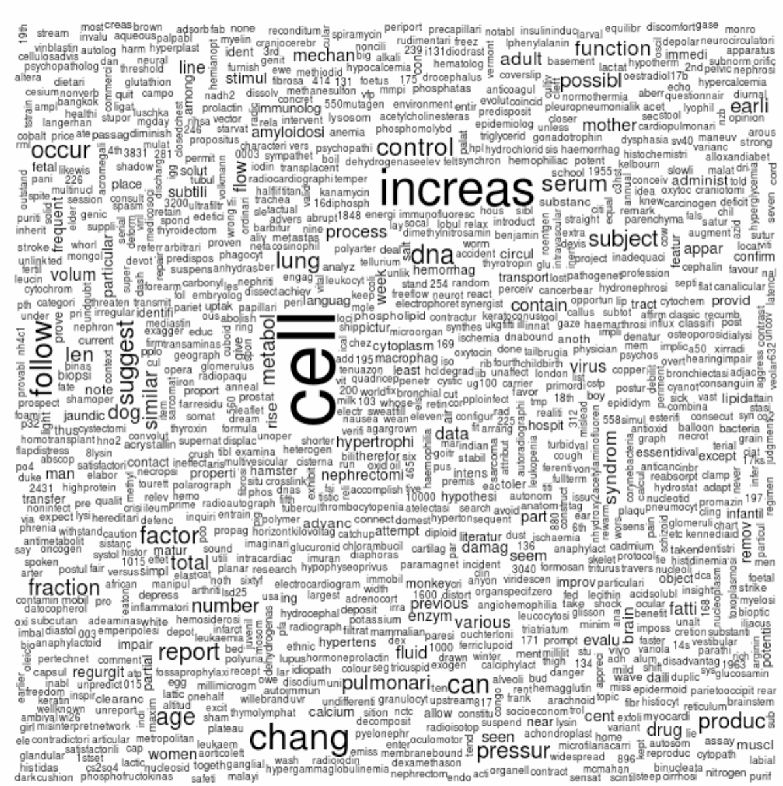

## Data Mining Assignment 6
### Author G. Gordon
### Lecturer  Dr. Pawan Lingras
March 6, 2016

## Data Preparation

An archive available at (http://dev.cs.smu.ca/~pawan/5580/notes/week08/textMining/med/med.all.Z) was unzipped to retrieve a file named 'med.all'

The following Java code was used to split the aforementioned file into separate files .

```

import java.util.regex.Pattern;
import java.io.*;

/**
 * @author ggordon
 * @created 6.3.2016
 */
public class FileSeparator {

	private final static String DIR = "medCollection";

	/**
	 * @param args
	 */
	public static void main(String[] args) {
		System.out.println("Received : " + args.length + " args");
		if (args.length == 0) {
             //use default file
			args = new String[]{"dm06/med.all"};
		}
		for (String arg : args) {
			System.out.println("Parsing File : " + arg);
			parseFile(arg);
		}
        System.out.println("Parsing Complete");
	}

	private static void parseFile(String fileName) {
		Pattern newStoryPattern = Pattern.compile("\\.I [0-9]+");
		try {
			verifyDirectoryExists();
			File f = new File(fileName);

			BufferedReader br = new BufferedReader(new FileReader(f));

			String line = null, story = "", filename = null;
			FileWriter tempStoryFile = null;

			while ((line = br.readLine()) != null) {

				// verify whether new file should start
				if (newStoryPattern.matcher(line).find()) {
					saveStory(tempStoryFile,story,filename);
					// refresh buffers
					story = "";
					
					// get filename
					filename = DIR + File.separator + line.split(" ")[1] + ".txt";
					
					// create new file write
					tempStoryFile = new FileWriter(filename);

					// skip .I and .W line
					line = br.readLine();
					line = br.readLine();

				}
				story += line + "\n";
			}
			saveStory(tempStoryFile,story,filename);
			br.close();
		} catch (Exception e) {
			e.printStackTrace(System.err);
		}
	}
	
	private static void saveStory(FileWriter tempStoryFile,String story, String filename) throws IOException{
		if(tempStoryFile != null){
			tempStoryFile.write(story);
			System.out.println("Created "+filename);
		    tempStoryFile.close();
		}
	}

	private static boolean verifyDirectoryExists() {
		try {
			File dir = new File(DIR);
			if (dir.isDirectory())
				return true;
			return dir.mkdir();
		} catch (Exception e) {
			e.printStackTrace(System.err);
			return false;
		}
	}

}

```

## Data Analyis


```R
library(tm)
```

    Loading required package: NLP


```R
medCollection=Corpus(DirSource("medCollection"))
medCollection[["2.txt"]]
# inspect(medCollection)
```


    <<PlainTextDocument>>
    Metadata:  7
    Content:  chars: 1562


```R
medCollection=tm_map(medCollection,removePunctuation)
```


```R
medCollection=tm_map(medCollection,stripWhitespace)
```


```R
#medCollection=tm_map(medCollection,tolower)
```


```R
medCollection=tm_map(medCollection,removeWords,stopwords("english"))
```


```R
medCollection=tm_map(medCollection,stemDocument)
```


```R
#inspect(medCollection)
medCollection["2.txt"]
```


    <<VCorpus>>
    Metadata:  corpus specific: 0, document level (indexed): 0
    Content:  documents: 1


```R
dtmMedCollection = DocumentTermMatrix(medCollection)
```


```R
#inspect(dtmMedCollection[,30:35])
```


```R
head(findFreqTerms(dtmMedCollection,5),45)
```


<ol class=list-inline>
	<li>'100'</li>
	<li>'1000'</li>
	<li>'116'</li>
	<li>'120'</li>
	<li>'125'</li>
	<li>'131'</li>
	<li>'150'</li>
	<li>'1500'</li>
	<li>'168'</li>
	<li>'17hydroxycorticosteroid'</li>
	<li>'17ketosteroid'</li>
	<li>'17ohc'</li>
	<li>'17oxosteroid'</li>
	<li>'1959'</li>
	<li>'1960'</li>
	<li>'1961'</li>
	<li>'1962'</li>
	<li>'1963'</li>
	<li>'1964'</li>
	<li>'1st'</li>
	<li>'200'</li>
	<li>'250'</li>
	<li>'2nd'</li>
	<li>'300'</li>
	<li>'3rd'</li>
	<li>'4th'</li>
	<li>'500'</li>
	<li>'5fluorouracil'</li>
	<li>'5year'</li>
	<li>'600'</li>
	<li>'6mercaptopurin'</li>
	<li>'6phosphat'</li>
	<li>'99m'</li>
	<li>'abdomin'</li>
	<li>'aberr'</li>
	<li>'abil'</li>
	<li>'abl'</li>
	<li>'abnorm'</li>
	<li>'abolish'</li>
	<li>'abort'</li>
	<li>'absenc'</li>
	<li>'absent'</li>
	<li>'absolut'</li>
	<li>'absorb'</li>
	<li>'absorpt'</li>
</ol>


```R
findAssocs(dtmMedCollection,"data",0.9)
```


<strong>$data</strong> = <ol class=list-inline>
</ol>


```R
findAssocs(dtmMedCollection,"data",0.25)
```


<strong>$data</strong> = <dl class=dl-horizontal>
	<dt>miner</dt>
		<dd>0.3</dd>
	<dt>1770</dt>
		<dd>0.28</dd>
	<dt>alloc</dt>
		<dd>0.28</dd>
	<dt>appa</dt>
		<dd>0.28</dd>
	<dt>azotaem</dt>
		<dd>0.28</dd>
	<dt>bel</dt>
		<dd>0.28</dd>
	<dt>bloodureanitrogen</dt>
		<dd>0.28</dd>
	<dt>calcem</dt>
		<dd>0.28</dd>
	<dt>commit</dt>
		<dd>0.28</dd>
	<dt>curvilinear</dt>
		<dd>0.28</dd>
	<dt>cytokinet</dt>
		<dd>0.28</dd>
	<dt>fibrosa</dt>
		<dd>0.28</dd>
	<dt>finit</dt>
		<dd>0.28</dd>
	<dt>follicl</dt>
		<dd>0.28</dd>
	<dt>ger</dt>
		<dd>0.28</dd>
	<dt>h3dna</dt>
		<dd>0.28</dd>
	<dt>h3tdr</dt>
		<dd>0.28</dd>
	<dt>hypocalcem</dt>
		<dd>0.28</dd>
	<dt>indica</dt>
		<dd>0.28</dd>
	<dt>liabil</dt>
		<dd>0.28</dd>
	<dt>minal</dt>
		<dd>0.28</dd>
	<dt>normocalcem</dt>
		<dd>0.28</dd>
	<dt>osteiti</dt>
		<dd>0.28</dd>
	<dt>plasmacalcium</dt>
		<dd>0.28</dd>
	<dt>progenitor</dt>
		<dd>0.28</dd>
	<dt>qualli</dt>
		<dd>0.28</dd>
	<dt>radioacti</dt>
		<dd>0.28</dd>
	<dt>rentli</dt>
		<dd>0.28</dd>
	<dt>ricket</dt>
		<dd>0.28</dd>
	<dt>sacrif</dt>
		<dd>0.28</dd>
	<dt>sugino</dt>
		<dd>0.28</dd>
	<dt>thi</dt>
		<dd>0.28</dd>
	<dt>thymocyt</dt>
		<dd>0.28</dd>
	<dt>thymustyp</dt>
		<dd>0.28</dd>
	<dt>vertheless</dt>
		<dd>0.28</dd>
	<dt>statist</dt>
		<dd>0.25</dd>
</dl>


```R
library(wordcloud)
```

    Loading required package: RColorBrewer


```R
m=as.matrix(dtmMedCollection)
```


```R
v=sort(colSums(m),decreasing=TRUE)
```


```R
myNames = names(v)
```


```R
d=data.frame(word=myNames,freq=v)
```


```R
wordcloud(d$word,d$freq,min.freq=2)
```



## Conclusion

Since the support included (0.85) yielded no results, a smaller support bound was used. This implies that the relative occurence of a word in relation to another word was much smaller. The image included above illustrates and highlights the most likely occuring words. 

A random assumption utiliing the likelihood occurence may imply that the documents parsed described biological experiments which aimed to identify how cells interacted with other agents.
