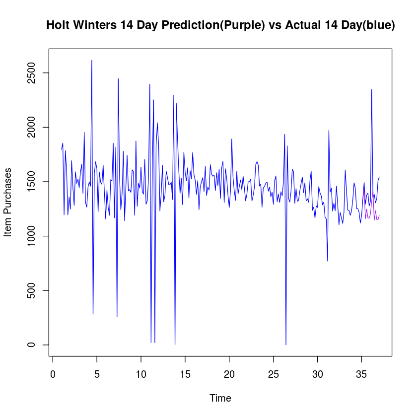

## Data Mining Assignment 4
### Author G. Gordon
February 15, 2016

Part 1 - Product 11740941

## Data Preparation

The Top 6 products were identified based on quantities sold using the following SQL query:

```
SELECT `ITEM_SK`, SUM(`ITEM_QTY`) as quantity_sold
FROM `sales`
GROUP BY `ITEM_SK`
ORDER BY quantity_sold DESC
LIMIT 0,7
```

The 1st, 3rd and 5th products were then chosen : 
1,11740941
3,11741274
5,11743201

Daily Product Sales were then attained for each product and exported to a csv file (no headers) 
    using the following query (in this case, product with ITEM SK '11740941' was exported):
```
SELECT SUM(`ITEM_QTY`) as quantity_sold  FROM `sales` 
where `ITEM_SK`= '11740941'
GROUP BY `date`
order by `date` asc    
```
    
Files were then saved to a directory using the following pattern `product-{ITEM_SK}-daily-quantities.csv`

Finally, the files to be used in the data analysis were prepared using the following python code (python 2.7) to
create files following the following pattern `product-{ITEM_SK}-7-day-forecast-data.csv`:
```
""" Last N Days Time Series Generator  """

# @author ggordon                 
# @created 11.2.2015                 
# @description 
#     Creates last N days data file

import os
import re

NO_OF_DAYS = 7
ItemSKPattern = re.compile('[0-9]{8}')
filePattern=re.compile('product-[0-9]{8}-daily-quantities.csv',re.I)
outputFileName = 'product-%s-%d-day-forecast-data.csv'

def main():
    # Get files in current directory that match pattern
    dataFiles = [ f for f in os.listdir('.') if os.path.isfile(f) and filePattern.match(f) ]

    for filename in dataFiles:
        with open(filename,'r') as file_reader:
            fileContents = file_reader.read()
        records = fileContents.split('\n')
        noOfRecords = len(records)
        print filename,'-',noOfRecords,'records'
        newFileContents = ''
        for i in range(NO_OF_DAYS+1,noOfRecords):
            newFileContents+= ','.join(records[(i-NO_OF_DAYS-1):i])+'\n'

        newFileName = outputFileName % (ItemSKPattern.search(filename).group(0),NO_OF_DAYS)
        print newFileName
        newFile = open(newFileName,'w')
        newFile.write(newFileContents)
        newFile.close()
        print "Saved %d Day Forecast to %s | %d lines" % (NO_OF_DAYS,newFileName,noOfRecords- NO_OF_DAYS+1)

if __name__ == '__main__':
	main()
```

## DATA ANALYSIS


```R
dir()
```


<ol class=list-inline>
	<li>'Assignment 4-11740941-Copy2.ipynb'</li>
	<li>'Assignment 4-11740941.ipynb'</li>
	<li>'Assignment 4-11740941-wip2.ipynb'</li>
	<li>'Assignment 4-11741274.ipynb'</li>
	<li>'Assignment 4-11741274-wip2.ipynb'</li>
	<li>'Assignment 4-11741274-wip2.zip'</li>
	<li>'Assignment 4-11743201.ipynb'</li>
	<li>'Assignment 4-11743201-wip2.ipynb'</li>
	<li>'Assignment 4-11743201-wip2.zip'</li>
	<li>'Assignment 4.ipynb'</li>
	<li>'last_n_days_time_series.py'</li>
	<li>'product-11740941-7-day-forecast-data.csv'</li>
	<li>'product-11740941-daily-quantities.csv'</li>
	<li>'product-11740941.zip'</li>
	<li>'product-11741274-7-day-forecast-data.csv'</li>
	<li>'product-11741274-daily-quantities.csv'</li>
	<li>'product-11741274.zip'</li>
	<li>'product-11743201-7-day-forecast-data.csv'</li>
	<li>'product-11743201-daily-quantities.csv'</li>
	<li>'product-11743201.zip'</li>
	<li>'timeseriesHistory.r'</li>
	<li>'top product queries'</li>
</ol>


```R
# Import the data for prod 11740941
prod1.data = read.csv('product-11740941-7-day-forecast-data.csv',header=F)
head(prod1.data)
```


<table>
<thead><tr><th></th><th scope=col>V1</th><th scope=col>V2</th><th scope=col>V3</th><th scope=col>V4</th><th scope=col>V5</th><th scope=col>V6</th><th scope=col>V7</th><th scope=col>V8</th></tr></thead>
<tbody>
	<tr><th scope=row>1</th><td>1796</td><td>1855</td><td>1196</td><td>1786</td><td>1607</td><td>1195</td><td>1358</td><td>1248</td></tr>
	<tr><th scope=row>2</th><td>1855</td><td>1196</td><td>1786</td><td>1607</td><td>1195</td><td>1358</td><td>1248</td><td>1693</td></tr>
	<tr><th scope=row>3</th><td>1196</td><td>1786</td><td>1607</td><td>1195</td><td>1358</td><td>1248</td><td>1693</td><td>1445</td></tr>
	<tr><th scope=row>4</th><td>1786</td><td>1607</td><td>1195</td><td>1358</td><td>1248</td><td>1693</td><td>1445</td><td>1282</td></tr>
	<tr><th scope=row>5</th><td>1607</td><td>1195</td><td>1358</td><td>1248</td><td>1693</td><td>1445</td><td>1282</td><td>1591</td></tr>
	<tr><th scope=row>6</th><td>1195</td><td>1358</td><td>1248</td><td>1693</td><td>1445</td><td>1282</td><td>1591</td><td>1485</td></tr>
</tbody>
</table>


```R
plot(prod1.data)
```


```R
prod1.days = 1:nrow(prod1.data)
```


```R
prod1.ts7 = ts(prod1.data,start = 1,freq=7)
prod1.ts30 = ts(prod1.data,start = 1,freq=30)
plot(stl(prod1.ts7[,8],s.window='periodic'),main="7 Day Outlook")
plot(stl(prod1.ts30[,8],s.window='periodic'),main="30 Day Outlook")
plot(stl(log(prod1.ts7[,8]),s.window='periodic'),main="Log 7 Day Outlook")
plot(stl(log(prod1.ts30[,8]),s.window='periodic'),main="Log 30 Day Outlook")
```


```R
# Split data into 80/20 Train/Test
set.seed(23)
no_of_observations = nrow(prod1.data)
percent_split = 0.8
sampler = sample(1:no_of_observations,size = as.integer(percent_split * no_of_observations))
#Normalize Columns Using Max
prod1.data.normalized = prod1.data
for(i in 1:ncol(prod1.data)){
    prod1.data.normalized[,i] = prod1.data[,i] /max(prod1.data[,i]) 
}

prod1.data.train = prod1.data.normalized[sampler,]

prod1.data.test = prod1.data.normalized[-sampler,]

paste("Train Size: ",nrow(prod1.data.train),"| Test size: ", nrow(prod1.data.test)," | Total:",no_of_observations)

```


'Train Size:  196 | Test size:  50  | Total: 246'


### Regression Model


```R
prod1.lm.fit = lm(V8 ~ .,data = prod1.data.train)
summary(prod1.lm.fit)
par(mfrow=c(2,2))
plot(prod1.lm.fit)
```


    
    Call:
    lm(formula = V8 ~ ., data = prod1.data.train)
    
    Residuals:
         Min       1Q   Median       3Q      Max 
    -0.43727 -0.04548  0.00129  0.04690  0.43702 
    
    Coefficients:
                Estimate Std. Error t value Pr(>|t|)    
    (Intercept)  0.52577    0.14436   3.642 0.000349 ***
    V1           0.19154    0.07482   2.560 0.011252 *  
    V2           0.18085    0.08367   2.161 0.031929 *  
    V3           0.10122    0.08672   1.167 0.244630    
    V4           0.13334    0.08058   1.655 0.099624 .  
    V5           0.06897    0.08488   0.813 0.417473    
    V6          -0.16060    0.08280  -1.940 0.053922 .  
    V7          -0.46855    0.07086  -6.612 3.82e-10 ***
    ---
    Signif. codes:  0 ‘***’ 0.001 ‘**’ 0.01 ‘*’ 0.05 ‘.’ 0.1 ‘ ’ 1
    
    Residual standard error: 0.1182 on 188 degrees of freedom
    Multiple R-squared:  0.2272,	Adjusted R-squared:  0.1984 
    F-statistic: 7.896 on 7 and 188 DF,  p-value: 2.187e-08


```R
# Predict on test data set using regression model
prod1.lm.pred = predict(prod1.lm.fit,prod1.data.test[,1:7])
# Determine the mean absolute percentage error
prod1.lm.error=mean(100*abs(prod1.data.test[,8] - prod1.lm.pred)/ prod1.data.test[,8])
paste('Mean Absolute % Error for Regression Model : ',prod1.lm.error,'%')
```


'Mean Absolute % Error for Regression Model :  9.956243131356 %'


### SVM Model


```R
library(e1071) # Load svm from library
```


```R
#Build SVM Model
prod1.svm.fit = svm(prod1.data.train[,1:7],prod1.data.train[,8])
plot(prod1.svm.fit,prod1.data.train[,1:7],"V1 ~ V2")
# Predict using test data
prod1.svm.pred = predict(prod1.svm.fit,prod1.data.test[,1:7])
# Determine the mean absolute percentage error
prod1.svm.error=mean(100*abs(prod1.data.test[,8] - prod1.svm.pred)/prod1.data.test[,8])
paste('Mean Absolute % Error for SVM : ',prod1.svm.error,'%')
```


'Mean Absolute % Error for SVM :  7.56867296680058 %'


### Neural Network


```R
# Load Libraries
library(neuralnet) 
library(RSNNS)
library('devtools')
source_url('https://gist.githubusercontent.com/gggordon/809278dab6d7c6692f8b/raw/36cd22fa4dd7c719cecc6d30e006cdc07e2c0109/plot.nnet.r')
```

    Loading required package: grid
    Loading required package: MASS
    Loading required package: Rcpp
    SHA-1 hash of file is 74c80bd5ddbc17ab3ae5ece9c0ed9beb612e87ef


```R
prod1.nn.1.fit = neuralnet(V8~V1+V2+V3+V4+V5+V6+V7,
                           data=prod1.data.train,
                           hidden=1,
                           learningrate=0.01,
                           #threshold=0.001,
                           #lifesign="full",
                           algorithm="backprop")
prod1.nn.1.pred = compute(prod1.nn.1.fit,prod1.data.test[,1:7])$net.result
prod1.nn.1.error=mean(100*abs(prod1.data.test[,8] - prod1.nn.1.pred)/prod1.data.test[,8])
paste('Mean Absolute % Error for Neural Network (1 hidden) : ',prod1.nn.1.error,'%')
#set.seed(23)
#plot.nnet(prod1.nn.4.fit,"Neural Network (4 Hidden)")
```


'Mean Absolute % Error for Neural Network (1 hidden) :  9.12686369480545 %'


```R
prod1.nn.10.fit = neuralnet(V8~V1+V2+V3+V4+V5+V6+V7,
                           data=prod1.data.train,
                           hidden=10,
                           learningrate=0.001,
                           #threshold=0.001,
                           #lifesign="full",
                           algorithm="backprop")
prod1.nn.10.pred = compute(prod1.nn.10.fit,prod1.data.test[,1:7])$net.result
prod1.nn.10.error=mean(100*abs(prod1.data.test[,8] - prod1.nn.10.pred)/prod1.data.test[,8])
paste('Mean Absolute % Error for Neural Network (10 hidden) : ',prod1.nn.10.error,'%')
```


'Mean Absolute % Error for Neural Network (10 hidden) :  10.8926000365346 %'


### Time Series Evaluation

#### More Data Preparation


```R
# Retrieve the original time series data but concatenating the first row values with the last column values
prod1.data.raw=c(as.vector(t(prod1.data[1,1:7])[,1]),prod1.data[,8])
```


```R
# Create time series from start of year for 7 day periods
prod1.data.rawts=ts(prod1.data.raw,start=1,freq=7)

plot(stl(prod1.data.rawts,s.window="periodic"),main="Time Series 7 Day")
prod1.data.rawts

prod1.data.rawts.log=log(prod1.data.rawts)
plot(stl(prod1.data.rawts.log,s.window="periodic"),main="Time Series Log 7 Day")
prod1.data.rawts.log


```


    Time Series:
    Start = c(1, 1) 
    End = c(37, 1) 
    Frequency = 7 
      [1] 1796 1855 1196 1786 1607 1195 1358 1248 1693 1445 1282 1591 1485 1522 1445
     [16] 1592 1659 1393 1953 1309 1267 1451 1498 1459 2616  283 1577 1683 1623 1224
     [31] 1587 1495 1476 1652 1394 1157 1421 1261 1192 1519 1507 1853 1168 1818  257
     [46] 2447 1538 1241 1389 1779 1142 1449 1743 1415 1428 1402 1609 1596 1192 1874
     [61] 1273 1485 1442 1634 1410 1386 1703 1293 1324 1539 2395   21 1685 2252   21
     [76] 1831 2041 1836 1231 1380 1652 1316 1372 1596 1538 1473 1472 1496 1337 2296
     [91]    3 2223 1886 1595 1393 1531 1289 1770 1589 1508 1628 1351 1600 1525 1768
    [106] 1565 1515 1384 1509 1243 1453 1499 1537 1410 1640 1374 1450 1423 1657 1569
    [121] 1550 1561 1418 1582 1464 1616 1345 1627 1686 1309 1618 1529 1376 1263 1416
    [136] 1892 1543 1412 1329 1597 1387 1457 1515 1424 1553 1441 1324 1386 1499 1499
    [151] 1523 1322 1376 1452 1656 1684 1653 1460 1477 1266 1443 1457 1487 1496 1413
    [166] 1450 1362 1403 1293 1508 1553 1315 1385 1310 1408 1370 1501 1935    1 1829
    [181] 1350 1313 1410 1614 1594 1302 1437 1320 1329 1417 1484 1543 1399 1490 1324
    [196] 1343 1311 1508 1597 1237 1266 1167 1277 1264 1455 1397 1370 1287 1312 1173
    [211] 1157  771 1971 1405 1442 1229 1302 1233 1459 1293 1104 1217 1167 1116 1219
    [226] 1608 1413 1239 1237 1191 1231 1334 1490 1440 1254 1252 1218 1120 1189 1348
    [241] 1493 1295 1376 1395 1275 1322 2347 1357 1384 1306 1344 1509 1544


    Time Series:
    Start = c(1, 1) 
    End = c(37, 1) 
    Frequency = 7 
      [1] 7.493317249 7.525639975 7.086737935 7.487733761 7.382124366 7.085901464
      [7] 7.213768308 7.129297549 7.434257382 7.275864601 7.156176637 7.372118028
     [13] 7.303170051 7.327780538 7.275864601 7.372746366 7.413970290 7.239214974
     [19] 7.577121931 7.177018766 7.144407180 7.280008253 7.311886164 7.285506549
     [25] 7.869401713 5.645446898 7.363279587 7.428333194 7.392031568 7.109879463
     [31] 7.369600721 7.309881486 7.297091005 7.409741954 7.239932591 7.053585727
     [37] 7.259116128 7.139660336 7.083387848 7.325807503 7.317876199 7.524561226
     [43] 7.063048163 7.505492275 5.549076085 7.802618063 7.338238150 7.123672785
     [49] 7.236339343 7.483806688 7.040536390 7.278628942 7.463363046 7.254884810
     [55] 7.264030143 7.245655068 7.383368147 7.375255778 7.083387848 7.535830463
     [61] 7.149131599 7.303170051 7.273786318 7.398786275 7.251344983 7.234177180
     [67] 7.440146681 7.164720379 7.188412736 7.338888134 7.781138510 3.044522438
     [73] 7.429520843 7.719573989 3.044522438 7.512617545 7.621195163 7.515344571
     [79] 7.115582126 7.229838778 7.409741954 7.182352112 7.224024808 7.375255778
     [85] 7.338238150 7.295056416 7.294377299 7.310550159 7.198183577 7.738923757
     [91] 1.098612289 7.706612914 7.542213463 7.374629015 7.239214974 7.333676396
     [97] 7.161622003 7.478734826 7.370860167 7.318539549 7.395107547 7.208600338
    [103] 7.377758908 7.329749689 7.477604243 7.355641103 7.323170718 7.232733136
    [109] 7.319202459 7.125283092 7.281385664 7.312553498 7.337587744 7.251344983
    [115] 7.402451521 7.225481473 7.279318835 7.260522598 7.412764017 7.358193753
    [121] 7.346010210 7.353081921 7.257002707 7.366445148 7.288927695 7.387709239
    [127] 7.204149292 7.394493107 7.430114139 7.177018766 7.388946098 7.332369206
    [133] 7.226936018 7.141245122 7.255591274 7.545389750 7.341483852 7.252762418
    [139] 7.192182059 7.375882148 7.234898420 7.284134806 7.323170718 7.261225092
    [145] 7.347943823 7.273092596 7.188412736 7.234177180 7.312553498 7.312553498
    [151] 7.328437353 7.186901020 7.226936018 7.280697195 7.412160335 7.428927195
    [157] 7.410347098 7.286191715 7.297768283 7.143617603 7.274479559 7.284134806
    [163] 7.304515946 7.310550159 7.253470383 7.279318835 7.216709487 7.246368080
    [169] 7.164720379 7.318539549 7.347943823 7.181591945 7.233455419 7.177782416
    [175] 7.249925537 7.222566019 7.313886832 7.567862605 0.000000000 7.511524648
    [181] 7.207859871 7.180069874 7.251344983 7.386470849 7.374001859 7.171656823
    [187] 7.270312886 7.185387016 7.192182059 7.256297240 7.302496424 7.341483852
    [193] 7.243512975 7.306531399 7.188412736 7.202661197 7.178545484 7.318539549
    [199] 7.375882148 7.120444372 7.143617603 7.062191632 7.152268856 7.142036575
    [205] 7.282761180 7.242082359 7.222566019 7.160069208 7.179307970 7.067319849
    [211] 7.053585727 6.647688374 7.586296307 7.247792582 7.273786318 7.113956110
    [217] 7.171656823 7.117205503 7.285506549 7.164720379 7.006695227 7.104144093
    [223] 7.062191632 7.017506143 7.105786129 7.382746450 7.253470383 7.122059882
    [229] 7.120444372 7.082548569 7.115582126 7.195937226 7.306531399 7.272398393
    [235] 7.134093721 7.132497552 7.104965448 7.021083964 7.080867897 7.206377291
    [241] 7.308542798 7.166265974 7.226936018 7.240649694 7.150701458 7.186901020
    [247] 7.760893196 7.213031660 7.232733136 7.174724310 7.203405521 7.319202459
    [253] 7.342131731


```R
# Split time series data in test data (last 2 weeks/last 14 days) and train data to evaluate models
prod1.data.rawts.size = length(prod1.data.rawts)
prod1.data.rawts.trainBoundIndex = prod1.data.rawts.size-14
paste("Training Bound Index : ",prod1.data.rawts.trainBoundIndex)
prod1.data.rawts.train = ts(prod1.data.rawts[1:prod1.data.rawts.trainBoundIndex],start=1,freq=7)
                            
prod1.data.rawts.test = ts(prod1.data.rawts[(prod1.data.rawts.trainBoundIndex+1):prod1.data.rawts.size],
                           start=prod1.data.rawts.trainBoundIndex+1,freq=7)

paste("Train Size: ",length(prod1.data.rawts.train),
      "| Test size: ", length(prod1.data.rawts.test),
      " | Total:",prod1.data.rawts.size)

```


'Training Bound Index :  239'


'Train Size:  239 | Test size:  14  | Total: 253'


### Holt Winters


```R
prod1.hw=HoltWinters(prod1.data.rawts.train)
prod1.hw
```


    Holt-Winters exponential smoothing with trend and additive seasonal component.
    
    Call:
    HoltWinters(x = prod1.data.rawts.train)
    
    Smoothing parameters:
     alpha: 0.004669677597
     beta : 1
     gamma: 0.1569846965
    
    Coefficients:
                  [,1]
    a  1214.7957691623
    b    -1.9378029018
    s1  125.3338576902
    s2  221.1990803541
    s3  -50.1813736446
    s4   40.1358787030
    s5  -38.6738192266
    s6  -37.8285911941
    s7    0.7352602356


```R
prod1.hw.rms=sqrt(sum((prod1.data.rawts.train-prod1.hw$fit[,1])^2)/length(prod1.data.rawts.train))
paste('Root Mean Square Error: ',prod1.hw.rms)
```


'Root Mean Square Error:  320.793250049083'


```R
plot(prod1.data.rawts,col="blue",
     main="Holt Winters 14 Day Prediction(Purple) vs Actual 14 Day(blue)",
     ylab="Item Purchases")
prod1.hw.pred = predict(prod1.hw,n.ahead=14)
lines(prod1.hw.pred,col=c('purple'))
testv = as.vector(prod1.data.rawts.test)
predv = as.vector(prod1.hw.pred[,1])
prod1.hw.error=mean(100*abs(testv - predv)/testv)
paste('Mean Absolute % Error for Holt Winters : ',prod1.hw.error,'%')
```


'Mean Absolute % Error for Holt Winters :  13.6118414544339 %'





### Arima


```R
library(forecast)
```

    Loading required package: zoo
    
    Attaching package: ‘zoo’
    
    The following objects are masked from ‘package:base’:
    
        as.Date, as.Date.numeric
    
    Loading required package: timeDate
    
    Attaching package: ‘timeDate’
    
    The following objects are masked from ‘package:e1071’:
    
        kurtosis, skewness
    
    This is forecast 6.2 
    


```R
# Use AIC as model evaluation test to test ARIMA models and choose best
# Initally Assumed (7,0,0)
prod1.arima.fit=auto.arima(prod1.data.rawts.train, ic = "aic")
prod1.arima.fit
```


    Series: prod1.data.rawts.train 
    ARIMA(2,1,1)(0,0,1)[7] with drift         
    
    Coefficients:
                 ar1         ar2         ma1       sma1       drift
          -0.5744361  -0.3080498  -0.9556942  0.1318590  -0.9488718
    s.e.   0.0634047   0.0629455   0.0171994  0.0654865   0.5201690
    
    sigma^2 estimated as 73670.95:  log likelihood=-1673.39
    AIC=3358.77   AICc=3359.13   BIC=3379.6


```R
plot(prod1.data.rawts,col="blue",
     main="Arima(2,1,1) 14 Day Prediction(red) vs Actual 14 Day(blue)",
     sub="Arima (2,1,1) (0,1,1)[7]",
     ylab="Item Purchases")
prod1.arima.pred= predict(prod1.arima,n.ahead=14)$pred
prod1.arima.pred
lines(prod1.arima.pred,col=c('red'))
testv = as.vector(prod1.data.rawts.test)

predv = as.vector(prod1.arima.pred)
prod1.arima.error=mean(100*abs(testv - predv)/testv)
paste('Mean Absolute % Error for Arima(2,1,1) : ',prod1.arima.error,'%')
```


    Time Series:
    Start = c(35, 2) 
    End = c(37, 1) 
    Frequency = 7 
     [1] 1537.044617 1312.284100 1310.928019 1376.349901 1361.500389 1350.379624
     [7] 1419.164409 1427.774179 1371.430684 1410.890839 1422.948499 1409.064569
    [13] 1419.851986 1434.420553


'Mean Absolute % Error for Arima(2,1,1) :  8.00143654701691 %'


```R
prod1.arima=arima(prod1.data.rawts.train,order=c(7,0,0))
prod1.arima


plot(prod1.data.rawts,col="blue",
     main="Arima(7,0,0) 14 Day Prediction(red) vs Actual 14 Day(blue)",
     ylab="Item Purchases")
prod1.arima.pred= predict(prod1.arima,n.ahead=14)$pred
prod1.arima.pred
lines(prod1.arima.pred,col=c('red'))
testv = as.vector(prod1.data.rawts.test)

predv = as.vector(prod1.arima.pred)
prod1.arima.error=mean(100*abs(testv - predv)/testv)
paste('Mean Absolute % Error for Arima(7,0,0) : ',prod1.arima.error,'%')
```


    
    Call:
    arima(x = prod1.data.rawts.train, order = c(7, 0, 0))
    
    Coefficients:
                 ar1         ar2        ar3        ar4        ar5        ar6
          -0.4435485  -0.1481495  0.1063168  0.1599641  0.1009174  0.1831410
    s.e.   0.0637669   0.0696176  0.0702508  0.0702955  0.0709380  0.0702508
                ar7     intercept
          0.2007931  1440.8478516
    s.e.  0.0641115    21.3307091
    
    sigma^2 estimated as 79246.93:  log likelihood = -1687.46,  aic = 3392.93


    Time Series:
    Start = c(35, 2) 
    End = c(37, 1) 
    Frequency = 7 
     [1] 1537.044617 1312.284100 1310.928019 1376.349901 1361.500389 1350.379624
     [7] 1419.164409 1427.774179 1371.430684 1410.890839 1422.948499 1409.064569
    [13] 1419.851986 1434.420553


'Mean Absolute % Error for Arima(7,0,0) :  8.00143654701691 %'


```R

```
