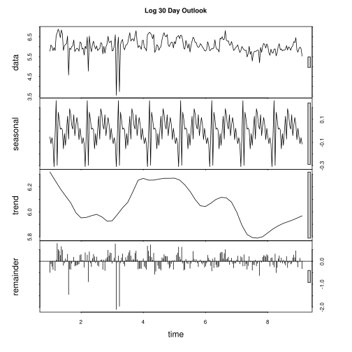
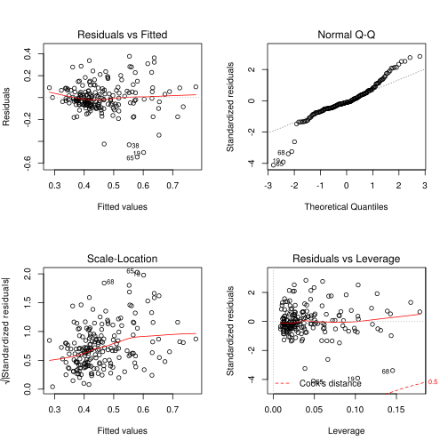
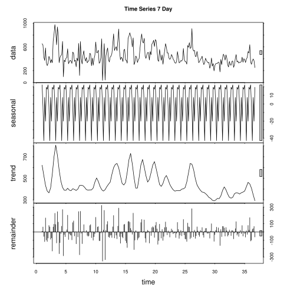
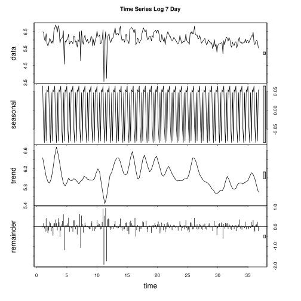
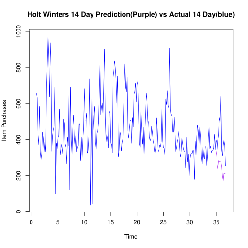
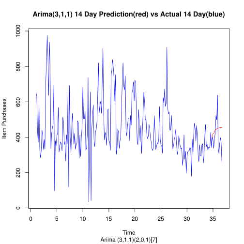
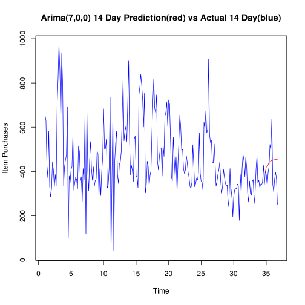

## Data Mining Assignment 4
### Author G. Gordon
February 15, 2016

Part 3 - Product 11741274

## DATA ANALYSIS


```R
dir()
```


<ol class=list-inline>
	<li>'Assignment 4-11740941-Copy2.ipynb'</li>
	<li>'Assignment 4-11740941.ipynb'</li>
	<li>'Assignment 4-11741274.ipynb'</li>
	<li>'Assignment 4-11741274-wip2.ipynb'</li>
	<li>'Assignment 4-11743201.ipynb'</li>
	<li>'Assignment 4-11743201-wip2.ipynb'</li>
	<li>'Assignment 4.ipynb'</li>
	<li>'last_n_days_time_series.py'</li>
	<li>'product-11740941-7-day-forecast-data.csv'</li>
	<li>'product-11740941-daily-quantities.csv'</li>
	<li>'product-11740941.zip'</li>
	<li>'product-11741274-7-day-forecast-data.csv'</li>
	<li>'product-11741274-daily-quantities.csv'</li>
	<li>'product-11741274.zip'</li>
	<li>'product-11743201-7-day-forecast-data.csv'</li>
	<li>'product-11743201-daily-quantities.csv'</li>
	<li>'product-11743201.zip'</li>
	<li>'timeseriesHistory.r'</li>
	<li>'top product queries'</li>
</ol>


```R
# Import the data for prod 11740941
prod1.data = read.csv('product-11741274-7-day-forecast-data.csv',header=F)
head(prod1.data)
```


<table>
<thead><tr><th></th><th scope=col>V1</th><th scope=col>V2</th><th scope=col>V3</th><th scope=col>V4</th><th scope=col>V5</th><th scope=col>V6</th><th scope=col>V7</th><th scope=col>V8</th></tr></thead>
<tbody>
	<tr><th scope=row>1</th><td>654</td><td>631</td><td>430</td><td>372</td><td>583</td><td>331</td><td>285</td><td>323</td></tr>
	<tr><th scope=row>2</th><td>631</td><td>430</td><td>372</td><td>583</td><td>331</td><td>285</td><td>323</td><td>441</td></tr>
	<tr><th scope=row>3</th><td>430</td><td>372</td><td>583</td><td>331</td><td>285</td><td>323</td><td>441</td><td>407</td></tr>
	<tr><th scope=row>4</th><td>372</td><td>583</td><td>331</td><td>285</td><td>323</td><td>441</td><td>407</td><td>331</td></tr>
	<tr><th scope=row>5</th><td>583</td><td>331</td><td>285</td><td>323</td><td>441</td><td>407</td><td>331</td><td>386</td></tr>
	<tr><th scope=row>6</th><td>331</td><td>285</td><td>323</td><td>441</td><td>407</td><td>331</td><td>386</td><td>333</td></tr>
</tbody>
</table>


```R
plot(prod1.data)
```


```R
prod1.days = 1:nrow(prod1.data)
```


```R
prod1.ts7 = ts(prod1.data,start = 1,freq=7)
prod1.ts30 = ts(prod1.data,start = 1,freq=30)
plot(stl(prod1.ts7[,8],s.window='periodic'),main="7 Day Outlook")
plot(stl(prod1.ts30[,8],s.window='periodic'),main="30 Day Outlook")
plot(stl(log(prod1.ts7[,8]),s.window='periodic'),main="Log 7 Day Outlook")
plot(stl(log(prod1.ts30[,8]),s.window='periodic'),main="Log 30 Day Outlook")
```





```R
# Split data into 80/20 Train/Test
set.seed(23)
no_of_observations = nrow(prod1.data)
percent_split = 0.8
sampler = sample(1:no_of_observations,size = as.integer(percent_split * no_of_observations))
#Normalize Columns Using Max
prod1.data.normalized = prod1.data
for(i in 1:ncol(prod1.data)){
    prod1.data.normalized[,i] = prod1.data[,i] /max(prod1.data[,i]) 
}

prod1.data.train = prod1.data.normalized[sampler,]

prod1.data.test = prod1.data.normalized[-sampler,]

paste("Train Size: ",nrow(prod1.data.train),"| Test size: ", nrow(prod1.data.test)," | Total:",no_of_observations)

```


'Train Size:  195 | Test size:  49  | Total: 244'


### Regression Model


```R
prod1.lm.fit = lm(V8 ~ .,data = prod1.data.train)
summary(prod1.lm.fit)
par(mfrow=c(2,2))
plot(prod1.lm.fit)
```


    
    Call:
    lm(formula = V8 ~ ., data = prod1.data.train)
    
    Residuals:
         Min       1Q   Median       3Q      Max 
    -0.54373 -0.06393 -0.01406  0.05853  0.37693 
    
    Coefficients:
                 Estimate Std. Error t value Pr(>|t|)    
    (Intercept)  0.131850   0.046607   2.829  0.00518 ** 
    V1           0.044100   0.069895   0.631  0.52885    
    V2           0.007119   0.073050   0.097  0.92247    
    V3          -0.013466   0.078468  -0.172  0.86393    
    V4          -0.034778   0.080680  -0.431  0.66692    
    V5           0.149115   0.076513   1.949  0.05281 .  
    V6           0.079081   0.078170   1.012  0.31301    
    V7           0.469841   0.073819   6.365 1.47e-09 ***
    ---
    Signif. codes:  0 ‘***’ 0.001 ‘**’ 0.01 ‘*’ 0.05 ‘.’ 0.1 ‘ ’ 1
    
    Residual standard error: 0.1355 on 187 degrees of freedom
    Multiple R-squared:  0.3222,	Adjusted R-squared:  0.2968 
    F-statistic:  12.7 on 7 and 187 DF,  p-value: 2.689e-13





```R
# Predict on test data set using regression model
prod1.lm.pred = predict(prod1.lm.fit,prod1.data.test[,1:7])
# Determine the mean absolute percentage error
prod1.lm.error=mean(100*abs(prod1.data.test[,8] - prod1.lm.pred)/ prod1.data.test[,8])
paste('Mean Absolute % Error for Regression Model : ',prod1.lm.error,'%')
```


'Mean Absolute % Error for Regression Model :  24.0456303269329 %'


### SVM Model


```R
library(e1071) # Load svm from library
```


```R
#Build SVM Model
prod1.svm.fit = svm(prod1.data.train[,1:7],prod1.data.train[,8])
plot(prod1.svm.fit,prod1.data.train[,1:7],"V1 ~ V2")
# Predict using test data
prod1.svm.pred = predict(prod1.svm.fit,prod1.data.test[,1:7])
# Determine the mean absolute percentage error
prod1.svm.error=mean(100*abs(prod1.data.test[,8] - prod1.svm.pred)/prod1.data.test[,8])
paste('Mean Absolute % Error for SVM : ',prod1.svm.error,'%')
```


'Mean Absolute % Error for SVM :  20.1429864360942 %'


### Neural Network


```R
# Load Libraries
library(neuralnet) 
library(RSNNS)
library('devtools')
source_url('https://gist.githubusercontent.com/gggordon/809278dab6d7c6692f8b/raw/36cd22fa4dd7c719cecc6d30e006cdc07e2c0109/plot.nnet.r')
```

    Loading required package: grid
    Loading required package: MASS
    Loading required package: Rcpp
    SHA-1 hash of file is 74c80bd5ddbc17ab3ae5ece9c0ed9beb612e87ef


```R
prod1.nn.1.fit = neuralnet(V8~V1+V2+V3+V4+V5+V6+V7,
                           data=prod1.data.train,
                           hidden=1,
                           learningrate=0.01,
                           #threshold=0.001,
                           #lifesign="full",
                           algorithm="backprop")
prod1.nn.1.pred = compute(prod1.nn.1.fit,prod1.data.test[,1:7])$net.result
prod1.nn.1.error=mean(100*abs(prod1.data.test[,8] - prod1.nn.1.pred)/prod1.data.test[,8])
paste('Mean Absolute % Error for Neural Network (1 hidden) : ',prod1.nn.1.error,'%')
#set.seed(23)
#plot.nnet(prod1.nn.4.fit,"Neural Network (4 Hidden)")
```


'Mean Absolute % Error for Neural Network (1 hidden) :  25.8549617524538 %'


```R
prod1.nn.10.fit = neuralnet(V8~V1+V2+V3+V4+V5+V6+V7,
                           data=prod1.data.train,
                           hidden=8,
                           learningrate=0.01,
                           #threshold=0.001,
                           #lifesign="full",
                           algorithm="backprop")
prod1.nn.10.pred = compute(prod1.nn.10.fit,prod1.data.test[,1:7])$net.result
prod1.nn.10.error=mean(100*abs(prod1.data.test[,8] - prod1.nn.10.pred)/prod1.data.test[,8])
paste('Mean Absolute % Error for Neural Network (8 hidden) : ',prod1.nn.10.error,'%')
```


'Mean Absolute % Error for Neural Network (8 hidden) :  25.8898773588716 %'


### Time Series Evaluation

#### More Data Preparation


```R
# Retrieve the original time series data but concatenating the first row values with the last column values
prod1.data.raw=c(as.vector(t(prod1.data[1,1:7])[,1]),prod1.data[,8])
```


```R
# Create time series from start of year for 7 day periods
prod1.data.rawts=ts(prod1.data.raw,start=1,freq=7)

plot(stl(prod1.data.rawts,s.window="periodic"),main="Time Series 7 Day")
prod1.data.rawts

prod1.data.rawts.log=log(prod1.data.rawts)
plot(stl(prod1.data.rawts.log,s.window="periodic"),main="Time Series Log 7 Day")
prod1.data.rawts.log


```


    Time Series:
    Start = c(1, 1) 
    End = c(36, 6) 
    Frequency = 7 
      [1] 654 631 430 372 583 331 285 323 441 407 331 386 333 699 817 976 855 636
     [19] 937 784 335 421 453 472 693  97 379 350 408 422 568 316 351 374 363 322
     [37] 513 491 357 376 265 413 364 660 118 691 400 313 455 535 411 360 421 332
     [55] 358 365 493 479 282 412 291 400 461 683 503 504 545 325 340 416 737  35
     [73] 363 656  42 448 530 583 385 346 433 444 490 648 820 539 582 603 536 708
     [91] 902 528 385 427 404 354 546 560 379 375 326 745 782 838 792 726 601 753
    [109] 303 340 446 425 337 382 404 573 717 819 687 667 746 447 407 464 506 506
    [127] 379 522 468 649 668 712 607 723 704 549 377 357 556 457 374 466 308 432
    [145] 537 655 600 496 500 413 391 406 472 442 394 372 332 325 351 521 434 331
    [163] 344 370 361 389 573 391 354 351 310 624 594 672 574 590 908 567 531 542
    [181] 440 440 524 436 334 354 388 407 444 357 302 333 409 375 348 333 340 241
    [199] 283 413 276 320 196 286 317 322 323 343 335 179 389 303 412 478 449 377
    [217] 466 414 301 262 357 300 292 356 363 255 302 410 471 347 362 328 342 339
    [235] 353 427 342 401 386 337 395 422 522 498 638 342 307 366 397 367 252





    Time Series:
    Start = c(1, 1) 
    End = c(36, 6) 
    Frequency = 7 
      [1] 6.483107351 6.447305863 6.063785209 5.918893854 6.368187186 5.802118375
      [7] 5.652489180 5.777652323 6.089044875 6.008813185 5.802118375 5.955837369
     [13] 5.808142490 6.549650742 6.705639095 6.883462586 6.751101469 6.455198563
     [19] 6.842683282 6.664409020 5.814130532 6.042632834 6.115892125 6.156978986
     [25] 6.541029999 4.574710979 5.937536205 5.857933154 6.011267174 6.045005314
     [31] 6.342121419 5.755742214 5.860786223 5.924255797 5.894402834 5.774551546
     [37] 6.240275845 6.196444128 5.877735782 5.929589143 5.579729826 6.023447593
     [43] 5.897153868 6.492239835 4.770684624 6.538139824 5.991464547 5.746203191
     [49] 6.120297419 6.282266747 6.018593214 5.886104031 6.042632834 5.805134969
     [55] 5.880532986 5.899897354 6.200509174 6.171700597 5.641907071 6.021023349
     [61] 5.673323267 5.991464547 6.133398043 6.526494860 6.220590170 6.222576268
     [67] 6.300785795 5.783825182 5.828945618 6.030685260 6.602587892 3.555348061
     [73] 5.894402834 6.486160789 3.737669618 6.104793232 6.272877007 6.368187186
     [79] 5.953243334 5.846438775 6.070737728 6.095824562 6.194405391 6.473890696
     [85] 6.709304340 6.289715571 6.366470448 6.401917197 6.284134161 6.562444094
     [91] 6.804614520 6.269096284 5.953243334 6.056784013 6.001414878 5.869296913
     [97] 6.302618976 6.327936784 5.937536205 5.926926026 5.786897381 6.613384218
    [103] 6.661854741 6.731018100 6.674561392 6.587550015 6.398594935 6.624065228
    [109] 5.713732806 5.828945618 6.100318952 6.052089169 5.820082930 5.945420609
    [115] 6.001414878 6.350885717 6.575075841 6.708084084 6.532334292 6.502790046
    [121] 6.614725600 6.102558595 6.008813185 6.139884552 6.226536669 6.226536669
    [127] 5.937536205 6.257667588 6.148468296 6.475432717 6.504288174 6.568077911
    [133] 6.408528791 6.583409222 6.556778356 6.308098442 5.932245187 5.877735782
    [139] 6.320768294 6.124683391 5.924255797 6.144185634 5.730099783 6.068425588
    [145] 6.285998095 6.484635236 6.396929655 6.206575927 6.214608098 6.023447593
    [151] 5.968707560 6.006353160 6.156978986 6.091309882 5.976350909 5.918893854
    [157] 5.805134969 5.783825182 5.860786223 6.255750042 6.073044534 5.802118375
    [163] 5.840641657 5.913503006 5.888877958 5.963579344 6.350885717 5.968707560
    [169] 5.869296913 5.860786223 5.736572297 6.436150368 6.386879319 6.510258341
    [175] 6.352629396 6.380122537 6.811244379 6.340359304 6.274762021 6.295266001
    [181] 6.086774727 6.086774727 6.261491684 6.077642243 5.811140993 5.869296913
    [187] 5.961005340 6.008813185 6.095824562 5.877735782 5.710427017 5.808142490
    [193] 6.013715156 5.926926026 5.852202480 5.808142490 5.828945618 5.484796933
    [199] 5.645446898 6.023447593 5.620400866 5.768320996 5.278114659 5.655991811
    [205] 5.758901774 5.774551546 5.777652323 5.837730447 5.814130532 5.187385806
    [211] 5.963579344 5.713732806 6.021023349 6.169610732 6.107022888 5.932245187
    [217] 6.144185634 6.025865974 5.707110265 5.568344504 5.877735782 5.703782475
    [223] 5.676753802 5.874930731 5.894402834 5.541263545 5.710427017 6.016157160
    [229] 6.154858094 5.849324780 5.891644212 5.793013608 5.834810737 5.826000107
    [235] 5.866468057 6.056784013 5.834810737 5.993961427 5.955837369 5.820082930
    [241] 5.978885765 6.045005314 6.257667588 6.210600077 6.458338283 5.834810737
    [247] 5.726847748 5.902633333 5.983936281 5.905361848 5.529429088





```R
# Split time series data in test data (last 2 weeks/last 14 days) and train data to evaluate models
prod1.data.rawts.size = length(prod1.data.rawts)
prod1.data.rawts.trainBoundIndex = prod1.data.rawts.size-14
paste("Training Bound Index : ",prod1.data.rawts.trainBoundIndex)
prod1.data.rawts.train = ts(prod1.data.rawts[1:prod1.data.rawts.trainBoundIndex],start=1,freq=7)
                            
prod1.data.rawts.test = ts(prod1.data.rawts[(prod1.data.rawts.trainBoundIndex+1):prod1.data.rawts.size],
                           start=prod1.data.rawts.trainBoundIndex+1,freq=7)

paste("Train Size: ",length(prod1.data.rawts.train),
      "| Test size: ", length(prod1.data.rawts.test),
      " | Total:",prod1.data.rawts.size)

```


'Training Bound Index :  237'


'Train Size:  237 | Test size:  14  | Total: 251'


### Holt Winters


```R
prod1.hw=HoltWinters(prod1.data.rawts.train,alpha=0.9,beta=0,gamma=0.9)
prod1.hw
```


    Holt-Winters exponential smoothing with trend and additive seasonal component.
    
    Call:
    HoltWinters(x = prod1.data.rawts.train, alpha = 0.9, beta = 0,     gamma = 0.9)
    
    Smoothing parameters:
     alpha: 0.9
     beta : 0
     gamma: 0.9
    
    Coefficients:
                [,1]
    a  293.395548981
    b   -9.576530612
    s1  57.511953152
    s2  41.373416356
    s3  -1.379706177
    s4 -17.045659023
    s5  35.644975032
    s6  39.690984742
    s7  49.531856122


```R
prod1.hw.rms=sqrt(sum((prod1.data.rawts.train-prod1.hw$fit[,1])^2))/length(prod1.data.rawts.train)
paste('Root Mean Square Error: ',prod1.hw.rms)
```


'Root Mean Square Error:  10.6079147341412'


```R
plot(prod1.data.rawts,col="blue",
     main="Holt Winters 14 Day Prediction(Purple) vs Actual 14 Day(blue)",
     ylab="Item Purchases")
prod1.hw.pred = predict(prod1.hw,n.ahead=14)
lines(prod1.hw.pred,col=c('purple'))
testv = as.vector(prod1.data.rawts.test)
predv = as.vector(prod1.hw.pred[,1])
prod1.hw.error=mean(100*abs(testv - predv)/testv)
paste('Mean Absolute % Error for Holt Winters : ',prod1.hw.error,'%')
```


'Mean Absolute % Error for Holt Winters :  35.7084973382145 %'





### Arima


```R
library(forecast)
```

    Loading required package: zoo
    
    Attaching package: ‘zoo’
    
    The following objects are masked from ‘package:base’:
    
        as.Date, as.Date.numeric
    
    Loading required package: timeDate
    
    Attaching package: ‘timeDate’
    
    The following objects are masked from ‘package:e1071’:
    
        kurtosis, skewness
    
    This is forecast 6.2 
    


```R
# Use AIC as model evaluation test to test ARIMA models and choose best
# Initally Assumed (7,0,0)
prod1.arima.fit=auto.arima(prod1.data.rawts.train, ic = "aic")
prod1.arima.fit
```

    Warning message:
    In auto.arima(prod1.data.rawts.train, ic = "aic"): Unable to fit final model using maximum likelihood. AIC value approximated


    Series: prod1.data.rawts.train 
    ARIMA(3,1,1)(2,0,1)[7]                    
    
    Coefficients:
                ar1        ar2        ar3         ma1        sar1       sar2
          0.2319201  0.1488097  0.1612399  -0.9816633  -0.0596831  0.2681173
    s.e.  0.0621192  0.0616136  0.0638831   0.0284168   0.1448612  0.0681825
               sma1
          0.1323714
    s.e.  0.1592610
    
    sigma^2 estimated as 16152.67:  log likelihood=-1478.27
    AIC=2962.7   AICc=2963.34   BIC=2990.41


```R
plot(prod1.data.rawts,col="blue",
     main="Arima(1,0,2) 14 Day Prediction(red) vs Actual 14 Day(blue)",
     ylab="Item Purchases")
prod1.arima.pred= predict(prod1.arima,n.ahead=14)$pred
prod1.arima.pred
lines(prod1.arima.pred,col=c('red'))
testv = as.vector(prod1.data.rawts.test)

predv = as.vector(prod1.arima.pred)
prod1.arima.error=mean(100*abs(testv - predv)/testv)
paste('Mean Absolute % Error for Holt Winters : ',prod1.arima.error,'%')
```


    Time Series:
    Start = c(34, 7) 
    End = c(36, 6) 
    Frequency = 7 
     [1] 398.6869192 420.0588706 421.3133135 430.2091580 442.6497733 444.0258006
     [7] 446.5398527 450.2016435 451.6085217 452.4129602 453.6395818 454.3470391
    [13] 454.7156701 455.1257288


'Mean Absolute % Error for Holt Winters :  23.2317272980919 %'





```R
prod1.arima=arima(prod1.data.rawts.train,order=c(7,0,0))
prod1.arima


plot(prod1.data.rawts,col="blue",
     main="Arima(7,0,0) 14 Day Prediction(red) vs Actual 14 Day(blue)",
     ylab="Item Purchases")
prod1.arima.pred= predict(prod1.arima,n.ahead=14)$pred
prod1.arima.pred
lines(prod1.arima.pred,col=c('red'))
testv = as.vector(prod1.data.rawts.test)

predv = as.vector(prod1.arima.pred)
prod1.arima.error=mean(100*abs(testv - predv)/testv)
paste('Mean Absolute % Error for Holt Winters : ',prod1.arima.error,'%')
```


    
    Call:
    arima(x = prod1.data.rawts.train, order = c(7, 0, 0))
    
    Coefficients:
                ar1        ar2        ar3         ar4         ar5        ar6
          0.3867489  0.1328721  0.1464823  -0.0177098  -0.0605749  0.0193713
    s.e.  0.0649417  0.0697124  0.0700200   0.0707039   0.0703302  0.0697839
                ar7    intercept
          0.0088882  456.1424784
    s.e.  0.0651165   22.6217110
    
    sigma^2 estimated as 18223.09:  log likelihood = -1499.03,  aic = 3016.06


    Time Series:
    Start = c(34, 7) 
    End = c(36, 6) 
    Frequency = 7 
     [1] 398.6869192 420.0588706 421.3133135 430.2091580 442.6497733 444.0258006
     [7] 446.5398527 450.2016435 451.6085217 452.4129602 453.6395818 454.3470391
    [13] 454.7156701 455.1257288


'Mean Absolute % Error for Holt Winters :  23.2317272980919 %'





```R

```
