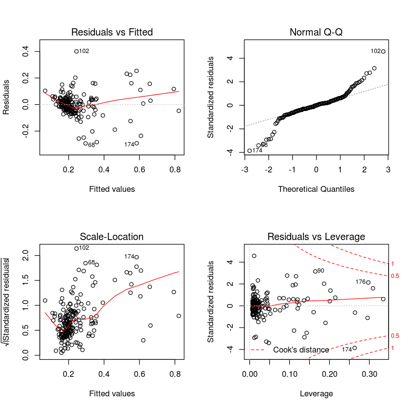
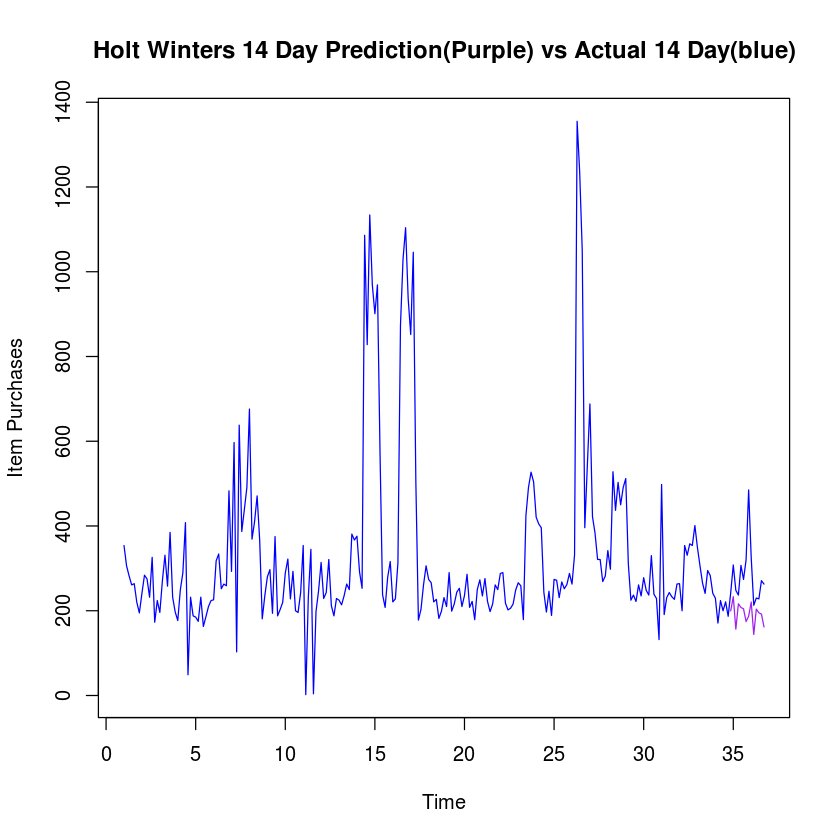
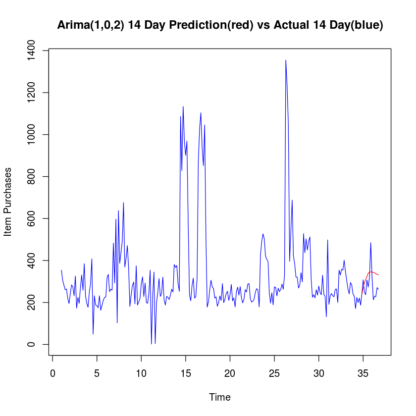

## Data Mining Assignment 4
### Author G. Gordon
February 15, 2016

Part 3 - Product 11743201

## DATA ANALYSIS


```R
dir()
```


<ol class=list-inline>
	<li>'Assignment 4-11740941-Copy2.ipynb'</li>
	<li>'Assignment 4-11740941.ipynb'</li>
	<li>'Assignment 4-11741274.ipynb'</li>
	<li>'Assignment 4-11743201.ipynb'</li>
	<li>'Assignment 4-11743201-wip2.ipynb'</li>
	<li>'Assignment 4.ipynb'</li>
	<li>'last_n_days_time_series.py'</li>
	<li>'product-11740941-7-day-forecast-data.csv'</li>
	<li>'product-11740941-daily-quantities.csv'</li>
	<li>'product-11740941.zip'</li>
	<li>'product-11741274-7-day-forecast-data.csv'</li>
	<li>'product-11741274-daily-quantities.csv'</li>
	<li>'product-11741274.zip'</li>
	<li>'product-11743201-7-day-forecast-data.csv'</li>
	<li>'product-11743201-daily-quantities.csv'</li>
	<li>'product-11743201.zip'</li>
	<li>'timeseriesHistory.r'</li>
	<li>'top product queries'</li>
</ol>


```R
# Import the data for prod 11740941
prod1.data = read.csv('product-11743201-7-day-forecast-data.csv',header=F)
head(prod1.data)
```


<table>
<thead><tr><th></th><th scope=col>V1</th><th scope=col>V2</th><th scope=col>V3</th><th scope=col>V4</th><th scope=col>V5</th><th scope=col>V6</th><th scope=col>V7</th><th scope=col>V8</th></tr></thead>
<tbody>
	<tr><th scope=row>1</th><td>354</td><td>306</td><td>282</td><td>261</td><td>264</td><td>220</td><td>195</td><td>241</td></tr>
	<tr><th scope=row>2</th><td>306</td><td>282</td><td>261</td><td>264</td><td>220</td><td>195</td><td>241</td><td>284</td></tr>
	<tr><th scope=row>3</th><td>282</td><td>261</td><td>264</td><td>220</td><td>195</td><td>241</td><td>284</td><td>275</td></tr>
	<tr><th scope=row>4</th><td>261</td><td>264</td><td>220</td><td>195</td><td>241</td><td>284</td><td>275</td><td>232</td></tr>
	<tr><th scope=row>5</th><td>264</td><td>220</td><td>195</td><td>241</td><td>284</td><td>275</td><td>232</td><td>326</td></tr>
	<tr><th scope=row>6</th><td>220</td><td>195</td><td>241</td><td>284</td><td>275</td><td>232</td><td>326</td><td>173</td></tr>
</tbody>
</table>


```R
plot(prod1.data)
```


```R
prod1.days = 1:nrow(prod1.data)
```


```R
prod1.ts7 = ts(prod1.data,start = 1,freq=7)
prod1.ts30 = ts(prod1.data,start = 1,freq=30)
plot(stl(prod1.ts7[,8],s.window='periodic'),main="7 Day Outlook")
plot(stl(prod1.ts30[,8],s.window='periodic'),main="30 Day Outlook")
plot(stl(log(prod1.ts7[,8]),s.window='periodic'),main="Log 7 Day Outlook")
plot(stl(log(prod1.ts30[,8]),s.window='periodic'),main="Log 30 Day Outlook")
```


```R
# Split data into 80/20 Train/Test
set.seed(23)
no_of_observations = nrow(prod1.data)
percent_split = 0.8
sampler = sample(1:no_of_observations,size = as.integer(percent_split * no_of_observations))
#Normalize Columns Using Max
prod1.data.normalized = prod1.data
for(i in 1:ncol(prod1.data)){
    prod1.data.normalized[,i] = prod1.data[,i] /max(prod1.data[,i]) 
}

prod1.data.train = prod1.data.normalized[sampler,]

prod1.data.test = prod1.data.normalized[-sampler,]

paste("Train Size: ",nrow(prod1.data.train),"| Test size: ", nrow(prod1.data.test)," | Total:",no_of_observations)

```


'Train Size:  195 | Test size:  49  | Total: 244'


### Regression Model


```R
prod1.lm.fit = lm(V8 ~ .,data = prod1.data.train)
summary(prod1.lm.fit)
par(mfrow=c(2,2))
plot(prod1.lm.fit)
```


    
    Call:
    lm(formula = V8 ~ ., data = prod1.data.train)
    
    Residuals:
         Min       1Q   Median       3Q      Max 
    -0.29267 -0.03471 -0.00064  0.03370  0.40052 
    
    Coefficients:
                Estimate Std. Error t value Pr(>|t|)    
    (Intercept)  0.06784    0.01591   4.265 3.17e-05 ***
    V1           0.04705    0.06066   0.776   0.4389    
    V2          -0.15430    0.06614  -2.333   0.0207 *  
    V3          -0.02570    0.07063  -0.364   0.7164    
    V4           0.15931    0.07568   2.105   0.0366 *  
    V5          -0.17690    0.07195  -2.459   0.0149 *  
    V6           0.13979    0.07363   1.898   0.0592 .  
    V7           0.71668    0.06383  11.227  < 2e-16 ***
    ---
    Signif. codes:  0 ‘***’ 0.001 ‘**’ 0.01 ‘*’ 0.05 ‘.’ 0.1 ‘ ’ 1
    
    Residual standard error: 0.08805 on 187 degrees of freedom
    Multiple R-squared:  0.657,	Adjusted R-squared:  0.6441 
    F-statistic: 51.16 on 7 and 187 DF,  p-value: < 2.2e-16





```R
# Predict on test data set using regression model
prod1.lm.pred = predict(prod1.lm.fit,prod1.data.test[,1:7])
# Determine the mean absolute percentage error
prod1.lm.error=mean(100*abs(prod1.data.test[,8] - prod1.lm.pred)/ prod1.data.test[,8])
paste('Mean Absolute % Error for Regression Model : ',prod1.lm.error,'%')
```


'Mean Absolute % Error for Regression Model :  32.1716881402131 %'


### SVM Model


```R
library(e1071) # Load svm from library
```


```R
#Build SVM Model
prod1.svm.fit = svm(prod1.data.train[,1:7],prod1.data.train[,8])
plot(prod1.svm.fit,prod1.data.train[,1:7],"V1 ~ V2")
# Predict using test data
prod1.svm.pred = predict(prod1.svm.fit,prod1.data.test[,1:7])
# Determine the mean absolute percentage error
prod1.svm.error=mean(100*abs(prod1.data.test[,8] - prod1.svm.pred)/prod1.data.test[,8])
paste('Mean Absolute % Error for SVM : ',prod1.svm.error,'%')
```


'Mean Absolute % Error for SVM :  23.1444047252265 %'


### Neural Network


```R
# Load Libraries
library(neuralnet) 
library(RSNNS)
library('devtools')
source_url('https://gist.githubusercontent.com/gggordon/809278dab6d7c6692f8b/raw/36cd22fa4dd7c719cecc6d30e006cdc07e2c0109/plot.nnet.r')
```

    Loading required package: grid
    Loading required package: MASS
    Loading required package: Rcpp
    SHA-1 hash of file is 74c80bd5ddbc17ab3ae5ece9c0ed9beb612e87ef


```R
prod1.nn.1.fit = neuralnet(V8~V1+V2+V3+V4+V5+V6+V7,
                           data=prod1.data.train,
                           hidden=1,
                           learningrate=0.01,
                           #threshold=0.001,
                           #lifesign="full",
                           algorithm="backprop")
prod1.nn.1.pred = compute(prod1.nn.1.fit,prod1.data.test[,1:7])$net.result
prod1.nn.1.error=mean(100*abs(prod1.data.test[,8] - prod1.nn.1.pred)/prod1.data.test[,8])
paste('Mean Absolute % Error for Neural Network (1 hidden) : ',prod1.nn.1.error,'%')
#set.seed(23)
#plot.nnet(prod1.nn.4.fit,"Neural Network (4 Hidden)")
```


'Mean Absolute % Error for Neural Network (1 hidden) :  39.558639745784 %'


```R
prod1.nn.10.fit = neuralnet(V8~V1+V2+V3+V4+V5+V6+V7,
                           data=prod1.data.train,
                           hidden=10,
                           learningrate=0.001,
                           #threshold=0.001,
                           #lifesign="full",
                           algorithm="backprop")
prod1.nn.10.pred = compute(prod1.nn.10.fit,prod1.data.test[,1:7])$net.result
prod1.nn.10.error=mean(100*abs(prod1.data.test[,8] - prod1.nn.10.pred)/prod1.data.test[,8])
paste('Mean Absolute % Error for Neural Network (10 hidden) : ',prod1.nn.10.error,'%')
```


'Mean Absolute % Error for Neural Network (10 hidden) :  31.6251097222069 %'


### Time Series Evaluation

#### More Data Preparation


```R
# Retrieve the original time series data but concatenating the first row values with the last column values
prod1.data.raw=c(as.vector(t(prod1.data[1,1:7])[,1]),prod1.data[,8])
```


```R
# Create time series from start of year for 7 day periods
prod1.data.rawts=ts(prod1.data.raw,start=1,freq=7)

plot(stl(prod1.data.rawts,s.window="periodic"),main="Time Series 7 Day")
prod1.data.rawts

prod1.data.rawts.log=log(prod1.data.rawts)
plot(stl(prod1.data.rawts.log,s.window="periodic"),main="Time Series Log 7 Day")
prod1.data.rawts.log


```


    Time Series:
    Start = c(1, 1) 
    End = c(36, 6) 
    Frequency = 7 
      [1]  354  306  282  261  264  220  195  241  284  275  232  326  173  224  196
     [16]  271  331  258  385  232  197  177  249  290  408   49  232  188  185  175
     [31]  232  163  186  210  224  226  318  334  252  263  259  483  293  597  103
     [46]  638  387  438  491  676  369  410  471  367  181  235  280  297  194  375
     [61]  188  203  220  289  322  228  293  200  196  243  354    2  232  345    4
     [76]  198  247  314  229  243  321  212  188  229  225  214  236  263  250  381
     [91]  367  376  292  253 1086  828 1134  969  901  969  576  238  208  279  316
    [106]  221  228  313  874 1030 1104  937  852 1046  505  178  203  261  306  274
    [121]  266  221  227  182  199  231  210  290  199  216  244  253  210  236  286
    [136]  208  222  179  250  273  235  276  222  198  216  261  250  288  290  218
    [151]  202  206  216  249  266  259  179  425  491  527  504  421  405  396  244
    [166]  197  246  189  274  272  231  268  252  262  288  263  332 1355 1235 1050
    [181]  396  544  688  422  383  321  321  269  282  342  298  528  437  503  450
    [196]  491  512  311  225  237  222  261  235  278  248  237  330  239  229  132
    [211]  498  191  231  243  233  227  263  264  200  354  331  358  354  401  349
    [226]  306  265  241  295  283  241  230  171  224  200  221  187  243  308  248
    [241]  237  307  274  320  485  326  213  230  228  271  263


    Time Series:
    Start = c(1, 1) 
    End = c(36, 6) 
    Frequency = 7 
      [1] 5.8692969131 5.7235851020 5.6419070709 5.5645204073 5.5759491031
      [6] 5.3936275464 5.2729995586 5.4847969335 5.6489742382 5.6167710977
     [11] 5.4467373717 5.7868973814 5.1532915945 5.4116460519 5.2781146592
     [16] 5.6021188209 5.8021183754 5.5529595849 5.9532433343 5.4467373717
     [21] 5.2832037287 5.1761497326 5.5174528965 5.6698809230 6.0112671744
     [26] 3.8918202981 5.4467373717 5.2364419628 5.2203558251 5.1647859739
     [31] 5.4467373717 5.0937502008 5.2257466737 5.3471075307 5.4116460519
     [36] 5.4205349993 5.7620513828 5.8111409930 5.5294290875 5.5721540322
     [41] 5.5568280617 6.1800166537 5.6801726090 6.3919171134 4.6347289882
     [46] 6.4583382833 5.9584246930 6.0822189104 6.1964441278 6.5161930760
     [51] 5.9107966440 6.0161571597 6.1548580940 5.9053618481 5.1984970313
     [56] 5.4595855141 5.6347896032 5.6937321388 5.2678581591 5.9269260260
     [61] 5.2364419628 5.3132059790 5.3936275464 5.6664266881 5.7745515455
     [66] 5.4293456290 5.6801726090 5.2983173665 5.2781146592 5.4930614433
     [71] 5.8692969131 0.6931471806 5.4467373717 5.8435444170 1.3862943611
     [76] 5.2882670307 5.5093883366 5.7493929859 5.4337220036 5.4930614433
     [81] 5.7714411231 5.3565862747 5.2364419628 5.4337220036 5.4161004022
     [86] 5.3659760150 5.4638318050 5.5721540322 5.5214609179 5.9427993751
     [91] 5.9053618481 5.9295891434 5.6767538023 5.5333894887 6.9902565005
     [96] 6.7190131544 7.0335064843 6.8762646119 6.8035052576 6.8762646119
    [101] 6.3561076607 5.4722706737 5.3375380797 5.6312117818 5.7557422136
    [106] 5.3981627015 5.4293456290 5.7462031905 6.7730803757 6.9373140812
    [111] 7.0066952268 6.8426832822 6.7475865268 6.9527286446 6.2245584293
    [116] 5.1817835503 5.3132059790 5.5645204073 5.7235851020 5.6131281064
    [121] 5.5834963088 5.3981627015 5.4249500175 5.2040066871 5.2933048247
    [126] 5.4424177105 5.3471075307 5.6698809230 5.2933048247 5.3752784077
    [131] 5.4971682253 5.5333894887 5.3471075307 5.4638318050 5.6559918108
    [136] 5.3375380797 5.4026773819 5.1873858058 5.5214609179 5.6094717952
    [141] 5.4595855141 5.6204008657 5.4026773819 5.2882670307 5.3752784077
    [146] 5.5645204073 5.5214609179 5.6629604801 5.6698809230 5.3844950628
    [151] 5.3082676974 5.3278761688 5.3752784077 5.5174528965 5.5834963088
    [156] 5.5568280617 5.1873858058 6.0520891689 6.1964441278 6.2672005485
    [161] 6.2225762681 6.0426328337 6.0038870671 5.9814142113 5.4971682253
    [166] 5.2832037287 5.5053315359 5.2417470151 5.6131281064 5.6058020663
    [171] 5.4424177105 5.5909869805 5.5294290875 5.5683445038 5.6629604801
    [176] 5.5721540322 5.8051349689 7.2115567333 7.1188262491 6.9565454432
    [181] 5.9814142113 6.2989492469 6.5337888379 6.0450053140 5.9480349892
    [186] 5.7714411231 5.7714411231 5.5947113796 5.6419070709 5.8348107371
    [191] 5.6970934865 6.2690962837 6.0799331951 6.2205901701 6.1092475828
    [196] 6.1964441278 6.2383246250 5.7397929122 5.4161004022 5.4680601411
    [201] 5.4026773819 5.5645204073 5.4595855141 5.6276211137 5.5134287462
    [206] 5.4680601411 5.7990926545 5.4764635519 5.4337220036 4.8828019226
    [211] 6.2106000770 5.2522734280 5.4424177105 5.4930614433 5.4510384536
    [216] 5.4249500175 5.5721540322 5.5759491031 5.2983173665 5.8692969131
    [221] 5.8021183754 5.8805329864 5.8692969131 5.9939614273 5.8550719222
    [226] 5.7235851020 5.5797298260 5.4847969335 5.6869753563 5.6454468976
    [231] 5.4847969335 5.4380793089 5.1416635565 5.4116460519 5.2983173665
    [236] 5.3981627015 5.2311086169 5.4930614433 5.7300997830 5.5134287462
    [241] 5.4680601411 5.7268477476 5.6131281064 5.7683209958 6.1841488909
    [246] 5.7868973814 5.3612921657 5.4380793089 5.4293456290 5.6021188209
    [251] 5.5721540322


```R
# Split time series data in test data (last 2 weeks/last 14 days) and train data to evaluate models
prod1.data.rawts.size = length(prod1.data.rawts)
prod1.data.rawts.trainBoundIndex = prod1.data.rawts.size-14
paste("Training Bound Index : ",prod1.data.rawts.trainBoundIndex)
prod1.data.rawts.train = ts(prod1.data.rawts[1:prod1.data.rawts.trainBoundIndex],start=1,freq=7)
                            
prod1.data.rawts.test = ts(prod1.data.rawts[(prod1.data.rawts.trainBoundIndex+1):prod1.data.rawts.size],
                           start=prod1.data.rawts.trainBoundIndex+1,freq=7)

paste("Train Size: ",length(prod1.data.rawts.train),
      "| Test size: ", length(prod1.data.rawts.test),
      " | Total:",prod1.data.rawts.size)

```


'Training Bound Index :  237'


'Train Size:  237 | Test size:  14  | Total: 251'


### Holt Winters


```R
prod1.hw=HoltWinters(prod1.data.rawts.train,alpha=0.9,beta=0,gamma=0.9)
prod1.hw
```


    Holt-Winters exponential smoothing with trend and additive seasonal component.
    
    Call:
    HoltWinters(x = prod1.data.rawts.train, alpha = 0.9, beta = 0,     gamma = 0.9)
    
    Smoothing parameters:
     alpha: 0.9
     beta : 0
     gamma: 0.9
    
    Coefficients:
                 [,1]
    a  201.1043636982
    b   -1.7942176871
    s1   0.3437327649
    s2  35.7504366047
    s3 -39.1395045042
    s4  22.5990095175
    s5  15.5784120290
    s6  14.3192866818
    s7 -14.0652564517


```R
prod1.hw.rms=sqrt(sum((prod1.data.rawts.train-prod1.hw$fit[,1])^2))/length(prod1.data.rawts.train)
paste('Root Mean Square Error: ',prod1.hw.rms)
```


'Root Mean Square Error:  10.5216229832783'


```R
plot(prod1.data.rawts,col="blue",
     main="Holt Winters 14 Day Prediction(Purple) vs Actual 14 Day(blue)",
     ylab="Item Purchases")
prod1.hw.pred = predict(prod1.hw,n.ahead=14)
lines(prod1.hw.pred,col=c('purple'))
testv = as.vector(prod1.data.rawts.test)
predv = as.vector(prod1.hw.pred[,1])
prod1.hw.error=mean(100*abs(testv - predv)/testv)
paste('Mean Absolute % Error for Holt Winters : ',prod1.hw.error,'%')
```


'Mean Absolute % Error for Holt Winters :  29.2933187343579 %'





### Arima


```R
library(forecast)
```

    Loading required package: zoo
    
    Attaching package: ‘zoo’
    
    The following objects are masked from ‘package:base’:
    
        as.Date, as.Date.numeric
    
    Loading required package: timeDate
    
    Attaching package: ‘timeDate’
    
    The following objects are masked from ‘package:e1071’:
    
        kurtosis, skewness
    
    This is forecast 6.2 
    


```R
# Use AIC as model evaluation test to test ARIMA models and choose best
# Initally Assumed (7,0,0)
prod1.arima.fit=auto.arima(prod1.data.rawts.train, ic = "aic")
prod1.arima.fit
```


    Series: prod1.data.rawts.train 
    ARIMA(1,0,2) with non-zero mean 
    
    Coefficients:
                ar1         ma1        ma2    intercept
          0.6994472  -0.0527762  0.1071911  328.2475969
    s.e.  0.0861319   0.1106906  0.0745479   33.0980019
    
    sigma^2 estimated as 21532.35:  log likelihood=-1518.96
    AIC=3047.93   AICc=3048.19   BIC=3065.27


```R
plot(prod1.data.rawts,col="blue",
     main="Arima(1,0,2) 14 Day Prediction(red) vs Actual 14 Day(blue)",
     ylab="Item Purchases")
prod1.arima.pred= predict(prod1.arima,n.ahead=14)$pred
prod1.arima.pred
lines(prod1.arima.pred,col=c('red'))
testv = as.vector(prod1.data.rawts.test)

predv = as.vector(prod1.arima.pred)
prod1.arima.error=mean(100*abs(testv - predv)/testv)
paste('Mean Absolute % Error for Holt Winters : ',prod1.arima.error,'%')
```


    Time Series:
    Start = c(34, 7) 
    End = c(36, 6) 
    Frequency = 7 
     [1] 239.8176364 269.1640891 294.7152205 309.4190544 323.3211432 339.6968876
     [7] 344.0690620 346.1806211 344.5656868 343.6299803 340.9306083 337.3220957
    [13] 334.2325867 331.7240075


'Mean Absolute % Error for Holt Winters :  24.3868519387838 %'





```R
prod1.arima=arima(prod1.data.rawts.train,order=c(7,0,0))
prod1.arima


plot(prod1.data.rawts,col="blue",
     main="Arima(7,0,0) 14 Day Prediction(red) vs Actual 14 Day(blue)",
     ylab="Item Purchases")
prod1.arima.pred= predict(prod1.arima,n.ahead=14)$pred
prod1.arima.pred
lines(prod1.arima.pred,col=c('red'))
testv = as.vector(prod1.data.rawts.test)

predv = as.vector(prod1.arima.pred)
prod1.arima.error=mean(100*abs(testv - predv)/testv)
paste('Mean Absolute % Error for Holt Winters : ',prod1.arima.error,'%')
```


    
    Call:
    arima(x = prod1.data.rawts.train, order = c(7, 0, 0))
    
    Coefficients:
               ar1        ar2         ar3        ar4         ar5         ar6
          0.637744  0.1694702  -0.1282548  0.1321486  -0.0270686  -0.1534491
    s.e.  0.064692  0.0760803   0.0768969  0.0766079   0.0765255   0.0755916
                ar7    intercept
          0.0299667  329.5289812
    s.e.  0.0641740   27.4571695
    
    sigma^2 estimated as 20714.09:  log likelihood = -1514.47,  aic = 3046.95


    Time Series:
    Start = c(34, 7) 
    End = c(36, 6) 
    Frequency = 7 
     [1] 239.8176364 269.1640891 294.7152205 309.4190544 323.3211432 339.6968876
     [7] 344.0690620 346.1806211 344.5656868 343.6299803 340.9306083 337.3220957
    [13] 334.2325867 331.7240075


'Mean Absolute % Error for Holt Winters :  24.3868519387838 %'


```R

```
